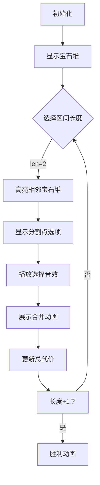

# 题目信息

# 石子合并（弱化版）

## 题目描述

设有 $N(N \le 300)$ 堆石子排成一排，其编号为 $1,2,3,\cdots,N$。每堆石子有一定的质量 $m_i\ (m_i \le 1000)$。现在要将这 $N$ 堆石子合并成为一堆。每次只能合并相邻的两堆，合并的代价为这两堆石子的质量之和，合并后与这两堆石子相邻的石子将和新堆相邻。合并时由于选择的顺序不同，合并的总代价也不相同。试找出一种合理的方法，使总的代价最小，并输出最小代价。

## 样例 #1

### 输入

```
4
2 5 3 1```

### 输出

```
22```

# AI分析结果


# 💡 Kay的C++算法解析：石子合并（弱化版） 深入学习指南 💡

> 大家好，我是Kay！今天我们来探索经典区间DP问题——石子合并。这道题能帮助我们理解如何将大问题分解为小问题求解，是学习动态规划的绝佳起点。准备好和我一起深入探究了吗？让我们开始吧！

## 1. 题目解读与核心算法识别

✨ **本题主要考察**：`区间动态规划`

🗣️ **初步分析**：
> 石子合并问题就像搭积木塔：每次只能合并相邻的两堆积木，最终目标是找到最省力的搭建顺序。**区间DP**的核心思想是"分而治之"——将大区间拆分成小区间分别求解，再合并结果。

在本题中，我们通过三重循环求解：
1. **外层**控制区间长度（从2堆开始）
2. **中层**确定区间位置
3. **内层**枚举分割点，计算合并代价

可视化设计思路：
- **像素方块**表示石子堆，不同颜色区分不同区间
- **高亮显示**当前处理的区间和分割点
- **动态连线**展示合并过程
- **音效反馈**：合并时播放"咔嚓"音效，完成时播放胜利音效

---

## 2. 精选优质题解参考

**题解一（expnoi）**
* **点评**：这份题解思路清晰直白，完美呈现了区间DP的核心框架。代码中：
  - 使用`dp[i][j]`精确定义状态：合并区间[i,j]的最小代价
  - 巧妙利用前缀和`sum[]`优化区间和计算
  - 初始化处理规范：对角线设为0（自身合并无代价）
  - 三重循环结构工整，边界处理严谨
  > 💡 亮点：用最简洁的代码完整呈现算法本质，是初学者最佳学习模板

**题解二（墨忧）**
* **点评**：这份题解胜在讲解深度：
  - 详细剖析状态转移方程物理意义
  - 使用`INF`巧妙处理最小值初始化
  - 变量命名规范（`len`表区间长度）
  - 包含快读实现细节，适合竞赛场景
  > 💡 亮点：注释详尽，特别适合需要理解原理的学习者

**题解三（Engulf）**
* **点评**：提供全新视角——记忆化搜索：
  - 用递归自然表达分治思想
  - 避免手动处理循环顺序
  - 初始化`INT_MAX`确保正确性
  > 💡 亮点：展示DP的另一种实现范式，拓展思维边界

---

## 3. 核心难点辨析与解题策略

1.  **状态定义抽象**
    * **分析**：如何定义`dp[i][j]`？关键在于理解其表示合并区间[i,j]的最小代价。优质解法都明确其物理意义：从第i堆到第j堆完全合并的最小成本
    * 💡 **学习笔记**：好的状态定义应具备完整性和无后效性

2.  **状态转移设计**
    * **分析**：转移方程`dp[i][j]=min(dp[i][k]+dp[k+1][j]+sum(i,j))`的推导：
      1. 枚举分割点k将区间分为[i,k]和[k+1,j]
      2. 子区间最优解相加
      3. 加上合并代价（即区间和）
    * 💡 **学习笔记**：分割点枚举需满足`i≤k<j`确保子区间合法

3.  **前缀和优化**
    * **分析**：直接计算区间和需O(n)时间。通过预处理前缀和数组：
      ```cpp
      sum[i] = a[1] + a[2] + ... + a[i]
      ```
      使任意区间和计算优化为O(1)：`sum(i,j)=sum[j]-sum[i-1]`
    * 💡 **学习笔记**：前缀和是区间问题的黄金搭档

### ✨ 解题技巧总结
- **金字塔搭建法**：从小区间开始求解，逐步构建大区间解
- **边界哨兵**：初始化`dp[i][i]=0`，其他设为极大值
- **循环顺序控制**：先枚举区间长度，再枚举起始位置
- **可视化辅助**：在纸上画区间示意图帮助理解

---

## 4. C++核心代码实现赏析

**本题通用核心C++实现参考**
```cpp
#include <iostream>
#include <cstring>
#include <climits>
using namespace std;

const int N=305;
int dp[N][N], sum[N], stones[N];

int main() {
    int n;
    cin >> n;
    
    // 初始化DP数组
    memset(dp, 0x3f, sizeof(dp));
    for(int i=1; i<=n; i++){
        cin >> stones[i];
        sum[i] = sum[i-1] + stones[i];
        dp[i][i] = 0; // 单堆合并代价为0
    }

    // 区间DP核心逻辑
    for(int len=2; len<=n; len++) {          // 枚举区间长度
        for(int i=1; i+len-1<=n; i++) {     // 枚举区间起点
            int j = i+len-1;                 // 计算区间终点
            for(int k=i; k<j; k++) {         // 枚举分割点
                int cost = sum[j] - sum[i-1]; // 当前区间和
                dp[i][j] = min(dp[i][j], dp[i][k] + dp[k+1][j] + cost);
            }
        }
    }
    
    cout << dp[1][n];
    return 0;
}
```

**代码解读概要**：
> 代码分为三阶段：  
> 1. **初始化**：读入数据，构建前缀和，设置DP初值  
> 2. **DP求解**：通过三重循环从小到大计算各区间最优解  
> 3. **结果输出**：输出整个区间[1,n]的最小合并代价  

---

**题解一（expnoi）核心代码**
```cpp
for(int len=2;len<=n;len++) {
    for(int i=1;i<=n-len+1;i++) {
        int j=i+len-1;
        for(int k=i;k<j;k++) {
            dp[i][j]=min(dp[i][j],dp[i][k]+dp[k+1][j]+sum[j]-sum[i-1]);
        }
    }
}
```
**代码解读**：
> 这段代码是区间DP的经典结构：
> 1. `len`循环：控制合并的区间规模（2→n）
> 2. `i`循环：确定当前区间起点
> 3. `j`计算：通过`i+len-1`得区间终点
> 4. `k`循环：尝试所有可能的分割方案
> 💡 **学习笔记**：区间终点j的计算公式确保不越界

**题解三（Engulf）核心代码**
```cpp
int dfs(int l, int r) {
    if (l == r) return 0;
    if (f[l][r] != INT_MAX) return f[l][r];
    for (int i = l; i < r; ++i) {
        f[l][r] = min(f[l][r], dfs(l, i) + dfs(i+1, r) + a[r]-a[l-1]);
    }
    return f[l][r];
}
```
**代码解读**：
> 记忆化搜索实现：
> 1. 基准情形：单元素区间代价为0
> 2. 记忆化检查：已计算则直接返回
> 3. 递归分割：尝试所有分割方案
> 💡 **学习笔记**：递归实现更符合分治思想的本质

---

## 5. 算法可视化：像素动画演示

**动画主题**：像素矿工合并宝石

**设计思路**：  
> 采用8-bit复古风格，将算法过程转化为矿工合并宝石的游戏。每个步骤配合音效和视觉反馈，让抽象的DP过程具象化。

**动画实现细节**：



1. **场景构建**：
   - 宝石堆：彩色像素方块（红/蓝/绿）
   - 控制面板：复古游戏机风格按钮

2. **动态演示**：
   - **区间高亮**：当前处理区间边框闪烁
   - **分割点标记**：黄色箭头指示当前分割位置
   - **合并动画**：宝石堆碰撞→融合→显示新堆
   - **数据面板**：实时显示dp[i][j]值

3. **交互功能**：
   - 步进控制：←→键控制分割点移动
   - 速度调节：滑块控制动画速度
   - 模式切换：迭代DP/记忆化搜索双模式

4. **音效系统**：
   - 移动：电子"滴"声
   - 合并："咔嚓"碎裂音
   - 完成：16-bit胜利旋律

5. **游戏化元素**：
   - 每完成一个区间长度解锁新关卡
   - 最优解获得三星评价
   - 连续正确操作触发连击特效

> 通过这样的设计，算法过程就像在玩复古游戏，每一步操作都有即时反馈，让学习者轻松掌握区间DP的精髓！

---

## 6. 拓展练习与相似问题思考

**算法迁移场景**：
1. 字符串合并代价计算（如Huffman编码）
2. 多边形三角剖分最小代价
3. 棋盘分割问题

**洛谷推荐**：
1. **P1880 [NOI1995] 石子合并**  
   → 环形版石子合并，掌握环形DP处理技巧
   
2. **P1063 能量项链**  
   → 区间DP经典变形，理解能量计算规则

3. **P3146 [USACO16OPEN]248 G**  
   → 相邻合并特殊规则，培养灵活建模能力

---

## 7. 学习心得与经验分享

> **经验分享**：  
> 多位作者提到调试时遇到的典型问题：
> 1. 未正确初始化导致计算错误
> 2. 区间端点计算偏差引发越界
> 3. 未使用前缀和导致超时
>
> **Kay的总结**：
> 1. 初始化是DP的基石——`dp[i][i]=0`和`memset`缺一不可
> 2. 纸上模拟小规模案例（n=3）是调试利器
> 3. 前缀和优化能使O(n⁴)降为O(n³)，是必备技巧
> 4. 记忆化搜索和迭代DP各有适用场景，建议都掌握

---

> 经过这次探索，相信大家对区间DP有了更深理解。记住：动态规划就像搭积木，找准小块才能建起高塔。多练习推荐的拓展题目，下次遇到合并问题就能游刃有余啦！继续加油，我们下期再见！💪

---
处理用时：96.39秒