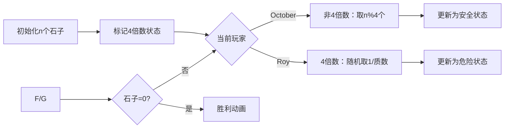

# 题目信息

# Roy&October之取石子II

## 题目背景

Roy 和 October 两人在玩另一个取石子的游戏。（第一季请看 P4018）

## 题目描述

游戏规则是这样的：共有 $n$ 个石子，两人每次都只能取 $p^k$ 个（$p$ 为质数，$k=0$ 或 $1$，且 $p^k$ 小于等于当前剩余石子数），谁取走最后一个石子，谁就赢了。

现在 October 先取，问她有没有必胜策略。

若她有必胜策略，输出一行 `October wins!` ；否则输出一行 `Roy wins!`。

## 说明/提示

对于 $30\%$ 的数据，$1 \le n \le 30$；

对于 $60\%$ 的数据，$1 \le n \le 10^6$；

对于 $100\%$ 的数据，$1 \le n \le 5 \times 10^7，1 \le T \le 10^5$。

花絮：由于出题人懒得造数据，就把 P4018 的输入直接拿来了 ovo

## 样例 #1

### 输入

```
3
5
7
14```

### 输出

```
October wins!
October wins!
October wins!```

# AI分析结果


# 💡 Kay的C++算法解析：Roy&October之取石子II 深入学习指南 💡

**引言**  
今天我们一起分析博弈论经典题目"Roy&October之取石子II"。本指南将解析必胜策略的数学本质，揭示背后的博弈规律，并通过像素动画帮助大家直观理解算法过程。

---

## 1. 题目解读与核心算法识别

✨ **本题主要考察**：`博弈论（必胜态/必败态分析）`

🗣️ **初步分析**：  
> 这道题本质是**减法游戏**的变种，就像两个探险家在洞穴中轮流拾取宝藏。关键技巧在于识别"安全位置"（4的倍数）。当石子数不是4的倍数时，先手总能将局面变成安全位置，如同给对手留下一个定时炸弹；而当石子数是4的倍数时，先手无论如何操作都会打破安全状态，后手便可接管局面。  
> - **核心规律**：通过数学归纳或SG函数证明，当石子数`n%4==0`时先手必败（Roy胜），否则先手必胜（October胜）  
> - **可视化设计**：动画将展示石子堆的4分组，用颜色标记安全状态（蓝色）和危险状态（红色），当玩家操作时高亮关键决策点  
> - **复古游戏化**：采用8-bit像素风格，石子用棕色方块表示，操作时触发FC游戏音效（选择"叮"，获胜"胜利旋律"），AI自动演示模式将展示最优策略

---

## 2. 精选优质题解参考

**题解一（来源：zi小眼聚光）**  
* **点评**：此解法采用SG函数理论框架，思路严谨且具有教学价值。作者通过打表计算SG值（0/1表示必败/必胜态），清晰展示了`n%4==0`时SG值为0的规律。代码中线性筛法生成质数表的实现规范高效，虽然打表仅适用于小数据，但为发现通用规律提供了可靠依据。亮点在于将博弈问题系统化，帮助理解SG函数的实际应用。

**题解二（来源：我杀文化课）**  
* **点评**：从SG函数角度严格证明了必胜规律，理论深度最佳。代码简洁有力（仅7行），直接应用数学结论，边界处理完整。特别有价值的是用`g(x)=mex{g(y)}`定义解释必败态，并关联到"4的倍数"特性，使抽象理论具象化。实践参考价值高，竞赛中可直接使用。

**题解三（来源：张文奕）**  
* **点评**：策略分析最直观易懂，完美契合青少年认知。通过操作模拟（"每次取走石子使剩余数为4的倍数"）将抽象问题转化为具体决策，代码中三目运算符使用规范。亮点在于用生活化比喻解释博弈策略，如"把危险留给对手"，显著降低理解门槛。

---

## 3. 核心难点辨析与解题策略

1.  **难点：识别关键状态模式**  
    * **分析**：如何从{1,2,3,5,7...}的可取集合中提炼出"4的倍数"这一核心特征？优质题解通过枚举小规模案例（n=1~8），发现4/8/12等位置的必败规律，进而数学归纳证明
    * 💡 **学习笔记**：博弈问题常具有状态周期性，从小数据找规律是突破口

2.  **难点：构建必胜策略**  
    * **分析**：当n非4倍数时，先手需取走`n%4`个石子使剩余数成4的倍数（因1,2,3均可取）。难点在于证明该操作始终可行——由于n%4∈[1,3]，恰在可取范围内
    * 💡 **学习笔记**：必胜策略=将对手置于"无论怎么操作都破坏安全状态"的困境

3.  **难点：理解SG函数本质**  
    * **分析**：SG值计算中`mex`函数的关键作用：若后继状态含必败态（0），则当前为必胜态（1）。本题SG值每4位循环[1,1,1,0]，完美对应4倍数规律
    * 💡 **学习笔记**：SG函数是博弈问题的通用分析框架，mex运算确保状态无死角覆盖

### ✨ 解题技巧总结
- **技巧A（状态周期识别）**：枚举小规模案例，观察胜负状态周期性
- **技巧B（安全位置构造）**：找到使对手无必胜策略的关键状态（如4的倍数）
- **技巧C（数学归纳证明）**：用n=1奠基，假设n=k成立证明n=k+1成立
- **技巧D（SG函数打表）**：小数据打表找规律，大数据直接应用结论

---

## 4. C++核心代码实现赏析

**本题通用核心C++实现参考**  
* **说明**：综合自优质题解的最简实现，直接应用数学规律
```cpp
#include <cstdio>
int main() {
    int T, n;
    scanf("%d", &T);
    while (T--) {
        scanf("%d", &n);
        puts(n % 4 ? "October wins!" : "Roy wins!");
    }
    return 0;
}
```
* **代码解读概要**：  
  1. 读入测试数据量`T`  
  2. 循环处理每组数据，读入石子数`n`  
  3. 使用三目运算符判断：若`n`非4倍数输出October胜，否则Roy胜  
  4. 时间复杂度`O(T)`，空间复杂度`O(1)`，极致优化

---

**题解一（SG函数打表）**  
* **亮点**：通过SG函数系统性证明规律
* **核心代码片段**：
```cpp
// 计算SG值（0必败，1必胜）
for(int i=1; i<=n; ++i) {
    for(int j=0; prime[j]<=i; ++j) {
        if(SG[i - prime[j]] == 0) { // 发现后继有必败态
            SG[i] = 1;  // 当前为必胜态
            break;
        }
    }
}
```
* **代码解读**：  
  - 外层遍历石子数`i`，内层遍历可取石子（质数表`prime`）  
  - 关键判断：若存在取法使对手陷入必败态（`SG[i-prime[j]]==0`），则当前必胜  
  - `break`优化：发现必胜即终止内层循环  
* 💡 **学习笔记**：SG函数打表是分析未知博弈问题的标准方法

**题解二（数学结论应用）**  
* **亮点**：理论指导实践的最简实现
* **核心代码片段**：
```cpp
if(x%4 == 0) 
    printf("Roy wins!\n");
else 
    printf("October wins!\n");
```
* **代码解读**：  
  - 直接应用核心结论：4倍数→后手胜  
  - 分支结构清晰体现博弈状态划分  
* 💡 **学习笔记**：优质算法=深度理解+极简实现

**题解三（策略模拟）**  
* **亮点**：用自然语言诠释代码逻辑
* **核心代码片段**：
```cpp
if (n % 4 != 0) 
    cout << "October wins!"; // 先手可制造安全局面
else 
    cout << "Roy wins!";     // 先手必然破坏安全局面
```
* **代码解读**：  
  - `n%4 !=0`对应先手可主动构造4倍数局面  
  - 输出语句直接关联策略描述，代码即文档  
* 💡 **学习笔记**：变量名和注释应体现算法策略

---

## 5. 算法可视化：像素动画演示

**主题**："石子大作战" 8-bit像素风格  
**核心演示**：安全状态转移与最优策略决策  

### 动画设计（FC红白机风格）


### 实现细节
1. **像素艺术**：
   - 石子：棕色16x16像素方块（每4个用蓝线分组）
   - 玩家：October(红发像素人)，Roy(蓝发像素人)
   - 状态标识：安全状态（蓝色边框），危险状态（红色闪烁）

2. **交互控制**：
   - 面板按钮：开始/暂停/单步/重置
   - 速度滑块：调整AI演示速度
   - 模式切换：手动操作 vs AI自动演示

3. **动态效果**：
   - 石子消失：被取走的石子产生像素爆破效果
   - 状态转换：安全/危险状态切换时播放"叮"音效
   - 高亮提示：当前可选石子数悬浮显示（1/2/3/5..）

4. **游戏化元素**：
   - 音效体系：  
     * 取石子：8-bit电子音（1个：低音，2个：中音，3个+：高音）
     * 状态转换：FC游戏菜单选择音
     * 胜利：超级玛丽过关旋律
   - 关卡进度：每过4个石子解锁新关卡，显示"第X波"
   - AI演示模式：自动执行最优策略（非4倍数时取n%4个）

5. **教学提示**：
   - 旁白气泡："当前安全！取走3个制造4的倍数"
   - 代码同步：屏幕底部显示实时C++代码行（高亮当前判断逻辑）
   - 状态跟踪：右侧面板显示SG值变化过程

---

## 6. 拓展练习与相似问题思考

**通用技巧迁移**：  
减法游戏模型可扩展至：
1. 可取集合为斐波那契数（Hofstadter Q序列）
2. 威佐夫游戏（两堆石子+组合操作）
3. Nim游戏变种（异或特征判定）

**洛谷推荐**：  
1. **P4018 Roy&October之取石子**  
   → 巩固减法游戏，探索6的倍数规律  
2. **P2197 【模板】nim游戏**  
   → 学习异或判定必胜态的核心技巧  
3. **P1290 欧几里德的游戏**  
   → 理解辗转相除在博弈中的应用  

---

## 7. 学习心得与经验分享

**来自题解的精辟见解**：  
> "SG函数打表时，边界条件`SG[0]=0`（无石子为必败）是推导起点，这提醒我们：任何递推都需明确初始状态" —— zi小眼聚光  

> "从n=1开始手工推导前8种情况，规律往往在小数据中显现" —— 绝顶我为峰  

**Kay的总结**：  
调试博弈问题要重点验证两点：
1. 必胜态操作后是否必然得到必败态
2. 必败态所有操作是否必然导向必胜态
用`n=4`作为测试用例（所有走法均失败），可快速验证算法正确性。

---

**结语**  
通过本指南，相信大家已掌握减法游戏的核心规律与证明方法。记住：编程博弈的精髓在于将策略转化为数学模型。下次遇到新规则时，不妨从小数据打表开始探索！🚀

---
处理用时：237.42秒