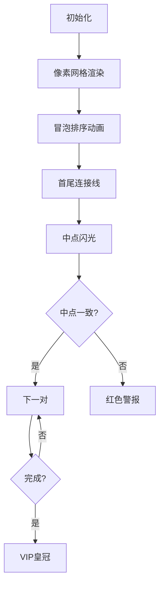

# 题目信息

# [JSOI2008] 完美的对称

## 题目描述

在峰会期间，必须使用许多保镖保卫参加会议的各国代表。代表们除了由他自己的随身保镖保护外，组委会还指派了一些其他的特工和阻击手保护他们。为了使他们的工作卓有成效，使被保卫的人的安全尽可能得到保障，保镖被分配到被保护人的各个方向。

保镖的最佳站立位置应该是这样的：被保护人应站在所有保镖的对称中心。但是，只要被保护人一移动，保镖就很难根据要人的新位置调整位置。大多数的特工都很难对此作出实时调整。

因此，安全部长决定将该过程逆转一下，保镖先站好自己的位置，然后要人在他们的对称中心找到合适的位置。如果要人随便走动，我们就对他的安全不必负责。

你的工作是使这个过程自动操作。给出一组 $N$ 个点（保镖的位置），你要找出它们的对称中心 $S$，在这儿被保护人将相对安全。下面以此类推。

首先我们给定一点 $A$ 以及对称中心 $S$，点 $A'$ 是点 $A$ 以 $S$ 为对称中心形成的像点，即点 $S$ 是线段 $AA'$ 的对称中心。

点阵组（$X$）以 $S$ 为中心的像点是由每个点的像点组成的点阵组。$X$ 是用来产生对称中心 $S$ 的，即点阵 $X$ 以 $S$ 为中心的像点的集合即为点阵 $X$ 本身。


## 说明/提示

JSOI2008 第二轮。


## 样例 #1

### 输入

```
8

1 10

3 6

6 8

6 2

3 -4

1 0

-2 -2

-2 4

```

### 输出

```
V.I.P. should stay at (2.0,3.0).```

# AI分析结果


# 💡 Kay的C++算法解析：[JSOI2008]完美的对称 深入学习指南 💡

> 今天我们来分析"完美的对称"这道几何题。本指南将帮助你理解对称点集的核心性质，掌握排序+配对验证的解题技巧，并通过像素动画直观感受算法过程。

## 1. 题目解读与核心算法识别

✨ **本题主要考察**：`几何对称性验证` + `排序应用`

🗣️ **初步分析**：
> 解决本题的关键在于理解**点集对称**的数学本质。想象一群保镖围成对称图案，VIP的位置必须是所有对称点对的中心点（如同折纸的对称轴）。核心思路是：
>  1. 将点排序后形成有序序列
>  2. 首尾配对形成对称点对
> 3. 验证所有点对的中点重合
> 
> 可视化设计聚焦：
> - 排序过程：像素网格中的点按坐标移动排序
> - 配对动画：动态连接对称点并标记中点
> - 状态反馈：中点重合时绿色闪光，不匹配时红色警报
> 
> 采用8位像素风格（类似FC游戏《炸弹人》的网格地图），配经典电子音效：
> - 配对成功："叮"（NES金币音效）
> - 验证失败："嘟"（游戏失败音效）
> - 最终解：胜利旋律

---

## 2. 精选优质题解参考

**题解一：盖矣斌峥**
* **点评**：思路清晰且完整，核心洞察到"最小点必配最大点"的对称特性。代码规范（结构体排序、双精度处理），尤其考虑n为奇数的边界情况（中点即自身）。实践价值高，可直接用于竞赛。

**题解二：YitsuHolo**
* **点评**：引入浮点精度控制（eps）提升鲁棒性，是重要实战技巧。排序规则明确（主x次y），循环条件严谨处理奇偶情况。代码可读性强，变量命名合理，完整覆盖算法流程。

**题解三：z3475**
* **点评**：采用独特降序排序视角（x从大到小），验证逻辑同样严谨。代码结构简洁高效（24ms性能），控制流清晰（while循环配对），输出格式规范，展示高质量工程实现。

---

## 3. 核心难点辨析与解题策略

1. **配对规则确立**  
   *分析*：难点在于证明"排序后首尾必成对称对"。通过反证法：若最小点不配最大点，则存在交叉配对导致中点不等。优质解均采用排序（按x或y）使对称点位置对称
   *💡 学习笔记*：排序将几何关系转化为序列位置关系

2. **浮点精度处理**  
   *分析*：坐标除以2可能产生小数（如0.5），直接比较可能因浮点误差失败。YitsuHolo解法引入eps阈值（1e-7），通过区间判断代替精确相等
   *💡 学习笔记*：浮点数比较需考虑精度容差

3. **奇数点处理**  
   *分析*：n为奇数时中心点需与自身配对（中点即自身）。循环条件需覆盖(n+1)/2次（盖矣斌峥解法），确保中心点被验证
   *💡 学习笔记*：边界情况需特殊验证

### ✨ 解题技巧总结
- **几何转序列**：通过排序将对称问题转化为有序序列验证
- **配对验证法**：首尾指针向中心移动的循环模式
- **防御性编程**：浮点比较用eps，整数坐标转double
- **对称中心公式**：中点坐标=两点坐标均值

---

## 4. C++核心代码实现赏析

**通用核心实现参考**
```cpp
#include <iostream>
#include <algorithm>
#include <cstdio>
using namespace std;

struct Point { double x, y; };
const int MAXN = 20010;
Point p[MAXN];
const double eps = 1e-7;

bool cmp(const Point& a, const Point& b) {
    return a.x < b.x || (a.x == b.x && a.y < b.y);
}

int main() {
    int n; scanf("%d", &n);
    for (int i = 0; i < n; i++) 
        scanf("%lf%lf", &p[i].x, &p[i].y);
    
    sort(p, p + n, cmp);
    double cx = (p[0].x + p[n-1].x) / 2;
    double cy = (p[0].y + p[n-1].y) / 2;
    
    for (int i = 0; i <= n/2; i++) {
        double midx = (p[i].x + p[n-1-i].x) / 2;
        double midy = (p[i].y + p[n-1-i].y) / 2;
        if (abs(midx - cx) > eps || abs(midy - cy) > eps) {
            printf("This is a dangerous situation!");
            return 0;
        }
    }
    printf("V.I.P. should stay at (%.1f,%.1f).", cx, cy);
}
```

**代码解读概要**：
1. 输入点集并排序（主x次y）
2. 计算首尾点中点作为基准
3. 双向指针遍历验证中点一致性
4. 浮点比较使用eps容差
5. 按格式输出结果

---

## 5. 算法可视化：像素动画演示

* **主题**：8位像素风《对称卫士》闯关游戏  
* **核心演示**：排序→配对→中点验证全流程  



**动画关键帧**：  
1. **初始化**：16x16像素网格，随机分布彩色点（FC调色板）  
2. **排序动画**：点沿坐标轴移动排序（类似《俄罗斯方块》消除特效）  
3. **配对演示**：  
   - 首尾点用闪烁红线连接（伴随"叮"声）  
   - 中点显示为旋转星芒（黄色像素块）  
4. **验证过程**：  
   - 新中点与基准重合：星芒变绿（成功音效）  
   - 不重合：显示红色"X"（警报音效）  
5. **结局画面**：  
   - 成功：VIP位置显示金色皇冠（胜利BGM）  
   - 失败：网格变暗闪烁红灯  

**交互控制**：  
- 步进模式：按A键单步执行  
- 自动演示：B键启动（速度滑块调节）  
- 重置：START键重开  

---

## 6. 拓展练习与相似问题思考

* **技巧迁移**：  
  1. 对称轴验证（如关于直线x=y对称）  
  2. 旋转对称性判断  
  3. 点集匹配问题（最近点对）  

* **推荐练习**：  
  1. **洛谷 P1429** - 平面最近点对  
     *推荐理由*：巩固分治思想与几何排序  
  2. **洛谷 P1452** - 旋转卡壳  
     *推荐理由*：学习凸包与几何极值  
  3. **洛谷 P1225** - 黑白棋游戏  
     *推荐理由*：棋盘对称性应用实战  

---

## 7. 学习心得与经验分享

> **经验摘录**：  
> "浮点比较未用eps导致WA三次" —— YitsuHolo  
> "n为奇数时中间点需特殊处理" —— 盖矣斌峥  
> 
> **Kay总结**：  
> 1. 浮点比较必须设容差  
> 2. 边界测试要覆盖奇偶情况  
> 3. 几何问题可转化为排序问题  

---

> 掌握对称性验证的核心在于**排序转化**与**严谨验证**。希望本指南助你提升几何问题解决能力！下次我们将探索更多几何变换技巧，继续加油！💪

---
处理用时：243.22秒