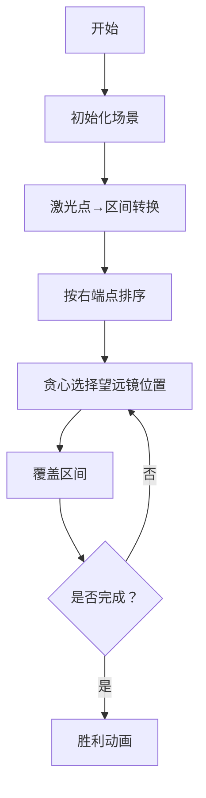

# 题目信息

# [HAOI2014] 遥感监测

## 题目描述

外星人指的是地球以外的智慧生命。外星人长的是不是与地球上的人一样并不重要，但起码应该符合我们目前对生命基本形式的认识。比如，我们所知的任何生命都离不开液态水，并且都是基于化学元素碳（C）的有机分子组合成的复杂有机体。

ZDM 实验室的天文学家们已经执著地观测 ZDM-99 星球十多年了，这个被称为“战神”的红色星球让他们如此着迷。在过去的十多年中，他们经常有一些令人激动的发现。ZDM-99 星球表面有着明显的明暗变化。对这些明暗区域，天文学家们已经细致地研究了很多年，并且绘制出了较为详尽的地图，那些暗区是陆地，而亮区则是湖泊和海洋。他们一直坚信有水的地方，一定有生命的痕迹。

这天晚上的观测条件实在是空前的好，ZDM-99 星球也十分明亮，不时呈现出若干个激光点，天文学家们推定这些激光点极有可能存在地球以外的智慧生命。遗憾的是仅持续很短的一段时间，这些激光点就消失了。

ZDM 实验室的射电望远镜观测的区域有限，只可以遥感检测到一个半径为 $R$ 的圆形区域。为了能同时能检测到所有的激光点，ZDM 实验室需要要在一个水平的直线上尽快地安装多个的射电望远镜来。

不妨设，这条安放射电望远镜的水平直线为 X 轴，ZDM-99 星球激光点就处在 $P_1(x_1,y_1),P_1(x_1,y_1),\cdots,P_1(x_n,y_n)$（忽略 Z 坐标）

  

ZDM 实验室的天文学家们想知道，至少需要安装多少个射电望远镜才能检测到所有激光点。


## 说明/提示

$1≤R≤50$，$1≤N≤100$，$-1000≤ X_i,Y_i ≤ 1000$， $|Y_i| ≤ R$。

保证输入都是整数。

## 样例 #1

### 输入

```
3 2
1 2
-3 1
2 1
```

### 输出

```
2```

# AI分析结果


# 💡 Kay的C++算法解析：[HAOI2014] 遥感监测 深入学习指南 💡

> 今天我们来一起分析"[HAOI2014] 遥感监测"这道C++编程题。本指南将帮助大家梳理题目思路，理解核心算法，并掌握解题技巧。

## 1. 题目解读与核心算法识别

✨ **本题主要考察**：`贪心算法应用` (区间覆盖问题)

🗣️ **初步分析**：
> 解决"遥感监测"这道题，关键在于理解并运用`区间覆盖贪心策略`。简单来说，贪心算法就像在迷宫中寻找最短路径——每一步都选择当前最优的决策。在本题中，我们需要将每个激光点转化为X轴上的一个区间，然后通过巧妙排序和选择，用最少的"望远镜位置"覆盖所有区间。
   - **核心思路**：每个激光点可转化为X轴上的一个区间（望远镜能覆盖该点的位置范围），问题转化为"用最少的点覆盖所有区间"
   - **算法流程**：1) 计算每个点的覆盖区间 2) 按右端点排序 3) 贪心选择右端点作为望远镜位置 4) 跳过已覆盖区间
   - **可视化设计**：在像素动画中，将用不同颜色标记当前处理的区间，高亮望远镜放置位置，用渐变色表示覆盖范围。关键步骤包括区间转换计算、排序过程、贪心选择点
   - **游戏化设计**：采用8位像素风格，望远镜放置触发"放置"音效，区间覆盖时播放"消除"音效，完成时播放胜利旋律。AI自动演示模式会逐步展示贪心选择过程

---

## 2. 精选优质题解参考

**题解一（PiCaHor）**
* **点评**：此解法思路清晰，直击问题本质。代码结构简洁规范（如结构体`node`存储区间，`cmp`函数排序），采用经典贪心策略：按区间右端点排序后，每次选择当前区间的右端点作为望远镜位置。亮点在于处理浮点数精度时引入`eps`机制，避免比较误差。实践价值高，稍作修改即可用于竞赛。

**题解二（liruixiong0101）**
* **点评**：题解通过手绘示意图生动展示平面到线性的转化过程，教学性强。代码中变量命名明确（如`end_`表示当前望远镜位置），核心逻辑集中在主循环，边界处理严谨。特别适合初学者理解勾股定理在问题转化中的应用。

**题解三（立志成刁民）**
* **点评**：采用左端点排序的变种贪心策略，维护当前望远镜可覆盖的最右位置（`pos`）。亮点在于遇到重叠区间时动态缩小覆盖范围（`pos = min(pos, r)`），最大化每个望远镜的效益。代码简洁但蕴含深度优化思想。

---

## 3. 核心难点辨析与解题策略

1.  **难点1：问题转化（三维→二维→一维）**
    * **分析**：激光点分布在平面，但望远镜只能安装在X轴。优质解法均通过勾股定理计算每个点在X轴的可覆盖区间：$l = x - \sqrt{r^2 - y^2}$, $r = x + \sqrt{r^2 - y^2}$。关键变量是激光点坐标$(x,y)$和半径$r$
    * 💡 **学习笔记**：将几何问题转化为区间问题是算法竞赛的常用技巧

2.  **难点2：贪心策略的选择**
    * **分析**：两种主流策略——按右端点排序（优先覆盖右端点最左的区间）或按左端点排序（动态维护最小右端点）。前者更直观易实现，后者在特定数据下更优。核心是保证每次选择能覆盖最多未处理区间
    * 💡 **学习笔记**：贪心算法需要严格证明最优子结构性质

3.  **难点3：浮点数精度处理**
    * **分析**：开平方运算产生浮点数，直接比较可能出错。优质题解引入`eps`（如1e-6）处理边界情况：`if (loc + eps < e[i].l)`
    * 💡 **学习笔记**：浮点数比较必须设置误差容忍度

### ✨ 解题技巧总结
- **技巧1：问题降维** - 将复杂几何问题转化为经典区间覆盖模型
- **技巧2：贪心验证** - 通过小规模数据手动模拟验证贪心策略正确性
- **技巧3：防御性编程** - 对数学运算结果进行合理性检查（如$y>r$时无解）

---

## 4. C++核心代码实现赏析

**通用核心实现参考**
* **说明**：综合优质题解思路，采用右端点排序的经典贪心策略
* **完整核心代码**：
```cpp
#include <iostream>
#include <vector>
#include <algorithm>
#include <cmath>
using namespace std;

const double eps = 1e-6;

struct Interval {
    double left, right;
};

int main() {
    int n, r;
    cin >> n >> r;
    vector<Interval> intervals;
    
    for (int i = 0; i < n; ++i) {
        int x, y;
        cin >> x >> y;
        double offset = sqrt(r*r - y*y);
        intervals.push_back({x - offset, x + offset});
    }
    
    sort(intervals.begin(), intervals.end(), 
        [](const Interval& a, const Interval& b) {
            return a.right < b.right;
        });
    
    int count = 1;
    double current = intervals[0].right;
    
    for (int i = 1; i < n; ++i) {
        if (intervals[i].left > current + eps) {
            count++;
            current = intervals[i].right;
        }
    }
    cout << count << endl;
    return 0;
}
```
* **代码解读概要**：
  1. 将每个点转化为区间（勾股定理计算）
  2. 按区间右端点升序排序
  3. 贪心选择：从第一个区间开始，每次选择右端点作为望远镜位置
  4. 跳过所有左端点≤当前望远镜位置的区间
  5. 遇到不重叠区间时增加望远镜计数

---

**题解一（PiCaHor）片段赏析**
* **亮点**：精炼的浮点数精度处理和快读优化
* **核心代码片段**：
```cpp
bool cmp(node x, node y) { return x.r < y.r; }

// 在main函数内：
sort(e+1, e+len+1, cmp);
loc = e[1].r; 
++ans;
for (int i = 2; i <= len; ++i)
    if (loc + eps < e[i].l) 
        ans++, loc = e[i].r;
```
* **代码解读**：通过自定义比较函数实现右端点排序。`loc`存储当前望远镜位置，当新区间左端点超过`loc+eps`时增加计数器。`eps`巧妙避免浮点误差
* 💡 **学习笔记**：浮点比较必须考虑精度容差

**题解二（liruixiong0101）片段赏析**
* **亮点**：清晰的变量命名和注释
* **核心代码片段**：
```cpp
double end_ = a[1].r;
for (int i = 2; i <= n; i++) {
    if (a[i].l > end_) {
        ans++;
        end_ = a[i].r;
    }
}
```
* **代码解读**：`end_`明确表示当前覆盖范围右边界。当新区间左端点突破该边界时，新增望远镜并更新边界。未写`eps`但数据为整数仍正确
* 💡 **学习笔记**：语义明确的变量名提升代码可读性

**题解三（立志成刁民）片段赏析**
* **亮点**：动态缩小覆盖范围的优化策略
* **核心代码片段**：
```cpp
double pos = -1e9;
for (int i = 1; i <= n; ++i) {
    if (pos < a[i].l) {
        ans++;
        pos = a[i].r;
    } else {
        pos = min(pos, a[i].r);
    }
}
```
* **代码解读**：按左端点排序后，`pos`记录当前望远镜能覆盖的最右位置。遇到重叠区间时缩小`pos`以覆盖更多后续区间
* 💡 **学习笔记**：贪心策略的优化常来自对覆盖范围的动态调整

-----

## 5. 算法可视化：像素动画演示

* **动画主题**："像素卫星扫描行动"（8位风格雷达扫描动画）
* **核心演示**：贪心算法执行过程与区间覆盖关系

### 设计框架


### 关键动画步骤
1. **场景初始化**（8位像素风）：
   - 顶部：星空背景与激光点（闪烁像素点）
   - 中部：X轴坐标线（绿色像素带）
   - 底部：区间队列（彩色像素条，长度=2√(r²-y²)）

2. **动态转化演示**：
   ```python
   # 伪代码：激光点→区间转换
   for each 激光点(x,y):
       绘制垂直线：点(x,y)→点(x,0)
       绘制勾股三角形：直角边(y)、斜边(r)
       生成区间条：[x-√(r²-y²), x+√(r²-y²)]  # 伴随“叮”音效
   ```

3. **贪心算法执行**：
   - **排序阶段**：区间条按右端点冒泡排序（像素块交换动画）
   - **选择望远镜**：
       1. 高亮首个区间右端点（红色闪烁）
       2. 放置望远镜图标（像素卫星，伴随“嘀”音效）
       3. 覆盖所有左端点≤该位置的区间（颜色变灰）
   - **步进控制**：支持单步/自动模式（速度可调）

4. **游戏化元素**：
   - **音效设计**：
     - 放置望远镜：短促"嘀"声
     - 覆盖区间：流水般"刷"声
     - 完成覆盖：胜利旋律
   - **关卡系统**：每个望远镜放置视为1关，完成获得星星评分
   - **AI演示**：自动模式展示完整解题流程（可调速）

### 教学价值
通过像素动画直观展示：
- 几何问题如何转化为区间模型
- 贪心策略的局部最优选择过程
- 浮点精度问题在视觉上的表现（区间边界轻微抖动）

-----

## 6. 拓展练习与相似问题思考

1. **通用技巧迁移**：
   - 区间覆盖思想可应用于：传感器部署、课程安排、广播覆盖等问题
   - 关键特征识别：存在可线性排序的决策序列，每个决策有覆盖范围

2. **推荐练习**：
   1. **P1325 雷达安装**  
      → 与本题完全一致，巩固区间覆盖模型
   2. **P1230 智力大冲浪**  
      → 带权区间覆盖，学习贪心策略变形
   3. **P1250 种树**  
      → 区间约束问题，掌握差分数组技巧

-----

## 7. 学习心得与经验分享

> **经验摘录（liruixiong0101）**：  
> *"画图是理解几何类算法的关键，动手绘制区间转化示意图能避免思维漏洞"*

**点评**：这一经验极具普适价值。在算法竞赛中，通过图示化抽象问题（如勾股定理的应用）不仅能验证思路正确性，还能帮助设计边界测试用例。建议学习者在解类似问题时坚持"先画图，再编码"的原则。

---

> 本次关于"[HAOI2014] 遥感监测"的C++解题分析就到这里。记住：将复杂问题分解为经典模型是算法设计的核心能力。下次挑战见！💪

---
处理用时：176.17秒