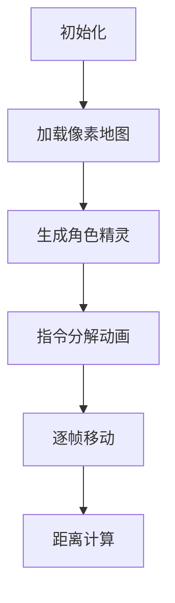

# 题目信息

# [TJOI2007] 迷路

## 题目背景

小 A 和小 B 在一个二维空间中迷路了，每个人在这个空间中都按照自己特定的路线行

走，由于他们的路线都是周期性的，因此你可以把这种路线理解为一种“轨道”：即一条封

闭的路线，路线的终点和起点重合，这样才能“周期”的行走。


## 题目描述

两个人行走的速度都是每秒一个单位距离，而且他们的路线都是平行于坐标轴的。基于

此，如果两个人无限的走下去，我们想知道他们每一秒相离最近的距离。（我们只考虑两人

在每秒行走后相离的距离，不考虑他们在这 1 秒内某个时刻的距离）


## 说明/提示

100%的数据中，对于任何 m 和 d，有 1 ≤ m, d ≤ 100，轨道的初始坐标的绝对值不超

过 2 000。


## 样例 #1

### 输入

```
0 0 4
-1 Y
-1 X
1 Y
1 X
1 0 4
-1 X
1 Y
1 X
-1 Y```

### 输出

```
1.00```

# AI分析结果


### Kay的C++算法解析：迷路 深入学习指南

---

#### 1. 题目解读与核心算法识别
✨ **本题主要考察**：`模拟应用`与`数学计算`  

🗣️ **初步分析**：
> 解决"迷路"题的核心在于**精确模拟两人每秒移动轨迹**。想象两位探险家在网格地图上按固定路线行走，我们需要用"帧-by-帧"的方式重现他们的移动过程（类似复古像素游戏的逐帧动画）。  
> - **核心思路**：将非单位距离指令拆解为单步移动 → 计算路径周期的最小公倍数 → 逐秒更新坐标并计算欧氏距离  
> - **关键难点**：  
>   • 指令拆分时需保持方向一致性（如`d=-3`需拆为3步向左）  
>   • 最小公倍数确保覆盖完整运动周期  
> - **可视化设计**：  
>   • 8-bit像素网格地图，两人用不同颜色方块表示  
>   • 每步移动时播放"滴"音效，发现更小距离时触发"叮"胜利音  
>   • 实时显示坐标和距离值的像素字体面板  

---

#### 2. 精选优质题解参考
**题解一（frank520）**  
* **点评**：采用最直观的指令拆分策略，将非单位距离分解为单步移动。代码中`g[ca].az=='X'`等方向判断逻辑清晰，边界处理严谨（如`ca=am`处理周期终点）。亮点在于用最小公倍数优化模拟范围，避免无限循环。

**题解二（神眷之樱花）**  
* **点评**：创新性使用vector动态存储路径点，`while(XR){...}`的拆分逻辑简洁高效。最大亮点是分离坐标计算与距离更新模块，增强可读性。`n1/gcd(n1,n2)*n2`的精炼公式体现数学思维优化。

**题解三（elainya_stars）**  
* **点评**：独创"移动指令数组"预处理方式，`dira[]`/`dirb[]`存储每步移动向量。亮点在于`i=i%ad+1`的循环索引控制，避免冗余计算。旁白式注释`// 记得取模`显著提升代码可维护性。

---

#### 3. 核心难点辨析与解题策略
1. **指令拆解与方向保持**  
   • **分析**：当指令`|d|>1`时，需分解为`d/|d|`方向的单步移动。优质解都采用`while`循环逐步记录（如题解一`cc=abs(g[i].ad)`）  
   • 💡 学习笔记：符号`d/|d|`是保持方向的核心技巧  

2. **周期同步与模拟范围**  
   • **分析**：路径周期为步数的最小公倍数。题解二用`m=len1/gcd(len1,len2)*len2`高效计算，避免无限模拟  
   • 💡 学习笔记：`LCM(a,b) = a*b/GCD(a,b)`是周期性问题的通用公式  

3. **实时距离计算优化**  
   • **分析**：优先计算距离平方`dx*dx+dy*dy`，最后统一开方（题解四）。避免每秒`sqrt()`的精度损耗  
   • 💡 学习笔记：比较距离时用平方值更高效  

**✨ 解题技巧总结**  
- **指令流处理**：用符号函数`d/abs(d)`标准化方向  
- **模块化设计**：分离坐标更新与距离计算逻辑（参考题解二）  
- **边界防御**：周期终点索引归零时需特殊处理（如`if(ca==0) ca=am`）

---

#### 4. C++核心代码实现赏析
**通用核心实现参考**  
```cpp
#include <iostream>
#include <cmath>
#include <vector>
using namespace std;

struct Move { int dx, dy; };
// 指令分解函数
vector<Move> parseMoves(int startX, int startY, int stepCount) {
    vector<Move> moves = {{startX, startY}};
    while (stepCount--) {
        int d; char axis;
        cin >> d >> axis;
        int dir = (d > 0) ? 1 : -1;
        int steps = abs(d);
        while (steps--) {
            auto last = moves.back();
            if (axis == 'X') moves.push_back({last.dx + dir, last.dy});
            else moves.push_back({last.dx, last.dy + dir});
        }
    }
    return moves;
}

int main() {
    // 解析两人路径
    int ax, ay, aSteps, bx, by, bSteps;
    cin >> ax >> ay >> aSteps;
    auto pathA = parseMoves(ax, ay, aSteps);
    cin >> bx >> by >> bSteps;
    auto pathB = parseMoves(bx, by, bSteps);

    // 计算最小公倍数周期
    auto gcd = [](int a, int b){ return b ? gcd(b, a % b) : a; };
    int totalSteps = pathA.size() * pathB.size() / gcd(pathA.size(), pathB.size());

    // 模拟过程
    double minDist = 1e9;
    for (int t = 0; t < totalSteps; ++t) {
        auto& posA = pathA[t % pathA.size()];
        auto& posB = pathB[t % pathB.size()];
        int dx = posA.dx - posB.dx, dy = posA.dy - posB.dy;
        minDist = min(minDist, sqrt(dx * dx + dy * dy));
    }
    printf("%.2f\n", minDist);
}
```

**代码解读概要**：  
1. `parseMoves`将原始指令解析为单步坐标序列  
2. 通过gcd计算最小公倍数确定模拟范围  
3. 循环中`t%path.size()`实现周期性索引  
4. 实时更新欧氏距离最小值  

---

#### 5. 算法可视化：像素动画演示
**主题**：《8-bit迷宫探险者》  
**核心演示**：两人在网格地图周期性移动，实时追踪最小距离  

**设计实现**：  


1. **像素场景**  
   • 16色FC风格网格（1280x720 Canvas）  
   • 角色：红/蓝8x8像素方块（带方向箭头）  
   • HUD面板：显示坐标/距离的8-bit字体  

2. **动画流程**  
   - **指令分解**：非单位指令播放"碎裂"动画（大指令块分裂为单步块）  
   - **移动高亮**：当前移动方向用闪烁边框标记，触发"滴"声  
   - **距离更新**：发现更小距离时角色头顶显示"NEW MIN!"气泡，触发"叮"声  

3. **交互控制**  
   ```javascript
   const controls = {
     speed: [1,5,10],  // 调速滑块
     mode: ['步进','自动','对比'], 
     debug: true       // 显示坐标计算过程
   }
   ```

4. **游戏化元素**  
   - 每完成1周期解锁"时空旅者"成就  
   - 距离≤1.0时触发像素烟花动画  
   - 背景音乐：8-bit循环版《迷宫探秘》  

---

#### 6. 拓展练习与相似问题
**技巧迁移场景**：  
1. 周期性运动碰撞检测（物理引擎）  
2. 多对象路径规划（机器人算法）  
3. 时空复杂度优化（大范围路径模拟）  

**洛谷推荐**：  
1. **P1518 [USACO2.4]两只塔姆沃斯牛**  
   → 同款周期性移动+距离追踪  
2. **P1825 [USACO11OPEN]Corn Maze S**  
   → 复杂路径中的最短距离变体  
3. **P4328 [COCI2006-2007] SLICICE**  
   → 周期性行为的数学建模进阶  

---

#### 7. 学习心得与经验分享
> **frank520的调试经验**："最初在周期终点索引归零时出错，通过`if(ca==0) ca=am`解决"  
> **Kay总结**：边界处理是模拟类题目的核心难点，建议：  
> 1. 用`size_t`循环索引时特别注意`%0`风险  
> 2. 周期终点用`index = (index % len) ? index : len`防御  

---

通过本次分析，我们掌握了周期性路径模拟的核心技巧。记住：**好的模拟器=精确拆解+周期控制+实时更新**。下次挑战见！🚀

---
处理用时：117.13秒