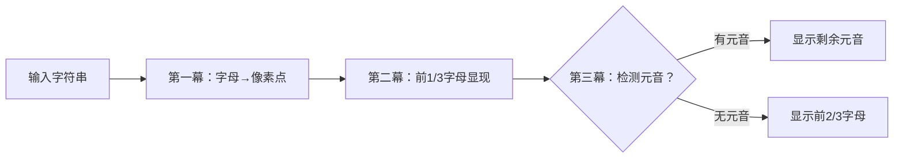

# 题目信息

# [JLOI2008] 提示问题

## 题目描述

最近在 JLOI 网上的一个流行游戏中，选手要回答很难的问题。假如在规定时间内不能回答，系统将给出 $1$ 个提示，之后再依次给出第 $2,3$ 个提示。出现在答案中的是字母和下列字符：

$\verb|. , : ; ! ? - |$ 和空格（空格不会在开头和结尾出现）。

字母是指：小写字母 $\verb!a! \cdots \verb!z!$ 大写字母 $\verb!A! \cdots \verb!Z!$，其中 a e i o u A E I O U 是元音字母。

生成提示的规则：

- 第 $1$ 个提示：简单的将所有字母换成 $\verb!.!$ 即可；
- 第 $2$ 个提示：从第 $1$ 个提示而来，将所有字母的个数求出，再将总个数除以三，得到的最接近商的自然数 $N$，将第 $1$ 个提示中的前 $N$ 个字母显示；
- 第 $3$ 个提示：从第 $2$ 个提示而来，将剩下的元音字母显示。假如没有可显示的元音字母，则从第 $1$ 个提示而来，即我们将前 $2/3$ 的字母显示（同样如不能被 $3$ 整除则取最接近的整数）。

## 样例 #1

### 输入

```
Upomoc! Lpv s nm pkrl sv smglsnk.```

### 输出

```
......! ... . .. .... .. ........ 
Upomoc! Lp. . .. .... .. ........ 
Upomoc! Lpv s nm pkrl s. ........
```

# AI分析结果


# 💡 Kay的C++算法解析：[JLOI2008]提示问题 深入学习指南 💡

## 1. 题目解读与核心算法识别

✨ **本题主要考察**：`字符串模拟` + `精确条件处理`

🗣️ **初步分析**：
> 解决这道字符串处理题，就像玩一个文字解谜游戏！核心在于**分阶段精确模拟**三个提示生成规则：
> - **提示1**：扫描字符串，将所有字母替换为`.`（类似"刮刮乐"隐藏答案）
> - **提示2**：计算字母总数的1/3（四舍五入），显示前N个字母
> - **提示3**：在提示2基础上显示剩余元音字母，若无则显示前2/3字母
>
> **核心难点**在于四舍五入计算、元音判断和状态记录。可视化设计将采用**像素文字冒险**风格：用不同颜色标记字母/元音/符号，动画分三幕展示字符串变化过程，关键操作配8-bit音效。

---

## 2. 精选优质题解参考

**题解一：_StarBird_ (11赞)**
* **点评**：模块化设计优秀（hint1/hint2/hint3分离），代码结构清晰如乐高积木。亮点在四舍五入函数`calc()`的数学处理，以及用`pos`变量记录关键位置。边界处理严谨（如getline读空格），实践价值高。

**题解二：_MRCMRC_ (7赞)**
* **点评**：创新使用`substr`字符串截取重组，像剪纸拼接般优雅。提供多组测试数据是最大亮点，帮助理解特殊用例。控制流稍复杂但注释详细，适合进阶学习。

**题解三：UnyieldingTrilobite (1赞)**
* **点评**：C++11函数式编程的炫技之作！`count_if`+`for_each`+lambda表达式实现极致简洁，像用瑞士军刀处理字符串。虽然可读性略低，但展示了STL的强大能力。

---

## 3. 核心难点辨析与解题策略

1.  **难点：四舍五入的精确计算**
    * **分析**：字母数除以3需严格四舍五入（如7/3≈2.33→2）。优质题解采用两种方案：①自定义比较函数（_StarBird_）②`round()`函数（UnyieldingTrilobite）。关键要避免整数除法截断错误。
    * 💡 **学习笔记**：浮点转整数时显式用`1.0*`保小数位

2.  **难点：元音字母的检测与状态保存**
    * **分析**：提示3需检测特定区间的元音存在性。高效方案：①遍历时标记位置（_StarBird_）②用`map`记录元音位置（Eason_AC）。注意大小写都要检测！
    * 💡 **学习笔记**：`AEIOUaeiou`建议用字符串常量避免重复判断

3.  **难点：非字母字符的保留处理**
    * **分析**：标点/空格必须原样输出。通用技巧：分支处理`isalpha()`为false的情况。_MRCMRC_的字符串重组法对此最稳健。
    * 💡 **学习笔记**：输入含空格必须用`getline(cin,str)`

### ✨ 解题技巧总结
- **模块化设计**：将三个提示拆解为独立函数（如_StarBird_）
- **防御性编程**：用`round()`或严格比较处理浮点精度
- **状态记录**：用`pos`变量保存关键转折点位置
- **测试驱动**：构造特殊用例（如全辅音字符串）验证边界

---

## 4. C++核心代码实现赏析

**通用核心实现参考**
* **说明**：综合优质题解思路，采用模块化+防御性四舍五入
```cpp
#include <iostream>
#include <cmath>
using namespace std;

string s;
int totalLetters = 0, pos = 0;

// 四舍五入函数
int roundCustom(double num) {
    return (int)(num + 0.5); 
}

// 提示1：所有字母变点
void hint1() {
    for(char c : s) {
        if(isalpha(c)) {
            cout << '.';
            totalLetters++;
        } else cout << c;
    }
    cout << endl;
}

// 提示2：显示前1/3字母
void hint2() {
    int showCount = roundCustom(totalLetters / 3.0);
    int count = 0;
    for(int i=0; i<s.size(); ++i) {
        if(isalpha(s[i])) {
            if(++count <= showCount) {
                cout << s[i];
                if(count == showCount) pos = i; // 记录最后显示位置
            } else cout << '.';
        } else cout << s[i];
    }
    cout << endl;
}

// 提示3：显示剩余元音或前2/3
void hint3() {
    // 检测剩余部分是否有元音
    bool hasVowel = false;
    string vowels = "AEIOUaeiou";
    for(int i = pos+1; i < s.size(); ++i) {
        if(vowels.find(s[i]) != string::npos) {
            hasVowel = true;
            break;
        }
    }

    // 根据检测结果输出
    int count = 0;
    int showCount = hasVowel ? roundCustom(totalLetters / 3.0) 
                             : roundCustom(totalLetters * 2.0 / 3.0);
    
    for(int i=0; i<s.size(); ++i) {
        if(isalpha(s[i])) {
            bool isVowel = (vowels.find(s[i]) != string::npos);
            if(++count <= showCount || (hasVowel && isVowel)) {
                cout << s[i];
            } else cout << '.';
        } else cout << s[i];
    }
}

int main() {
    getline(cin, s);
    hint1();
    hint2();
    hint3();
    return 0;
}
```

**题解一：_StarBird_**
* **亮点**：自定义四舍五入函数，严格处理边界
```cpp
int calc(double number) {
    if(number == (int)number) return (int)number;
    if(number - (int)number < (int)number+1 - number) 
        return (int)number;
    else return (int)number+1;
}
```
* **学习笔记**：浮点数比较需考虑精度误差，直接比较差值更可靠

**题解二：_MRCMRC_**
* **亮点**：substr字符串重组实现非破坏性处理
```cpp
string tmp = s.substr(0, N); // 前半段显示
string temp = s1.substr(N, len); // 后半段隐藏
s2 = tmp + temp; // 拼接结果
```
* **学习笔记**：字符串截取避免修改原数据，方便回溯操作

**题解三：UnyieldingTrilobite**
* **亮点**：STL算法+lambda表达式精简代码
```cpp
int cnt = count_if(s, s+n, [](char c){return isalpha(c);});
for_each(s, s+n, [](char c){putchar(isalpha(c)?'.':c);});
```
* **学习笔记**：C++11的lambda适合简单回调，但复杂逻辑可读性降低

---

## 5. 算法可视化：像素动画演示

* **主题**：8-bit文字解谜游戏《字母迷宫探险》
* **核心演示**：三幕舞台剧展示字符串变换过程

**动画设计**：


**实现细节**：
1. **像素画布**：每个字符为16x16像素块，字母=青色砖块，元音=闪烁金砖，符号=灰色石砖
2. **动态效果**：
   - 提示1：字母砖块逐个变为苔藓砖（音效：水滴声）
   - 提示2：前N个砖块破土而出（音效：挖掘声）
   - 提示3：元音砖块发光旋转（音效：金币声）或更多砖块升起
3. **控制面板**：
   - 步进控制：方向键逐帧前进
   - 速度滑块：调整动画速度
   - 元音探测器：第三幕触发时显示扫描光束
4. **游戏化元素**：
   - 每完成一阶段，屏幕下方显示"STAGE CLEAR!"
   - 最终解密成功播放8-bit胜利音乐

---

## 6. 拓展练习与相似问题

* **技巧迁移**：本题训练的字符串处理技术还可用于：
  1. 密码强度检测（统计字符类型）
  2. 文本数据脱敏（选择性替换）
  3. 代码语法高亮（区分关键字）

* **推荐练习**：
  1. **P1308 统计单词数**：字符串匹配基础
  2. **P1553 数字反转**：字符位置处理
  3. **P1598 垂直柱状图**：字符统计与输出格式化

---

## 7. 学习心得与经验分享

> **经验摘录**（_StarBird_）：
> "输入有空格要用getline，四舍五入处理卡了很久...边界测试太重要了！"
>
> **Kay点评**：这戳中两大核心痛点：①输入处理需考虑全部字符 ②数值计算要预防浮点陷阱。建议学习者：1) 用`getline`处理带空格输入 2) 编写`round()`单独测试边界值 3) 构造全辅音/全元音等极端用例验证。

---

通过本次分析，我们掌握了字符串处理的核心技巧：精确条件处理+分阶段模拟。记住，编程如解谜——分解问题、处理细节、验证边界，就能破解任何难题！下次挑战见！🚀

---
处理用时：106.20秒