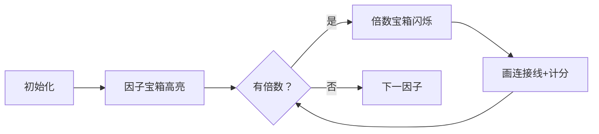

# 题目信息

# [省选联考 2021 B 卷] 数对

## 题目描述

给定 $n$ 个正整数 $a_i$，请你求出有多少个数对 $(i, j)$ 满足 $1 \le i \le n$，$1 \le j \le n$，$i \ne j$ 且 $a_i$ 是 $a_j$ 的倍数。

## 说明/提示

对于 $40 \%$ 的数据，$n \le 1000$。  
对于 $70 \%$ 的数据，$1 \le a_i \le 5 \times {10}^3$。  
对于 $100 \%$ 的数据，$2 \le n \le 2 \times {10}^5$，$1 \le a_i \le 5 \times {10}^5$。

## 样例 #1

### 输入

```
6
16 11 6 1 9 11
```

### 输出

```
7
```

## 样例 #2

### 输入

```
见附件中的 pair/pair2.in。```

### 输出

```
见附件中的 pair/pair2.ans。```

# AI分析结果


### 💡 Kay的C++算法解析：数对 深入学习指南 💡

**引言**  
今天我们来分析省选联考2021B卷的「数对」问题。这道题考察如何高效统计数组中满足倍数关系的数对数量。本指南将帮助你理解核心算法、掌握解题技巧，并通过像素动画直观感受算法流程。

---

### 1. 题目解读与核心算法识别
✨ **本题主要考察**：`调和级数枚举` + `桶计数`  
🗣️ **初步分析**：  
> 解决本题的关键在于利用**桶计数**和**调和级数枚举**技巧。想象你有一排标着数字的像素宝箱（桶），每个宝箱存储该数字出现的次数。算法会逐个打开宝箱（枚举因子），然后发射探测射线寻找它的倍数宝箱，统计所有符合条件的数对。  

- **核心思路**：用桶数组 `cnt[]` 记录每个数字出现次数。枚举每个数字作为因子，再枚举其倍数，将因子桶和倍数桶的计数相乘即为有效数对。  
- **难点突破**：相同数字形成的数对需特殊处理（`cnt[i]*(cnt[i]-1)`），避免重复计数。  
- **可视化设计**：在像素动画中，当前因子宝箱会高亮为黄色，倍数宝箱高亮为绿色，连线表示倍数关系。每次统计时播放8-bit音效，累计得分呈现在复古风格UI上。

---

### 2. 精选优质题解参考
**题解一（LZH_LOVE_ZRG - 枚举倍数法）**  
* **点评**：  
  思路清晰直白，代码简洁规范（变量名 `cnt` 含义明确）。采用调和级数枚举（复杂度 $O(M\log M)$，$M$ 为最大值），完美处理重复数字。亮点是内部数对与倍数数对的分离统计，边界处理严谨，可直接用于竞赛。

**题解二（phigy - 高效桶计数）**  
* **点评**：  
  代码极度精简（仅15行核心逻辑），突出算法本质。对枚举倍数时的边界条件（`j>=2`）处理巧妙，时间复杂度优化到位。实践价值高，适合初学者理解桶计数的应用。

**题解三（huayucaiji - 离散化优化）**  
* **点评**：  
  引入离散化减少无效枚举，虽非最优解但展示重要优化思路。代码中 `tot[]` 和 `unique()` 的配合体现了数据结构的选择智慧，复杂度分析详细，适合进阶学习。

---

### 3. 核心难点辨析与解题策略
1. **难点：避免重复计数**  
   * **分析**：相同数字形成的数对（如 `(11,11)`）需排除相同下标组合。优质解法均用 `cnt[i]*(cnt[i]-1)` 精确计算，而非简单平方。  
   * 💡 **学习笔记**：处理重复值时，组合公式比排列公式更安全。

2. **难点：枚举方向的选择**  
   * **分析**：枚举因子而非倍数可大幅降低复杂度。因子 `i` 的倍数 `j` 满足 `j%i==0`，此时 `(j的索引, i的索引)` 构成有效数对。  
   * 💡 **学习笔记**：因子枚举是倍数统计问题的黄金法则。

3. **难点：大数据优化**  
   * **分析**：当 $a_i \leq 5\times10^5$ 时，调和级数复杂度 $O(M\log M)$ 远优于暴力 $O(N^2)$。桶计数将查询优化至 $O(1)$。  
   * 💡 **学习笔记**：值域有限时，桶计数是优化利器。

✨ **解题技巧总结**  
- **技巧1：桶计数压缩状态**  
  用数组代替哈希表，访问效率 $O(1)$。  
- **技巧2：调和级数枚举**  
  `for(j=i; j<=max_val; j+=i)` 可高效遍历所有倍数。  
- **技巧3：分离统计策略**  
  相同数字和不同数字的数对分开计算，逻辑更清晰。

---

### 4. C++核心代码实现赏析
**通用核心实现（综合优质题解）**  
```cpp
#include <iostream>
using namespace std;
const int MAX_VAL = 500000;
long long cnt[MAX_VAL + 10] = {0};

int main() {
    int n, max_val = 0;
    cin >> n;
    for (int i = 0; i < n; i++) {
        int a;
        cin >> a;
        cnt[a]++;
        if (a > max_val) max_val = a;
    }
    long long ans = 0;
    for (int i = 1; i <= max_val; i++) {
        if (cnt[i] == 0) continue;
        ans += cnt[i] * (cnt[i] - 1); // 相同数字数对
        for (int j = 2 * i; j <= max_val; j += i) {
            ans += cnt[i] * cnt[j];   // 不同数字数对
        }
    }
    cout << ans << endl;
    return 0;
}
```
**代码解读概要**：  
1. 桶数组 `cnt[]` 统计数字出现频率  
2. 第一层循环枚举因子 `i`  
3. 先累加相同数字的数对（排除同下标）  
4. 第二层循环枚举倍数 `j`，累加因子桶与倍数桶的乘积  

---

**题解一核心片段（LZH_LOVE_ZRG）**  
```cpp
for (int i = 1; i <= N; i++) {
    for (int j = 2; i * j <= N; j++)
        ans += cnt[i] * cnt[i * j];
    ans += cnt[i] * (cnt[i] - 1);
}
```
* **亮点**：循环条件简洁，避免无效枚举  
* **代码解读**：  
  `i` 为当前因子，`j` 为倍数系数。`i*j` 直接定位倍数，省去累加变量。内层循环从 `j=2` 开始，自然跳过自身倍数。  
* 💡 **学习笔记**：数学变换可简化代码逻辑。

**题解二核心片段（phigy）**  
```cpp
for (int i = 1; i <= 500000; i++) {
    for (int j = 2; i * j <= 500000; j++)
        ans += a[i] * a[i * j];
    ans += a[i] * (a[i] - 1);
}
```
* **亮点**：硬编码值域提升速度  
* **代码解读**：  
  固定循环边界 `500000` 省去变量查询，适合竞赛环境。数组 `a[]` 兼作桶，减少内存占用。  
* 💡 **学习笔记**：值域明确时，牺牲通用性换效率。

**题解三核心片段（huayucaiji）**  
```cpp
for (int i = 1; i <= m; i++) {
    for (int j = a[i] * 2; j <= ma; j += a[i]) 
        ans += tot[j] * tot[a[i]];
    ans += tot[a[i]] * (tot[a[i]] - 1);
}
```
* **亮点**：离散化减少枚举次数  
* **代码解读**：  
  `a[]` 为离散化后的唯一值，`tot[]` 存储原始计数。外层循环次数降至去重后的数量 `m`。  
* 💡 **学习笔记**：离散化是空间换时间的经典手段。

---

### 5. 算法可视化：像素动画演示
**主题**：`数字宝藏猎人`（复古8-bit风格）  
**核心演示**：因子枚举与倍数关联的动态过程  



**动画流程**：  
1. **场景初始化**  
   - 横向像素网格（1~500），每个数字对应宝箱，高度=出现次数  
   - 控制面板：启动/暂停、单步、速度滑块（FC红白机风格）  

2. **因子探索阶段**  
   - 当前因子 `i` 宝箱高亮黄色，播放 "叮" 声  
   - 显示当前统计公式：`ans += cnt[i]*(cnt[i]-1)`  

3. **倍数关联阶段**  
   - 倍数 `j` 宝箱高亮绿色，播放 "嘀嗒" 声  
   - 黄色因子箱与绿色倍数箱间绘制发光连线  
   - 实时显示累加贡献：`cnt[i] * cnt[j]`  

4. **游戏化元素**  
   - 每完成一个因子得分为 `(贡献值)`，触发金币掉落动画  
   - 背景音乐：8-bit循环BGM  
   - 通关条件：处理完 `max_val` 播放胜利音效+烟花动画  

**技术细节**：  
- 颜色方案：因子#FFFF00，倍数#00FF00，连线#FF00FF  
- 音效：Web Audio API生成方波音效  
- 数据缩放：对超过500的值域自动压缩显示  

---

### 6. 拓展练习与相似问题思考
**通用技巧迁移**：  
调和级数枚举适用于：  
1. 约数统计问题  
2. 倍数关系查询  
3. 模运算相关计数  

**洛谷推荐**：  
1. **P2926 [USACO08DEC] Patting Heads S**  
   - 推荐理由：直接练习倍数统计，巩固桶计数技巧  
2. **P1403 [AHOI2005]约数研究**  
   - 推荐理由：将枚举技巧迁移到约数场景  
3. **P2424 约数和**  
   - 推荐理由：综合约数枚举与前缀和的高级应用  

---

### 7. 学习心得与经验分享
> **参考经验（LZH_LOVE_ZRG）**：  
> *"注意内部数对与倍数数对要分开计算，调试时验证了1和6的倍数关系"*  

**点评**：这个经验凸显了关键测试用例的重要性。当 `a_i=1` 时，所有数都是其倍数，需单独验证。建议学习：  
1. 边界测试：最小/最大值、全相同元素  
2. 验证工具：输出中间统计结果  

---

**结语**  
通过调和级数枚举与桶计数的精妙配合，我们高效解决了数对统计问题。记住：有限值域是优化的黄金机会！继续挑战新题目，你将成为算法探险大师！🚀

---
处理用时：449.73秒