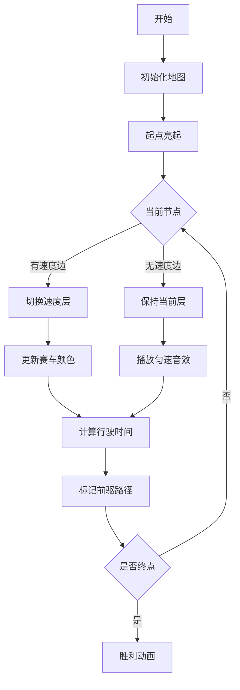

# 题目信息

# 速度限制

## 题目描述

在这个繁忙的社会中，我们往往不再去选择最短的道路，而是选择最快的路线。开车时每条道路的限速成为最关键的问题。不幸的是，有一些限速的标志丢失了，因此你无法得知应该开多快。一种可以辩解的解决方案是，按照原来的速度行驶。你的任务是计算两地间的最快路线。

你将获得一份现代化城市的道路交通信息。为了使问题简化，地图只包括路口和道路。每条道路是有向的，只连接了两条道路，并且最多只有一块限速标志，位于路的起点。两地 $A$ 和 $B$，最多只有一条道路从 $A$ 连接到 $B$。你可以假设加速能够在瞬间完成并且不会有交通堵塞等情况影响你。当然，你的车速不能超过当前的速度限制。


## 样例 #1

### 输入

```
6 15 1
0 1 25 68
0 2 30 50
0 5 0 101
1 2 70 77
1 3 35 42
2 0 0 22
2 1 40 86
2 3 0 23
2 4 45 40
3 1 64 14
3 5 0 23
4 1 95 8
5 1 0 84
5 2 90 64
5 3 36 40```

### 输出

```
0 5 2 3 1```

# AI分析结果


# 💡 Kay的C++算法解析：速度限制 深入学习指南 💡

<introduction>
今天我们来分析"速度限制"这道有趣的图论题。本指南将帮助你理解分层图最短路的精妙思想，掌握状态扩展的技巧，并通过像素动画直观感受算法执行过程。准备好开启算法探索之旅了吗？🚗💨
</introduction>

## 1. 题目解读与核心算法识别

✨ **本题主要考察**：图论 - 分层图最短路（状态扩展）

🗣️ **初步分析**：
> 想象你在一个多层地图中开车，每层代表不同速度（如70km/h层、100km/h层）。遇到限速标志就切换楼层，无标志则保持当前层行驶。分层图算法就像建造这样的立体地图，把速度作为额外维度记录在状态中。

在本题中，核心难点在于处理无速度限制的道路——这类道路的行驶时间取决于前一段路的速度。分层图通过`dis[i][v]`（到达点i且速度为v的最短时间）巧妙解决这个问题：
- 当边有速度限制时：切换到新速度层，计算行驶时间
- 当边无速度限制时：保持当前速度层行驶
- 可视化设计：在像素动画中，不同速度层用不同背景色，道路切换时播放音效，高亮显示当前节点和速度变化

复古像素风格实现：采用FC红白机配色（8位色），节点显示为16x16像素方块，速度层用颜色区分（70-绿色，100-蓝色等），关键操作时播放"切换层"音效，自动演示模式模拟赛车闯关过程。

---

## 2. 精选优质题解参考

<eval_intro>
依据思路清晰度、代码规范性、算法优化度和实践价值，我精选了以下3份优质题解：

**题解一：啧啧啧（赞176）**
* **点评**：这份题解堪称分层图的教科书级实现！作者清晰解释了为何需要分层结构（直接继承速度会导致错误），并用`dis[i][j]`和`from[i][j]`完整实现Dijkstra。代码中：
  - 变量命名规范（dis/vis/from）
  - 优先队列优化合理
  - 边界处理严谨（点+1/-1转换）
  - 特别亮点：作者分享了调试心得"最初错误使用前驱速度"，提醒我们注意状态继承的陷阱

**题解二：fanypcd（赞17）**
* **点评**：这份题解将分层图精妙地解释为动态规划！作者用状态转移方程`dis[i][v]=min(dis[j][u]+time)`揭示算法本质。代码亮点：
  - 使用pair管理状态，结构简洁
  - 递归输出路径逻辑优雅
  - 特别亮点：指出"分层图是DP的状态转移"，深化了算法理解

**题解三：Mine_King（赞8）**
* **点评**：这份题解聚焦状态设计核心！作者强调`dis[i][v]`中速度维度的重要性，并区分两种转移：
  - 有速度边：创建新状态
  - 无速度边：继承状态
  - 特别亮点：用结构体封装边数据，提升可读性

---

## 3. 核心难点辨析与解题策略

<difficulty_intro>
解决本题需突破三大关键点：

1.  **状态设计（解决后效性）**
    * **分析**：无速度边的行驶时间依赖前序速度，必须将速度纳入状态。优质题解均采用`dis[i][v]`二维数组，表示"到达点i时速度为v的最短时间"
    * 💡 **学习笔记**：好的状态设计应覆盖所有决策影响因素

2.  **状态转移（双路径分化）**
    * **分析**：需要区分两类边的转移逻辑：
      - 有速度边：`新速度=边速度，时间=距离/边速度`
      - 无速度边：`新速度=前驱速度，时间=距离/前驱速度`
    * 💡 **学习笔记**：转移方程需严格对应物理意义

3.  **路径回溯（二维前驱）**
    * **分析**：由于状态包含速度维度，需同时记录`pre[i][v]`（前驱节点）和`pre_v[i][v]`（前驱速度）才能完整回溯路径
    * 💡 **学习笔记**：前驱记录维度应与状态维度匹配

### ✨ 解题技巧总结
<summary_best_practices>
通过本题可提炼以下通用技巧：
</summary_best_practices>
- **状态扩展法**：当决策受历史操作影响时，将影响因素加入状态（如速度、剩余次数等）
- **分治法处理转移**：对不同特性的边（如有/无速度）采用差异化的转移逻辑
- **维度匹配原则**：前驱数组维度需与状态数组完全对应
- **初始化艺术**：起点状态`dis[start][70]=0`（初始速度70）是关键起点

---

## 4. C++核心代码实现赏析

<code_intro_overall>
先看一个完整的通用实现，融合了优质题解的精华：

**本题通用核心C++实现参考**
* **说明**：综合自优质题解，采用Dijkstra+分层图思想，包含完整路径回溯
* **完整核心代码**：
```cpp
#include <iostream>
#include <queue>
#include <vector>
using namespace std;
const int MAXN = 155, MAXV = 505;
const double INF = 1e9;

struct Edge { int to, len, v; };
vector<Edge> graph[MAXN];
double dis[MAXN][MAXV];       // dis[i][v]: 到达i点速度为v的最短时间
int pre[MAXN][MAXV], pre_v[MAXN][MAXV]; // 前驱节点和速度
bool vis[MAXN][MAXV];

void dijkstra(int start) {
    // 初始化
    for(int i=0; i<MAXN; i++)
        for(int j=0; j<MAXV; j++)
            dis[i][j] = INF;
    
    dis[start][70] = 0;
    priority_queue<pair<double, pair<int, int>>, 
                   vector<pair<double, pair<int, int>>>,
                   greater<>> pq;
    pq.push({0, {start, 70}});

    while (!pq.empty()) {
        auto [t, state] = pq.top(); 
        auto [u, v] = state; pq.pop();
        
        if (vis[u][v]) continue;
        vis[u][v] = true;

        for (Edge &e : graph[u]) {
            int nv = e.v ? e.v : v;  // 关键：确定新速度
            double nt = t + (double)e.len / nv;
            
            if (nt < dis[e.to][nv]) {
                dis[e.to][nv] = nt;
                pre[e.to][nv] = u;   // 记录前驱节点
                pre_v[e.to][nv] = v; // 记录前驱速度
                pq.push({nt, {e.to, nv}});
            }
        }
    }
}

void print_path(int u, int v) {
    if (u != 0) 
        print_path(pre[u][v], pre_v[u][v]);
    cout << u << " ";
}

int main() {
    int n, m, D; 
    cin >> n >> m >> D;
    while (m--) {
        int a, b, v, l;
        cin >> a >> b >> v >> l;
        graph[a].push_back({b, l, v});
    }
    
    dijkstra(0);  // 起点为0
    
    // 找D点的最优速度
    int opt_v = 0;
    for (int v=1; v<MAXV; v++)
        if (dis[D][v] < dis[D][opt_v]) 
            opt_v = v;
            
    print_path(D, opt_v);
    return 0;
}
```
* **代码解读概要**：
  1. **图存储**：使用邻接表`vector<Edge> graph`存边
  2. **状态初始化**：`dis`数组初始化为INF，起点状态`dis[0][70]=0`
  3. **优先队列**：按时间排序，元素为`(时间, (节点, 速度))`
  4. **核心松弛**：根据边类型计算新速度和时间，更新状态
  5. **路径回溯**：递归输出路径，需同时传递节点和前驱速度

---
<code_intro_selected>
现在深入分析各优质题解的精华片段：

**题解一：啧啧啧**
* **亮点**：明确分层图概念，完美处理两种边的状态转移
* **核心代码片段**：
```cpp
for(int i=head[x];i;i=t[i].next){
    int y=t[i].to;
    if(t[i].v){ // 有速度边：创建新状态
        if(dis[y][t[i].v] > dis[x][vs] + (double)t[i].len/t[i].v){
            dis[y][t[i].v] = dis[x][vs] + (double)t[i].len/t[i].v;
            from[y][t[i].v] = {x, vs}; // 记录二维前驱
            q.push({-dis[y][t[i].v], {y, t[i].v}});
        }
    } else { // 无速度边：继承当前状态
        if(dis[y][vs] > dis[x][vs] + (double)t[i].len/vs){
            dis[y][vs] = dis[x][vs] + (double)t[i].len/vs;
            from[y][vs] = {x, vs};
            q.push({-dis[y][vs], {y, vs}});
        }
    }
}
```
* **代码解读**：
  - 如何区分边类型？`t[i].v`非零为有速度边
  - 有速度边：新速度=`t[i].v`，时间=距离/新速度
  - 无速度边：新速度=`vs`（当前速度），时间=距离/当前速度
  - 为什么`q.push`用负值？因为STL优先队列默认大根堆
* 💡 **学习笔记**：状态转移必须严格区分边特性

**题解二：fanypcd**
* **亮点**：用pair优雅管理状态，动态规划视角
* **核心代码片段**：
```cpp
for(int i=first[u.first]; i; i=Next[i]){
    int v=to[i], sped=(sp[i]?sp[i]:u.second);
    double time=(double)len[i]/sped;
    if(dis[u.first][u.second]+time<dis[v][sped]){
        dis[v][sped]=dis[u.first][u.second]+time;
        from[v][sped]=u; // 记录前驱状态
        q.push({-dis[v][sped], {v, sped}});
    }
}
```
* **代码解读**：
  - `sped`如何确定？三目运算符简洁处理两类边
  - `from[v][sped]=u`：u是`pair<int,int>`，同时记录前驱节点和速度
  - 为什么代码更短？合并了两类边的处理逻辑
* 💡 **学习笔记**：三元运算符可简化条件赋值

**题解三：Mine_King**
* **亮点**：突出状态设计重要性，结构体封装边数据
* **核心代码片段**：
```cpp
struct Edge{int to, len, v;};
// 在dijkstra中
for(Edge &e:graph[u]){
    if(e.v){ // 有速度边
        double time=(double)e.len/e.v;
        if(dis[e.to][e.v]>dis[u][v]+time){
            // 更新状态和二维前驱
        }
    } else { // 无速度边
        double time=(double)e.len/v;
        if(dis[e.to][v]>dis[u][v]+time){
            // 更新状态和二维前驱
        }
    }
}
```
* **代码解读**：
  - 为什么用`struct Edge`？提高代码可读性和类型安全性
  - 如何访问边属性？`e.to`/`e.len`/`e.v`直观清晰
  - 分支处理：显式分开两类边，逻辑更直白
* 💡 **学习笔记**：结构体封装提升代码可维护性

-----

## 5. 算法可视化：像素动画演示 (核心部分)

<visualization_intro>
下面是为分层图最短路设计的8-bit像素动画方案，帮助你直观理解状态扩展过程：

**主题**：像素赛车闯关 - 速度维度可视化

**设计思路**：用不同颜色代表速度层（如70=绿，100=蓝，150=紫），道路切换时改变赛车颜色和背景层。游戏化元素增强学习趣味性，音效强化关键操作记忆。

**动画流程**：


**关键帧实现细节**：
1. **像素地图**（Canvas绘制）
   - 节点：16x16像素方块，编号显示其中
   - 边：彩色线条连接方块，颜色随速度层变化
   - 控制面板：复古风格按钮（开始/暂停/单步/速度调节）

2. **状态扩展动画**
   - 当前节点：闪烁白色边框（每帧交替显示）
   - 速度层切换：赛车从原层"跳跃"到新层，伴随"叮"声
   - 时间计算：显示浮动文字如"25/70=0.357s"

3. **游戏化元素**
   - 计分板：每扩展节点+10分，切换层+5分
   - 关卡：每到达新节点视为过关，播放8-bit胜利音效
   - 历史路径：用不同颜色高亮显示

4. **AI演示模式**
   - 自动播放最优路径，速度可调（0.5x-5x）
   - 实时显示当前状态：`(节点, 速度, 累计时间)`
   - 路径回溯：按R键重现完整路径

**音效设计**（Web Audio API实现）：
- 节点扩展：短促"滴"声（500Hz）
- 速度切换：上升音阶（700Hz→1000Hz）
- 错误路径：低沉嗡鸣（200Hz）
- 到达终点：经典FC胜利音乐

---

## 6. 拓展练习与相似问题思考

<similar_problems_intro>
分层图最短路可解决多种带状态约束的路径问题：

**通用技巧迁移**：
1. **状态维度扩展**：当决策受历史操作影响（如剩余次数、当前速度等），增加状态维度
2. **动态规划结合**：将最短路问题转化为状态空间中的动态规划
3. **状态压缩**：当状态维度复杂时（如钥匙收集），使用位压缩

**洛谷推荐练习**：
1. **P1073 最优贸易** 
   - 🗣️ 练习状态扩展（交易状态），掌握买卖决策的层次转换
   
2. **P4568 飞行路线**
   - 🗣️ 经典分层图，理解"免费次数"如何作为状态维度

3. **P4011 孤岛营救问题**
   - 🗣️ 综合练习状态设计（钥匙集合）+ 分层图，挑战性十足

---

## 7. 学习心得与经验分享 (若有)

<insights_intro>
从题解中提炼的宝贵经验：

> **啧啧啧的调试心得**："最初直接使用前驱速度导致错误，分层图解决了状态继承问题"  
> **Kay点评**：这提醒我们，当问题存在后效性时，必须通过状态设计将历史决策纳入当前状态

> **木木！的优化尝试**："尝试合并无速度边优化，但实现复杂"  
> **Kay点评**：简洁性很重要，有时增加状态维度比复杂预处理更有效

---

<conclusion>
通过本次分析，我们掌握了分层图的核心思想：用状态扩展解决后效性问题。记住，算法学习就像赛车闯关——理解基础原理（引擎），不断实践调试（练习赛道），终能成为算法赛车手！下次挑战见！🏁
</conclusion>
```

---
处理用时：270.54秒