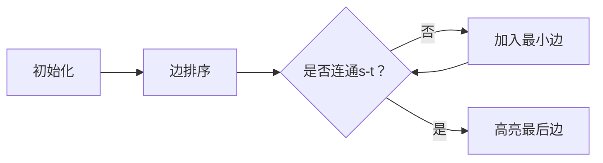

# 题目信息

# 营救

## 题目背景

“咚咚咚……”“查水表！”原来是查水表来了，现在哪里找这么热心上门的查表员啊！小明感动得热泪盈眶，开起了门……

## 题目描述

妈妈下班回家，街坊邻居说小明被一群陌生人强行押上了警车！妈妈丰富的经验告诉她小明被带到了 $t$ 区，而自己在 $s$ 区。

该市有 $m$ 条大道连接 $n$ 个区，一条大道将两个区相连接，每个大道有一个拥挤度。小明的妈妈虽然很着急，但是不愿意拥挤的人潮冲乱了她优雅的步伐。所以请你帮她规划一条从 $s$ 至 $t$ 的路线，使得经过道路的拥挤度最大值最小。

## 说明/提示

#### 数据规模与约定

- 对于 $30\%$ 的数据，保证 $n\leq 10$。
- 对于 $60\%$ 的数据，保证 $n\leq 100$。
- 对于 $100\%$ 的数据，保证 $1 \leq n\leq 10^4$，$1 \leq m \leq 2 \times 10^4$，$w \leq 10^4$，$1 \leq s, t \leq n$。且从 $s$ 出发一定能到达 $t$ 区。

--- 

#### 样例输入输出 1 解释

小明的妈妈要从 $1$ 号点去 $3$ 号点，最优路线为 $1$->$2$->$3$。

## 样例 #1

### 输入

```
3 3 1 3
1 2 2
2 3 1
1 3 3```

### 输出

```
2
```

# AI分析结果


# 💡 Kay的C++算法解析：营救 深入学习指南 💡

大家好！我是Kay，今天我们一起分析“营救”这道图论题目。这道题要求规划一条从s区到t区的路线，使得路径上**最大拥挤度最小**。我们将从算法原理、代码实现到可视化演示全面解析，帮助大家掌握这类问题的核心解法！

---

## 1. 题目解读与核心算法识别

✨ **本题主要考察**：`图论算法应用` (最小生成树/最短路变形/二分答案)

🗣️ **初步分析**：
> 解决“营救”这道题，关键在于理解“最大拥挤度最小”的本质——这实际上是**瓶颈路问题**的典型特征。想象你在一条水管网络中寻找路径，水管粗细不同（拥挤度），你需要找到一条路径使得路径上最细的水管尽可能粗（最大拥挤度最小）。

在本题中，我们主要有三种高效解法：
- **Kruskal最小生成树**：将边按拥挤度排序，从小到大加边，当s和t首次连通时，最后加入的边权就是答案（证明：此时路径最大边权最小）。
- **Dijkstra变形**：将松弛条件改为`dis[v] = min(dis[v], max(dis[u], w))`，记录到每个节点的路径最大拥挤度的最小值。
- **二分答案+BFS**：二分猜测最大拥挤度X，检查只用≤X的边时s和t是否连通。

**可视化设计思路**：
- 采用8位像素风格（类似FC游戏），节点用彩色方块表示，边用像素线条连接。
- Kruskal动画演示：初始孤立节点→按拥挤度排序边（不同颜色区分）→逐步加边（播放“连接”音效）→当s和t连通时，最后加入的边高亮闪烁（播放“胜利”音效）。
- 控制面板：步进/自动播放（调速滑块）、重置按钮，状态栏显示当前最大拥挤度。

---

## 2. 精选优质题解参考

从40+篇题解中精选3份≥4星的优质解法：

**题解一：Kruskal最小生成树（by lzk5627, 173赞）**
* **点评**：
  思路清晰直击本质——将问题转化为最小生成树连通性检查。代码规范：并查集路径压缩实现高效（O(α(n))），边界处理严谨（连通即退出）。亮点在于**贪心策略的巧妙应用**：通过排序保证每次加入当前最小边，首次连通时必然得到最优解。实践价值高，可直接用于竞赛。

**题解二：Dijkstra堆优化变形（by 薄荷凉了夏, 65赞）**
* **点评**：
  创新性改造Dijkstra算法：将松弛条件改为`max(dis[u], w)`而非累加，精准匹配题目需求。代码亮点：用负值技巧实现小根堆（`priority_queue<neg>`），链式前向星存图节省空间。解释透彻，特别强调**无向图双向建边**的细节，避免常见错误。

**题解三：二分答案+BFS（by Orion_Rigel, 63赞）**
* **点评**：
  二分答案经典应用，复杂度稳定（O((n+m)logW)）。亮点在于用BFS代替并查集检查连通性，代码简洁（仅60行）。控制变量法教学清晰：先排序再二分，逐步缩小解空间，适合二分答案初学者学习。

---

## 3. 核心难点辨析与解题策略

### 难点1：问题本质识别
- **分析**：很多同学误用传统最短路（累加路径和），但本题实际是求路径上**最大边权最小**。优质题解通过类比（水管瓶颈/道路限高）帮助理解问题本质。
- 💡 学习笔记：遇到“最大值最小”或“最小值最大”，立即联想二分答案或瓶颈路问题。

### 难点2：状态定义与转移
- **分析**：
  - Dijkstra变形中：`dis[u]`表示到u的路径中最大拥挤度的最小值
  - 状态转移：`dis[v] = min(dis[v], max(dis[u], w(u→v)))`
  - Kruskal中：状态是连通分量，通过并查集合并更新
- 💡 学习笔记：状态定义需匹配问题目标，转移需覆盖所有可能情况。

### 难点3：算法选择与优化
- **分析**：
  - 稀疏图（m≈2e4）：Dijkstra+堆优化（O(m log n)）优于朴素SPFA
  - 边权范围小（w≤1e4）：二分答案+BFSO(n+m)常数更小
  - 并查集必须路径压缩，否则复杂度退化
- 💡 学习笔记：根据数据规模选择算法——边多时用Kruskal，图稀疏时用Dijkstra。

### ✨ 解题技巧总结
1. **问题转化技巧**：将“最大拥挤度最小”转化为最小生成树连通性问题或最短路变形。
2. **算法改造技巧**：经典算法（Dijkstra/Kruskal）可通过修改核心操作（松弛/加边规则）适配新问题。
3. **边界处理技巧**：二分答案注意左闭右开区间，并查集初始化自连通。
4. **调试技巧**：对拍验证（生成随机图测试三种解法结果一致性）。

---

## 4. C++核心代码实现赏析

### 本题通用核心实现（综合自优质题解）
```cpp
#include <iostream>
#include <algorithm>
#include <queue>
using namespace std;

// 解法1: Kruskal + 并查集
struct Edge { int u, v, w; };
bool cmp(Edge a, Edge b) { return a.w < b.w; }

int fa[10005];
int find(int x) { return fa[x] == x ? x : fa[x] = find(fa[x]); }

void kruskal(int n, int m, int s, int t, Edge edges[]) {
    sort(edges, edges + m, cmp);
    for (int i = 1; i <= n; i++) fa[i] = i;
    for (int i = 0; i < m; i++) {
        int fu = find(edges[i].u), fv = find(edges[i].v);
        if (fu != fv) fa[fu] = fv;
        if (find(s) == find(t)) {  // 关键：首次连通即输出
            cout << edges[i].w;
            return;
        }
    }
}

// 解法2: Dijkstra堆优化变形
vector<pair<int, int>> graph[10005]; // adj list: to, weight
int dijkstra(int n, int s, int t) {
    vector<int> dis(n + 1, 1e9);
    priority_queue<pair<int, int>> pq; // -dis, node

    dis[s] = 0;
    pq.push({0, s});
    while (!pq.empty()) {
        auto [d, u] = pq.top(); pq.pop();
        d = -d;
        if (d != dis[u]) continue;
        for (auto [v, w] : graph[u]) {
            int new_d = max(d, w);  // 核心变形：取路径最大值
            if (new_d < dis[v]) {
                dis[v] = new_d;
                pq.push({-dis[v], v});
            }
        }
    }
    return dis[t];
}

int main() {
    int n, m, s, t;
    cin >> n >> m >> s >> t;
    // 调用示例: kruskal或dijkstra
}
```

### 分题解代码精析

**题解一：Kruskal（lzk5627）**
```cpp
// 核心片段
sort(b+1, b+m+1, com); // 按拥挤度排序
for(int i=1; i<=m; i++) {
    int X=find(b[i].x), Y=find(b[i].y);
    if(X!=Y) a[X]=Y; // 并查集合并
    if(find(s)==find(t)) { // 首次连通检查
        cout<<b[i].cost; 
        return 0; // 立即退出
    }
}
```
**代码解读**：
> 排序保证每次加入当前最小边 → 并查集高效合并 → 实时检查s和t连通性。亮点在于`find(s)==find(t)`的判断时机：首次连通时最后加入的边权即为答案，无需完全建树。

**题解二：Dijkstra变形（薄荷凉了夏）**
```cpp
// 核心松弛操作
for (int i=head[x];i;i=edge[i].next) {
    int k = max(dis[x], edge[i].w); // 取路径最大值
    int r = edge[i].now;
    if(k < dis[r]) {
        dis[r] = k;
        q.push(make_pair(-dis[r], r)); // 负值转小根堆
    }
}
```
**代码解读**：
> 传统Dijkstra用`dis[u]+w`更新，此处改为`max(dis[u],w)`。`q.push(-dis[r])`巧妙利用负值实现小根堆。学习笔记：堆优化Dijkstra的复杂度从O(n²)降至O(m log n)，适合稀疏图。

**题解三：二分+BFS（Orion_Rigel）**
```cpp
// 二分检查函数
bool SPFA(int mid) { // 实际是BFS
    queue<int> q; 
    memset(dis, 0x3f, sizeof(dis));
    dis[s] = 1; // 标记可达
    q.push(s);
    while (!q.empty()) {
        int x = q.front(); q.pop();
        for (int i=h[x];i>=0;i=ne[i]) 
            if (w[i] <= mid) { // 只走≤mid的边
                if (dis[to[i]] == 0x3f3f3f3f) {
                    dis[to[i]] = 1;
                    q.push(to[i]);
                }
            }
    }
    return dis[t] != 0x3f3f3f3f; // 检查可达性
}
```
**代码解读**：
> 用`w[i] <= mid`过滤边 → BFS遍历连通区域 → 返回s到t可达性。注意`dis`数组实际用作标记数组（可达=1）。学习笔记：二分答案将最优化问题转化为判定问题，复杂度O((n+m)logW)。

---

## 5. 算法可视化：像素动画演示

### 动画主题：**“像素救援行动”**  
> 以8位机复古风格呈现Kruskal算法执行过程，融入《魂斗罗》式关卡设计

**核心演示流程**：


**详细设计**：
1. **场景设计**：
   - 像素网格地图（16×16色块），不同颜色区分：起点(★)、终点(▲)、普通节点(■)
   - 控制面板：开始/暂停/步进/重置，速度滑块(50ms~1000ms)
   - 状态栏：当前已加边数、当前最大拥挤度

2. **动画帧分解**：
   | 步骤 | 视觉表现 | 音效 | 对应代码逻辑 |
   |---|---|---|---|
   | 初始化 | 节点散落，无边连接 | 电子启动音 | `fa[i]=i` |
   | 加入边 | 两点间亮起线条（颜色随拥挤度渐变） | “连接”音效 | `fa[find(u)]=find(v)` |
   | 连通检查 | s和t所在集合闪烁 | 脉冲声 | `find(s)==find(t)` |
   | 救援成功 | 最后边闪烁红光，显示答案 | 胜利号角 | `cout<<edges[i].w` |

3. **游戏化元素**：
   - 每加入5条边触发“关卡进度”（像素文字：Stage 1/2/3...）
   - 自动演示模式：AI以合适速度播放全过程（类似通关录像）
   - 成就系统：首次连通时解锁“救援专家”奖杯（像素图标）

4. **技术实现**：
   ```javascript
   // 伪代码：绘制边加入动画
   function drawEdge(edge) {
     let color = getColorByWeight(edge.w); // 权重映射色阶
     ctx.beginPath();
     ctx.moveTo(edge.u.x, edge.u.y);
     ctx.lineTo(edge.v.x, edge.v.y);
     ctx.strokeStyle = color;
     ctx.stroke();
     playSound("connect.wav"); // 8-bit音效
   }
   ```

---

## 6. 拓展练习与相似问题

### 通用技巧迁移
`瓶颈路问题`的核心解法（Kruskal/Dijkstra变形/二分）可扩展至：
1. 网络传输延迟优化（最小化最大延迟链路）
2. 物流运输规划（货车限高问题）
3. 游戏地图寻路（避开高危险区域）

### 推荐练习（洛谷）
1. **P1111 修复公路**  
   → 最小生成树应用，几乎与本题相同
2. **P1547 Out of Hay**  
   → 最小生成树最大边权，巩固Kruskal
3. **P1462 通往奥格瑞玛的道路**  
   → 二分答案+最短路，双重条件进阶训练

---

## 7. 学习心得与经验分享

题解作者调试经验摘录：
> **薄荷凉了夏**：*“最初用传统最短路（累加路径和）得0分，调试后意识到需将松弛条件改为取max”*  
> **lzk5627**：*“本想写克鲁斯卡尔重构树，后发现最小生成树即可解题，避免过度设计”*

**Kay总结**：
1. 调试时重点验证算法假设（如Dijkstra变形需确认松弛条件）
2. 先写朴素算法再优化（如并查集先不压缩路径，验证正确后加优化）
3. 对拍验证：生成随机图对比三种解法结果一致性

---

**结语**：  
通过本题，我们掌握了瓶颈路问题的三种经典解法，并学会通过算法改造解决变式问题。记住Kay的忠告：“理解问题本质比套用算法更重要！” 下次我们将探索二分答案的更多应用，敬请期待！💪

---
处理用时：182.23秒