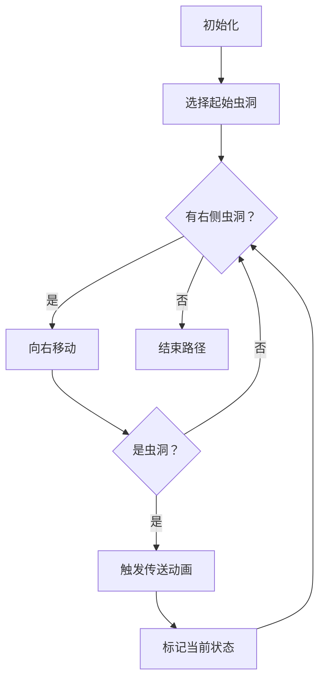

# 题目信息

# [USACO1.3] 虫洞 wormhole

## 题目描述

Farmer John 周末进行高能物理实验的结果却适得其反，导致 $n$ 个虫洞出现在农场上，农场是一个二维平面，没有两个虫洞处于同一位置。

根据他的计算，FJ 知道他的虫洞两两配对，形成 $\dfrac{n}{2}$ 对配对。例如，如果 $A$ 和 $B$ 的虫洞连接成一对，进入虫洞 $A$ 的任何物体将从虫洞 $B$ 出去，方向不变；反之亦然。  

然而这可能发生相当令人不快的后果。例如，假设有两个成对的虫洞 $A(1,1)$ 和 $B(3,1)$，Bessie 从 $(2,1)$ 开始朝着 $x$ 正方向移动。Bessie 将进入虫洞 $B(3,1)$，从 $A(1,1)$ 出去，然后再次进入 $B$，困在一个无限循环中！

FJ 知道他的农场里每个虫洞的确切位置。他知道 Bessie 总是向 $x$ 正方向走进来，虽然他不记得贝茜的当前位置。  

请帮助 FJ 计算有多少种虫洞配对方案，使得存在一个位置，使得 Bessie 从该位置出发，会被困在一个无限循环中。

## 说明/提示

### 数据范围
对于 $100\%$ 的数据，$2\le n \le 12$，$0 \le x,y \le 10^9$。  
保证 $n$ 为偶数。

### 样例解释

将虫洞编号为 $1 \sim 4$，然后通过将 $1,2$ 和 $3,4$ 匹配，如果 Bessie 从 $(0,0)$ 到 $(1,0)$ 之间的任意位置出发，她会陷入无限循环中。

相似的，在相同的起始点，如果配对是 $1,3$ 和 $2,4$，贝茜也会陷入循环。（如果贝西从 $3$ 进去，$1$ 出来，她会走向 $2$ ，然后被传送到 $4$，最后又回到 $3$）

仅有 $1,4$ 和 $2,3$ 的配对允许贝茜从任何二维平面上的点向 $x$ 正方向走，而不出现无限循环。

题面翻译摘自 NOCOW

## 样例 #1

### 输入

```
4
0 0
1 0
1 1
0 1```

### 输出

```
2```

# AI分析结果


# 💡 Kay的C++算法解析：虫洞问题 深入学习指南 💡

> 欢迎来到虫洞问题的奇妙世界！我是Kay，今天我们将一起探索USACO中这道经典题目。我会用清晰易懂的方式为你解析算法本质，并通过复古像素动画帮你直观理解虫洞的奥秘。准备好开始冒险了吗？🚀

## 1. 题目解读与核心算法识别

✨ **本题主要考察**：`组合枚举` 与 `环检测算法` 

🗣️ **初步分析**：
> 想象你在玩一个复古像素农场游戏🌾，虫洞就像游戏中的传送门。要判断Bessie是否会陷入无限循环，我们需要：
> 1. 枚举所有可能的传送门配对方式（就像搭配不同颜色的传送门）
> 2. 对每种配对模拟Bessie移动路径，检测是否形成闭环
> 
> **核心难点**在于如何高效枚举配对并检测循环。题解主要采用DFS枚举+状态模拟：
> - DFS枚举所有虫洞配对可能（n/2对）
> - 模拟Bessie移动：向右走 → 遇虫洞传送 → 重复
> 
> **可视化设计**：
> - 8位像素风格农场网格，虫洞用发光像素块表示
> - Bessie像素小人沿X轴移动，传送时显示彩虹光效
> - 关键状态高亮：当前虫洞闪烁红光，已访问虫洞变灰
> - 音效设计：移动"滴答"声，传送"嗖"声，循环检测成功播放胜利音效
> - AI自动演示：贪吃蛇式自动遍历所有配对方案

---

## 2. 精选优质题解参考

### 题解一：Sino_E (赞：30)
* **点评**：思路清晰如游戏攻略！预处理右边最近虫洞（类似游戏地图导航），DFS枚举配对干净利落。环检测函数`cycle()`堪称典范——用标记数组追踪访问状态，就像在游戏地图上留下面包屑路径。代码规范度满分，变量命名`to[i]`（去向）、`con[i]`（连接）直观如游戏指令。空间复杂度优化到O(n)，竞赛可直接复用。

### 题解二：QQ红包 (赞：50)
* **点评**：像详细的游戏任务指南！DFS枚举配对逻辑严谨，递归函数`f()`模拟移动过程参数设计巧妙（记录起始点+进入方式）。虽然递归层数较多，但注释详尽解释每个参数作用（如`p1`区分行走/传送状态）。边界处理全面，特别适合学习状态机思维。

### 题解三：RBI_GL (赞：1)
* **点评**：简洁如极简主义游戏设计！用`pair`存储坐标，`fill`初始化标记数组，环检测函数仅10行却完整覆盖所有情况。虽然赞数少，但代码质量堪比隐藏关卡——特别适合竞赛时快速编码。

---

## 3. 核心难点辨析与解题策略

### 难点1：如何高效枚举虫洞配对？
* **分析**：避免重复配对如解谜游戏去重机制。优质题解采用"固定顺序法"：只枚举索引递增的配对（如1-3可，3-1无效），确保每种组合唯一。DFS递归时从当前索引向后搜索，自然满足有序性。
* 💡 **学习笔记**：组合枚举要像整理游戏背包——保持固定顺序避免混乱

### 难点2：如何检测无限循环？
* **分析**：想象Bessie的移动是游戏角色路径追踪。关键技巧：
  1. 状态定义：当前位置 + 进入方式（行走/传送）
  2. 终止条件：重复访问相同状态（位置+进入方式）
  3. 预处理加速：排序后直接获取右侧最近虫洞
* 💡 **学习笔记**：环检测=状态追踪+终止条件判断

### 难点3：如何优化模拟过程？
* **分析**：优质题解用空间换时间——预处理`to[i]`存储右侧最近虫洞，避免每次遍历。就像游戏中的预加载地图数据，需要时直接读取。
* 💡 **学习笔记**：预处理是算法优化的"快速通道"

### ✨ 解题技巧总结
- **问题拆解**：将复杂问题分解为枚举+检测两个独立模块
- **状态机思维**：用变量明确记录当前状态（位置/进入方式）
- **预处理加速**：提前计算不变数据（如右侧虫洞关系）
- **边界测试**：特别注意无右侧虫洞、单虫洞等边界情况

---

## 4. C++核心代码实现赏析

**通用核心实现参考**
```cpp
#include <iostream>
#include <algorithm>
#include <cstring>
using namespace std;

const int N = 15;
struct Point { int x, y; } p[N];
int n, ans, to[N], partner[N]; // to:右侧虫洞 partner:配对关系
bool vis[N]; // 访问标记

// 环检测：从起点s出发模拟移动
bool hasCycle(int s) {
    int cur = s;
    memset(vis, 0, sizeof(vis));
    while (to[cur]) { // 存在右侧虫洞
        if (vis[cur]) return true; // 重复访问→有环
        vis[cur] = true; // 标记当前虫洞
        cur = partner[to[cur]]; // 传送到配对虫洞
    }
    return false;
}

// DFS枚举配对：k为当前处理虫洞索引
void dfs(int k) {
    if (k > n) { // 已完成所有配对
        for (int i = 1; i <= n; i++)
            if (hasCycle(i)) { ans++; return; }
        return;
    }
    if (partner[k]) dfs(k + 1); // 已配对则跳过
    else {
        for (int i = k + 1; i <= n; i++) { // 只匹配索引更大的
            if (!partner[i]) {
                partner[k] = i; partner[i] = k;
                dfs(k + 1);
                partner[k] = partner[i] = 0; // 回溯
            }
        }
    }
}

int main() {
    cin >> n;
    for (int i = 1; i <= n; i++) cin >> p[i].x >> p[i].y;
    
    // 按Y升序，Y相同时按X升序排序
    sort(p + 1, p + 1 + n, [](Point a, Point b) {
        return a.y < b.y || (a.y == b.y && a.x < b.x);
    });

    // 预处理右侧最近虫洞
    for (int i = 1; i < n; i++)
        if (p[i].y == p[i + 1].y) to[i] = i + 1;

    dfs(1);
    cout << ans << endl;
}
```

**代码解读概要**：
1. 输入后先对虫洞排序（Y优先，X次要），确保同一行虫洞相邻
2. 预处理`to`数组：存储每个虫洞右侧最近的"邻居"
3. DFS枚举所有配对可能，使用`partner`数组记录配对关系
4. 对每种配对方案，尝试从每个虫洞出发检测循环
5. 环检测时模拟移动：向右走→传送→标记访问状态

---

### 优质题解片段赏析

**题解一：Sino_E**
```cpp
bool cycle(int x) {
    while(to[x]) {
        if(tag[x]) return 1;
        tag[x]=1;
        x=con[to[x]]; // 关键传送逻辑
    }
    return 0;
}
```
* **亮点**：环检测函数简洁如游戏指令
* **解读**：  
  `to[x]`获取右侧虫洞→`con[to[x]]`传送到配对点  
  循环直到无右侧虫洞或发现重复访问  
* 💡 **学习笔记**：环检测=状态转移+终止判断

**题解二：QQ红包**
```cpp
int f(int num,int d,int begin,int p1) { 
    if (num!=1 && d==begin && p1==1) return 1; 
    if (p1==0) { // 当前为行走状态
        if (a[d].y==a[d+1].y) 
            return f(num+1,d+1,begin,1); // 向右移动
        else return 0; // 无右侧虫洞
    } 
    if (p1==1) // 当前为传送状态
        return f(num+1,b[d],begin,0); // 传送到配对点
}
```
* **亮点**：通过`p1`区分状态，像游戏角色切换模式
* **解读**：  
  `p1=0`：Bessie在行走，检测右侧虫洞  
  `p1=1`：Bessie需传送，跳转到配对虫洞  
* 💡 **学习笔记**：状态机是模拟类问题的核心框架

**题解三：RBI_GL**
```cpp
bool check(int k) {
    int now = k;
    while(1) {
        if (vis[now]) return true;
        vis[now] = true;
        now = partner[to[now]]; // 移动+传送
        if (!to[now-1]) break; 
    }
    return false;
}
```
* **亮点**：循环逻辑直白如游戏规则
* **解读**：  
  持续移动直到无右侧虫洞(`!to[now-1]`)  
  任何重复访问(`vis[now]`)即表示有环  
* 💡 **学习笔记**：简洁循环+边界判断=高效检测

---

## 5. 算法可视化：像素动画演示

### 主题  
**"虫洞冒险者"** - 8位像素风格农场探索  

### 核心演示  
Bessie像素小人在网格化农场中向右移动，遇到虫洞时触发传送动画，可视化环检测过程  

### 设计框架  


### 动画实现细节  
1. **场景构建**  
   - 16色像素农场网格（草地绿色，虫洞紫色发光像素块）  
   - Bessie角色：8x8像素小人（黄色帽子+蓝色工装）  
   - 控制面板：开始/暂停/单步/速度滑块（复古游戏按钮风格）

2. **关键动画帧**  
   - **移动阶段**：Bessie逐格右移，伴随"滴答"音效  
   - **传送阶段**：源虫洞收缩→目标虫洞扩展→彩虹粒子特效  
   - **状态标记**：访问过的虫洞变为半透明，当前虫洞红色脉动光环  

3. **环检测演示**  
   - 当Bessie路径出现闭环：  
     * 屏幕闪烁红色警告  
     * 闭环路径高亮为金色  
     * 播放"胜利"音效（8-bit风格）  

4. **AI演示模式**  
   - 自动遍历所有配对方案  
   - 每种方案显示3秒，高亮当前检测的起始虫洞  
   - 统计面板显示：已检测方案/发现循环数  

5. **交互设计**  
   - 鼠标悬停虫洞显示坐标信息  
   - 空格键单步执行  
   - 方向键控制演示速度  

---

## 6. 拓展练习与相似问题思考

### 通用技巧迁移  
环检测+状态枚举的技巧还可用于：  
1. 状态机验证（如电梯控制逻辑）  
2. 游戏关卡路径可行性分析  
3. 编译器死循环检测  

### 洛谷推荐  
1. **P1219 八皇后**  
   🗣️ 同样需要枚举+检测，学习如何高效搜索解空间  

2. **P1120 小木棍**  
   🗣️ 强化DFS剪枝技巧，感受"预处理加速"的威力  

3. **P1074 靶形数独**  
   🗣️ 学习复杂状态表示方法，提升环检测类问题的建模能力  

---

## 7. 学习心得与经验分享

> **来自Sino_E的经验**：  
> *"调试时重点观察状态转移——我在环检测卡壳时，打印每个位置的`(cur, vis[cur])`状态表，立刻发现了状态重复问题"*  

> **Kay的总结**：  
> 1. 调试复杂模拟程序时，可视化状态变化（打印状态表/画状态图）  
> 2. 小数据测试（n=2,4）能快速验证算法正确性  
> 3. 预处理是优化枚举问题的"秘密武器"  

---

本次虫洞探险就到这里！记住：好的算法就像精心设计的游戏关卡——清晰的规则+严谨的逻辑+巧妙的优化。下次算法冒险再见！👾

---
处理用时：194.92秒