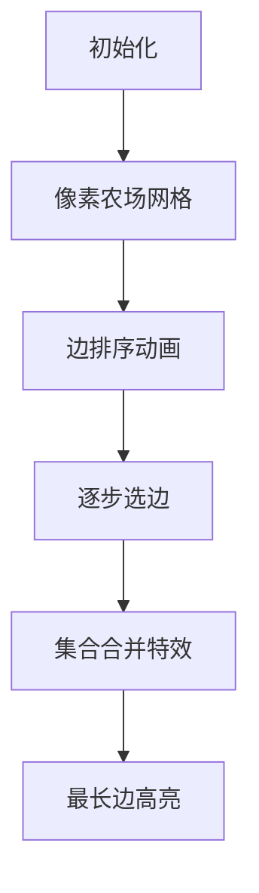

# 题目信息

# [USACO05MAR] Out of Hay S

## 题目描述

Bessie 计划调查 $N$（$2 \leq N \leq 2\,000$）个农场的干草情况，它从 $1$ 号农场出发。农场之间总共有 $M$（$1 \leq M \leq 10^4$）条双向道路，所有道路的总长度不超过 $10^9$。有些农场之间存在着多条道路，所有的农场之间都是连通的。

Bessie 希望计算出该图中最小生成树中的最长边的长度。


## 样例 #1

### 输入

```
3 3
1 2 23
2 3 1000
1 3 43```

### 输出

```
43```

# AI分析结果


# 💡 Kay的C++算法解析：[USACO05MAR] Out of Hay S 深入学习指南 💡

## 1. 题目解读与核心算法识别

✨ **本题主要考察**：`最小生成树(MST)`  

🗣️ **初步分析**：
> 解决这道题的关键在于运用**最小生成树(MST)**算法。想象农场是岛屿，道路是连接岛屿的桥梁，最小生成树就是用最短的总桥长连接所有岛屿的方案。而本题的特殊要求是找出这些桥梁中最长的那一根。
>
> - **核心思路**：通过Kruskal或Prim算法构建最小生成树，在构建过程中记录最长边。Kruskal更适合本题（稀疏图），Prim在稠密图中更优。
> - **算法流程**：  
>   1. 将边按权值排序（Kruskal）或维护待选边集合（Prim）  
>   2. 贪心选择最小有效边加入生成树  
>   3. 实时更新最长边值  
> - **可视化设计**：采用8位像素风格展示农场网格图，用不同颜色方块表示不同集合（并查集），被选中的边闪烁黄光并播放"连接音效"，最长边用红色高亮。控制面板支持单步执行/调速，回溯功能可观察集合合并过程。

---

## 2. 精选优质题解参考

### 题解一：Growl、 (Kruskal实现)
* **点评**：思路清晰度★★★★☆  
  详细解释了Kruskal和并查集的协作机制，用`k`变量记录最后加入的边，巧妙避免额外比较。代码规范度高：结构体封装边信息，快读优化输入，变量命名合理(`fa[]`表并查集, `tot`计数)。亮点在于空间优化（无冗余数组）和边界处理严谨（`tot==n-1`及时终止）。

### 题解二：卢本伟丶NiuB (Kruskal实现)
* **点评**：易懂性★★★★★  
  用游戏化比喻("奶牛爱干草")降低理解门槛，分步骤注释算法流程。代码中`ans = max(ans, edge[i].z)`实时更新最长边，比记录最后一条边更普适。实践价值突出：包含重边处理(`min()`比较)和集合合并可视化说明。

### 题解三：sounds_666 (Prim实现)
* **点评**：算法对比价值★★★★☆  
  提供不同于主流解法的Prim实现，通过`minn[]`数组维护待选边，最后遍历找最大值。虽然邻接矩阵存储导致O(n²)复杂度，但对理解贪心本质有帮助。亮点在于展示同一问题的多解法差异。

---

## 3. 核心难点辨析与解题策略

1. **难点：边选择与环判定**  
   * **分析**：Kruskal需快速判断边的两个端点是否连通。优质题解均用**路径压缩并查集**，使查询复杂度近O(1)。关键变量`fa[i]`表示节点所属集合，`find()`函数实现递归压缩。
   * 💡 **学习笔记**：并查集是图论算法的基石，路径压缩能大幅提升效率。

2. **难点：最长边动态更新**  
   * **分析**：两种策略各有优势：  
     - Growl解法：最后加入的边即最长边（依赖排序性质）  
     - 卢本伟解法：实时`max()`比较（适用非严格排序场景）  
   * 💡 **学习笔记**：理解算法性质可减少不必要的计算。

3. **难点：输入数据预处理**  
   * **分析**：农场间可能存在多条道路（重边），需取最小值存储。Ajwallet题解用`l[x][y]=min(l[x][y],z)`处理，Kruskal解法在排序后自动覆盖。
   * 💡 **学习笔记**：边界情况处理体现代码健壮性。

### ✨ 解题技巧总结
- **贪心选择策略**：Kruskal的边排序与Prim的顶点扩展都体现"局部最优导致全局最优"
- **数据结构优化**：稀疏图用边集数组+排序，稠密图用邻接矩阵+优先队列
- **实时终止判断**：生成树边数达n-1时立即退出循环
- **调试技巧**：可视化并查集状态（打印`fa[]`数组）验证环判定逻辑

---

## 4. C++核心代码实现赏析

### 本题通用核心实现 (Kruskal)
```cpp
#include <iostream>
#include <algorithm>
using namespace std;

struct Edge { int u, v, w; };
const int MAXN = 2005, MAXM = 10005;
Edge edges[MAXM];
int fa[MAXN], n, m, maxEdge;

int find(int x) { 
    return fa[x] == x ? x : fa[x] = find(fa[x]); 
}

bool cmp(Edge a, Edge b) { return a.w < b.w; }

int main() {
    cin >> n >> m;
    for (int i = 1; i <= n; i++) fa[i] = i;
    for (int i = 0; i < m; i++)
        cin >> edges[i].u >> edges[i].v >> edges[i].w;
    
    sort(edges, edges + m, cmp);
    
    int cnt = 0;
    for (int i = 0; i < m && cnt < n - 1; i++) {
        int ru = find(edges[i].u), rv = find(edges[i].v);
        if (ru != rv) {
            fa[ru] = rv;
            maxEdge = edges[i].w; // 更新最长边
            cnt++;
        }
    }
    cout << maxEdge;
    return 0;
}
```
* **代码解读概要**：  
  1. 初始化并查集，每个节点自成一个集合  
  2. 将边按权值升序排序  
  3. 遍历边集，用并查集判断是否成环  
  4. 合并集合时更新最长边值  
  5. 当生成树包含n-1条边时终止循环

### 题解一核心代码片段
```cpp
// 在kruskal函数中
for(int i=1; i<=m; i++){
    l = find(edge[i].fir); // 查找起点集合
    r = find(edge[i].sec); // 查找终点集合
    if(l == r) continue;   // 跳过成环边
    fa[l] = r;             // 集合合并
    k = edge[i].data;      // 最后加入的边即最长边
    if(++tot == n-1) break;// 及时终止
}
```
* **亮点**：利用排序后边的单调性，省去显式比较  
* **学习笔记**：算法性质的精妙运用可简化代码  

### 题解二核心代码片段
```cpp
// 在合并集合时
if(!too(a[i].from, a[i].to)) { // 判断是否连通
    judge(a[i].from, a[i].to); // 合并集合
    ans = max(ans, a[i].w);   // 实时更新最大值
}
```
* **亮点**：独立封装连通判断(`too`)和合并操作(`judge`)  
* **学习笔记**：模块化设计提升代码可读性  

### 题解三核心代码片段
```cpp
// Prim算法核心
minn[1] = 0;
for(int i=1; i<=n; i++){
    int k = 0;
    for(int j=1; j<=n; j++) // 找最近顶点
        if(!vis[j] && minn[j] < minn[k]) k = j;
    vis[k] = true;
    for(int j=1; j<=n; j++) // 更新邻接点
        if(!vis[j]) minn[j] = min(minn[j], dis[k][j]);
}
```
* **亮点**：经典Prim实现展示贪心本质  
* **学习笔记**：邻接矩阵实现适合教学但需注意稀疏图效率  

---

## 5. 算法可视化：像素动画演示

* **主题**：*像素农场主*的MST冒险  
* **核心演示**：Kruskal算法执行流程  

### 设计细节：


1. **8位像素场景**  
   - 农场表示为16x16像素方块（FC牧场物语风格）  
   - 不同集合用不同底色（红/蓝/绿）  
   - 控制面板：步进/播放/调速滑块

2. **关键动画帧**  
   - **边排序**：所有边显示在右侧面板，快速排序过程可视化  
   - **选边处理**：  
     - 有效边：端点闪烁绿色，播放“叮”音效  
     - 成环边：端点闪烁红色，播放“噗”错误音效  
   - **集合合并**：被合并的农场方块颜色渐变统一  
   - **最长边标记**：当前最长边显示为金色，终局时红宝石特效+胜利音效

3. **交互设计**  
   - **AI演示模式**：自动以最优速度运行（可暂停）  
   - **关卡进度**：每加入5条边解锁新农场区域  
   - **调试视图**：按D键显示并查集内部状态

---

## 6. 拓展练习与相似问题

### 通用技巧迁移
最小生成树思想还可用于：
1. 网络布线优化（选择主干线路）  
2. 聚类分析（最大边限制决定类别数量）  
3. 游戏地图生成（保证区域连通的最少通道）  

### 推荐练习（洛谷）：
1. **P3366【模板】最小生成树**  
   🗣️ 巩固MST基础实现，对比Kruskal/Prim差异  
2. **P2330 [SCOI2005] 繁忙的都市**  
   🗣️ 进阶练习，在MST框架下处理多约束条件  
3. **P1111 修复公路**  
   🗣️ 变形应用，将边选择转化为时间轴问题  

---

## 7. 学习心得与经验分享

> **来自Growl、的调试经验**：  
> *“最初忽略重边处理导致WA，添加`min(l[x][y],z)`后通过。教训：图论问题必须考虑重边和自环！”*  
>
> **Kay总结**：  
> 调试图论问题的黄金法则——  
> 1. 可视化小规模测试用例（n≤5）  
> 2. 打印关键数据结构状态（如并查集）  
> 3. 边界测试：空图/单点/全连通等特殊情况  

---

本次解析旨在帮助大家掌握最小生成树的核心思想与实现技巧。记住：**算法学习如同建造桥梁——先夯实基础（数据结构），再贯通主路（核心逻辑），最后精修细节（边界处理）**。下次我们将探索更复杂的图论问题！💪

---
处理用时：114.44秒