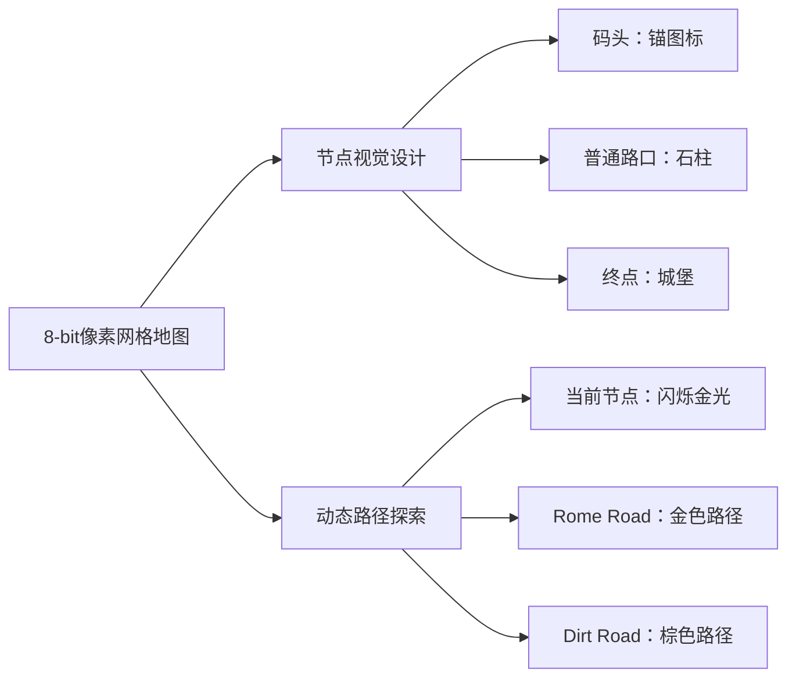

# 题目信息

# 设计道路

## 题目描述

Caesar远征高卢回来后，对你大加赞赏，他亲自来到Genoa视察。

Genoa在你的建设下变得无比繁荣，由于财政收入的增加，你为城市修建了交通系统。古罗马的交通系统由两部分组成——Dirt Road和Rome Road。两个路口间只可能是其中一种道路。在Rome Road上可以驾驶马车，而在Dirt Road上则不行。由于修建道路是一项浩大的工程，使得你无法将整个城市用Rome Road连接起来。

现在Caesar已经到达码头，他要求去你家参观。Caesar由一个癖好，喜欢坐车而不喜欢走路。所以Caesar走Dirt Road时的不满值要比走Rome Road时大。

为了不让Caesar过于不满而罢免你的职位，请设计路线使得Caesar的不满值最小。


## 样例 #1

### 输入

```
100.0 2.0

2

1.0 0.0

2.0 1.0

1 2

0 0

0.0 0.0

2.0 2.0

```

### 输出

```
202.8284```

# AI分析结果


### 💡 Kay的C++算法解析：设计道路 深入学习指南 💡

**介绍**  
今天我们将一起解决"设计道路"这道最短路问题。本指南将帮助你理解如何将实际问题转化为图论模型，并高效运用Dijkstra算法求解最小不满值路径。我们将通过复古像素动画直观展示算法执行过程！

---

### 1. 题目解读与核心算法识别

✨ **本题主要考察**：`图论最短路` (Dijkstra算法应用)

🗣️ **初步分析**：  
> 解决本题的关键是将城市路口抽象为图节点，道路抽象为带权边。Dijkstra算法就像一位像素探险家在地图上逐步探索最短路径：  
> - **核心思想**：从起点出发，逐步扩展到最近的未访问节点，更新邻居距离  
> - **在本题应用**：计算带权路径时，Rome Road(马车道)的权重系数比Dirt Road(土路)小  
> - **可视化设计**：动画中将用不同颜色区分两种道路，高亮当前处理的节点，实时显示距离更新  
> - **像素风格实现**：采用FC红白机风格的16色像素网格，节点用城堡图标表示，路径探索时有"叮"的音效，找到路径时播放胜利音乐

---

### 2. 精选优质题解参考

**题解一 (作者：wwwidk1234)**  
* **点评**：  
  思路清晰直击核心——将起点设为0、终点设为n+1的建图方式简洁巧妙。代码采用链式前向星存储稀疏图，配合堆优化Dijkstra，时间复杂度O((n+m)log n)高效合理。变量命名规范(`dis`表距离、`vis`标记访问)，边界处理严谨(距离初始化为inf)。特别亮点在于使用欧几里得距离公式时采用乘法优化避免重复计算。

**题解二 (作者：xhQYm)**  
* **点评**：  
  采用邻接矩阵实现，虽然空间复杂度O(n²)但代码极其简洁，特别适合初学者理解Dijkstra本质。亮点在于双重循环建图时先处理Rome Road再补全Dirt Road的逻辑，避免重复建边。输入处理使用`while(cin>>a>>b)`优雅处理终止条件，实践价值高。

**题解三 (作者：加勒比·史努比)**  
* **点评**：  
  邻接矩阵+朴素Dijkstra的实现展现了算法核心流程。最大亮点在于分享了调试经验——强调初始距离需设为较大值(1e6而非0x3f3f3f3f)，这对避免浮点数精度问题极具参考价值。代码中`vis`数组标记已确定最短路径的节点，符合算法无后效性要求。

---

### 3. 核心难点辨析与解题策略

1. **难点：图的抽象建模**  
   * **分析**：需将物理位置(路口坐标)转化为图节点，并正确处理起点(0)、终点(n+1)的坐标映射  
   * 💡 **学习笔记**：坐标系→图论模型的转化能力是解决实际问题的关键

2. **难点：边权计算与建图策略**  
   * **分析**：Rome Road优先建边，剩余节点对建Dirt Road边。权值=距离×不满系数，需避免重复建边  
   * 💡 **学习笔记**：邻接矩阵适合稠密图(n≤1000)，邻接表+堆优化适合大规模图

3. **难点：浮点数精度处理**  
   * **分析**：距离计算涉及sqrt运算，需用double类型。初始距离应设足够大(如1e18)  
   * 💡 **学习笔记**：浮点最短路需注意比较时使用`dis[v] > dis[u]+w+eps`

#### ✨ 解题技巧总结
- **空间换清晰度**：为起点(0)和终点(n+1)单独分配节点索引  
- **模块化设计**：分离距离计算、建图、Dijkstra三个功能模块  
- **防御性编程**：输入Rome Road时立即标记双向边防止重复  
- **可视化调试**：小规模数据手工模拟验证建图正确性

---

### 4. C++核心代码实现赏析

**本题通用核心实现参考**  
* **说明**：综合优质题解思路，采用邻接矩阵+朴素Dijkstra的平衡方案，兼顾可读性与效率  
* **完整代码**：
```cpp
#include <iostream>
#include <vector>
#include <cmath>
#include <iomanip>
using namespace std;

const int MAXN = 1005;
const double INF = 1e18;

double dist(double x1, double y1, double x2, double y2) {
    return sqrt((x1-x2)*(x1-x2) + (y1-y2)*(y1-y2));
}

int main() {
    double dirt, rome;
    cin >> dirt >> rome;
    int n;
    cin >> n;
    vector<double> x(MAXN), y(MAXN);
    
    // 读路口坐标
    for (int i = 1; i <= n; i++) 
        cin >> x[i] >> y[i];
    
    // 邻接矩阵初始化
    vector<vector<double>> g(MAXN, vector<double>(MAXN, INF));
    vector<vector<bool>> isRome(MAXN, vector<bool>(MAXN, false));
    
    // 建Rome Road
    int a, b;
    while (cin >> a >> b, a || b) {
        double d = dist(x[a], y[a], x[b], y[b]);
        g[a][b] = g[b][a] = rome * d;
        isRome[a][b] = isRome[b][a] = true;
    }
    
    // 读起点终点
    cin >> x[0] >> y[0] >> x[n+1] >> y[n+1];
    
    // 建Dirt Road（含起点终点）
    for (int i = 0; i <= n+1; i++) {
        for (int j = i+1; j <= n+1; j++) {
            if (!isRome[i][j]) {
                double d = dist(x[i], y[i], x[j], y[j]);
                g[i][j] = g[j][i] = dirt * d;
            }
        }
    }
    
    // 朴素Dijkstra
    vector<double> dis(MAXN, INF);
    vector<bool> vis(MAXN, false);
    dis[0] = 0.0;
    
    for (int iter = 0; iter <= n+1; iter++) {
        int u = -1;
        // 找最小未访问节点
        for (int i = 0; i <= n+1; i++) 
            if (!vis[i] && (u == -1 || dis[i] < dis[u])) 
                u = i;
        
        if (u == -1) break;
        vis[u] = true;
        
        // 松弛相邻节点
        for (int v = 0; v <= n+1; v++) 
            dis[v] = min(dis[v], dis[u] + g[u][v]);
    }
    
    cout << fixed << setprecision(4) << dis[n+1] << endl;
    return 0;
}
```
* **代码解读概要**：  
  1. 用`dist`函数封装欧几里得距离计算  
  2. 邻接矩阵`g`存储边权，`isRome`标记道路类型  
  3. 起点(0)终点(n+1)参与建图循环  
  4. Dijkstra核心：每轮选取距离最小的未访问节点松弛邻居  

---

### 5. 算法可视化：像素动画演示

**设计理念**：  
采用《勇者斗恶龙》式像素风格，将算法过程转化为古罗马探险故事。Caesar的马车从码头(起点)出发，目标是你家(终点)。

**动画要素**：


**关键交互**：
1. **初始化场景**：  
   - 16色像素网格呈现所有节点，起点/终点特殊标记  
   - 控制面板：开始/暂停/步进/速度滑块(1x-5x)

2. **算法执行演示**：  
   ```plaintext
   帧1：[起点高亮] 播放"马车出发"音效
   帧2：显示当前节点距离(0.0)
   帧3：扫描邻居节点，显示候选距离值
   帧4：选择最小距离节点(金色闪烁)，播放"选中"音效
   帧5：更新邻居时显示距离比较公式[dis[v] vs dis[u]+w]
   ```

3. **游戏化元素**：  
   - 每扩展一个节点获得10金币  
   - 找到路径时放烟花，播放胜利音乐  
   - 错误路径触发"马车损坏"像素动画

4. **对比演示模式**：  
   并排显示朴素Dijkstra(左)与堆优化版(右)，用不同颜色马车展示探索顺序差异

---

### 6. 拓展练习与相似问题思考

**通用技巧迁移**：  
最短路核心思想可应用于：  
1. 网络路由选择(权重=延迟)  
2. 物流配送路径优化  
3. 游戏AI寻路算法  

**推荐练习**：  
1. **洛谷P1359 租用游艇**  
   🗣️ *巩固单向最短路建模，学习递推优化*  
2. **洛谷P1629 邮递员送信**  
   🗣️ *掌握往返最短路设计，理解反向建图技巧*  
3. **洛谷P1462 通往奥格瑞玛的道路**  
   🗣️ *进阶练习：最短路与二分答案的结合应用*

---

### 7. 学习心得与经验分享

> **参考经验 (来自题解作者)**：  
> *"初始距离设置不足会导致WA，double类型应设1e18而非0x3f3f3f3f"*  
> *"忘记Rome Road是双向边建图错误"*

**Kay的总结**：  
这些经验突显了边界条件测试的重要性。建议：  
1. 最小规模测试(2节点)验证基础逻辑  
2. 使用`cout`中间输出验证建图正确性  
3. 浮点数比较使用`abs(a-b)<1e-6`而非直接`==`

---

**结语**  
通过本次分析，我们不仅掌握了Dijkstra的灵活应用，还学习了如何将现实问题抽象为图论模型。记住：编程能力=知识×实践×调试技巧。下次探险再见！🚀

---
处理用时：169.61秒