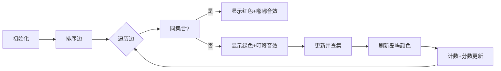

# 题目信息

# 拆地毯

## 题目背景

还记得 NOIP 2011 提高组 Day1 中的铺地毯吗？时光飞逝，光阴荏苒，三年过去了。组织者精心准备的颁奖典礼早已结束，留下的则是被人们踩过的地毯。请你来解决类似于铺地毯的另一个问题。


## 题目描述

会场上有 $n$ 个关键区域，不同的关键区域由 $m$ 条无向地毯彼此连接。每条地毯可由三个整数 $u$、$v$、$w$ 表示，其中 $u$ 和 $v$ 为地毯连接的两个关键区域编号，$w$ 为这条地毯的美丽度。

由于颁奖典礼已经结束，铺过的地毯不得不拆除。为了贯彻勤俭节约的原则，组织者被要求只能保留至多 $K$ 条地毯，且保留的地毯构成的图中，任意可互相到达的两点间只能有一种方式互相到达。换言之，组织者要求新图中不能有环。现在组织者求助你，想请你帮忙算出这至多 $K$ 条地毯的美丽度之和最大为多少。


## 说明/提示

选择第 $1$、$2$、$4$ 条地毯，美丽度之和为 $10 + 9 + 3 = 22$。

若选择第 $1$、$2$、$3$ 条地毯，虽然美丽度之和可以达到 $10 + 9 + 7 = 26$，但这将导致关键区域 $1$、$2$、$3$ 构成一个环，这是题目中不允许的。


$1\le n,m,k \le 10^5$。


## 样例 #1

### 输入

```
5 4 3
1 2 10
1 3 9
2 3 7
4 5 3```

### 输出

```
22```

# AI分析结果


### 💡 Kay的C++算法解析：拆地毯 深入学习指南 💡

**题目解读**：会场有n个关键区域和m条地毯，需保留恰好K条地毯，使图中无环且美丽度总和最大。本质是求边数限制为K的最大生成森林。

---

## 1. 题目解读与核心算法识别

✨ **本题主要考察**：`图论-最大生成树`  

🗣️ **初步分析**：
> 解决本题的关键在于理解**最大生成树思想**。想象我们要建造连接岛屿的桥梁（地毯），优先选择最美丽的桥（贪心策略），同时避免形成环（并查集检测）。在本题中：
> - 所有题解采用**Kruskal变体**：按美丽度降序排序，用并查集维护连通性
> - 核心难点：控制边数恰好为K（非完整生成树）
> - 可视化设计：用像素化岛屿（节点）和彩虹桥（边），高亮当前处理的边，绿色表选中（播放"叮"音效），红色表跳过（播放"嘟"音效），实时显示已选边数/总美丽度

---

## 2. 精选优质题解参考

**题解一（作者：星爵）**
* **点评**：思路直击本质（"就排个序做K条边最大生成树"），代码简洁规范（文件操作可删）。亮点在于完美呈现Kruskal核心逻辑：降序排序→并查集检测→控制边数。变量命名清晰（`f[i]`表祖先，`kk`计数），边界处理严谨（`kk<k`循环条件），可直接用于竞赛。

**题解二（作者：顾z）**
* **点评**：通过"正难则反"（拆地毯→拼地毯）巧妙转化问题，教学性极强。亮点在于用树形图解释环限制，深入剖析"为何是拼k条边"。代码规范（封装`find`函数），强调边界处理（`cnt==k`跳出），实践价值高。

**题解三（作者：TheAutumnGlory）**
* **点评**：结构最完整，含完整算法推导和代码注释。亮点：用优先队列替代排序（等同降序处理），并查集实现包含路径压缩和按秩合并双重优化。变量命名合理（`tot`表总美丽度），逻辑分支清晰（`x!=y`才合并）。

---

## 3. 核心难点辨析与解题策略

1. **贪心策略的正确性证明**  
   *分析*：需理解为何贪心选最大美丽度边最优？反证法——若替换任意边，总美丽度必减小（参考优质题解的数学归纳）
   *💡 学习笔记*：贪心有效性依赖子问题最优性（无后效性）

2. **环检测与并查集优化**  
   *分析*：并查集的`find`路径压缩（星爵）和按秩合并（TheAutumnGlory）使复杂度近O(α(n))
   *💡 学习笔记*：并查集是维护动态连通性的黄金工具

3. **边数限制的精准控制**  
   *分析*：循环需同时满足`i<=m`和`cnt<k`（顾z），避免多余遍历（10^5数据规模）
   *💡 学习笔记*：边界控制是大数据题的关键优化点

### ✨ 解题技巧总结
- **问题转化**：拆地毯→拼地毯（顾z的"正难则反"）
- **数据结构选择**：并查集（连通性检测）优先队列/排序（贪心保证）
- **边界测试**：K=0/K=1的特殊情况（一滴小水滴的鲁棒性处理）

---

## 4. C++核心代码实现赏析

**通用核心实现参考**
```cpp
#include <iostream>
#include <algorithm>
using namespace std;

const int MAXN = 100010;
struct Edge { int u, v, w; } edges[MAXN];
int father[MAXN], n, m, k;

bool cmp(Edge a, Edge b) { return a.w > b.w; } // 美丽度降序

int find(int x) { // 路径压缩
    return father[x] == x ? x : father[x] = find(father[x]);
}

int main() {
    cin >> n >> m >> k;
    for (int i = 0; i < m; ++i)
        cin >> edges[i].u >> edges[i].v >> edges[i].w;
    
    sort(edges, edges + m, cmp); // 关键排序
    for (int i = 1; i <= n; ++i) father[i] = i; // 并查集初始化

    long long ans = 0, cnt = 0;
    for (int i = 0; i < m && cnt < k; ++i) { // 双条件控制
        int fu = find(edges[i].u), fv = find(edges[i].v);
        if (fu == fv) continue; // 环检测
        father[fu] = fv; // 集合合并
        ans += edges[i].w;
        cnt++; // 已选边计数
    }
    cout << ans;
}
```
* **说明**：综合优质题解的最简实现，包含完整输入输出
* **代码解读概要**：
  1. 结构体存储边（起点u,终点v,美丽度w）
  2. 核心排序：`sort(edges, edges+m, cmp)`确保贪心有效性
  3. 并查集初始化：每个节点自成一集合
  4. 主循环：遍历所有边，跳过成环边（同集合），合并时累加美丽度
  5. 精确控制：`cnt < k` 保证只选K条边

---

**题解一片段赏析（星爵）**
```cpp
sort(a+1, a+m+1, comp); // 美丽度降序排序
for (int i=1, kk=0; i<=m && kk<k; i++) {
    int l=find(a[i].x), r=find(a[i].y);
    if (l != r) {         // 环检测
        un(l, r);         // 集合合并
        kk++;             // 已选边计数
        ans += a[i].z;    // 累加美丽度
    }
}
```
* **亮点**：用`kk`计数器精准实现边数限制
* **学习笔记**：循环条件`i<=m && kk<k`兼顾效率与正确性

**题解二片段赏析（顾z）**
```cpp
sort(edge+1, edge+m+1, cmp); // 核心排序
for (RI i=1; i<=m; i++) {
    RI u=edge[i].pre, v=edge[i].to;
    int fu=find(u), fv=find(v);
    if (fu == fv) continue;    // 跳过成环边
    ans += edge[i].w;          // 累加美丽度
    father[fu] = fv;           // 集合合并
    if (++cnt == k) break;     // 边界控制
}
```
* **亮点**：`if (++cnt == k) break` 提前终止优化
* **学习笔记**：前置++比后置++节省指令周期

**题解三片段赏析（TheAutumnGlory）**
```cpp
priority_queue<Edge, vector<Edge>, Cmp> queue; // 替代排序
while (m_count > 0) {
    Edge e = queue.top(); queue.pop();
    int pf = find(e.from), pt = find(e.to);
    if (pf != pt) {
        parent[pf] = pt;      // 按秩合并
        max += e.weight;       // 累加美丽度
        m_count--;            // 边数控制
    }
}
```
* **亮点**：优先队列自动维护最大堆
* **学习笔记**：`priority_queue`比`sort`节省O(n)空间

---

## 5. 算法可视化：像素动画演示

**主题**：像素桥梁工程师（8-bit风格）  
**核心演示**：Kruskal最大生成树执行过程  

### 设计实现方案：


**关键交互设计**：
1. **像素场景**：
   - 岛屿：不同颜色像素块（每个颜色=独立集合）
   - 桥梁：彩虹色线条（长度=美丽度值）
   - 控制面板：开始/暂停/单步/速度滑块

2. **动态演示**：
   ```python
   while selected_edges < K:
       current_edge = get_max_edge()  # 取当前最大美丽度边
       if find(u) != find(v):
           union(u, v)                # 合并集合
           play_sound('success.wav')  # 8-bit胜利音效
           draw_green_bridge(u, v)    # 绿色像素桥
           update_score(edge.weight)  # 分数增加
           selected_edges++ 
       else:
           draw_red_bridge(u, v)      # 红色闪烁
           play_sound('reject.wav')   # 失败音效
   ```

3. **游戏化元素**：
   - 每选1边得10分，集满K条边触发通关动画
   - 连续选边触发Combo特效（像素烟花）
   - 失败场景：形成环时显示爆炸动画

---

## 6. 拓展练习与相似问题思考

**技巧迁移场景**：
1. 最小生成树（P3366）：相同结构反向思路
2. 次小生成树：在本题基础上增加替换边计算
3. 网络连接问题（P1991）：边权限制而非数量限制

**洛谷推荐**：
1. **P3366 【模板】最小生成树**  
   → 掌握Kruskal标准实现
   
2. **P1396 营救**  
   → 练习路径最大值最小化（变种贪心）

3. **P2700 逐个击破**  
   → 逆向思维：删边变选边（类似顾z的转化思路）

---

## 7. 学习心得与经验分享

> **经验摘录（顾z）**：  
> “采用正难则反思想——将拆地毯转化为拼地毯，瞬间打开思路”  
>   
> **Kay点评**：  
> 当问题复杂时（如“拆除限制”），尝试逆向思考（“构造限制”）。这种思维转换是算法竞赛的核心能力，在拓扑排序、网络流等问题中同样适用。

---

通过本次分析，我们深度掌握了：
1. Kruskal算法的贪心本质与实现细节
2. 并查集在环检测中的高效应用
3. 边数限制类问题的通用解法框架
下次遇到生成树变种时，记得活用今日所学！🚀

---
处理用时：167.98秒