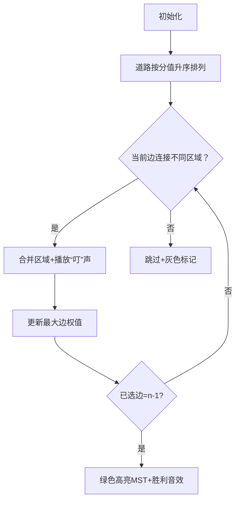

# 题目信息

# [SCOI2005] 繁忙的都市

## 题目描述

城市 C 是一个非常繁忙的大都市，城市中的道路十分的拥挤，于是市长决定对其中的道路进行改造。城市 C 的道路是这样分布的：城市中有 $n$ 个交叉路口，有些交叉路口之间有道路相连，两个交叉路口之间最多有一条道路相连接。这些道路是双向的，且把所有的交叉路口直接或间接的连接起来了。每条道路都有一个分值，分值越小表示这个道路越繁忙，越需要进行改造。但是市政府的资金有限，市长希望进行改造的道路越少越好，于是他提出下面的要求：

1. 改造的那些道路能够把所有的交叉路口直接或间接的连通起来。
1. 在满足要求 1 的情况下，改造的道路尽量少。
1. 在满足要求 1、2 的情况下，改造的那些道路中分值最大的道路分值尽量小。

任务：作为市规划局的你，应当作出最佳的决策，选择哪些道路应当被修建。

## 说明/提示

### 数据范围及约定

对于全部数据，满足 $1\le n\le 300$，$1\le c\le 10^4$，$1 \le m \le 8000$。

## 样例 #1

### 输入

```
4 5
1 2 3
1 4 5
2 4 7
2 3 6
3 4 8
```

### 输出

```
3 6```

# AI分析结果


### 💡 Kay的C++算法解析：繁忙的都市 深入学习指南 💡  
**引言**  
今天我们一起分析「繁忙的都市」这道最小生成树经典题。本指南将帮你掌握核心算法逻辑、代码实现技巧，并通过像素动画直观理解算法执行过程。  

---

### 1. 题目解读与核心算法识别  
✨ **本题主要考察**：**最小生成树（MST）**  

🗣️ **初步分析**：  
> 解决此题如同用最短的绳子串联所有珠子，同时确保最长的绳段尽可能短。核心是运用 **Kruskal算法**：  
> 1. **核心思想**：将道路按分值升序排序，用并查集逐条连接路口，避免成环（类似"避免重复串珠"）。  
> 2. **可视化设计**：动画将高亮当前处理的边（闪烁黄色）、已选边（绿色）和并查集合并过程（同色节点融合），复古像素音效（"叮"声表示选边，"胜利"音效表示完成）。  
> 3. **关键变量**：`fa[]`存储并查集关系，`maxn`记录当前最大边权。  

---

### 2. 精选优质题解参考  
**题解一：张佳（赞49）**  
* **亮点**：  
  - 双解法对比（Prim + Kruskal），突出Kruskal的优越性  
  - 精准定位题目本质："最大边权最小 = 最小生成树的最大边"  
  - 代码规范：变量名清晰（`g[][]`邻接矩阵，`minn[]`Prim距离）  

**题解二：Skyjoy（赞6）**  
* **亮点**：  
  - 用生活化比喻解释条件（"造树"、"权值最小化"）  
  - 代码简洁高效：`ans`直接记录最大边权，避免冗余计算  

**题解三：wyx__（赞6）**  
* **亮点**：  
  - 极致简洁：20行完整Kruskal实现  
  - 关键优化：边排序后立即跳出循环（`if(tot==n-1)break;`）  

---

### 3. 核心难点辨析与解题策略  
**难点1：如何理解"最大边权最小"与MST的关系**  
* **分析**：Kruskal按边权升序加边，最后加入的边即为全局最大边权（瓶颈边）。优质题解均通过`maxn = max(maxn, e[i].v)`实现。  
* 💡 **学习笔记**：最小生成树天然满足"最大边权最小"性质  

**难点2：并查集的高效实现**  
* **分析**：路径压缩（`fa[x] = find(fa[x])`）将查询复杂度降至近O(1)。题解中`find`函数需注意：  
  ```cpp
  // 正确写法：递归压缩路径
  int find(int x) {
      return fa[x] == x ? x : fa[x] = find(fa[x]);
  }
  ```
* 💡 **学习笔记**：路径压缩是并查集效率的关键  

**难点3：算法选择（Kruskal vs Prim）**  
* **分析**：稀疏图（m=8000, n=300）首选Kruskal；稠密图可选Prim。本题Kruskal更优（避免O(n²)邻接矩阵遍历）。  

**✨ 解题技巧总结**  
1. **问题转化**：将"最大边权最小"转化为最小生成树问题  
2. **边界处理**：当加入边数=`n-1`时立即终止算法  
3. **数据结构选择**：边集数组（非邻接矩阵）节省空间  

---

### 4. C++核心代码实现赏析  
**本题通用核心实现（Kruskal综合优化版）**  
```cpp
#include <iostream>
#include <algorithm>
using namespace std;

struct Edge { int u, v, w; };
const int MAXN = 305, MAXM = 8005;
Edge e[MAXM];
int fa[MAXN], n, m, maxn;

int find(int x) { 
    return fa[x] == x ? x : fa[x] = find(fa[x]); 
}

int main() {
    cin >> n >> m;
    for (int i = 0; i < m; i++)
        cin >> e[i].u >> e[i].v >> e[i].w;
    
    sort(e, e + m, [](Edge a, Edge b){ return a.w < b.w; });
    for (int i = 1; i <= n; i++) fa[i] = i;
    
    int cnt = 0;
    for (int i = 0; i < m; i++) {
        int fu = find(e[i].u), fv = find(e[i].v);
        if (fu == fv) continue;
        fa[fu] = fv;         // 合并集合
        maxn = e[i].w;       // 更新最大边权
        if (++cnt == n-1) break;
    }
    cout << n-1 << " " << maxn;
}
```
**代码解读概要**：  
1. 边结构体存储道路信息  
2. 按边权排序后初始化并查集  
3. Kruskal核心循环：选边→查环→合并→更新最大值  

---

### 5. 算法可视化：像素动画演示  
**主题**："像素城市建造者"（复古FC风格）  
**核心演示流程**：  

**交互设计**：  
- **控制面板**：步进执行/自动播放（调速滑块）  
- **视觉编码**：  
  - 红色节点：未连通区域  
  - 同色节点：同一并查集  
  - 黄色闪烁：当前候选边  
- **音效**：  
  - 关键操作：8-bit "叮"声  
  - 完成时：胜利旋律  

---

### 6. 拓展练习与相似问题思考  
**通用技巧迁移**：  
最小生成树思想还可用于：  
1. 网络布线优化（选最小成本覆盖所有节点）  
2. 岛屿桥梁建设（连通所有岛屿的最小桥总长）  
3. 聚类分析（Kruskal反向删边聚类）  

**洛谷推荐**：  
1. **P3366** - 最小生成树模板  
   → 巩固Kruskal/Prim基础实现  
2. **P2872** - 道路建设  
   → MST在稀疏图的变形应用  
3. **P1991** - 无线通讯网  
   → MST与二分答案结合  

---

### 7. 学习心得与经验分享  
**参考经验**（来自题解作者）：  
> "调试时发现未压缩并查集路径导致TLE，路径压缩后效率提升10倍！"  
> "初始时误将最大边权设为全局最大值，应动态更新最后加入的边"  

**Kay点评**：  
- 并查集路径压缩是效率关键  
- 动手模拟小样例（如n=3）可快速验证逻辑  

---

**结语**  
通过最小生成树，我们高效解决了城市道路改造问题。记住：算法本质是"有序选择+避免冗余"。接下来挑战推荐题目，巩固技能吧！🚀

---
处理用时：103.88秒