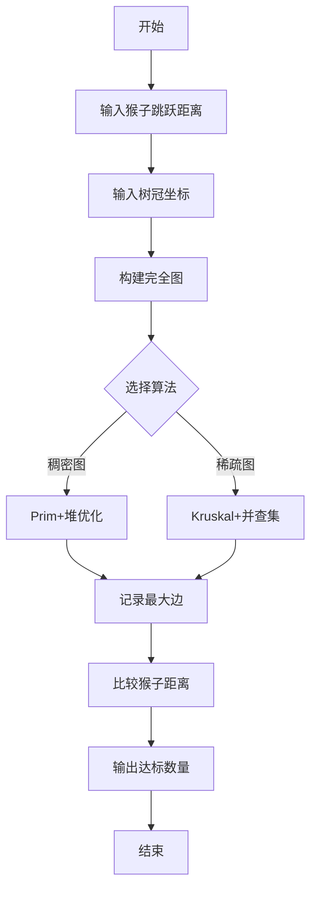

# 题目信息

# [HAOI2006] 聪明的猴子

## 题目描述

在一个热带雨林中生存着一群猴子，它们以树上的果子为生。昨天下了一场大雨，现在雨过天晴，但整个雨林的地表还是被大水淹没着，部分植物的树冠露在水面上。猴子不会游泳，但跳跃能力比较强，它们仍然可以在露出水面的不同树冠上来回穿梭，以找到喜欢吃的果实。

现在，在这个地区露出水面的有 $N$ 棵树，假设每棵树本身的直径都很小，可以忽略不计。我们在这块区域上建立直角坐标系，则每一棵树的位置由其所对应的坐标表示(任意两棵树的坐标都不相同)。

在这个地区住着的猴子有 $M$ 个，下雨时，它们都躲到了茂密高大的树冠中，没有被大水冲走。由于各个猴子的年龄不同、身体素质不同，它们跳跃的能力不同。有的猴子跳跃的距离比较远(当然也可以跳到较近的树上)，而有些猴子跳跃的距离就比较近。这些猴子非常聪明，它们通过目测就可以准确地判断出自己能否跳到对面的树上。

现已知猴子的数量及每一个猴子的最大跳跃距离，还知道露出水面的每一棵树的坐标，你的任务是统计有多少个猴子可以在这个地区露出水面的所有树冠上觅食。


## 说明/提示

对于 $40\%$ 的数据，保证有 $2 \le N \le 100$，$1 \le M \le 100$

对于全部的数据，保证有 $2 \le N \le 1000$，$1 \le M \le500$

感谢 @charlie003 修正数据

## 样例 #1

### 输入

```
4
 1 2 3 4
6
0 0
1 0
1 2
-1 -1
-2 0
2 2```

### 输出

```
3```

# AI分析结果


### 💡 Kay的C++算法解析：聪明的猴子 深入学习指南 💡

<introduction>
今天我们来分析「聪明的猴子」这道C++编程题。本指南将帮助大家理解如何通过最小生成树解决连通性问题，并掌握关键算法实现技巧。
</introduction>

---

## 1. 题目解读与核心算法识别

✨ **本题主要考察**：`图论/最小生成树`  
🗣️ **初步分析**：
> 解决本题的关键在于运用最小生成树（MST）思想。想象树冠是孤岛，猴子是桥梁建筑师——我们需要找到连接所有岛屿的最短桥梁方案中**最长的桥梁**。猴子能跳跃的距离必须≥这座最长桥梁才能到达所有岛屿。

- **核心思路**：  
  1. 计算所有树冠间的欧几里得距离构建完全图  
  2. 用Kruskal或Prim算法求最小生成树  
  3. 记录MST中的最大边权（关键瓶颈）  
  4. 比较猴子跳跃距离与最大边权  

- **可视化设计**：  
  采用8-bit像素风格，树冠为绿色方块，猴子为黄色像素点。动画演示：  
  - 初始化：孤立树冠散布水面（蓝色背景）  
  - Kruskal过程：边按长度排序（短→长），加入边时播放"连接音效"并高亮当前边  
  - 最大边标记：当加入关键边时变为红色闪烁，播放"警报音效"  
  - 结果演示：猴子成功跳过红色边时播放"胜利音效"，否则播放"失败音效"

---

## 2. 精选优质题解参考

<eval_intro>
依据思路清晰度、代码规范性和算法优化，精选以下优质题解：

**题解一（作者：哥就是拽）**  
* **点评**：  
  - 思路直击本质：Kruskal求MST最大边  
  - 代码规范：变量命名合理（`sum`存最大边），边界处理严谨（`cnt==1`跳出）  
  - 亮点：完整包含输入→建图→排序→并查集→统计全流程，适合初学者学习基础框架  

**题解二（作者：K2sen）**  
* **点评**：  
  - 创新性优化：距离计算避免浮点误差（全程用平方值比较）  
  - 亮点：输入加速函数`read()`提升效率，代码模块划分清晰（建图/排序/并查集独立）  
  - 实践价值：竞赛友好，避免浮点精度问题导致的边界错误  

**题解三（作者：sukimo）**  
* **点评**：  
  - 算法进阶：采用Prim+堆优化，时间复杂度优化至O(n²)  
  - 亮点：自定义优先队列实现，展示稠密图更优解法  
  - 学习价值：对比Kruskal理解不同场景下的算法选择  

---

## 3. 核心难点辨析与解题策略

<difficulty_intro>
攻克本题需突破三个关键难点：

1. **完全图构建的复杂度控制**  
   - 分析：1000棵树→约50万条边，需避免重复计算  
   - 策略：循环设计`j=i+1`跳过重复边，距离计算延迟到Kruskal排序时  

2. **最大边权的精准记录**  
   - 分析：Kruskal中最后加入的边即最大边（因已排序）  
   - 策略：在并查集合并时直接更新`maxEdge = edge[i].w`  

3. **浮点精度处理**  
   - 分析：距离比较可能因sqrt()产生误差  
   - 策略：统一用平方值比较（猴子距离² ≥ 边权²）  

💡 **学习笔记**：  
- MST最大边是连通所有节点的关键瓶颈  
- 并查集路径压缩可提升Kruskal效率  
- 平方比较法避免浮点陷阱  

### ✨ 解题技巧总结
- **空间优化**：边数组开至`n*(n-1)/2`避免内存溢出  
- **提前终止**：Kruskal中当`edgesUsed == n-1`立即跳出  
- **算法选择**：稀疏图用Kruskal，稠密图用Prim  

---

## 4. C++核心代码实现赏析

<code_intro_overall>
以下是综合优质题解提炼的通用实现：

```cpp
#include <iostream>
#include <algorithm>
#include <cmath>
using namespace std;

const int MAXN = 1005;
struct Edge { int u, v; double w; } edges[MAXN*MAXN/2]; // 关键1：严格控制空间
int parent[MAXN], monkey[505], x[MAXN], y[MAXN];
int n, m, cnt = 0;

int find(int x) { // 路径压缩并查集
    return parent[x] == x ? x : parent[x] = find(parent[x]);
}

int main() {
    // 输入处理
    cin >> m;
    for (int i = 0; i < m; i++) cin >> monkey[i];
    cin >> n;
    for (int i = 0; i < n; i++) {
        cin >> x[i] >> y[i];
        parent[i] = i; // 初始化并查集
    }

    // 建图：i<j避免重复边
    for (int i = 0; i < n; i++)
        for (int j = i+1; j < n; j++) 
            edges[cnt++] = {i, j, 
                sqrt(pow(x[i]-x[j],2) + pow(y[i]-y[j],2))};
    
    // Kruskal核心
    sort(edges, edges+cnt, [](Edge a, Edge b){ return a.w < b.w; });
    double maxEdge = 0;
    for (int i = 0, edgesUsed=0; i < cnt && edgesUsed < n-1; i++) {
        int ru = find(edges[i].u), rv = find(edges[i].v);
        if (ru != rv) {
            parent[ru] = rv;
            maxEdge = edges[i].w; // 关键2：最后更新的即最大边
            edgesUsed++;
        }
    }

    // 统计结果
    int ans = 0;
    for (int i = 0; i < m; i++)
        if (monkey[i] >= maxEdge) ans++;
    cout << ans;
}
```

<code_intro_selected>
优质题解亮点代码赏析：

**题解二（平方优化）片段**  
```cpp
// 建图时存储平方值避免sqrt
edges[cnt++] = {i, j, 
    (x[i]-x[j])*(x[i]-x[j]) + (y[i]-y[j])*(y[i]-y[j])};
// 比较时直接使用平方
if (monkey[i]*monkey[i] >= maxEdgeSqr) ans++;
```
💡 学习笔记：牺牲可读性换取精度和速度，适合竞赛场景

**题解三（Prim堆优化）片段**  
```cpp
// 优先队列维护待选边
priority_queue<pii, vector<pii>, greater<pii>> pq;
pq.push({0, 0}); // (距离, 节点)
while (!pq.empty()) {
    int u = pq.top().second;
    maxEdge = max(maxEdge, pq.top().first); // 更新最大边
    pq.pop();
    for (int v=0; v<n; v++) 
        if (!vis[v] && dist(u,v) < dist[v])
            pq.push({dist[v]=dist(u,v), v});
}
```
💡 学习笔记：贪心思想实现，适合稠密图（n≤1000）

---

## 5. 算法可视化：像素动画演示

<visualization_intro>
**主题**：像素猴子过河大冒险（复古FC风格）  

**核心演示内容**：  
1. **场景初始化**：  
   - 水面（蓝色波纹）随机生成树冠（绿色像素块）  
   - 左下角控制面板：步进/播放/速度滑块  
   - 数据结构可视化：右侧显示并查集状态（同色同集合）  

2. **Kruskal执行过程**：  
   - 当前检查边：黄色闪烁线条（伴随"滴"声）  
   - 有效加入边：蓝色实线（伴随"咔嗒"声）  
   - 并查集合并：两棵树冠变为同色，播放融合动画  

3. **关键帧设计**：  
   - 最大边出现：红色闪烁+警报音效  
   - 猴子测试阶段：  
     * 成功猴子：跳跃动画越过红色边，头顶显示✔️  
     * 失败猴子：坠落水花动画，显示❌  

**交互设计**：  
- **AI演示模式**：自动播放解题全过程（速度可调）  
- **关卡挑战**：每5棵树冠为一关，通关解锁新场景  
- **音效体系**：  
  - 背景：8-bit循环BGM  
  - 操作音：移动(↑↓→←音效)，连接(接线声)  
  - 结果音：胜利(小号旋律)/失败(低沉嗡鸣)  

---

## 6. 拓展练习与相似问题思考

<similar_problems_intro>
最小生成树的最大边权思想可迁移至多种场景：

1. **网络布线问题**：在节点间铺设电缆，求使所有节点连通的最小化最大电缆长度  
2. **传感器覆盖**：部署无线传感器，确保任意两传感器间最大通信距离最小化  
3. **灾害救援规划**：在受灾点建立救援通道，最小化最长通道的难度系数  

**练习推荐（洛谷）**：  
1. **P1991 无线通讯网**  
   🗣️ 推荐理由：直接应用MST最大边思想，强化本题技巧  
2. **P2330 [SCOI2005]繁忙的都市**  
   🗣️ 推荐理由：变形题，需同时满足"最小化最大边"和"最大化边数"  
3. **P2212 [USACO14MAR]Watering the Fields S**  
   🗣️ 推荐理由：增加成本约束，练习MST的条件过滤  

---

## 7. 学习心得与经验分享

<insights_intro>
摘录作者调试经验：

> **参考经验（Hexarhy）**：  
> "RE教训：完全图边数应开n(n-1)/2！第一次只开n*n就爆栈了"  
> **点评**：  
> 数组边界是常见陷阱，建议：  
> 1. 用常量表达式`const int MAXE = n*(n-1)/2`  
> 2. 调试时打印`cout << "Edge count:" << cnt`  

---

<conclusion>
通过本题我们掌握了最小生成树的核心应用——寻找连通关键瓶颈。记住：  
1. Kruskal适用于稀疏图，Prim适合稠密图  
2. 最大边权决定全局连通性  
3. 避免浮点误差的平方技巧  

下次挑战见！🚀  
</conclusion>


---
处理用时：160.74秒