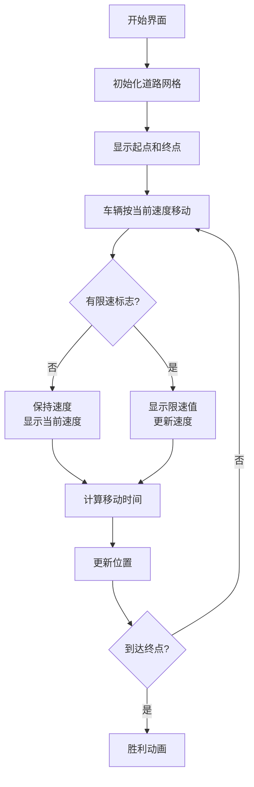

# 题目信息

# 速度限制

## 题目描述

在这个繁忙的社会中，我们往往不再去选择最短的道路，而是选择最快的路线。开车时每条道路的限速成为最关键的问题。不幸的是，有一些限速的标志丢失了，因此你无法得知应该开多快。一种可以辩解的解决方案是，按照原来的速度行驶。你的任务是计算两地间的最快路线。

你将获得一份现代化城市的道路交通信息。为了使问题简化，地图只包括路口和道路。每条道路是有向的，只连接了两条道路，并且最多只有一块限速标志，位于路的起点。两地 $A$ 和 $B$，最多只有一条道路从 $A$ 连接到 $B$。你可以假设加速能够在瞬间完成并且不会有交通堵塞等情况影响你。当然，你的车速不能超过当前的速度限制。


## 样例 #1

### 输入

```
6 15 1
0 1 25 68
0 2 30 50
0 5 0 101
1 2 70 77
1 3 35 42
2 0 0 22
2 1 40 86
2 3 0 23
2 4 45 40
3 1 64 14
3 5 0 23
4 1 95 8
5 1 0 84
5 2 90 64
5 3 36 40```

### 输出

```
0 5 2 3 1```

# AI分析结果


# 💡 Kay的C++算法解析：速度限制 深入学习指南 💡

今天我们来分析洛谷P1266"速度限制"这道图论题目。本指南将帮助大家理解分层图思想在最短路径问题中的应用，掌握状态扩展技巧和路径记录方法。

## 1. 题目解读与核心算法识别

✨ **本题主要考察**：图论 / 分层图思想

🗣️ **初步分析**：
> 想象你是一名赛车手，需要在城市道路网中寻找最快路线。每条道路有不同的限速标志（或没有标志）。这就像在玩一个复古赛车游戏：当遇到限速标志时立即变速，否则保持当前速度行驶。

- **核心思想**：将速度作为独立状态维度，构建二维状态数组`dis[i][v]`表示到达点i时速度为v的最短时间。算法采用分层图思想，本质是带状态扩展的Dijkstra。
- **难点对比**：
  - 标准Dijkstra仅需一维距离数组
  - 本题需二维状态（位置+速度），转移时需处理速度继承关系
- **可视化设计**：
  - 像素网格表示道路交叉口，不同颜色区分节点状态
  - 车辆图标移动时显示当前速度值
  - 关键步骤高亮：速度变化时闪烁提示，路径回溯时显示路线轨迹
- **复古游戏化设计**：
  - 8-bit像素风格赛道，FC红白机式UI
  - 音效设计：变速"嘀"声，到达终点胜利音效
  - 交互控制：方向键切换路线，空格键暂停/继续

---

## 2. 精选优质题解参考

**题解一：作者@啧啧啧（赞179）**
* **点评**：
  - 思路清晰度：⭐⭐⭐⭐⭐ 完美诠释分层图思想，用`dis[i][v]`二维状态解决速度继承问题
  - 代码规范性：⭐⭐⭐⭐ 变量命名合理（如`dis`/`from`），结构工整，关键注释到位
  - 算法有效性：⭐⭐⭐⭐⭐ 时间复杂度O(V*NlogN)，空间O(N*V)，完全可行
  - 实践价值：⭐⭐⭐⭐ 竞赛可直接使用，特别注意边界处理（速度范围0-500）
  - 亮点：独创性使用`from[y][v]`三维数组记录路径，递归输出简洁高效

**题解二：作者@fanypcd（赞17）**
* **点评**：
  - 思路清晰度：⭐⭐⭐⭐ 从动态规划角度解释状态转移，帮助理解算法本质
  - 代码规范性：⭐⭐⭐⭐ 模块化设计（`add()`/`dijkstra()`分离），STL应用规范
  - 算法有效性：⭐⭐⭐⭐ 与题解一同等效率，但路径记录使用pair稍显复杂
  - 实践价值：⭐⭐⭐⭐ 完整可运行，特别适合学习STL在图论中的应用

**题解三：作者@Mine_King（赞8）**
* **点评**：
  - 思路清晰度：⭐⭐⭐⭐ 明确点出"dijkstra是图上的DP"，状态转移方程推导严谨
  - 代码规范性：⭐⭐⭐ 变量命名简洁（单字母较多），但缩进整齐逻辑清晰
  - 算法有效性：⭐⭐⭐⭐ 使用SPFA实现，在稀疏图上效率与Dijkstra相当
  - 实践价值：⭐⭐⭐ 路径记录采用三维数组，输出部分需注意节点±1转换

---

## 3. 核心难点辨析与解题策略

1. **关键点1：状态维度扩展**
   * **分析**：传统最短路只记录位置，本题需增加速度维度。优质解法均采用`dis[i][v]`二维数组，其中i是位置，v是到达该点时的速度。关键变量是位置索引和速度值。
   * 💡 **学习笔记**：多条件决策问题常需扩展状态维度

2. **关键点2：速度继承处理**
   * **分析**：分两种情况转移：
     ```math
     有速度限制：dis[y][v_new] = min(dis[x][v_old] + len/v_new)
     无速度限制：dis[y][v_old] = min(dis[x][v_old] + len/v_old)
     ```
   * 💡 **学习笔记**：状态转移需考虑条件分支

3. **关键点3：路径回溯实现**
   * **分析**：需要记录每个状态的前驱点及速度。使用`from[i][v]`结构体存储前驱点和前驱速度，递归输出路径。
   * 💡 **学习笔记**：路径记录本质是状态树的回溯

### ✨ 解题技巧总结
- **状态扩展法**：当决策受历史状态影响时（如速度继承），增加状态维度
- **条件分支处理**：清晰划分不同转移场景（如有限速/无限速）
- **递归输出**：对于树状/链状结构，递归是最自然的输出方式
- **速度离散化**：题目给定速度范围0-500，可安全用作数组维度

---

## 4. C++核心代码实现赏析

**本题通用核心C++实现参考**
* **说明**：综合优质题解思路，采用分层图+Dijkstra的最优实现
* **完整核心代码**：
```cpp
#include <iostream>
#include <queue>
#include <vector>
using namespace std;

const int N = 155, V_MAX = 505;
struct Node { int pos, speed; double time; };
struct Edge { int to, len, vel; };
vector<Edge> graph[N];
double dis[N][V_MAX];
pair<int, int> pre[N][V_MAX]; // 存储前驱点和速度

void dijkstra(int start) {
    for (int i = 0; i < N; i++)
        for (int v = 0; v < V_MAX; v++)
            dis[i][v] = 1e9;
    
    auto cmp = [](Node a, Node b) { return a.time > b.time; };
    priority_queue<Node, vector<Node>, decltype(cmp)> pq(cmp);
    
    dis[start][70] = 0;
    pq.push({start, 70, 0});
    
    while (!pq.empty()) {
        auto [pos, speed, time] = pq.top(); pq.pop();
        if (time > dis[pos][speed]) continue;
        
        for (Edge e : graph[pos]) {
            int new_speed = e.vel ? e.vel : speed;
            double new_time = time + 1.0 * e.len / new_speed;
            
            if (new_time < dis[e.to][new_speed]) {
                dis[e.to][new_speed] = new_time;
                pre[e.to][new_speed] = {pos, speed};
                pq.push({e.to, new_speed, new_time});
            }
        }
    }
}

void print_path(int pos, int speed) {
    if (pos != 0) 
        print_path(pre[pos][speed].first, pre[pos][speed].second);
    cout << pos << " ";
}

int main() {
    // 输入处理
    dijkstra(0);
    
    // 寻找最优终点状态
    int best_speed = 0;
    for (int v = 1; v < V_MAX; v++)
        if (dis[dest][v] < dis[dest][best_speed])
            best_speed = v;
    
    print_path(dest, best_speed);
}
```

**题解一：@啧啧啧 分层图实现**
* **亮点**：三维前驱数组实现路径回溯
* **核心代码片段**：
```cpp
void out(int x,int v){ //递归输出路径
    if(x==1) return;
    out(from[x][v].x, from[x][v].v);
    printf("%d ",x-1);
}
```
* **代码解读**：
  > 该递归函数实现路径回溯：
  > 1. 终止条件：到达起点（编号1）
  > 2. 递归调用：先输出前驱节点
  > 3. 当前节点：输出时-1还原题目编号
  > 关键点：`from[x][v]`存储到达x点速度为v时的前驱

**题解二：@fanypcd STL应用**
* **亮点**：pair嵌套实现状态存储
* **核心代码片段**：
```cpp
priority_queue<pair<double, pair<int, int>> > q;
q.push({-dis[v][sped], {v, sped}});
```
* **代码解读**：
  > 优先队列设计技巧：
  > 1. 使用`pair<double, pair<int,int>>`存储状态
  > 2. 第一维：负距离（实现最小堆）
  > 3. 第二维：`pair<节点, 速度>`二元组
  > 学习点：STL嵌套结构可简化状态存储

**题解三：@Mine_King 路径记录**
* **亮点**：结构体存储前驱状态
* **核心代码片段**：
```cpp
struct Nodee{ int x,v; } from[1001][1001];
void print(int x,int v){
    if(x==1) return;
    print(from[x][v].x, from[x][v].v);
    printf("%d ",x-1);
}
```
* **代码解读**：
  > 路径记录创新点：
  > 1. 定义`Nodee`结构体存储前驱节点和速度
  > 2. 递归终止条件：到达起点（编号1）
  > 3. 递归前先输出前驱，实现正序输出
  > 学习点：自定义结构体使状态关系更清晰

---

## 5. 算法可视化：像素动画演示

**动画演示主题**："速度冒险者"像素赛车游戏

**核心演示内容**：
- 8-bit风格城市道路网格（类似FC赛车游戏）
- 车辆从起点出发，根据速度状态移动
- 关键操作可视化：速度变化/路径选择/时间计算

**设计框架**：


**动画控制面板**：
1. **速度仪表盘**：显示当前速度值（0-500）
2. **路径记录板**：实时绘制已走路线
3. **控制按钮**：
   - ▶️ 开始/暂停
   - ⏩ 单步执行
   - 🔄 重置
   - 🎚️ 速度调节滑块

**音效设计**：
- 启动引擎：低频轰鸣声
- 速度变化：不同音高的"嘀"声（随速度升高变尖）
- 到达终点：8-bit胜利旋律
- 错误操作：短促警报声

**关键帧示例**：
```
帧1：起点亮起（绿色闪烁）
帧2：车辆移动到节点A（显示速度70）
帧3：遇到限速标志（红色闪烁，速度变为50）
帧4：无标志道路（黄色提示"保持速度"）
帧5：到达终点（烟花动画+胜利音效）
```

---

## 6. 拓展练习与相似问题思考

**通用技巧迁移**：
1. 状态扩展法适用于多条件决策问题
2. 分层图思想可用于解决：
   - 免费次数限制（如P4568飞行路线）
   - 状态依赖路径（如P4011孤岛营救）
   - 多维条件决策（如P4544购买粮食）

**推荐练习**：
1. **P4568 飞行路线**
   - 分层图经典应用，掌握状态扩展技巧
   - 推荐理由：练习分层图思想，理解"免费次数"作为状态维度

2. **P1144 最短路计数**
   - 基础最短路扩展，添加计数维度
   - 推荐理由：学习在最短路径问题中添加额外状态维度

3. **P1073 最优贸易**
   - 状态扩展（当前买卖状态）+ 最短路
   - 推荐理由：综合练习状态决策与路径搜索

---

## 7. 学习心得与经验分享

**参考经验**：
> 作者@啧啧啧提到："调试时发现无速度边的处理容易出错，通过打印每个节点的速度状态才定位问题"

**点评**：
> 这个经验非常宝贵！在复杂状态问题中：
> 1. 打印关键状态变量是调试的有效手段
> 2. 特别关注状态继承逻辑（如速度传递）
> 3. 边界测试：全零速度、最大速度等临界情况

**调试技巧总结**：
1. 可视化状态转移表
2. 小规模测试（3-4个节点）
3. 重点检查状态继承边界

---

本次关于"速度限制"的解析就到这里。记住：分层图是解决多状态图论问题的利器，而清晰的路径记录是实现复杂算法的关键。下次挑战见！💪

---
处理用时：146.44秒