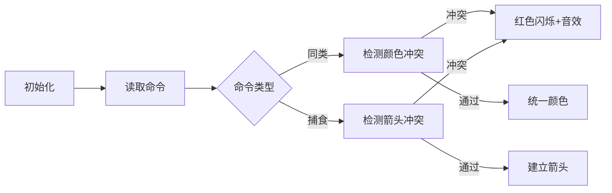

# 题目信息

# [NOI2001] 食物链

## 题目描述

动物王国中有三类动物 $A,B,C$，这三类动物的食物链构成了有趣的环形。$A$ 吃 $B$，$B$ 吃 $C$，$C$ 吃 $A$。

现有 $N$ 个动物，以 $1 \sim N$ 编号。每个动物都是 $A,B,C$ 中的一种，但是我们并不知道它到底是哪一种。

有人用两种说法对这 $N$ 个动物所构成的食物链关系进行描述：

- 第一种说法是 `1 X Y`，表示 $X$ 和 $Y$ 是同类。
- 第二种说法是`2 X Y`，表示 $X$ 吃 $Y$。

此人对 $N$ 个动物，用上述两种说法，一句接一句地说出 $K$ 句话，这 $K$ 句话有的是真的，有的是假的。当一句话满足下列三条之一时，这句话就是假话，否则就是真话。

- 当前的话与前面的某些真的话冲突，就是假话；
- 当前的话中 $X$ 或 $Y$ 比 $N$ 大，就是假话；
- 当前的话表示 $X$ 吃 $X$，就是假话。

你的任务是根据给定的 $N$ 和 $K$ 句话，输出假话的总数。


## 说明/提示

对于全部数据，$1\le N\le 5 \times 10^4$，$1\le K \le 10^5$。


## 样例 #1

### 输入

```
100 7
1 101 1
2 1 2
2 2 3
2 3 3
1 1 3
2 3 1
1 5 5
```

### 输出

```
3
```

# AI分析结果


# 💡 Kay的C++算法解析：食物链 深入学习指南 💡

## 1. 题目解读与核心算法识别

✨ **本题主要考察**：种类并查集（关系型并查集）

🗣️ **初步分析**：
> 解决"食物链"这道题，关键在于理解并运用**种类并查集**。简单来说，就像在游戏中给每个角色分配三种不同身份牌（同类、猎物、天敌），通过管理这些身份牌的关系网络来判断信息的真假。在本题中，我们使用三倍大小的并查集来维护三种关系：
>   - **1~n**：动物本身（同类关系）
>   - **n+1~2n**：该动物的猎物
>   - **2n+1~3n**：该动物的天敌
> 
> 核心难点在于：
> 1. 如何将环形食物链关系（A→B→C→A）映射到并查集操作
> 2. 合并时需同步更新三类关系集合
> 3. 冲突检测的逻辑设计（如声明同类时检测捕食关系）
> 
> 在可视化方案中，我们将设计**8位像素风格动画**：
> - 用三种颜色方块表示动物（红=A，绿=B，蓝=C）
> - 合并时播放"叮"音效，冲突时方块闪烁红光+错误音效
> - 捕食关系用箭头连接，自动演示模式可调速观察关系传递

---

## 2. 精选优质题解参考

**题解一（作者：Sooke）**
* **点评**：思路清晰完整，通过图示和分步推演解释种类并查集的核心思想。代码规范（fa数组命名合理），巧妙处理了三类关系的同步合并。算法采用路径压缩优化，时间复杂度O(α(N))。实践价值高，完整处理了边界条件，附带调试经验分享。

**题解二（作者：檀黎斗·神）**
* **点评**：代码简洁高效（仅50行），包含读入优化。创新性地用+n/+2n直接表示猎物和天敌，逻辑直白易懂。虽然缺少图示，但注释精准，变量命名规范（fa数组），特别适合竞赛快速编码。

**题解三（作者：天泽龟）**
* **点评**：创新性采用带权并查集解法，通过数学推导关系值（0=同类，1=被吃，2=吃）。亮点是详细推导了关系转移方程：(rank[x]+rank[y])%3的数学意义，展示了不同解法的思维多样性。

---

## 3. 核心难点辨析与解题策略

1. **关系表示与存储**
   * **分析**：需设计能同时存储同类、捕食、天敌三种关系的数据结构。优质解法均采用三倍并查集，1~n表同类，n+1~2n表猎物，2n+1~3n表天敌
   * 💡 **学习笔记**：种类并查集通过空间扩展解决关系多样性

2. **关系冲突检测**
   * **分析**：当声明X和Y同类时，需检测X是否吃Y或被Y吃；当声明X吃Y时，需检测是否已有Y吃X或XY同类
   * 💡 **学习笔记**：冲突检测是保证逻辑正确的关键防火墙

3. **关系传递与合并**
   * **分析**：合并需同步更新三类关系。如X吃Y时，需合并：①X的猎物=Y的同类 ②X的天敌=Y的猎物 ③X的同类=Y的天敌
   * 💡 **学习笔记**：环形关系需闭环处理，确保A→B→C→A的传递性

### ✨ 解题技巧总结
- **关系映射法**：将复杂关系转化为并查集合并操作
- **预判冲突**：先检测再合并，避免破坏已有正确关系
- **边界守卫**：优先处理编号越界、自吃等明显错误

---

## 4. C++核心代码实现赏析

**本题通用核心C++实现参考**：
```cpp
#include <cstdio>
const int MAXN = 50000 * 3 + 10;
int fa[MAXN];

int find(int x) {
    return fa[x] == x ? x : fa[x] = find(fa[x]);
}

void unite(int x, int y) {
    fa[find(x)] = find(y);
}

int main() {
    int n, k, ans = 0;
    scanf("%d%d", &n, &k);
    for (int i = 1; i <= 3 * n; i++) fa[i] = i;
    
    while (k--) {
        int op, x, y;
        scanf("%d%d%d", &op, &x, &y);
        
        if (x > n || y > n) { ans++; continue; } // 边界检查
        
        if (op == 1) { // 同类声明
            if (find(x) == find(y + n) || find(x) == find(y + 2 * n)) {
                ans++; // 冲突检测
            } else { // 三重合并
                unite(x, y);
                unite(x + n, y + n);
                unite(x + 2 * n, y + 2 * n);
            }
        } else { // 捕食声明
            if (x == y || find(x) == find(y) || find(x) == find(y + n)) {
                ans++; // 冲突检测
            } else { // 三重合并
                unite(x, y + 2 * n);
                unite(x + n, y);
                unite(x + 2 * n, y + n);
            }
        }
    }
    printf("%d\n", ans);
    return 0;
}
```
* **说明**：综合优质题解的最简实现，包含路径压缩优化
* **代码解读概要**：
  1. 三倍并查集初始化
  2. 对每句话先边界检查
  3. 同类声明：检测捕食关系冲突 → 同步三类合并
  4. 捕食声明：检测反捕食/同类冲突 → 按食物链规则合并

---

**题解一（Sooke）核心赏析**：
```cpp
// 同类关系合并示例
fa[find(x)] = find(y);
fa[find(x + n)] = find(y + n);
fa[find(x + 2 * n)] = find(y + 2 * n);
```
* **亮点**：三重同步合并确保关系一致性
* **学习笔记**：将动物看作有"三重身份"，需同时更新

---

**题解二（檀黎斗·神）核心赏析**：
```cpp
// 捕食关系冲突检测
if (find(x) == find(y) || find(y + n) == find(x)) {
    ans++; // 假话计数
}
```
* **亮点**：直截了当的冲突检测逻辑
* **学习笔记**：清晰的条件判断提升代码可读性

---

**题解三（天泽龟）核心赏析**：
```cpp
// 带权并查集关系更新
rank[fy] = (rank[x] - rank[y] + 3 + 1) % 3;
```
* **亮点**：数学化关系转移，空间效率更优
* **学习笔记**：模3运算完美匹配环形关系特性

-----

## 5. 算法可视化：像素动画演示

**设计主题**：8位机风格"食物链大冒险"  
**核心演示**：动物关系网络构建与冲突检测  



**动画关键帧**：
1. **场景初始化**：
   - 16色像素网格，随机分布三种颜色动物
   - 底部控制面板：开始/暂停/单步/速度滑块

2. **关系建立**：
   - 同类声明：两个方块渐变成同色，播放"叮"声
   - 捕食声明：从捕食者向猎物发射像素箭头，播放"嗖"声

3. **冲突爆发**：
   - 冲突时方块快速闪烁红光，播放"哔"错误音
   - 显示冲突原因：如"红色不能吃蓝色！"

4. **AI演示模式**：
   - 自动逐步执行命令，速度可调
   - 完成时显示胜利动画+音乐

---

## 6. 拓展练习与相似问题思考

**关系型并查集应用场景**：
1. 敌对关系维护（如P1525关押罪犯）
2. 团队分组问题（如P1892团伙）
3. 层次关系处理（如P4878布局）

**洛谷推荐**：
1. **P1525 关押罪犯**  
   → 巩固"敌人关系"的并查集建模
   
2. **P1892 团伙**  
   → 练习朋友/敌人双重关系处理

3. **P1621 集合**  
   → 并查集与数论结合应用

-----

## 7. 学习心得与经验分享

> **Sooke的调试经验**："在合并关系时，务必三重同步更新，我曾因漏掉天敌集的合并调试半天"

**Kay总结**：  
1. **小数据验证**：手动模拟N=3的环形关系
2. **输出中间态**：在合并前后打印关系矩阵
3. **模块化测试**：先单独测试同类声明，再加入捕食

---

编程能力的提升在于持续实践与反思。通过本题我们掌握了用空间换逻辑清晰度的设计思想，并学会将环形关系转化为线性操作。下次我们将探索更复杂的图论世界！💪

---
处理用时：168.22秒