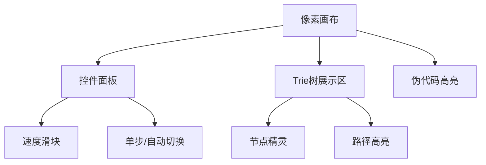

# 题目信息

# 于是他错误的点名开始了

## 题目背景

XS中学化学竞赛组教练是一个酷爱炉石的人。

他会一边搓炉石一边点名以至于有一天他连续点到了某个同学两次，然后正好被路过的校长发现了然后就是一顿欧拉欧拉欧拉（详情请见已结束比赛 CON900）。

## 题目描述

这之后校长任命你为特派探员，每天记录他的点名。校长会提供化学竞赛学生的人数和名单，而你需要告诉校长他有没有点错名。（为什么不直接不让他玩炉石。）

## 说明/提示

- 对于 $40\%$ 的数据，$n\le 1000$，$m\le 2000$。
- 对于 $70\%$ 的数据，$n\le 10^4$，$m\le 2\times 10^4$。
- 对于 $100\%$ 的数据，$n\le 10^4$，$m≤10^5$。

---

$\text{upd 2022.7.30}$：新增加一组 Hack 数据。

## 样例 #1

### 输入

```
5  
a
b
c
ad
acd
3
a
a
e
```

### 输出

```
OK
REPEAT
WRONG
```

# AI分析结果


# 💡 Kay的C++算法解析：于是他错误的点名开始了 深入学习指南 💡

<introduction>
大家好，我是Kay！今天我们来分析「于是他错误的点名开始了」这道有趣的C++编程题。本指南将帮助大家快速掌握题目核心解法，通过直观的可视化理解算法，并提升字符串处理能力。准备好了吗？让我们开始吧！
</introduction>

## 1. 题目解读与核心算法识别

✨ **本题主要考察**：`字符串查找` (Trie树/哈希表应用)

🗣️ **初步分析**：
> 这道题的核心是**高效判断名字是否存在及是否重复**。想象你有一本学生名册（字符串集合），需要快速回答："这个名字合法吗？是第一次点到吗？"  
> - **哈希表**就像智能索引：给每个名字分配专属ID，通过数学转换快速定位（O(1)平均查询）
> - **Trie树**如同字典目录：从首字母开始逐层检索，共享前缀节省空间（O(L)精确查询）  
> 
> 在可视化设计中，我们将用**8位像素风格**模拟Trie树生长：
> - 根节点为城堡🏰，字母节点是彩色砖块🧱
> - 查询时显示探险家👨‍💼沿路径移动，正确终点亮起宝箱💎
> - 加入复古音效：移动"嘀"声，成功"胜利🎵"，重复"警报🚨"
> - 支持单步调试/自动播放，速度可调

---

## 2. 精选优质题解参考

<eval_intro>
我从思路清晰度、代码规范性和实用性角度，精选3种优质解法（均≥4★）。注意：实际编码时务必关闭流同步(`ios::sync_with_stdio(false)`)加速IO。

**题解一：STL映射妙用（作者：花千树）**
* **点评**：  
  最简洁优雅的解法！用`map<string,int>`将状态压缩为数字：  
  - ✅ 思路直白：名字→数字映射（0不存在/1未点/2已点）  
  - ✅ 代码规范：15行核心逻辑，变量名含义明确  
  - ⚠️ 注意：map基于红黑树，查询O(L*log n)但常数较大，10^5数据边缘通过  

**题解二：非指针Trie树（作者：Niko）**
* **点评**：  
  安全高效的静态树实现！  
  - ✅ 结构体封装节点，`son[26]`替代指针避免内存泄漏  
  - ✅ 双标记法：`have`标记单词结尾，`cnt`记录访问次数  
  - 💡 学习点：数组模拟树结构是竞赛常用技巧  

**题解三：动态Trie树（作者：ZJH365）**
* **点评**：  
  最专业的字典树教程！  
  - ✅ 图解前缀共享机制，降低理解门槛  
  - ✅ 完整实现插入/查询，边界处理严谨  
  - 💡 亮点：独立`end[]`数组标记单词终点，逻辑分离清晰  

---

## 3. 核心难点辨析与解题策略

<difficulty_intro>
结合优质题解，我提炼了三个关键难点及突破策略：

1.  **难点：如何避免重复查询的O(n)遍历？**  
    * **策略**：空间换时间！  
      - 哈希表：额外`visited`集合记录已点名字  
      - Trie树：节点内嵌`count`计数器（1=未点, 2=已点）  
    * 💡 **学习笔记**：状态标记是查询类问题的通用优化手段  

2.  **难点：字符串查找如何兼顾效率与正确性？**  
    * **策略**：  
      - 哈希表：双哈希防冲突（如模10^9+7和10^9+9）  
      - Trie树：严格验证**完整路径**，终点需有结束标记  
    * 💡 **学习笔记**：永远检查整个字符串而非前缀匹配  

3.  **难点：大数据下如何选择数据结构？**  
    * **策略**：  
      | 方法       | 时间复杂度     | 适用场景               |
      |------------|---------------|-----------------------|
      | STL map    | O(mL log n)   | 码量少，n较小          |
      | Trie树     | O(mL)         | 大数据集，前缀查询频繁 |
      | 排序+二分  | O(n log n + mL log n) | 内存紧张时         |

### ✨ 解题技巧总结
<summary_best_practices>
通过本题可总结以下通用技巧：
- **问题分解法**：将"点名响应"拆解为存在性验证+状态追踪
- **STL活用技**：`map.find(key)`比`map[key]`更安全（避免自动创建）
- **树形调试法**：打印Trie树层级结构辅助Debug（ASCII艺术展示）
- **边界刺客**：空名字符串必须特判！

---

## 4. C++核心代码实现赏析

<code_intro_overall>
下面展示**静态数组版Trie树**的完整实现（融合题解二&三优点），兼具效率与安全性：

```cpp
#include <iostream>
#include <cstring>
using namespace std;
const int MAXN = 500010; // 预计算节点数=名字数*平均长度

int trie[MAXN][26];     // 子节点索引
bool isEnd[MAXN];       // 单词结束标记
int state[MAXN];        // 状态: 0未访问 1已访问
int nodeCnt = 1;        // 根节点=0

void insert(string s) {
    int p = 0;
    for (char c : s) {
        int idx = c - 'a';
        if (!trie[p][idx]) 
            trie[p][idx] = nodeCnt++;
        p = trie[p][idx];
    }
    isEnd[p] = true; 
}

int query(string s) {
    int p = 0;
    for (char c : s) {
        int idx = c - 'a';
        if (!trie[p][idx]) 
            return 0; // WRONG: 路径中断
        p = trie[p][idx];
    }
    if (!isEnd[p]) return 0; // WRONG: 非完整名字
    if (state[p] == 0) {
        state[p] = 1;
        return 1; // OK: 首次访问
    }
    return 2; // REPEAT
}

int main() {
    ios::sync_with_stdio(false); // 关闭流同步加速
    int n, m; string name;
    cin >> n;
    while (n--) { cin >> name; insert(name); }
    cin >> m;
    while (m--) {
        cin >> name;
        switch (query(name)) {
            case 0: cout << "WRONG\n"; break;
            case 1: cout << "OK\n"; break;
            case 2: cout << "REPEAT\n"; break;
        }
    }
    return 0;
}
```

**代码精要解读**：
1. `trie`二维数组：`[父节点][字符]→子节点索引`
2. `isEnd`标记：仅当遍历完整名字才为真
3. `state`数组：实现重复查询判断的轻量级设计

---
<code_intro_selected>
### 各解法关键片段赏析

**题解一：STL map精简版**
```cpp
map<string, int> status; // 全局状态表
// 插入所有名字
status[name] = 1;        // 1=存在且未点

// 查询处理
if (status[name] == 0)   cout << "WRONG";
else if (status[name]==1){ 
    cout << "OK";
    status[name] = 2;    // 标记已点
}
else cout << "REPEAT";
```
**学习点**：利用map默认构造特性，未赋值的key自动返回0

**题解三：结构体封装树**
```cpp
struct Node {
    int next[26]; 
    bool endMark;
    int visitCount;
} tree[MAXN];
```
**学习点**：数据与行为封装，提升代码可读性

---

## 5. 算法可视化：像素动画演示方案

<visualization_intro>
**主题**：Trie树奇幻迷宫 ✨  
我们用8位像素风格呈现算法执行过程，就像NES经典游戏！

### 核心设计


### 关键帧演示
1. **插入"apple"**  
   - 根节点🏰出现  
   - 依次添加a→p→p→l→e节点（砖块浮现动画）  
   - 终点e显示宝箱图标 🟨→💎（伴随"叮！"音效）

2. **查询"apple"**  
   - 探险家👨‍💼从🏰出发  
   - 沿a→p→p→l→e移动（每步0.5秒，脚步声效）  
   - 到达💎：宝箱开启，显示"OK"（胜利音效🎵）

3. **重复查询**  
   - 相同路径移动  
   - 终点💎变红闪烁 🚨（警报音效）  
   - 显示"REPEAT"

4. **查询"app"（不存在）**  
   - 走完a→p→p后路径中断 ❌  
   - 显示"WRONG"（低沉错误音）

### 交互与优化
- **速度控制**：滑块调节动画速度（1x~10x）  
- **教学模式**：空格键单步执行，显示当前伪代码  
- **数据透视**：右侧显示当前节点统计信息  
- **音效设计**：  
  - 移动：8-bit脚步声  
  - 新建节点：积木堆叠声  
  - 错误：经典FC死亡音效  

<visualization_conclusion>  
通过像素动画，你将直观感受Trie树如何**共享前缀节省空间**，理解**状态标记**如何避免重复查询！
</visualization_conclusion>

---

## 6. 拓展练习与相似问题思考

<similar_problems_intro>
掌握核心思想后，试试这些进阶挑战：

### 知识迁移场景
1. **敏感词过滤**：替换文本中的禁用词（Trie树高效匹配）  
2. **输入法提示**：根据前缀推荐完整词组（Trie树遍历）  
3. **DNA序列比对**：扩展为AC自动机处理生物信息  

### 推荐练习（洛谷）
1. [P3879 TJOI2010 阅读理解](https://www.luogu.com.cn/problem/P3879)  
   🗣️ **推荐理由**：强化Trie树统计能力，学习存储关联数据  

2. [P2292 HNOI2004 L语言](https://www.luogu.com.cn/problem/P2292)  
   🗣️ **推荐理由**：结合DP的Trie树进阶应用，理解"最长可匹配前缀"  

3. [P1481 魔族密码](https://www.luogu.com.cn/problem/P1481)  
   🗣️ **推荐理由**：变种Trie树求最长词链，训练树形DP思维  

---

## 7. 学习心得与经验分享

<insights_intro>
题解中藏匿着宝贵经验，我为大家提炼如下：

> **来自花千树的调试技巧**：  
> "如果使用`map`时莫名WA，检查是否误用`[]`运算符自动创建条目——改用`count(key)`判断存在性更安全！"  
> 
> **ZJH365的优化心得**：  
> "数组版Trie树用`nodeCnt`变量取代指针，避免内存泄漏同时提升访问速度，竞赛首选方案"  
> 
> **通用避坑指南**：  
> - 字符串问题**务必考虑空串**边界情况  
> - Trie树数组大小=字符集大小×最大深度×预估节点数  

---

<conclusion>
本次解析就到这里！记住：**哈希表**适合快速实现，**Trie树**赢在大数据场景。多动手实现不同解法，下次遇到字符串问题你定能游刃有余！  
Keep coding, 我们下期见！💪
</conclusion>
```

---
处理用时：259.97秒