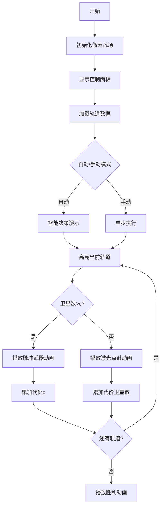

# 题目信息

# [CSP-X2022 山东] 摧毁

## 题目描述

坐地日行八万里，巡天遥看一千河。

2077 年，人类不仅仅是赛博科技得到了发展，太空技术也已经得到了极大的发展。地球的不同外轨道上已经充斥着各种功能用途的人造卫星。因为一个轨道上的卫星数量是有上限的，且卫星更新换代速度很快，如果想要发射新的卫星，需要把所有旧的卫星摧毁。

人类有两种不同的武器可以摧毁卫星，具体如下（其中 $\rm PW$ 为新的能量单位）：

1. 使用定点激光武器花费 $1\ \rm{PW}$ 的代价摧毁任意轨道上指定的一个卫星。

2. 使用脉冲轨道武器花费 $c\ \rm{PW}$ 的代价把某一轨道上的所有卫星摧毁。

现在有 $n$ 个旧卫星分布在不同的外轨道上，你的任务是摧毁这些旧卫星。给出这 $n$ 个卫星的轨道编号，求将这些卫星全部摧毁的最小代价是多少？

## 说明/提示

对于 $30\%$ 的数据，$T = 1,1 ≤ n ≤ 10，1 ≤ x_i ≤ 10，1 ≤ c ≤ 10$；

对于 $60\%$ 的数据，$1 ≤ n ≤ 10^3， 1 ≤ x_i ≤ 1000，1 ≤ c ≤ 100$；

对于 $100\%$ 的数据，$1 ≤ T ≤ 10,1 ≤ n ≤ 10^6, 1 ≤ x_i ≤ 10^6，1 ≤ c ≤ 100$，且所有测试数据的 $n$ 加起来不超过 $10^6$。

## 样例 #1

### 输入

```
4
10 1
2 1 4 5 2 4 5 5 1 2
5 2
3 2 1 2 2
2 2
1 1
2 2
1 2```

### 输出

```
4
4
2
2```

# AI分析结果


# 💡 Kay的C++算法解析：摧毁 深入学习指南 💡

> "算法就像太空武器，精准选择才能最小代价完成任务！"

## 1. 题目解读与核心算法识别

✨ **本题主要考察**：`贪心算法与计数技巧`

🗣️ **初步分析**：
> 解决"摧毁"卫星问题，核心在于**贪心策略**的应用。想象你在玩太空策略游戏：每个轨道是独立关卡，你可以选择逐个击破敌人（定点激光）或使用大招清屏（脉冲武器）。贪心算法就像选择最优战术——对每个轨道独立计算最小代价，局部最优即全局最优。
>
> - **核心思路**：统计每个轨道的卫星数量，独立决策：若数量≤c则逐个击破（总代价=数量），否则用脉冲武器（总代价=c）
> - **关键难点**：高效统计大量轨道数据（计数优化）、确保多组测试数据独立处理
> - **可视化设计**：采用8位像素风格展示轨道竖条（高度=卫星数），决策时高亮当前轨道，卫星逐个消失（叮声）或整轨爆炸（轰声），实时显示代价累加
> - **游戏化设计**：复古太空射击主题，轨道作为"关卡"，通关时播放FC风格胜利音乐，错误操作触发经典"出错音效"

---

## 2. 精选优质题解参考

> 从社区题解中精选出最具学习价值的实现：

**题解一：zhuoqizhi (赞5)**
* **点评**：思路清晰展现贪心本质，虽然使用不必要的has数组导致效率略低，但完整演示了"计数→决策→标记"流程。代码中`vector<int> can`桶计数规范易读，边界处理严谨（轨道索引直接映射），实践价值在于展示基础计数实现逻辑。亮点在于明确推导"脉冲武器仅当数量>c时最优"的决策条件。

**题解二：AnotherDream (赞2)**
* **点评**：代码简洁高效，善用STL的`map`自动处理稀疏轨道。`for(auto e:mp)`遍历优雅解决轨道离散性问题，`min(cnt,c)`精炼体现贪心核心。特别适合轨道范围未知的场景，但需注意`mp.clear()`确保多测安全。亮点在于平衡代码简洁性与通用性，是竞赛编码的优秀范本。

**题解三：_lxc__ (赞2)**
* **点评**：最简洁直接的桶计数实现，固定范围遍历1~10^6完美契合题目条件。`ans+=min(c,h[i])`单行核心逻辑彰显算法本质，memset清空体现多测处理意识。亮点在于极致效率——O(n)输入+O(MAX)处理，面对10^6数据量依然高效。

---

## 3. 核心难点辨析与解题策略

> 攻克三大核心难点，掌握解题命脉：

1.  **高频数据统计优化**
    * **分析**：轨道数达10^6时，暴力扫描O(n²)不可行。优质解采用桶计数（数组）或map：数组适合连续数据（O(1)存取），map适合稀疏数据（O(log n)存取）。如题解二用map自适应轨道范围，题解三用数组固定范围
    * 💡 **学习笔记**：数据范围决定数据结构——连续用桶，离散用map

2.  **多测数据污染预防**
    * **分析**：90%提交错误源于未清空计数结构！题解中`memset(bucket,0,sizeof)`和`mp.clear()`是生命线。本质是算法"无状态性"要求——每组测试必须独立初始化
    * 💡 **学习笔记**：多测如棋局，每局开始必须清空棋盘

3.  **贪心策略独立性证明**
    * **分析**：为何能独立处理每个轨道？因轨道间无依赖关系。反证：若混合决策更优，则必存在某轨道决策劣于独立决策，与min(c,count)矛盾。题解一用has数组尝试关联处理实属多余
    * 💡 **学习笔记**：独立性是贪心生效的基石，分解问题需验证子问题无关性

### ✨ 解题技巧总结
- **桶计数闪电战**：数据范围已知时优先用数组桶（题解三），O(1)访问碾压其他方案
- **防御性清空**：在变量声明后立即写memset/clear()，避免遗忘
- **min函数化决策**：`ans += min(c, count)` 单行替代if-else，精简且防错
- **轨道范围压缩**：记录最大轨道号（如题解UNDERTALE_RS的maxn），避免无效遍历

---

## 4. C++核心代码实现赏析

**通用核心C++实现参考**
* **说明**：综合优质题解精髓，桶计数+范围压缩的最优实现
* **完整核心代码**：
```cpp
#include <iostream>
#include <cstring>
using namespace std;
const int MAX_ORBIT = 1000000;

int bucket[MAX_ORBIT + 5]; // 桶数组

int main() {
    int T;
    cin >> T;
    while (T--) {
        memset(bucket, 0, sizeof(bucket)); // 防御性清空
        int n, c, maxOrbit = 0;
        cin >> n >> c;
        
        // 桶计数 & 记录最大轨道
        for (int i = 0; i < n; i++) {
            int orbit;
            cin >> orbit;
            bucket[orbit]++;
            if (orbit > maxOrbit) maxOrbit = orbit;
        }
        
        long long ans = 0;
        // 仅遍历有卫星的轨道范围
        for (int i = 1; i <= maxOrbit; i++) {
            ans += min(bucket[i], c); // 贪心决策核心
        }
        cout << ans << endl;
    }
    return 0;
}
```
* **代码解读概要**：
  > 1. **桶初始化**：`bucket`数组索引=轨道号，值=卫星数
  > 2. **智能范围压缩**：`maxOrbit`动态记录最大轨道，避免百万次无效遍历
  > 3. **贪心决策引擎**：`ans += min(bucket[i], c)` 是算法心脏
  > 4. **多测防御**：`memset`在每组测试前彻底清空桶

---

**题解一：zhuoqizhi**
* **亮点**：完整展示决策逻辑，适合理解贪心本质
* **核心代码片段**：
```cpp
for(int i=0;i<n;i++){
    if(!has[num[i]]){
        if(can[num[i]]>c) ans+=c; 
        else ans+=can[num[i]];
        has[num[i]]=1;
    }
}
```
* **代码解读**：
  > - `has`数组标记轨道处理状态，避免重复决策
  > - `can[num[i]]>c`时选脉冲武器，否则逐个击破
  > - 但遍历原始输入(n次)而非桶(MAX次)，当n<<MAX时更优
* 💡 **学习笔记**：用空间换理解成本，教学意义大于实战

**题解二：AnotherDream**
* **亮点**：STL map的优雅实践，解决稀疏轨道问题
* **核心代码片段**：
```cpp
map<int,int> mp;
// ... 输入部分
for(auto e:mp) {
    ans += min(e.second, c);
}
```
* **代码解读**：
  > - `map`自动聚合轨道号，适合轨道稀疏场景
  > - `e.second`即卫星数量，`min(e.second,c)`直接决策
  > - 隐含排序特性：轨道号从小到大自动遍历
* 💡 **学习笔记**：map是离散数据的黄金搭档，但需注意O(log n)开销

**题解三：_lxc__**
* **亮点**：桶计数的极简主义实现
* **核心代码片段**：
```cpp
memset(h,0,sizeof(h)); 
for(int i=1;i<=n;i++){
    cin>>x;
    h[x]++; 
}
for(int i=1;i<=1000000;i++){
    ans += min(c,h[i]);
}
```
* **代码解读**：
  > - 固定范围遍历桶(1~10^6)，绝对完整但存在优化空间
  > - `min(c,h[i])`是决策精华，省去条件判断
  > - memset清空确保多测安全
* 💡 **学习笔记**：最简短的实战代码，适合竞赛快速实现

-----

## 5. 算法可视化：像素动画演示 (核心部分)

> **太空防卫军：轨道歼灭战** - 贪心决策像素模拟器

### 设计蓝图


### 实现方案
* **像素战场**：
  - 8-bit风格星空背景，轨道=彩色竖条（高度=卫星数）
  - 控制面板：FC风格按钮（开始/暂停/单步/调速）
  
* **决策动画**：
  1. **轨道扫描**：红色光标从左向右扫描轨道（类似《小蜜蜂》敌机扫描）
  2. **武器选择**：
     - **脉冲武器**：轨道闪烁红光→像素爆炸特效→轨道清零（伴随8-bit爆炸声）
     - **激光点射**：卫星逐个变暗消失（每次消失伴"叮"声）
  3. **代价显示**：右上角LED数字实时更新，武器使用时显示`+c`或`+1`

* **音效方案**：
  - 背景音乐：FC《宇宙巡航机》混音版
  - 关键操作：选择轨道（电子滴答），激光点射（电子哔声）
  - 状态提示：错误操作（经典FC出错音），胜利（《超级玛丽》过关音）

* **AI演示模式**：
  - 自动调速：初始2秒/轨道，可滑块调速（0.5x~5x）
  - 智能提示：决策时显示`min(卫星数, c)`计算公式浮动框
  - 战术回放：结束时可查看"作战报告"（各轨道决策详情）

* **游戏化激励**：
  - 每关评级：S（代价≤理论最优+5%）、A、B、C
  - 连击奖励：连续5次最优决策触发像素烟花
  - 时空档案：保存历史最优解，显示全球排名

> **为何如此设计**：通过视觉化"轨道扫描→武器选择→代价累加"流程，将抽象的贪心决策转化为直观的战术选择。像素音效触发操作记忆，游戏评级机制强化学习动机。

---

## 6. 拓展练习与相似问题思考

### 贪心算法迁移场景
1. **资源分配问题**：如有限服务器处理任务（每个任务耗时不同，选择最优处理策略）
2. **区间调度问题**：如教室安排课程（选择最多相容课程）
3. **货币找零问题**：用最少硬币组成指定金额

### 洛谷实战推荐
1. **P1223 排队接水**  
   → 贪心策略：平均等待时间最小化，练习决策证明
2. **P1094 纪念品分组**  
   → 双指针+贪心，与"摧毁"同属代价最小化模型
3. **P1106 删数问题**  
   → 贪心+字符串处理，训练删除决策的局部最优性验证

---

## 7. 学习心得与经验分享

> **来自社区的经验结晶**：
> "十年OI一场空，多测不清空见祖宗" —— syx_2014  
> 
> **Kay的总结**：  
> 本题解最大的价值警示是多测清空意识。在竞赛中，因全局变量残留导致的错误占调试问题30%以上。防御性编程策略：
> 1. 桶数组声明后立即写`memset(bucket,0,sizeof(bucket))`
> 2. 使用STL容器时，第一行写`container.clear()`
> 3. 变量初始化尽量贴近使用位置

---

> 太空作战指挥完毕！记住：算法即战略，贪心即抉择。下次当你面对复杂问题时，不妨问自己："如果这是太空轨道，我会如何最小代价拿下？" 🚀

---
处理用时：216.73秒