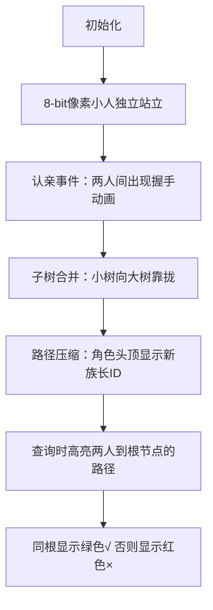

# 题目信息

# 亲戚

## 题目背景

若某个家族人员过于庞大，要判断两个是否是亲戚，确实还很不容易，现在给出某个亲戚关系图，求任意给出的两个人是否具有亲戚关系。


## 题目描述

规定：$x$ 和 $y$ 是亲戚，$y$ 和 $z$ 是亲戚，那么 $x$ 和 $z$ 也是亲戚。如果 $x$，$y$ 是亲戚，那么 $x$ 的亲戚都是 $y$ 的亲戚，$y$ 的亲戚也都是 $x$ 的亲戚。

## 样例 #1

### 输入

```
6 5 3
1 2
1 5
3 4
5 2
1 3
1 4
2 3
5 6```

### 输出

```
Yes
Yes
No```

# AI分析结果


### 💡 Kay的C++算法解析：亲戚 深入学习指南 💡

**引言**  
今天我们一起分析「亲戚」这道并查集经典题。本指南将帮你掌握集合合并与查询的核心思想，通过生动比喻和像素动画直观理解算法运作。  

---

## 1. 题目解读与核心算法识别

✨ **本题主要考察**：`并查集` (Union-Find)  

🗣️ **初步分析**：  
> 解决亲戚关系问题就像组建家族树——每个人初始是独立个体（单元素集合），通过认亲操作合并成大家族（集合合并）。关键在于用**树结构**高效管理家族关系：  
> - **核心思想**：用树根代表整个家族，判断两人是否亲戚只需比较他们的"族长"是否相同  
> - **可视化设计**：  
>   - 像素动画将展示家族树生长过程：初始每人独立→认亲时子树连接→查询时高亮两人到根节点的路径  
>   - 复古游戏元素：合并时播放"家族扩张"音效，成功查询时显示"YES/NO"像素弹窗  
>   - 关键变量`f[i]`（族长标记）实时显示在角色头顶，路径压缩时展示"寻根捷径"动画  

---

## 2. 精选优质题解参考

**题解一（作者：mysssss）**  
* **亮点**：  
  - 用"找大佬/族长"比喻生动解释路径压缩  
  - 代码高度规范：`fd()`函数命名清晰，注释详细解释递归过程  
  - 实践价值高：完整处理输入输出，边界条件严谨  

**题解二（作者：Null_Cat）**  
* **亮点**：  
  - 图文结合展示集合合并过程（树→森林示意图）  
  - 深入分析最坏情况（退化成链）及路径压缩必要性  
  - 代码简洁高效：非递归实现避免栈溢出风险  

**题解三（作者：TYX180129）**  
* **亮点**：  
  - 双实现对比：同时提供递归/非递归路径压缩代码  
  - "族长制"变量命名(`zuxian()`)提升可读性  
  - 精简实现（仅20行核心逻辑）适合竞赛参考  

---

## 3. 核心难点辨析与解题策略

1. **难点：集合的高效合并**  
   - **分析**：直接合并可能导致树退化成链（查询变慢）。优质题解采用**路径压缩**：查询时将节点直接挂到根节点下，使树保持扁平  
   - 💡 **学习笔记**：路径压缩 = 给家族成员发"族长直通卡"  

2. **难点：集合关系的动态维护**  
   - **分析**：合并时需确保两棵树深度接近。按秩合并（记录树高）可进一步优化，但路径压缩已足够解决本题  
   - 💡 **学习笔记**：并查集像动态更新的家族谱——新关系随时重构结构  

3. **难点：查询的语义转化**  
   - **分析**：将"是否亲戚"转化为"是否同根"。需注意初始化时每人自成集合（`f[i]=i`）  
   - 💡 **学习笔记**：问题转化是算法核心——亲戚判定→集合归属判定  

### ✨ 解题技巧总结  
- **技巧1 路径压缩**：递归查询时顺便更新父节点指向根  
- **技巧2 按序合并**：小树挂到大树下（进阶优化）  
- **技巧3 变量语义化**：用`find_root()`替代`f[i]`提升可读性  
- **技巧4 边界处理**：始终检查`i`的合法范围（1≤i≤n）  

---

## 4. C++核心代码实现赏析

**本题通用核心实现**  
```cpp
#include <iostream>
using namespace std;

const int MAXN = 5005;
int f[MAXN]; // f[i]表示i的族长

// 路径压缩版寻根
int find(int x) {
    return f[x] == x ? x : f[x] = find(f[x]);
}

int main() {
    int n, m, p;
    cin >> n >> m >> p;

    // 初始化：每人自成家族
    for (int i = 1; i <= n; i++) f[i] = i;

    // 建立亲戚关系
    while (m--) {
        int a, b;
        cin >> a >> b;
        f[find(a)] = find(b); // 合并家族
    }

    // 查询关系
    while (p--) {
        int x, y;
        cin >> x >> y;
        cout << (find(x) == find(y) ? "Yes" : "No") << endl;
    }
    return 0;
}
```
**代码解读概要**：  
1. **初始化**：每人初始为独立家族（`f[i]=i`）  
2. **关系建立**：通过`find(a)=find(b)`合并两个家族  
3. **路径压缩**：查询时自动优化树结构（`f[x]=find(f[x])`）  
4. **查询输出**：直接比较根节点判断亲戚关系  

---

## 5. 算法可视化：像素动画演示

**主题**：«像素家族物语»——复古RPG风格的并查集模拟  

**核心演示流程**：  


**交互设计**：  
1. **控制面板**：  
   - 步进控制：← → 键单步执行  
   - 速度滑块：调整动画速度  
   - 模式切换：手动/自动演示（AI自动合并家族）  
2. **音效方案**：  
   - 合并成功：FC游戏"获得道具"音效  
   - 路径压缩："嗖"的快速移动声  
   - 查询结果：正确→胜利音阶，错误→低沉提示音  
3. **动态数据展示**：  
   - 角色头顶实时显示`f[i]`值  
   - 当前操作对应代码行高亮显示  
   - 家族树用彩色连线动态生长  

---

## 6. 拓展练习与相似问题思考

**通用技巧迁移**：  
1. **网络连接检测**（如判断服务器是否互通）  
2. **图连通分量计算**  
3. **最小生成树Kruskal算法**（边的排序与合并）  

**洛谷推荐题目**：  
1. **P3367 【模板】并查集**  
   → 巩固基础操作与路径压缩实现  
2. **P1197 [JSOI2008] 星球大战**  
   → 逆向思维练习：从删边到加边的并查集应用  
3. **P2024 [NOI2001] 食物链**  
   → 拓展到带权并查集，处理复杂关系  

---

## 7. 学习心得与经验分享

**来自题解的经验**：  
> "调试时重点检查初始化——忘记`f[i]=i`会导致全部误判为亲戚" —— AcRapper  

**Kay的总结**：  
- 调试技巧：在合并/查询后打印`f[]`数组状态  
- 易错点：路径压缩非递归实现需用`while`替代递归防栈溢出  
- 核心口诀：**初始化→合并→查询**三步走，路径压缩效率优  

---

**结语**  
掌握并查集就像获得管理大家族的超能力！记住：好的算法能让计算机像处理家族事务般高效组织数据。下次我们继续探索算法的奇妙世界！💪

---
处理用时：83.99秒