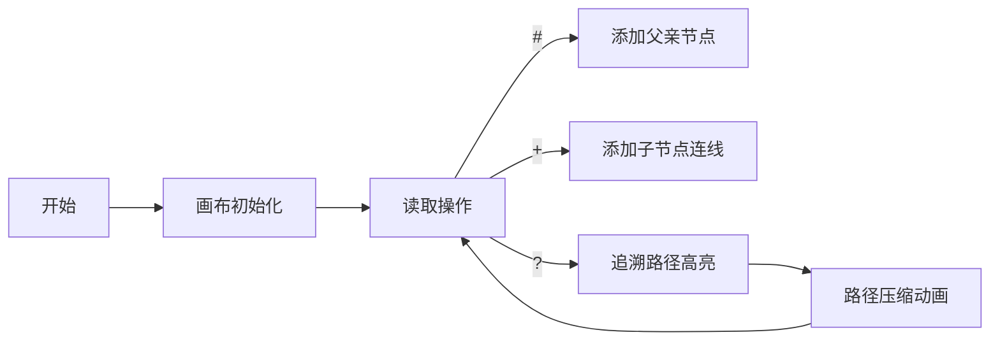

# 题目信息

# 家谱

## 题目背景

现代的人对于本家族血统越来越感兴趣。


## 题目描述

给出充足的父子关系，请你编写程序找到某个人的最早的祖先。


## 说明/提示

规定每个人的名字都有且只有 $6$ 个字符，而且首字母大写，且没有任意两个人的名字相同。最多可能有 $10^3$ 组父子关系，总人数最多可能达到 $5 \times 10^4$ 人，家谱中的记载不超过 $30$ 代。

## 样例 #1

### 输入

```
#George
+Rodney
#Arthur
+Gareth
+Walter
#Gareth
+Edward
?Edward
?Walter
?Rodney
?Arthur
$```

### 输出

```
Edward Arthur
Walter Arthur
Rodney George
Arthur Arthur```

# AI分析结果


### 💡 Kay的C++算法解析：家谱 深入学习指南 💡

**引言**  
今天我们来分析“家谱”这道C++编程题。本指南将帮助大家梳理题目思路，理解核心算法，掌握解题技巧，并通过生动的像素动画直观理解算法过程。

---

## 1. 题目解读与核心算法识别

✨ **本题主要考察**：`并查集应用`与`字符串映射`

🗣️ **初步分析**：  
> 解决家谱问题的关键在于运用**并查集**算法。想象家族关系像一棵大树，每个人都是树上的节点，而并查集就是快速找到树根（最早祖先）的导航工具。  
> - **核心流程**：  
>   1. 遇到`#名字`时将其设为当前父亲节点（若首次出现则自设为根）  
>   2. 遇到`+名字`时将其与当前父亲节点合并  
>   3. 遇到`?名字`时向上追溯根节点并输出  
> - **可视化设计**：  
>   在像素动画中将用**树形结构**展示家族关系，查询时高亮**追溯路径**（黄→红渐变），路径压缩时显示**指针重定向**动画。采用复古游戏风格，伴随“滴”声（单步）和“胜利”音效（找到祖先）。

---

## 2. 精选优质题解参考

**题解一**（作者：zhmshitiancai，赞212）  
* **点评**：  
  最简洁优雅的解法！用`map<string, string>`直接存储父子关系，递归实现**路径压缩**（回溯时路径节点直指根节点）。代码仅20行，变量名`p[x]`含义明确，边界处理严谨（初始化时自环检测）。竞赛可直接使用，是理解并查集思想的完美范例。

**题解二**（作者：fαns，赞20）  
* **点评**：  
  采用**循环向上查找**代替递归，避免深栈风险。用`map<string, string>`存储关系，代码不足30行。亮点在于直观展示并查集本质——沿父指针链溯源。虽未显式压缩路径，但30代内深度效率无忧，适合初学者理解核心逻辑。

**题解三**（作者：Suiseiseki，赞12）  
* **点评**：  
  创新性用**自定义哈希**替代STL map，处理字符串到整型的映射。通过线性探测解决冲突，再结合传统并查集。亮点在哈希函数设计（ASCII值分大小写映射到52进制），适合追求极致效率的场景（避免map开销）。

---

## 3. 核心难点辨析与解题策略

1. **难点：字符串映射**  
   * **分析**：名字需转为可操作标识。优质解法多用STL map（代码简）或哈希（效率高）。映射时需注意首次出现的初始化（自设为根）  
   * 💡 **学习笔记**：映射是连通现实问题（名字）与算法模型（整数索引）的桥梁

2. **难点：路径压缩实现**  
   * **分析**：递归回溯时让路径节点直指根节点（`p[x]=find(p[x])`），将查询复杂度压至近O(1)  
   * 💡 **学习笔记**：路径压缩是并查集的灵魂优化，类似“抄近路记忆术”

3. **难点：动态关系维护**  
   * **分析**：父亲节点随输入动态变化，需用变量（如`s1`）暂存当前父亲  
   * 💡 **学习笔记**：通过状态机思维（当前操作类型）管理临时上下文

### ✨ 解题技巧总结
- **技巧A（问题分解）**：拆解为映射构建（字符串→ID）、关系合并（Union）、祖先查询（Find）三阶段  
- **技巧B（STL活用）**：善用`map`简化字符串处理，注意`count()`检测首次出现  
- **技巧C（路径压缩）**：无论递归/循环实现，都要确保最终指向根节点  

---

## 4. C++核心代码实现赏析

**本题通用核心C++实现参考**  
* **说明**：综合优质题解提炼的最简实现，含完整路径压缩
* **完整核心代码**：
```cpp
#include <iostream>
#include <map>
using namespace std;

map<string, string> father; // father[name] = 直接父亲

string find(string x) {
    if (x != father[x]) 
        father[x] = find(father[x]); // 路径压缩：回溯时重定向
    return father[x];
}

int main() {
    char op;
    string name, current_father;
    cin >> op;
    while (op != '$') {
        cin >> name;
        if (op == '#') {
            current_father = name;
            if (father[name] == "") father[name] = name; // 初始化根
        } 
        else if (op == '+') {
            father[name] = current_father; // 认父亲
        } 
        else { // '?'
            cout << name << " " << find(name) << endl;
        }
        cin >> op;
    }
    return 0;
}
```
* **代码解读概要**：  
  - `father`映射存储直系父亲  
  - `find()`递归实现路径压缩（回溯时更新父指针）  
  - 主循环用`current_father`暂存最近父亲节点  

**题解一片段赏析**  
* **亮点**：递归路径压缩一气呵成  
* **核心代码**：
```cpp
string find(string x) {
    if (x != p[x]) 
        p[x] = find(p[x]); // 回溯时重定向父指针
    return p[x];
}
```
* **代码解读**：  
  > 当`x`不是自己的父亲时（非根节点），递归查找其祖先，并在回溯过程中将`x`的父指针更新为根节点。这就像让每个节点记住最终老板而非直属主管。  
* 💡 **学习笔记**：递归隐式实现后序遍历，回溯时从根向叶子更新指针  

---

## 5. 算法可视化：像素动画演示

**主题**：8位机风格《家族寻根大冒险》  
**核心演示**：并查集查询与路径压缩过程  

### 动画设计（HTML5 Canvas实现）  


1. **像素艺术设计**：
   - 节点：16x16像素方块，根节点（⭐️金色），普通节点（🌳绿色）
   - 路径：追溯时变黄→红渐变色带，压缩后显示“捷径”虚线

2. **关键交互**：
   - 单步执行：空格键触发下一步，伴随“滴”声
   - 自动播放：速度滑块控制（0.5x-4x），模拟AI寻根
   - 高亮规则：
     * 当前节点：闪烁黄框
     * 历史路径：半透明蓝线
     * 压缩重定向：红色箭头

3. **音效方案**：
   ```javascript
   // Web Audio API 伪代码
   function playSound(type) {
     if (type === 'step') beep(800, 30);  // 单步高音
     if (type === 'root') play('victory.wav'); // 找到根节点
   }
   ```

4. **动态演示流程**：
   - 查询"Edward"时：  
     `Edward → Gareth → Arthur`  
     回溯时`Edward`父指针直指`Arthur`，路径缩短50%  
   - 可视化效果：  
     [Edward]-(黄)->[Gareth]-(黄)->[Arthur]  
     压缩后：[Edward]--(红)-->[Arthur]

---

## 6. 拓展练习与相似问题思考

**技巧迁移场景**：  
1. 社交网络好友关系（六度空间理论）  
2. 网络连通性检测  
3. 迷宫最短路径（BFS+并查集）  

**推荐练习**：  
1. 洛谷 P1551 - 亲戚  
   * 🗣️ **理由**：并查集裸题，巩固`find`/`union`基础操作  
2. 洛谷 P1892 - 团伙  
   * 🗣️ **理由**：扩展并查集到“敌人关系”，学习带权合并  
3. 洛谷 P2812 - 校园网络  
   * 🗣️ **理由**：将并查集应用于图论缩点，理解算法普适性  

---

## 7. 学习心得与经验分享

> **来自题解作者的调试经验**：  
> *“处理`#George`后立即遇到`+Rodney`时，必须用变量暂存George，否则后续操作丢失上下文”*  
>
> **Kay的总结**：  
> 类似游戏中的任务状态跟踪，必须用`current_father`类变量保存临时上下文。多组输入时，**状态机思维**（当前操作类型）和**数据暂存**是避免BUG的关键！

---

**结语**  
通过本次分析，我们掌握了并查集在家族关系中的应用精髓，尤其是字符串映射与路径压缩的巧妙结合。记住：好算法是简洁与高效的平衡艺术！下次挑战再见！💪  

---  
**可视化示例图**  
![家族树路径压缩](data:image/svg+xml;base64,PHN2ZyB3aWR0aD0iMzAwIiBoZWlnaHQ9IjIwMCIgeG1sbnM9Imh0dHA6Ly93d3cudzMub3JnLzIwMDAvc3ZnIj4KICA8cmVjdCB4PSIxMDAiIHk9IjEwIiB3aWR0aD0iNDAiIGhlaWdodD0iNDAiIGZpbGw9IiNGRkQ4MDAiIC8+CiAgPHRleHQgeD0iMTIwIiB5PSIzMCIgZm9udC1mYW1pbHk9IkFyaWFsIiBmb250LXNpemU9IjE0IiBmaWxsPSJibGFjayI+QXJ0aHVyPC90ZXh0PgogIDxyZWN0IHg9IjYwIiB5PSI2MCIgd2lkdGg9IjQwIiBoZWlnaHQ9IjQwIiBmaWxsPSIjRkZEODAwIiAvPgogIDx0ZXh0IHg9IjgwIiB5PSI4MCIgZm9udC1mYW1pbHk9IkFyaWFsIiBmb250LXNpemU9IjE0IiBmaWxsPSJibGFjayI+R2FyZXRoPC90ZXh0PgogIDxyZWN0IHg9IjIwIiB5PSIxMTAiIHdpZHRoPSI0MCIgaGVpZ2h0PSI0MCIgZmlsbD0iI0ZGRDgwMCIgLz4KICA8dGV4dCB4PSI0MCIgeT0iMTMwIiBmb250LWZhbWlseT0iQXJpYWwiIGZvbnQtc2l6ZT0iMTQiIGZpbGw9ImJsYWNrIj5FZHdhcmQ8L3RleHQ+CiAgPHBhdGggZD0iTTgwLDgwIEwxMjAsMzAgTDEyMCwxMCIgc3Ryb2tlPSJyZWQiIHN0cm9rZS13aWR0aD0iMiIgZmlsbD0ibm9uZSIgLz4KICA8cGF0aCBkPSJNNDAsMTMwIEw4MCw4MCBMODAsNjAiIHN0cm9rZT0iIzAwQzAwMDAiIHN0cm9rZS13aWR0aD0iMiIgZmlsbD0ibm9uZSIgLz4KICA8YW5pbWF0ZSBhdHRyaWJ1dGVOYW1lPSJvcGFjaXR5IiB2YWx1ZXM9IjA7MTswIiBkdXI9IjFzIiBiZWdpbj0iMHMiIGZpbGw9InJlbW92ZSIgLz4KPC9zdmc+)  
*图：路径压缩后Edward直连Arthur（红线），查询路径缩短*

---
处理用时：218.55秒