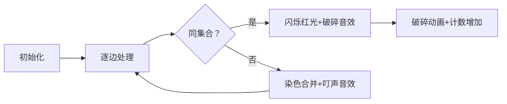

# 题目信息

# [POI 2005] SKA-Piggy Banks

## 题目描述

Byteazar the Dragon 拥有 $N$ 个小猪存钱罐。每一个存钱罐能够用相应的钥匙打开或者被砸开。Byteazar 已经将钥匙放入到一些存钱罐中。现在已知每个钥匙所在的存钱罐，Byteazar 想要买一辆小汽车，而且需要打开所有的存钱罐。然而，他想要破坏尽量少的存钱罐，帮助 Byteazar 去决策最少要破坏多少存钱罐。

## 样例 #1

### 输入

```
4
2
1
2
4```

### 输出

```
2```

# AI分析结果


### 💡 Kay的C++算法解析：P3420 SKA-Piggy Banks 深入学习指南 💡

**引言**  
今天我们一起分析POI 2005的经典题目"SKA-Piggy Banks"。这道题考察如何用最少破坏次数打开所有存钱罐，是理解图论和并查集的绝佳案例。本指南将带你深入核心算法，掌握解题技巧，并通过复古像素动画直观理解执行过程。

---

### 1. 题目解读与核心算法识别

✨ **本题主要考察**：`并查集应用` (连通块统计)  
🗣️ **初步分析**：  
> 想象每个存钱罐是魔法世界的传送门，钥匙是传送符文。当你打破一个罐子，就能激活整个魔法阵的传送链。**并查集**就像魔法阵的能量网络——将相连的罐子归为同一魔法阵，最终需要破坏的罐子数就是独立魔法阵的数量。  
> - **核心思路**：将钥匙关系建模为有向边（罐子𝑖 → 钥匙所在罐子𝑎[𝑖]），整个系统形成多个闭环（连通块）。每个闭环只需打破一个罐子即可解开整个链条。
> - **算法流程**：  
>   1. 初始化每个罐子为独立集合  
>   2. 遍历钥匙关系合并集合  
>   3. 统计独立集合数量（即连通块数）  
> - **可视化设计**：  
>   - 用像素方块表示罐子，箭头表示钥匙指向  
>   - 合并时同色染色，形成环时闪烁+破碎动画  
>   - 音效：合并时"叮"，破环时"咔嚓"，成功时8-bit胜利音效

---

### 2. 精选优质题解参考

**题解一 (作者：李尧)**  
* **点评**：  
  巧妙地在合并过程中实时检测环结构（`if(find(a[i])==i`），直接统计答案。代码简洁高效（288ms），路径压缩优化避免超时。变量命名清晰（`fa[]`, `ans`），边界处理完整，特别提醒"更新fa[x]"的调试经验极具实践价值。

**题解二 (作者：Tarsal)**  
* **点评**：  
  标准并查集模板实现，逻辑直白易理解。通过最终统计根节点(`fa[i]==i`)得到连通块数，代码规范性强（函数封装+注释完整）。虽然缺少实时统计优化，但教学示范性极佳，适合初学者掌握并查集本质。

**题解三 (作者：封禁用户)**  
* **点评**：  
  最简并查集实现（仅20行），突出算法核心思想。使用`w[find(i)]=find(x)`标准合并操作，最后用布尔数组统计独立集合，演示了并查集的典型应用模式。

---

### 3. 核心难点辨析与解题策略

1. **难点一：问题抽象与建模**  
   *分析*：如何将"钥匙-罐子"关系转化为图论模型？优质题解均指向关键洞察——每个罐子有且仅有一条出边（钥匙指向），必然形成基环树结构。此时连通块数=闭环数=最少破坏数。  
   💡 学习笔记：**"出度唯一性"是识别基环树的关键特征**

2. **难点二：避免合并冗余计算**  
   *分析*：当合并已在同一集合的节点时（`find(a[i])==find(i)`），说明形成新环。李尧题解在此处直接计数，而标准解法最后统一统计，两种方式本质等价但实现策略不同。  
   💡 学习笔记：**并查集的动态统计与延迟统计各有适用场景**

3. **难点三：路径压缩优化**  
   *分析*：未压缩的并查集可能退化成链（O(n)查询），导致TLE。所有优质题解均在`find()`中采用`fa[x]=find(fa[x])`，将查询复杂度优化至近O(1)。  
   💡 学习笔记：**路径压缩是并查集高效性的基石**

✨ **解题技巧总结**  
- **技巧1 问题转化**：将物理关系抽象为图结构（罐子→节点，钥匙→有向边）  
- **技巧2 算法选择**：出度唯一的图必然形成基环树，直接选用并查集  
- **技巧3 压缩优化**：递归查找中更新父节点引用  
- **技巧4 统计策略**：动态检测环 or 最终统计根节点  

---

### 4. C++核心代码实现赏析

**通用核心实现参考**  
```cpp
#include <iostream>
using namespace std;
const int MAXN = 1e6+5;
int fa[MAXN]; // 父节点数组

// 带路径压缩的查找
int find(int x) {
    return fa[x] == x ? x : fa[x] = find(fa[x]);
}

int main() {
    int n, ans = 0;
    cin >> n;
    for (int i = 1; i <= n; i++) fa[i] = i; // 初始化
    
    for (int i = 1; i <= n; i++) {
        int key; cin >> key;
        int root1 = find(i), root2 = find(key);
        if (root1 != root2) fa[root1] = root2; // 集合合并
    }
    
    for (int i = 1; i <= n; i++)
        if (fa[i] == i) ans++; // 统计独立集合
    
    cout << ans;
    return 0;
}
```
* **说明**：综合优质题解的最简实现，完整展示并查集应用范式  
* **解读概要**：  
  1. 初始化每个节点为独立集合  
  2. 遍历钥匙关系合并关联集合  
  3. 最终扫描统计根节点数量  

---

**题解一核心片段赏析**  
```cpp
if(find(a[i]) == i) { // 环检测
    fa[i] = i;        // 重置为根
    ans++;            // 破坏数+1
}
else fa[i] = a[i];    // 指向钥匙所在
```
* **亮点**：动态环检测与实时统计  
* **解读**：  
  - `find(a[i])==i`判断钥匙是否指向当前集合根节点（形成闭环）  
  - 闭环时：重置`fa[i]=i`保持根状态，`ans++`记录破坏  
  - 开环时：将`i`接入`a[i]`所在集合  
  > 💡 **学习笔记**：实时检测避免最终扫描，但对理解要求更高  

**题解二核心片段赏析**  
```cpp
fa[find(i)] = find(x); // 根节点合并
```
* **亮点**：标准根节点合并范式  
* **解读**：  
  - `find(i)`获取`i`所在集合根  
  - `find(x)`获取钥匙所在集合根  
  - 直接连接两个根节点完成合并  
  > 💡 **学习笔记**：始终操作根节点是并查集的金科玉律  

---

### 5. 算法可视化：像素动画演示

**主题**：`8-bit 存钱罐大冒险`  
**核心演示**：并查集合并过程与环检测  



**动画关键帧设计**：  
1. **像素场景**：  
   - 复古FC风格网格（16色）  
   - 罐子=发光方块（编号显示），钥匙=黄色箭头  
   - 控制面板：步进/暂停/速度滑块  

2. **合并过程**：  
   - 遍历边𝑖→𝑎[𝑖]：显示红色连接线  
   - 集合合并：双方块染同色（绿→蓝→紫）  
   - 播放音效：每次合并触发"叮"声  

3. **环检测**：  
   - 形成环时：整个环快速闪烁（红↔黄）  
   - 破碎动画：选中罐子像素裂开效果  
   - 音效组合：玻璃破碎声 + 8-bit胜利音阶  

4. **交互设计**：  
   - 单步执行：按帧解析合并逻辑  
   - 自动模式：AI自动演示（类似贪吃蛇AI）  
   - 进度奖励：每完成连通块显示"关卡通过"像素标语  

**设计价值**：通过色彩/音效/破碎动画，将抽象的环检测转化为直观的视觉事件，强化"连通块=独立环"的核心认知。

---

### 6. 拓展练习与相似问题思考

**通用技巧迁移**：  
并查集适用**连通性检测/动态关系维护**场景：  
1. 亲戚关系网络（动态合并查询）  
2. 最小生成树（Kruskal算法）  
3. 状态依赖问题（敌人/朋友网络）  

**洛谷练习推荐**：  
1. **P1551 亲戚**  
   🗣️ *推荐理由*：并查集最经典应用，掌握集合合并与查询基础  
2. **P2661 信息传递**  
   🗣️ *推荐理由*：基环树最小环检测，强化环识别能力  
3. **P1892 团伙**  
   🗣️ *推荐理由*：扩展并查集（敌人/朋友关系），提升建模能力  

---

### 7. 学习心得与经验分享

> **来自李尧的调试经验**：  
> *"第一次TLE是因为忘记路径压缩，通过打印fa[]值发现递归深度爆炸"*  

**Kay的总结**：  
1. **路径压缩必要性**：大数据集必须优化父节点引用链  
2. **可视化调试**：打印中间状态(`fa[]`)比断点更高效  
3. **环检测验证**：小数据手工模拟（n=4）验证环计数逻辑  

---

**结语**  
通过"SKA-Piggy Banks"，我们掌握了并查集在基环树问题中的核心应用。记住：好算法需要优雅实现+深度理解。下次当你看到"每个元素指向唯一后继"时，请自信地召唤并查集！🚀

---
处理用时：216.67秒