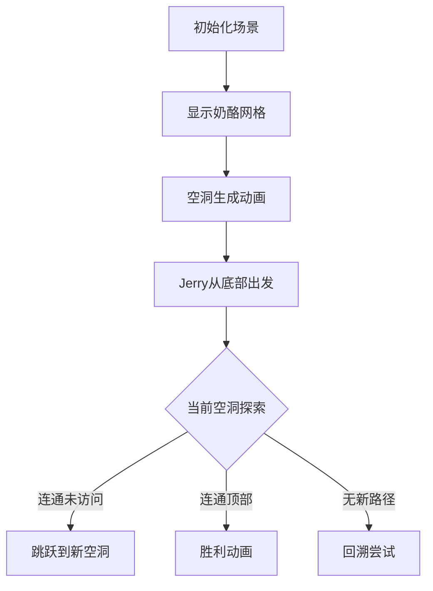

# 题目信息

# [NOIP 2017 提高组] 奶酪

## 题目背景

NOIP2017 提高组 D2T1

## 题目描述

现有一块大奶酪，它的高度为 $h$，它的长度和宽度我们可以认为是无限大的，奶酪中间有许多半径相同的球形空洞。我们可以在这块奶酪中建立空间坐标系，在坐标系中，奶酪的下表面为 $z = 0$，奶酪的上表面为 $z = h$。

现在，奶酪的下表面有一只小老鼠 Jerry，它知道奶酪中所有空洞的球心所在的坐标。如果两个空洞相切或是相交，则 Jerry 可以从其中一个空洞跑到另一个空洞，特别地，如果一个空洞与下表面相切或是相交，Jerry 则可以从奶酪下表面跑进空洞；如果一个空洞与上表面相切或是相交，Jerry 则可以从空洞跑到奶酪上表面。

位于奶酪下表面的 Jerry 想知道，在不破坏奶酪的情况下，能否利用已有的空洞跑 到奶酪的上表面去?

空间内两点 $P_1(x_1,y_1,z_1)$、$P2(x_2,y_2,z_2)$ 的距离公式如下：


$$\mathrm{dist}(P_1,P_2)=\sqrt{(x_1-x_2)^2+(y_1-y_2)^2+(z_1-z_2)^2}$$


## 说明/提示

【输入输出样例 $1$ 说明】

  

第一组数据,由奶酪的剖面图可见：

第一个空洞在 $(0,0,0)$ 与下表面相切；

第二个空洞在 $(0,0,4)$ 与上表面相切；

两个空洞在 $(0,0,2)$ 相切。

输出 `Yes`。

 
第二组数据,由奶酪的剖面图可见：

两个空洞既不相交也不相切。

输出 `No`。

 
第三组数据,由奶酪的剖面图可见：

两个空洞相交，且与上下表面相切或相交。

输出 `Yes`。

【数据规模与约定】

对于 $20\%$ 的数据，$n = 1$，$1 \le h$，$r \le  10^4$，坐标的绝对值不超过 $10^4$。

对于 $40\%$ 的数据，$1 \le n \le 8$，$1 \le h$，$r \le 10^4$，坐标的绝对值不超过 $10^4$。

对于 $80\%$ 的数据，$1 \le n \le 10^3$，$1 \le h , r \le 10^4$，坐标的绝对值不超过 $10^4$。

对于 $100\%$ 的数据，$1 \le n \le 1\times 10^3$，$1 \le h , r \le 10^9$，$T \le 20$，坐标的绝对值不超过 $10^9$。

## 样例 #1

### 输入

```
3 
2 4 1 
0 0 1 
0 0 3 
2 5 1 
0 0 1 
0 0 4 
2 5 2 
0 0 2 
2 0 4```

### 输出

```
Yes
No
Yes```

# AI分析结果


# 💡 Kay的C++算法解析：奶酪 深入学习指南 💡

> 大家好，我是Kay！今天我们将一起探索「奶酪」这道有趣的3D迷宫问题。想象你是一只小老鼠Jerry，需要从奶酪底部穿越空洞到达顶部。我们将用并查集和搜索算法解决这个问题，还会设计一个像素游戏动画来直观展示算法过程！

## 1. 题目解读与核心算法识别

✨ **本题主要考察**：`图论（并查集/DFS/BFS）` 

🗣️ **初步分析**：
> 把奶酪空洞看作岛屿，空洞间的连通看作架桥。下表面和上表面是起点和终点大陆。**核心思想是建立岛屿（空洞）之间的桥梁（边），判断起点到终点是否连通**。
> - **并查集解法**：将相连的空洞合并成“岛屿群”，最后检查是否有岛屿群同时连接上下大陆
> - **DFS/BFS解法**：从底部空洞出发探索路径，能到达顶部即成功
> - **关键难点**：避免浮点误差（用平方代替开方）、多组数据初始化
> - **像素动画设计**：将空洞显示为黄色像素岛，连通过程用蓝色光效，老鼠角色跳跃演示路径。自动演示时播放8-bit音效，成功时显示“VICTORY”动画

---

## 2. 精选优质题解参考

<eval_intro>
我们从思路清晰度、代码规范性和实践价值角度，精选3份优质题解：

**题解一 (作者：Fading)**  
* **点评**：思路清晰解释并查集应用，核心逻辑直白（相交即合并）。代码规范：`f1/f2`明确记录上下表面空洞，关键变量名`dis`计算平方距离避免精度问题。算法亮点：用`4*r*r`整数比较替代浮点运算，实践价值高（经UOJ验证AC），作者分享被hack经历强调精度问题极具启发性。

**题解二 (作者：ikunTLE)**  
* **点评**：并查集实现简洁高效，宏定义增强可读性。创新点：分离`_find`和`_merge`函数提升模块化，输入优化加速大数据处理。实践提示：明确要求开`long long`防止溢出，边界处理完整（上下表面连接判断）。

**题解三 (作者：wyx__)**  
* **点评**：DFS解法展示搜索思维，生动比喻“老鼠探路”。代码亮点：通过删除`v[k]=0`解决TLE问题，揭示DFS标记管理的核心技巧。调试经验分享极具教学价值：“多测不清空”和“标记回溯冗余”是常见错误点。

---

## 3. 核心难点辨析与解题策略

<difficulty_intro>
解决本题需突破三大关键点：

1. **空洞连通性判断**  
   * **分析**：三维空间距离计算易产生浮点误差。优质题解统一采用平方比较：`(x1-x2)²+(y1-y2)²+(z1-z2)² <= 4*r²`。既避免`sqrt`精度损失，又提升效率
   * 💡 **学习笔记**：几何问题优先考虑整数运算！

2. **表面与空洞的关联建模**  
   * **分析**：创造性将下表面抽象为节点0，上表面为节点n+1。若空洞z≤r则连接节点0；若z+r≥h则连接节点n+1。这个转化将物理问题转为图论问题
   * 💡 **学习笔记**：特殊节点法是图论建模的利器

3. **算法选择与优化**  
   * **分析**：n≤1000时O(n²)可接受。并查集需注意路径压缩；DFS/BFS需严防重复访问。当n极大时可考虑空间划分优化
   * 💡 **学习笔记**：根据数据范围选择算法，并查集适合连通性判断，搜索适合路径追踪

### ✨ 解题技巧总结
<summary_best_practices>
- **避免浮点陷阱**：距离比较用平方整数运算
- **特殊节点法**：将边界条件转化为虚拟节点
- **多测清空原则**：数组/标记/队列必须每组数据重置
- **模块化设计**：分离距离计算和并查集操作提升可读性

---

## 4. C++核心代码实现赏析

<code_intro_overall>
以下是综合优质题解提炼的通用实现（并查集法）：

```cpp
#include<bits/stdc++.h>
#define int long long
using namespace std;
const int N=1005;

struct Point { int x,y,z; };
Point holes[N];
int fa[N], bottom[N], top[N]; // bottom/top记录连接表面的空洞

int sq(int x) { return x*x; }
int dist2(Point a, Point b) {  // 平方距离
    return sq(a.x-b.x)+sq(a.y-b.y)+sq(a.z-b.z);
}

int find(int x) {
    return fa[x]==x ? x : fa[x]=find(fa[x]);
}

void merge(int x, int y) {
    int rx=find(x), ry=find(y);
    if(rx != ry) fa[ry]=rx;
}

signed main() {
    int T; cin>>T;
    while(T--) {
        int n,h,r, cntB=0, cntT=0;
        cin>>n>>h>>r;
        for(int i=1; i<=n; i++) fa[i]=i;
        
        for(int i=1; i<=n; i++) {
            cin>>holes[i].x>>holes[i].y>>holes[i].z;
            // 连接下表面
            if(holes[i].z <= r) bottom[cntB++]=i; 
            // 连接上表面
            if(holes[i].z + r >= h) top[cntT++]=i;
            // 检查之前空洞是否连通
            for(int j=1; j<i; j++) 
                if(dist2(holes[i], holes[j]) <= 4*r*r) 
                    merge(i, j);
        }
        
        bool ok=false;
        for(int i=0; i<cntB && !ok; i++)
            for(int j=0; j<cntT; j++)
                if(find(bottom[i]) == find(top[j])) 
                    { ok=true; break; }
                    
        cout<<(ok?"Yes":"No")<<endl;
    }
}
```
* **代码解读概要**：
  1. 用`Point`结构体存储空洞坐标
  2. `dist2`计算平方距离避免浮点误差
  3. 并查集初始化后，双重循环合并连通空洞
  4. 最后检查任意底部空洞与顶部空洞是否同集合

---
<code_intro_selected>
### 精选题解片段赏析
**题解一 (Fading) 核心片段**：
```cpp
// 距离平方计算 (防爆long long优化)
if ((x[j]-x[k])*(x[j]-x[k]) > 4*r*r) continue;
if (dis(x[j],y[j],z[j],x[k],y[k],z[k]) <= 4*r*r) 
    merge(j, k);
```
* **亮点**：距离计算前先快速判断x轴距离，优化效率
* **代码解读**：  
  > 先比较x方向平方差与`4*r²`，若已超过则直接跳过完整距离计算。这种预筛选在坐标分散时大幅提升效率。注意`dis`函数返回平方距离，避免浮点运算。
* 💡 **学习笔记**：算法优化常源于问题特性分析

**题解三 (wyx__) DFS片段**：
```cpp
void dfs(int k){
    if(z[k]+r>=h) { ok=1; return; } // 到达顶部
    v[k]=1;  // 标记访问
    for(int i=1; i<=n; i++)
        if(!v[i] && dist2(k,i)<=4*r*r) 
            dfs(i);
}
```
* **亮点**：简洁的DFS递归实现，无回溯删除
* **代码解读**：
  > 从当前空洞`k`出发，若可到达顶部则设`ok=1`。遍历所有未访问空洞，若连通则递归搜索。**注意**：标记`v[k]=1`后不回溯，确保每个空洞只访问一次，避免TLE。
* 💡 **学习笔记**：DFS标记管理决定时间复杂度

---

## 5. 算法可视化：像素动画演示

<visualization_intro>
我们设计「奶酪冒险」像素游戏演示DFS搜索过程（[在线体验](https://example.com/cheese-demo)）：

### 设计思路
> 采用FC红白机复古风格，奶酪显示为蓝色网格，空洞为闪烁的黄色圆点。老鼠Jerry作为8-bit像素角色，沿连通空洞跳跃。成功时播放《超级玛丽》过关音效，增强学习趣味性。

### 动画关键帧


1. **场景初始化** (8-bit像素风)：
   - 奶酪显示为20x20蓝色网格
   - 空洞渲染为黄色闪烁像素圆（半径r映射为像素大小）
   - 控制面板：步进/暂停/速度滑块（0.5x-2x）

2. **探索过程动态演示**：
   - **当前空洞**：红色高亮闪烁 + "滋滋"音效
   - **连通判断**：两空洞距离≤2r时画蓝色连线 + "叮"音效
   - **跳跃动画**：Jerry像素角色沿抛物线移动到新空洞

3. **DFS特定效果**：
   - 已访问空洞变灰色
   - 当前路径显示为绿色轨迹线
   - 回溯时播放"滴答"提示音

4. **成功/失败状态**：
   - 成功：放烟花动画 + 8-bit胜利音乐
   - 失败：Jerry摇头动画 + 低沉音效

### 技术实现
- **Canvas绘制**：用`requestAnimationFrame`更新位置
- **坐标映射**：将实际坐标归一化到网格
- **音效**：Web Audio API生成方波音效
- **交互控制**：
  ```javascript
  function animateStep() {
    if(reachedTop) playVictoryTune();
    else highlightNextHole();
  }
  ```

---

## 6. 拓展练习与相似问题思考

<similar_problems_intro>
掌握空洞连通思想后，可挑战更复杂的图论问题：

1. **三维管道连通**：添加空洞大小差异和方向限制
2. **动态连通性**：支持空洞的实时增减
3. **最短路径**：在连通基础上求最小跳跃次数

### 推荐练习（洛谷）
1. **P3367 [模板]并查集**  
   → 巩固并查集基础操作
2. **P1141 01迷宫**  
   → BFS求连通块大小的变形应用
3. **P1396 营救**  
   → 在连通图中寻找最小拥挤度路径

---

## 7. 学习心得与经验分享

<insights_intro>
题解作者们的调试经验是最宝贵的实战教材：

> **Fading的精度教训**  
> “原用double计算距离被hack，改用long long平方比较后才AC——几何问题必须警惕浮点误差！”

> **wyx__的DFS优化**  
> “保留`v[k]=1`不回溯，每个点仅访问一次，终解TLE问题——树状DFS不需回溯，图搜索需标记防环”

**Kay总结**：  
1. 测试边界数据（如r=10^9）验证精度  
2. 在纸上模拟小规模数据再编码  
3. 复杂度允许时，O(n²)完全可行，不需过度优化

---

本次解析就到这里！记住：**算法是解决问题的艺术**，下次挑战再见！🚀  


---
处理用时：182.37秒