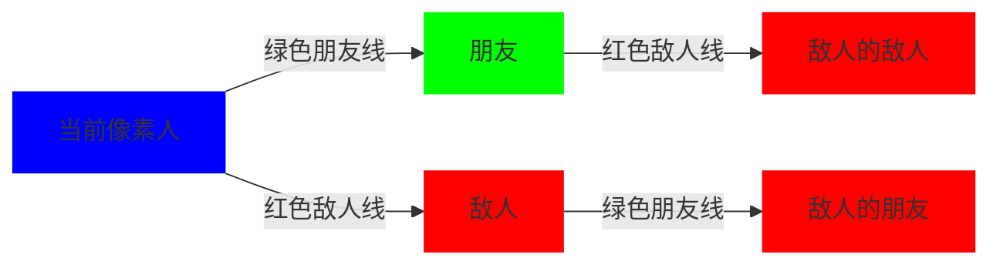

# 题目信息

# [入门赛 #9] 大碗宽面 (Hard Version)

## 题目背景


**本题与 Easy Version 题意完全相同，仅有 $n$ 的数据范围和空间限制不同**。

扶苏和她的朋友们在 Impart 酒店开派对。

## 题目描述

算上扶苏，本次派对共有 $n$ 个人。但是，并不是任何两个人都互相认识，并且互相认识的人关系也未必好。

具体而言，任意两个人可能是如下三种关系之一：
1. 敌人
2. 朋友
3. 陌生人

派对的一大重要活动是相互握手。对任意两个人 $u,v$，他们之间的握手情况遵循下面的规则：
1. 如果 $u$ 和 $v$ 是朋友关系，那么他们一定握手一次。
2. 如果 $u$ 和 $v$ 是敌人关系，那么他们一定**不**握手。
3. 如果 $u$ 和 $v$ 是陌生人关系，且存在一个人 $w$，使得 $w$ 是 $u$ 和 $v$ 之一的朋友，同时是 $u,v$ 中另一人的敌人，则 $u$ 和 $v$ **不会**握手，否则 $u$ 和 $v$ 一定握手一次。

对第三条规则，简单的说法是：一对陌生人之间，如果某一方的朋友是另一方的敌人，则不握手，否则握手。

已知共有 $p$ 对人是朋友关系，$q$ 对人是敌人关系。除了这 $p + q$ 对人，其他每对人均为陌生人关系。

请你求出本次派对一共握手了多少次。

## 说明/提示

### 样例 1 解释

共有 $(1,2), (1,3), (1,4), (2,3), (2,4), (3,4)$ $6$ 对人。
- $(1,2)$ 是朋友，握手。
- $(1,3)$ 是敌人，不握手。
- $(1,4)$ 是敌人，不握手。
- $(2,3)$ 是朋友，握手。
- $(2,4)$ 是陌生人，但是 $1$ 是 $2$ 的朋友，也是 $4$ 的敌人，所以不握手。
- $(3,4)$ 是陌生人，但是不存在任何一个人既是 $3$ 和 $4$ 之一的敌人也是另一个人的朋友，故握手。

综上，一共握手 $3$ 次。

### 数据规模与约定

以下设 $m = p + q$，即 $m$ 是朋友和敌人关系条数之和。

- 对 $100\%$ 的数据，保证 $2 \leq n \leq 10^6$，$1 \leq u, v \leq n$，$0 \leq p,q \leq m \leq 10^3$，$u \neq v$。同一对敌人或朋友关系不会出现两次，不会有一对人同时是敌人或朋友关系。

By 一扶苏一

## 样例 #1

### 输入

```
4 2 2
1 2
2 3
1 4
1 3```

### 输出

```
3```

# AI分析结果


### 💡 Kay的C++算法解析：大碗宽面 (Hard Version) 深入学习指南 💡

#### 1. 题目解读与核心算法识别
✨ **本题主要考察**：图论枚举与高效标记技巧  
🗣️ **初步分析**：
> 本题核心在于高效统计陌生人关系中不握手的情况。想象你管理一个像素化社交网络（类似复古RPG游戏），每个人是像素点，朋友是绿色连线，敌人是红色连线。关键技巧是：**避免无效遍历**，只处理实际存在的关系链（朋友的朋友的敌人）。  
> - 主要思路：总握手数 = 所有点对数 - 敌人对数 - 特定陌生人关系数  
> - 难点：n极大(10⁶)但关系数m极小(≤10³)，需避免O(n²)遍历  
> - 解法对比：链式前向星+局部标记（空间优） vs vector+map（代码简）  
> - 可视化设计：在8-bit网格中用颜色标记关系，高亮"朋友→敌人"传递链，音效提示关系发现（叮~危险！）

---

#### 2. 精选优质题解参考
**题解一**（作者：_•́へ•́╬_）  
* **点评**：思路清晰聚焦核心痛点——利用m小的特性，仅用O(m²)时间即完成统计。链式前向星存储关系，局部布尔数组标记处理过的点，避免memset大数组。代码中`ans -= !a[e2[k]]`体现高效标记技巧，边界处理严谨（`ans>>1`防重复计数）。亮点：空间优化极致，适合竞赛大数据。

**题解二**（作者：一扶苏一）  
* **点评**：采用"正难则反"思想，用map记录已处理关系防重复。vector存储邻接表，逻辑分层清晰（枚举黑边→白边→灰边）。`calced`映射确保每条边只处理一次，复杂度O(m²logn)合理。亮点：作者心得点明"三色三元环"本质，助理解问题抽象。

**题解三**（作者：__Kyw666__）  
* **点评**：三层循环结构直观体现陌生人关系判断逻辑（人→朋友→朋友的敌人）。vector存储关系+map去重，代码可读性强。亮点：用俗语"朋友的朋友是朋友"类比关系传递，降低理解门槛。

---

#### 3. 核心难点辨析与解题策略
1. **难点1：如何避免O(n²)遍历陌生人？**  
   * **分析**：利用m≤10³特性，仅枚举实际存在的朋友/敌人关系。优质题解均通过双层循环（朋友→朋友的敌人）实现O(m²)复杂度  
   * 💡 **学习笔记**：数据范围决定解法——小m暗示关系链枚举  

2. **难点2：如何防止重复标记关系对？**  
   * **分析**：两种方案——链式前向星+局部数组（每轮清空）或vector+全局map。前者节省空间，后者避免哈希冲突  
   * 💡 **学习笔记**：临时标记数组需精细管理作用域，避免全量初始化  

3. **难点3：关系传递性的抽象理解**  
   * **分析**：关键在识别"朋友的朋友的敌人=我的潜在敌人"。题解用像素化比喻（绿色朋友→红色敌人→灰色陌生人）降低理解难度  
   * 💡 **学习笔记**：图论问题先建立心智模型再编码  

### ✨ 解题技巧总结
- **技巧1：正难则反** - 从总对数减不握手情况比直接统计更高效  
- **技巧2：空间换时间/时间换空间** - 根据n/m规模选择链式前向星(空间优)或vector+map(时间优)  
- **技巧3：关系传递可视化** - 绘图辅助理解"朋友→敌人→陌生人"连锁  

---

#### 4. C++核心代码实现赏析
**通用核心实现**（综合题解一、二优化）  
```cpp
#include <cstdio>
#include <vector>
#include <cstring>
using namespace std;
const int N = 1000005, M = 2010;

int n, p, q, h1[N], e1[M*2], nxt1[M*2], idx1;
int h2[N], e2[M*2], nxt2[M*2], idx2;
bool mark[N]; // 局部标记数组
vector<int> clearList; // 清空队列

int main() {
    scanf("%d%d%d", &n, &p, &q);
    long long ans = 1LL * n * (n-1) / 2; // 总点对数
    
    // 链式前向星建图
    memset(h1, 0, (n+1)*sizeof(int));
    memset(h2, 0, (n+1)*sizeof(int));
    while(p--) { // 朋友关系
        int u, v; scanf("%d%d", &u, &v);
        e1[++idx1]=v; nxt1[idx1]=h1[u]; h1[u]=idx1;
        e1[++idx1]=u; nxt1[idx1]=h1[v]; h1[v]=idx1;
    }
    while(q--) { // 敌人关系
        int u, v; scanf("%d%d", &u, &v);
        e2[++idx2]=v; nxt2[idx2]=h2[u]; h2[u]=idx2;
        e2[++idx2]=u; nxt2[idx2]=h2[v]; h2[v]=idx2;
        ans--; // 直接减去敌人
    }

    for(int i=1; i<=n; ++i) {
        clearList.clear();
        // 标记直接朋友
        for(int j=h1[i]; j; j=nxt1[j]) {
            int v = e1[j];
            mark[v] = true;
            clearList.push_back(v);
        }
        // 遍历朋友的朋友的敌人
        for(int j=h1[i]; j; j=nxt1[j]) {
            int v = e1[j];
            for(int k=h2[v]; k; k=nxt2[k]) {
                int w = e2[k];
                if(!mark[w]) {
                    mark[w] = true;
                    clearList.push_back(w);
                    ans--; // 发现不握手陌生人
                }
            }
        }
        // 遍历敌人的朋友
        for(int j=h2[i]; j; j=nxt2[j]) {
            int v = e2[j];
            for(int k=h1[v]; k; k=nxt1[k]) {
                int w = e1[k];
                if(!mark[w]) {
                    mark[w] = true;
                    clearList.push_back(w);
                    ans--;
                }
            }
        }
        // 清空本轮标记
        for(int x : clearList) mark[x] = false;
    }
    printf("%lld\n", ans);
}
```
**代码解读概要**：  
> 1. 链式前向星存储关系（h1朋友/h2敌人）  
> 2. 总握手数初始化为所有点对数  
> 3. 每轮用局部mark数组标记当前点i的关系网  
> 4. 双层循环发现"朋友→敌人的敌人"和"敌人→朋友的朋友"  
> 5. clearList高效清空标记，避免全量初始化  

---

**题解一片段赏析**（链式前向星优化）  
```cpp
for(int j=h1[i];j;j=nxt1[j]) 
    for(int k=h2[e1[j]];k;k=nxt2[k]) 
        ans -= !a[e2[k]], a[e2[k]]=1;
```
**代码解读**：  
> - `h1[i]`遍历i的朋友，`h2[e1[j]]`遍历该朋友的敌人  
> - `!a[e2[k]]`确保陌生人首次被标记  
> - 精妙之处：用位标记替代map，O(1)查询  
> 💡 **学习笔记**：邻接表+位标记是稀疏图处理的黄金组合  

**题解二片段赏析**（map防重）  
```cpp
for(auto v : enemy[u]) 
    for(auto w : frnds[u]) 
        if(!calced[{w,v}]) 
            calced[{w,v}]=true, ans--;
```
**代码解读**：  
> - 枚举敌人v后遍历u的朋友w  
> - `calced`确保每条边只处理一次  
> - 清晰展现"敌人-朋友-陌生人"三角关系  
> 💡 **学习笔记**：map虽带log但代码更直观，适合小规模m  

---

#### 5. 算法可视化：像素动画演示
**主题**：8-bit关系网络探索  
**核心逻辑**：动态演示"朋友→敌人→陌生人"关系链  



**实现方案**：  
1. **初始化**：  
   - 像素网格（FC风格），控制面板含速度滑块/暂停键  
   - 朋友=绿色方块，敌人=红色方块，陌生人=灰色方块  

2. **遍历演示**：  
   - **步1**：高亮当前点i（蓝色闪烁）  
   - **步2**：画绿色线连接朋友，播放"叮~"音效  
   - **步3**：从朋友出发画红线到敌人，敌人闪红，播放"嘟！"警告音  
   - **步4**：从敌人出发画绿线到其朋友，闪红并减计数器  

3. **交互设计**：  
   - 成功标记陌生人：8-bit胜利音效+闪光  
   - 自动模式：AI按算法逻辑自主探索（调速可见）  
   - 错误预防：已处理关系变半透明防重  

---

#### 6. 拓展练习与相似问题
**通用技巧迁移**：  
> 1. 社交网络分析（朋友传播）  
> 2. 稀疏图关系链统计  
> 3. 避免全量遍历的优化策略  

**洛谷推荐**：  
1. **P1892 团伙**  
   🗣️ 巩固朋友/敌人分组思想，扩展域并查集应用  
2. **P1525 关押罪犯**  
   🗣️ 敌人关系处理进阶，二分图染色实践  
3. **P1983 车站分级**  
   🗣️ 关系传递抽象训练，拓扑排序应用  

---

#### 7. 学习心得与经验分享
> **参考经验**（一扶苏一）：  
> *"比赛时感觉创飞了不少人... 调试时要注意关系传递的边界"*  
>   
> **Kay点评**：  
> 作者提醒我们：  
> 1. 复杂关系需手工模拟小型用例验证  
> 2. 边界如(n=2)需单独测试  
> 3. 变量命名明确（frnds/enemy）降低调试难度  

---

掌握关系链的传递本质，你就能在像素世界中优雅解决握手难题！ 🎮✨

---
处理用时：252.48秒