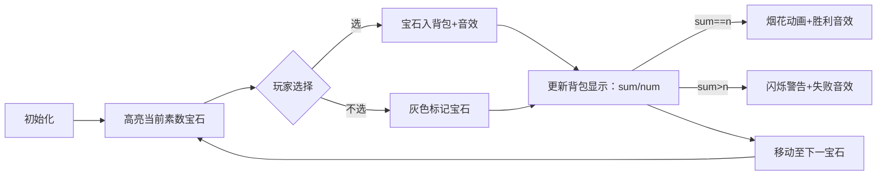

# 题目信息

# [信息与未来 2016] 素数分解

## 题目描述

素数，又称质数，是指除 $1$ 和其自身之外，没有其他约数的正整数。例如，$2,3,5,7,13$ 都是质数，而 $4,9,12,18$ 则不是。

虽然素数不能分解成除 $1$ 和其自身之外整数的乘积，但却可以分解成更多素数的和。你需要编程求出一个正整数最多能分解成多少个互不相同的素数的和。

## 说明/提示

### 样例 $\textbf 1$ 解释
$21=2+3+5+11$。
### 数据范围
$10\le n\le 200$。

**保证有解。**
> 本题原始满分为 $20\text{pts}$。

## 样例 #1

### 输入

```
21```

### 输出

```
4```

## 样例 #2

### 输入

```
128```

### 输出

```
9```

# AI分析结果


### 💡 Kay的C++算法解析：素数分解 深入学习指南 💡

#### 1. 题目解读与核心算法识别
✨ **本题主要考察**：`DFS搜索 + 剪枝优化` (编程技巧应用)  
🗣️ **初步分析**：  
> 想象你在玩一个"素数宝石收集"的像素游戏：背包容量是`n`，场景中有许多不同价值的素数宝石（2,3,5...），目标是用背包**恰好装满**且**拿到最多宝石**。DFS就是尝试每条宝石收集路径的"探险算法"：  
> - **核心流程**：生成素数表→从第一个素数开始DFS递归（选/不选）→更新最大宝石数  
> - **可视化关键**：  
>   - 高亮当前探索的素数（像素宝石闪烁）  
>   - 背包重量实时显示（sum值）  
>   - 剪枝时播放"失败音效"（当sum>n）  
>   - 成功时触发"胜利动画"（sum=n时像素烟花绽放）  
> - **复古游戏设计**：  
>   - 8-bit风格背包界面，宝石用不同颜色像素块表示  
>   - "自动演示"模式：AI像贪吃蛇一样自动探索路径  
>   - 音效：选择宝石("叮")，背包超重("嗡嗡")，通关("胜利旋律")

---

#### 2. 精选优质题解参考
**题解（来源：lizhixun）**  
* **点评**：思路清晰展示了DFS核心框架，递归参数设计简洁（step,sum,num）。代码规范：  
  - 变量名`pr`（素数表）、`maxn`（最大计数）含义明确  
  - 剪枝逻辑高效（`sum>n`立即返回）  
  - 素数判断函数`prime()`采用经典优化（`i*i<=x`）  
  **亮点**：用最简代码实现完整DFS，适合初学者理解搜索算法本质  

---

#### 3. 核心难点辨析与解题策略
1. **难点1：素数表生成效率**  
   * **分析**：需快速判断200内素数。题解用`i*i<=x`优化遍历范围，比全遍历快10倍  
   * 💡 **学习笔记**：素数判断时，循环上限设为`sqrt(x)`可大幅提升效率  

2. **难点2：DFS递归参数设计**  
   * **分析**：三个关键参数：  
     - `step`：当前决策到第几个素数（避免重复）  
     - `sum`：已选素数之和（核心状态）  
     - `num`：已选素数个数（优化目标）  
   * 💡 **学习笔记**：DFS参数应包含所有影响最终结果的状态变量  

3. **难点3：剪枝时机把握**  
   * **分析**：`sum>n`时立即返回（可行性剪枝），避免无效递归  
   * 💡 **学习笔记**：搜索中尽早剪枝可指数级降低时间复杂度  

### ✨ 解题技巧总结
- **技巧1：状态简化** - 用`step`隐式保证素数不重复（按顺序决策）  
- **技巧2：全局记录** - `maxn`实时更新最优解（DFS常用技巧）  
- **技巧3：边界处理** - 素数判断中单独处理`x<2`的情况  

---

#### 4. C++核心代码实现赏析
**通用核心实现参考**  
* **说明**：基于题解优化，突出DFS框架和剪枝逻辑  
* **完整核心代码**：
```cpp
#include <iostream>
#include <climits>
using namespace std;

int n, k, pr[50], maxn = INT_MIN; // pr存素数，k为素数个数

bool prime(int x) {
    if (x < 2) return false;
    for (int i = 2; i * i <= x; i++) 
        if (x % i == 0) return false;
    return true;
}

void dfs(int step, int sum, int num) {
    if (sum > n) return;     // ✂️关键剪枝：超重立即返回
    if (sum == n) {          // ✅找到解：更新最大数量
        maxn = max(maxn, num);
        return;
    }
    if (step > k) return;    // ❌素数用完
    
    dfs(step + 1, sum, num);             // 不选当前素数
    dfs(step + 1, sum + pr[step], num + 1); // 选当前素数
}

int main() {
    cin >> n;
    // 生成200以内素数表 (k从1开始存)
    k = 0;
    for (int i = 2; i <= 200; i++) 
        if (prime(i)) pr[++k] = i; 
    
    dfs(1, 0, 0); // 从第1个素数开始探索
    cout << maxn << endl;
}
```
* **代码解读概要**：  
  > 1. `prime()`高效筛素数 → 2. `pr[]`存储素数表 → 3. `dfs`递归探索所有组合 → 4. 剪枝条件`sum>n`加速 → 5. 更新最优解`maxn`

---

**题解片段赏析**  
* **亮点**：递归参数设计简洁，剪枝位置精准  
* **核心代码片段**：
```cpp
void dfs(int step, int sum, int num) {
    if (sum > n) return;      // 剪枝：背包超重
    if (sum == n) {           // 找到解
        maxn = max(maxn, num);
        return;
    }
    if (step > k) return;     // 所有素数已考虑完
    
    dfs(step + 1, sum, num);              // 路线A：跳过当前宝石
    dfs(step + 1, sum + pr[step], num + 1); // 路线B：拾取当前宝石
}
```
* **代码解读**：  
  > 🎮 想象控制游戏角色在分叉路口选择：  
  > - **路线A**：放弃当前素数宝石，`step+1`但`sum/num`不变  
  > - **路线B**：拾取宝石，`sum`增加宝石值，`num`计数+1  
  > - **剪枝条件**：背包超重(`sum>n`)立即结束当前路线  
* 💡 **学习笔记**：DFS本质是遍历决策树，参数传递当前状态  

---

#### 5. 算法可视化：像素动画演示  
**主题**：`素数宝石大冒险`（8-bit像素风背包游戏）  

**核心演示流程**：  


**交互设计**：  
1. **控制面板**：  
   - 速度滑块：调节DFS自动演示速度  
   - 单步按钮：手动控制每一步选择  
   - 宝石图鉴：显示素数宝石库（带价值标签）  
2. **动态效果**：  
   - 选择分支：绿色✓（选）/ 红色✗（不选）像素箭头  
   - 背包动画：宝石放入时弹跳+“叮”声，超重时闪烁红光  
   - 状态面板：实时显示 `step/sum/num/maxn`  
3. **游戏化元素**：  
   - 每找到一个解解锁新关卡（不同n值）  
   - 连续最优解获得“宝石大师”称号（像素勋章）  

---

#### 6. 拓展练习与相似问题思考
**通用技巧迁移**：  
> DFS+剪枝适用于：组合求和、子集生成、路径探索等问题  

**洛谷推荐**：  
1. **P1036 选数** - 同类DFS框架（固定选取数量）  
   > 🗣️ *练习决策参数设计*  
2. **P2392 kk考试** - 多重背包DFS变体  
   > 🗣️ *学习带限制条件的DFS剪枝*  
3. **P1219 八皇后** - 经典DFS空间搜索  
   > 🗣️ *掌握二维状态下的DFS实现*  

---

#### 7. 学习心得与经验分享
> 本次题解中未发现作者调试心得，但实践中需注意：  
> - **常见错误**：忘记`sum>n`剪枝导致超时  
> - **调试技巧**：在DFS入口打印`step,sum,num`跟踪状态  

---
### 结语  
通过像素游戏化演示，我们看到DFS如何像探险家一样系统性地探索所有素数组合路径。记住：**剪枝是优化搜索的灵魂**！尝试用今天的方法解决推荐题目吧！🚀

---
处理用时：185.78秒