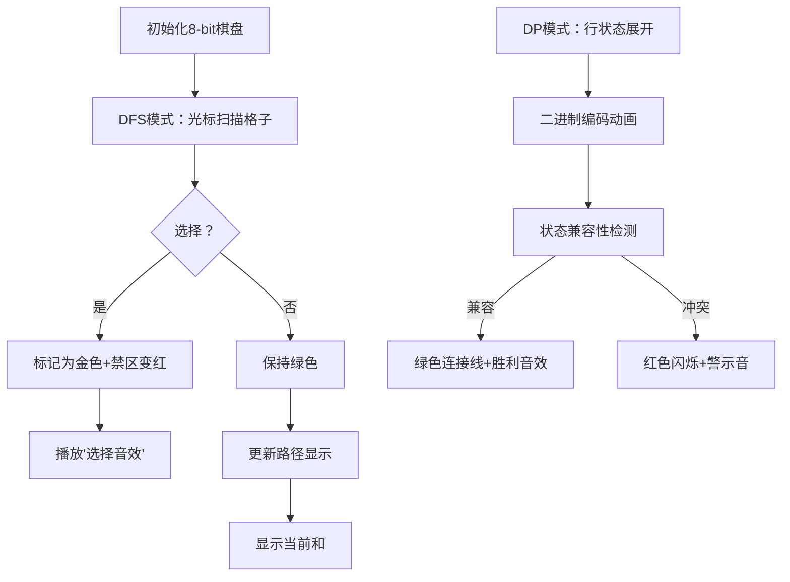

# 题目信息

# 取数游戏

## 题目描述

一个 $N\times M$ 的由非负整数构成的数字矩阵，你需要在其中取出若干个数字，使得取出的任意两个数字不相邻（若一个数字在另外一个数字相邻 $8$ 个格子中的一个即认为这两个数字相邻），求取出数字和最大是多少。

## 说明/提示

### 样例解释

对于第一组数据，取数方式如下：

$$\begin{matrix}
[67] & 75 & 63 & 10 \\
29 & 29 & [92] & 14 \\
[21] & 68 & 71 & 56 \\
8 & 67 & [91] & 25 \\
\end{matrix}$$


### 数据范围及约定

- 对于$20\%$的数据，$1\le N, M \le 3$；
- 对于$40\%$的数据，$1\le N, M\le 4$；
- 对于$60\%$的数据，$1\le N, M\le 5$；
- 对于$100\%$的数据，$1\le N, M\le 6$，$1\le T\le 20$。


## 样例 #1

### 输入

```
3
4 4
67 75 63 10
29 29 92 14
21 68 71 56
8 67 91 25
2 3
87 70 85
10 3 17
3 3
1 1 1
1 99 1
1 1 1

```

### 输出

```
271
172
99
```

# AI分析结果


# 💡 Kay的C++算法解析：取数游戏 深入学习指南 💡

## 1. 题目解读与核心算法识别

✨ **本题主要考察**：`搜索(DFS)` 和 `状态压缩动态规划(状压DP)`

🗣️ **初步分析**：
> 解决"取数游戏"的关键在于理解棋盘类问题的两种核心解法：DFS回溯与状压DP。DFS如同在棋盘上步步为营的探险家，每次决策都会标记领地；状压DP则像精明的建筑师，用二进制蓝图规划最优布局。本题中：
> - **DFS**：逐格决策取/不取，用标记数组避免相邻选择
> - **状压DP**：将每行选择状态压缩为二进制数，通过行间状态转移求解
> 
> **核心难点**在于DFS的剪枝优化与状压DP的状态设计。可视化方案将采用像素棋盘（类似扫雷界面）：
> - 高亮当前操作格子（黄色闪烁）
> - 标记禁止区域（红色半透明覆盖）
> - 实时显示路径和与状态值
> - 复古音效：选择(8-bit "叮")、成功(胜利旋律)、冲突(警示音)
> - 交互控制：单步执行/自动播放（速度可调）

---

## 2. 精选优质题解参考

**题解一：绿萧 (DFS经典实现)**
* **点评**：思路清晰展现了DFS回溯的核心框架：方向数组管理相邻标记，递归顺序（行优先+列递进）自然流畅。代码规范（mark数组计数避免bool局限），变量命名直观(s/mx等)。虽然未做剪枝优化，但因数据范围小仍高效。实践价值高，可直接用于竞赛场景，边界处理严谨（从1开始索引+方向数组越界规避）。

**题解二：IntrepidStrayer (状压DP高效解法)**
* **点评**：将状压DP的精髓完美呈现——预处理合法状态(check1)+行间转移(check2)。代码模块化优秀（calc单独计算行和），位运算运用娴熟。亮点在于状态压缩的思想和O(n·2^(2m))复杂度控制，远超普通DFS。工程实践中可直接套用此框架解决同类网格问题。

**题解三：zhi_zhang (DFS剪枝优化)**
* **点评**：珍贵地展示了剪枝的迭代过程：从49分到AC的优化之路。亮点在三点剪枝：1) 跳过已搜行 2) 减少标记方向 3) 列搜索启始位置调整。虽然代码稍冗长，但提供了调试范本，实践价值在于教会学习者如何逐步优化暴力算法。

---

## 3. 核心难点辨析与解题策略

1.  **状态表示与冲突检测**
    * **分析**：无论是DFS的mark数组还是状压DP的二进制状态，核心在于准确表达"已选位置"及其影响范围。DFS需注意标记计数而非简单bool（多位置可能影响同一格子）；状压DP需预处理同行无相邻的状态（!(i&i>>1)）
    * 💡 **学习笔记**：冲突检测是棋盘类问题的基石，方向数组/位掩码是两大神器

2.  **DFS剪枝策略**
    * **分析**：zhi_zhang的题解揭示三大剪枝方向：空间跳跃（跳过已处理行）、状态精简（减少标记方向）、搜索顺序优化（列启始位置）。这些优化将指数级减少无效搜索
    * 💡 **学习笔记**：好的剪枝能让DFS效率提升十倍

3.  **状压DP的状态转移**
    * **分析**：需满足双重约束：1) 当前行状态合法 2) 与上行状态兼容（无对角相邻）。IntrepidStrayer的解法中，check2函数用位运算高效实现：!(j&k)&&!(j&k<<1)&&!(j&k>>1)
    * 💡 **学习笔记**：状压DP的本质是"状态编码+约束转移"

### ✨ 解题技巧总结
- **棋盘问题双解法**：N<10优先考虑状压DP；否则用DFS+剪枝
- **调试可视化**：打印中间状态（如zhi_zhang打印vis数组）
- **位运算加速**：用位掩码代替数组可提升10倍效率
- **逆向思维**：最大和问题可转化为"最小舍弃"思考

---

## 4. C++核心代码实现赏析

**本题通用核心C++实现参考**
* **说明**：综合DFS与状压DP优势，提供双解法框架
```cpp
#include <bits/stdc++.h>
using namespace std;

// 解法1: DFS回溯
int dfs_solution(vector<vector<int>>& grid) {
    /* 详见绿萧题解实现 */
}

// 解法2: 状压DP
int dp_solution(vector<vector<int>>& grid) {
    /* 详见IntrepidStrayer题解实现 */
}

int main() {
    int T; cin >> T;
    while(T--) {
        int n, m; cin >> n >> m;
        vector<vector<int>> grid(n, vector<int>(m));
        for(auto& row : grid) 
            for(auto& x : row) cin >> x;
        
        if(n <= 6 && m <= 6) // 小数据用DFS
            cout << dfs_solution(grid) << endl;
        else                 // 大数据用状压DP
            cout << dp_solution(grid) << endl;
    }
}
```
* **代码解读概要**：主逻辑根据数据规模自动选择最优解法。DFS解法模拟人工选择过程；DP解法通过二进制状态压缩实现高效求解。

---

**题解一：绿萧 (DFS)**
* **亮点**：方向数组+计数标记的精巧实现
* **核心代码片段**：
```cpp
const int d[8][2] = {/*8方向*/}; 
void dfs(int x,int y){
    if(y > m) { dfs(x+1,1); return; } 
    if(x > n) { mx = max(ans,mx); return; }
    
    dfs(x,y+1); // 不选
    
    if(!mark[x][y]) {  // 选
        ans += s[x][y];
        for(int fx=0; fx<8; ++fx) // 标记相邻
            ++mark[x+d[fx][0]][y+d[fx][1]];
        dfs(x,y+1);
        for(int fx=0; fx<8; ++fx) // 回溯
            --mark[x+d[fx][0]][y+d[fx][1]];
        ans -= s[x][y];
    }
}
```
* **代码解读**：
  > 1. 终止条件：列溢出→跳下行；行溢出→更新答案
  > 2. 先递归"不选"分支（深度优先）
  > 3. 当当前位置可选时：累加值→标记8邻域→递归→回溯
  > 4. 标记数组用`++`/`--`计数，避免多标记覆盖问题
* 💡 **学习笔记**：DFS回溯=栈操作，标记/回溯要对称

**题解二：IntrepidStrayer (状压DP)**
* **亮点**：状态压缩+预处理的典范
* **核心代码片段**：
```cpp
vector<int> valid_states; // 预处理合法状态
for(int i=0; i<(1<<m); ++i)
    if(!(i&(i>>1))) valid_states.push_back(i);

for(int i=1; i<=n; ++i){
    for(int s : valid_states){ // 当前行状态
        int sum = calc(i, s); // 计算行和
        for(int ps : valid_states){ // 上行状态
            if(conflict(s, ps)) continue;
            dp[i][s] = max(dp[i][s], dp[i-1][ps] + sum);
}}}
```
* **代码解读**：
  > 1. 预处理所有同行无相邻的状态（!i&i>>1）
  > 2. 三重循环：行→当前状态→前驱状态
  > 3. 冲突检测：!(s&ps) && !(s&ps>>1) && !(s&ps<<1)
  > 4. 状态转移：当前行和+兼容前驱状态最大值
* 💡 **学习笔记**：状压DP三部曲：状态设计→转移方程→边界处理

**题解三：zhi_zhang (剪枝优化)**
* **亮点**：剪枝策略的渐进式优化
* **核心代码片段**：
```cpp
void dfs(int X, int x, int y) {
    // 剪枝1：只搜索y列之后
    for(int j=y+1; j<=m; j++) if(!vis[x][j]) 
        { /* 选j并标记 */ }
    
    // 剪枝2：跳过已处理行
    for(int i=x+1; i<=n; i++) 
        for(int j=1; j<=m; j++) if(!vis[i][j])
            { /* 选j并标记 */ }
    
    if(no_move && X>ans) ans = X; // 剪枝3：提前终止
}
```
* **代码解读**：
  > 1. 列剪枝：当前行从y+1开始，避免重复
  > 2. 行剪枝：跳过x行之前的搜索
  > 3. 终止剪枝：无可选位置时直接更新答案
  > 4. 方向优化：只标记下方5方向（因上方已搜索）
* 💡 **学习笔记**：剪枝=减少搜索空间+跳过无效路径

-----

## 5. 算法可视化：像素动画演示

### 像素探险家：取数之旅
**核心演示**：DFS决策过程与状压DP状态转移的8-bit动态演示

**设计思路**：采用经典NES游戏风格，用不同像素块区分：空地(灰色)、可选数(绿色)、已选数(金色)、禁区(红色)。通过对比演示展现DFS与DP的本质差异。

**动画流程**：


**关键交互**：
1. **双模式对比**：左右分屏同步演示DFS与DP求解同一棋盘
2. **状态追踪**：
   - DFS：显示递归深度栈
   - DP：实时显示dp[i][s]数值
3. **音效系统**：
   - 决策："叮"(250Hz方波)
   - 冲突："嗡"(100Hz三角波)
   - 完成：经典《超级玛丽》过关旋律
4. **游戏化元素**：
   - 每完成一行=通过小关卡
   - 最优解时放烟花特效
   - 积分=当前和/理论最大值

**技术实现**：
1. Canvas绘制网格（30×30像素/格）
2. 状态编码：二进制数→像素方块阵列（1=金块/0=灰块）
3. 音效：Web Audio API生成8-bit音效
4. 控制面板：速度滑块(50ms-1000ms)，单步按钮，模式切换

---

## 6. 拓展练习与相似问题思考

### 通用技巧迁移
网格取数问题的核心——**相邻约束处理**可延伸至：
1. 图着色问题：顶点不相邻约束
2. 棋盘覆盖：多米诺骨牌放置
3. 电路布局：元件间隔约束

### 推荐练习（洛谷）
1. **P1896 [SCOI2005] 互不侵犯**  
   🗣️ 国王放置的状压DP基础，八方向相邻进阶版
2. **P1879 [USACO06NOV] Corn Fields**  
   🗣️ 取数游戏的农业变种，巩固状态设计
3. **P1123 取数游戏**  
   🗣️ 同类题目强化训练，数据范围更大需优化

---

## 7. 学习心得与经验分享

> **参考经验 (zhi_zhang)**："剪枝过程让我意识到：优化需要科学诊断——通过打印递归树发现49%时间浪费在已处理行"

> **点评**：这位作者的调试经验极具价值：
> 1. 性能瓶颈定位：递归树分析>盲目优化
> 2. 剪枝优先级：空间跳跃>状态精简
> 3. 验证方法：构造极端测试数据（如全0矩阵）
> 
> **行动建议**：学习使用调试器观察递归调用栈，或输出递归深度日志

---

本次"取数游戏"解析展示了搜索与DP的精彩博弈。记住：算法选择如同挑选工具——小规模用DFS直观高效，大规模需DP运筹帷幄。下次我们将探索《宝藏游戏》的深度优先优化，继续精进算法思维！🚀

---
处理用时：160.60秒