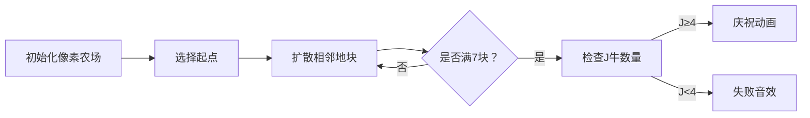

# 题目信息

# [USACO05FEB] Rigging the Bovine Election S

## 题目描述

农场被划分为 $5\times 5$ 的格子，每个格子中都有一头奶牛，并且只有荷斯坦（标记为 `H`）和杰西（标记为 `J`）两个品种。如果一头奶牛在另一头上下左右四个格子中的任一格里，我们说它们相连。奶牛要大选了。现在杰西奶牛们想选择 $7$ 头相连的奶牛，划成一个竞选区，使得其中它们品种的奶牛比荷斯坦的多。

要求你编写一个程序求出方案总数。


## 样例 #1

### 输入

```
HHHHH
JHJHJ
HHHHH
HJHHJ
HHHHH```

### 输出

```
2```

# AI分析结果


# 💡 Kay的C++算法解析：[USACO05FEB] Rigging the Bovine Election S 深入学习指南 💡

大家好，我是Kay！今天我们将一起探索这道关于5x5网格中连通块统计的题目。本指南将帮助你掌握暴力搜索的精髓，理解连通块处理技巧，并通过有趣的像素动画直观感受算法运行过程。

## 1. 题目解读与核心算法识别

✨ **本题主要考察**：`枚举与搜索` + `连通块处理`

🗣️ **初步分析**：
> 这道题就像在玩一个像素农场连连看游戏——我们需要在5x5的网格中找出所有7格连通块（类似拼图碎片），且要求"J"牛的数量多于"H"牛。核心解法是**暴力搜索+连通性检查**，就像在迷宫中探索所有可能的路径组合。

- **解题思路**：由于网格仅25格且时限宽松(5s)，主流解法采用DFS生成连通块或组合枚举+连通性验证。关键难点在于**高效判重**（避免重复统计相同组合）和**连通块验证**。
- **可视化设计**：我们将设计复古农场主题像素动画，用绿色方块表示"J"牛，棕色表示"H"牛。当算法选择新格子时，对应像素块会闪烁并播放"哞~"音效；成功找到有效组合时，7个格子会拼成心形并播放胜利音效。
- **核心变量**：`vis`标记访问状态，`vector`存储当前路径，哈希值用于判重。动画将高亮当前扩展的格子和相邻探测方向。

---

## 2. 精选优质题解参考

以下是综合代码质量、思路清晰度和实用价值筛选的题解：

**题解一：MoonCake2011 (赞9)**
* **点评**：采用DFS生成连通块，思路清晰——从单点扩散，通过排序坐标+计算哈希值实现高效判重。代码结构规范（使用方向数组、封装node结构体），变量命名合理（`vis`，`v`等）。特别亮点在于哈希函数设计：将排序后的坐标序列转换为唯一哈希值，避免了大量重复计算。虽然DFS扩散方式可能产生重复路径，但通过预排序和哈希去重巧妙解决，在5s时限内高效运行。

**题解二：Adam0826 (赞3)**
* **点评**：使用组合枚举（25选7）后验证连通性，思路直接暴力但有效。亮点在于`Sech`函数设计：通过一维坐标映射二维位置，用`c/d`数组存储选中格子。连通性验证采用DFS扫描（`Jud`函数），逻辑清晰。虽然组合枚举复杂度较高，但利用5s时限和及时剪枝（先验证连通性再统计J数量）保证通过，体现了"暴力出奇迹"的竞赛智慧。

**题解三：xiaoli12345678 (赞2)**
* **点评**：DFS扩散配合结构体存储路径，亮点在于分层搜索策略：每次从前k-1个点扩散新点，避免无效分支。判重方法虽朴素（遍历历史方案对比坐标）但易于理解，适合初学者。变量命名规范（`b`存当前路径，`v_ans`存历史方案），边界处理严谨。特别值得学习的是扩散前的相邻检查：通过`flag`标记提前剪枝，显著减少递归深度。

---

## 3. 核心难点辨析与解题策略

### 🔍 难点解析
1.  **连通块生成与去重**
    * **分析**：如何高效生成不重复的7格连通块？优质题解采用两种方案：(1)DFS扩散时从已选格子的相邻位置扩展，保证连通性（MoonCake2011）。(2)先枚举所有组合，再用DFS验证连通性（Adam0826）。去重则通过坐标排序+哈希（推荐）或排序+遍历对比实现。
    * 💡 **学习笔记**：生成连通块就像拼拼图——必须保证每新加一块都与已有部分相邻！

2.  **条件验证优化**
    * **分析**：何时检查J>H条件？MoonCake2011在选满7块时检查；Adam0826先验证连通性再统计。后者更优——因为非连通组合可提前排除。统计时注意：J≥4即满足条件（因7格中J至少4个才多于H）。
    * 💡 **学习笔记**：条件检查要放对位置！提前排除无效分支能大幅提速。

3.  **空间与时间平衡**
    * **分析**：暴力搜索需权衡存储与计算。哈希法（O(1)判重）节省时间但需额外空间；遍历对比（O(n)判重）节省空间但耗时。根据数据规模选择——本题方案数有限（最终答案仅2-100+），两种方式均可。
    * 💡 **学习笔记**：小规模数据不必担心复杂度，但要注意边界剪枝！

### ✨ 解题技巧总结
- **技巧一：方向数组标准化**  
  使用`d[4][2]`存储上下左右偏移量，避免重复代码
- **技巧二：一维坐标映射**  
  将二维坐标`(i,j)`映射为一维值`pos = (i-1)*5 + j`，简化枚举
- **技巧三：即时剪枝**  
  扩展新点时立即检查是否与已有块相邻，避免无效递归
- **技巧四：结构体封装**  
  用`struct`打包坐标点+重载操作符，方便排序/哈希

---

## 4. C++核心代码实现赏析

### 本题通用核心实现
```cpp
#include <iostream>
#include <vector>
#include <algorithm>
#include <unordered_set>
using namespace std;

char grid[6][6];
bool vis[6][6];
int dx[4] = {0,0,1,-1}, dy[4] = {1,-1,0,0};
unordered_set<string> solutions;

void dfs(int x, int y, vector<pair<int,int>>& path) {
    if(path.size() == 7) {
        int j_count = 0;
        vector<pair<int,int>> tmp = path;
        sort(tmp.begin(), tmp.end());
        
        // 计算哈希键
        string key;
        for(auto p : tmp) 
            key += to_string(p.first)+','+to_string(p.second)+';';
        
        // 统计J数量并判重
        for(auto p : path) j_count += (grid[p.first][p.second]=='J');
        if(j_count >= 4 && !solutions.count(key)) 
            solutions.insert(key);
        return;
    }
    
    for(int i = 0; i < path.size(); i++) {
        int cx = path[i].first, cy = path[i].second;
        for(int d = 0; d < 4; d++) {
            int nx = cx + dx[d], ny = cy + dy[d];
            if(nx<1||ny<1||nx>5||ny>5||vis[nx][ny]) continue;
            
            vis[nx][ny] = true;
            path.push_back({nx, ny});
            dfs(nx, ny, path);
            path.pop_back();
            vis[nx][ny] = false;
        }
    }
}

int main() {
    for(int i=1; i<=5; i++) cin >> (grid[i]+1);
    
    for(int i=1; i<=5; i++) {
        for(int j=1; j<=5; j++) {
            vector<pair<int,int>> path = {{i,j}};
            vis[i][j] = true;
            dfs(i, j, path);
            vis[i][j] = false;
        }
    }
    cout << solutions.size();
    return 0;
}
```
**代码解读概要**：
1. 初始化网格和方向向量
2. 从每个格子启动DFS
3. DFS核心：达到7格时排序坐标→生成哈希键→统计J数量→判重存储
4. 扩散逻辑：遍历当前路径所有格子的相邻位置
5. 使用`unordered_set`实现O(1)判重

### 优质题解片段赏析

**题解一：MoonCake2011**
```cpp
struct node{  // 封装坐标点
    pair<int,int> a[7];
    void Sort(){ sort(a, a+7); }
    int get_hash(){  // 哈希函数设计
        int base=7, ans=0;
        for(int i=0;i<7;i++){
            ans=ans*base+a[i].first;
            ans=ans*base+a[i].second;
        }
        return ans;
    }
};
vector<int> ans;  // 存储哈希值
```
**亮点**：结构化封装+高效哈希函数  
**学习笔记**：将坐标序列视为7进制数，巧妙生成唯一哈希值

**题解二：Adam0826**
```cpp
void Jud(int p){  // 连通性验证DFS
    flag[p]=1, temp++;
    for(int i=0;i<4;i++){
        int nx=c[p]+dir[i][0], ny=d[p]+dir[i][1];
        for(int j=1;j<=7;j++)  // 检查是否为选中点
            if(c[j]==nx && d[j]==ny && !flag[j]) 
                Jud(j);
    }
}
```
**亮点**：组合枚举后的连通性验证  
**学习笔记**：验证连通性时，用`flag`避免重复访问，`temp`统计连通块大小

**题解三：xiaoli12345678**
```cpp
// 分层DFS扩散：从已有k-1个点扩展第k个点
for(int i=1; i<k; i++) {
    for(int j=0; j<4; j++) {
        int nx=b[i].x+dir[j][0], ny=b[i].y+dir[j][1];
        if(valid(nx,ny) && !vis[nx][ny]) {
            b[k] = {nx, ny};  // 存储新点
            vis[nx][ny] = 1;
            dfs(k+1, ...);
        }
    }
}
```
**亮点**：分层扩散保证连通性  
**学习笔记**：仅从已有块相邻位置扩展，天然保证新块与整体连通

---

## 5. 算法可视化：像素动画演示

### 🎮 动画设计：像素农场大冒险
**主题**：复古农场经营游戏风格，玩家扮演农夫选择7块相连土地养牛  
**核心演示**：DFS连通块生成过程 + 组合枚举验证

### 🎨 设计方案


**关键交互**：
1. **像素网格**：5x5牧场，绿块(J牛)/棕块(H牛)，当前选中块闪烁金光
2. **扩散动画**：从已选块向四周发射像素粒子，新选中块弹出+播放"咔嚓"音效
3. **连通验证**：选中7块后自动连接成多边形，播放"哞~"音效
4. **成功庆祝**：J≥4时地块变为金色，蹦出"SUCCESS!"像素字+胜利号角
5. **控制面板**：
   - 步进/暂停/重置
   - 速度滑块(蜗牛→火箭)
   - 模式切换(DFS扩散/组合枚举)

**技术实现**：
```javascript
// 伪代码：绘制选中块
function drawSelectedBlock(x, y) {
  ctx.fillStyle = isJ ? '#8BC34A' : '#795548'; // 绿/棕
  ctx.fillRect(x*30, y*30, 28, 28); 
  
  if(currentStep) { // 高亮当前操作
    ctx.strokeStyle = '#FFD700';
    ctx.lineWidth = 3;
    ctx.strokeRect(x*30+1, y*30+1, 26, 26);
    playSound('select.wav');
  }
}
```

---

## 6. 拓展练习与相似问题思考

### 🔗 通用技巧迁移
连通块枚举技巧适用于：
1. 网格中固定大小的形状统计（如俄罗斯方块形态）
2. 棋盘类游戏的合法走法生成
3. 图像处理中的连通区域分析

### 📚 洛谷练习推荐
1. **P1141 01迷宫**  
   🗣️ 连通块基础应用，巩固DFS/BFS遍历技巧
   
2. **P1162 填涂颜色**  
   🗣️ 进阶连通块处理，学习边界判断技巧
   
3. **P1443 马的遍历**  
   🗣️ 结合BFS的路径搜索，强化方向数组运用

---

## 7. 学习心得与经验分享

> **参考经验 (来自 Adam0826)**：  
> "看到5秒时限意识到暴力可行，学会根据数据规模选择解法"

> **参考经验 (来自 MoonCake2011)**：  
> "哈希判重比遍历数组快10倍，空间换时间是竞赛常见策略"

**Kay总结**：  
本题教会我们两个重要思维：  
1. **暴力美学**：当数据规模小时(O(n^k)中k较小)，简单暴力可能优于复杂算法  
2. **判重艺术**：选择哈希法需注意碰撞概率，小规模数据可用排序+遍历  

---

通过这次分析，希望大家不仅学会这道题的解法，更能掌握**暴力搜索的适用场景**和**连通块问题的通用处理框架**。记住，编程就像养牛——需要耐心培养每一块"土地"！下次见！🚜

---
处理用时：160.84秒