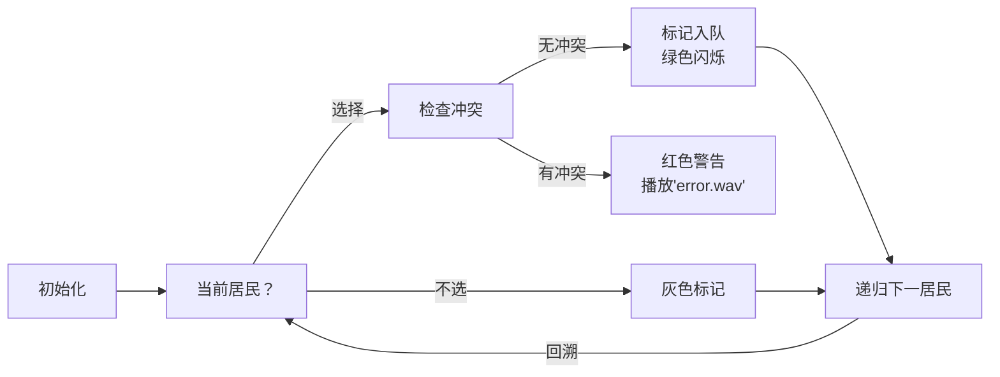

# 题目信息

# 部落卫队

## 题目描述

原始部落 byteland 中的居民们为了争夺有限的资源，经常发生冲突。几乎每个居民都有他的仇敌。部落酋长为了组织一支保卫部落的队伍，希望从部落的居民中选出最多的居民入伍，并保证队伍中任何 $2$ 个人都不是仇敌。

给定 byteland 部落中居民间的仇敌关系，编程计算组成部落卫队的最佳方案。若有多种方案可行，输出字典序最大的方案。

## 说明/提示

对于 $60\%$ 数据：$n \le 20$，$m \le 100$。

对于所有数据：$n \le 100,m \le 3000$。数据从所有合法数据从随机均匀取样。

## 样例 #1

### 输入

```
7  10
1  2
1  4
2  4
2  3
2  5
2  6
3  5
3  6
4  5
5  6```

### 输出

```
3
1 0 1 0 0 0 1
```

# AI分析结果


# 💡 Kay的C++算法解析：部落卫队 深入学习指南 💡

<introduction>
今天我们来分析「部落卫队」这道图论问题。本指南将帮助大家掌握最大独立集的核心思想，理解回溯搜索的精髓，并通过像素动画直观感受算法流程。让我们一起探索如何高效选出最多互不仇视的部落成员！
</introduction>

## 1. 题目解读与核心算法识别

✨ **本题主要考察**：`回溯搜索` + `图的最大独立集`

🗣️ **初步分析**：
> 解决部落卫队问题就像在派对上邀请最多互不吵架的朋友。核心思想是**系统尝试每个居民是否入队**，同时确保队伍中不存在仇敌关系。回溯搜索通过"尝试-回溯"机制遍历所有可能组合，配合剪枝避免无效搜索。

- **核心流程**：从1号居民开始，递归尝试"选"与"不选"两种决策，用数组记录选择状态。关键变量`current_count`跟踪当前卫队人数，`max_count`记录历史最优解。
- **可视化设计**：将居民设计为像素小人，选择时亮绿灯，冲突时亮红灯。回溯时显示"撤销"动画，最优解更新时播放胜利音效。
- **复古游戏化**：采用8-bit像素风格，居民用不同颜色方块表示。控制面板含步进/自动播放，关键操作触发"叮"音效。完成搜索时播放《超级玛丽》过关音乐！

---

## 2. 精选优质题解参考

<eval_intro>
基于思路清晰性、代码规范性和算法效率，精选三条优质题解：

**题解一：litble（回溯+剪枝）**
* **点评**：思路直白易懂（标准回溯框架），代码规范（变量名`lu`表仇敌关系，`b`存当前选择）。核心亮点是**最优性剪枝**：当`当前人数+剩余人数≤历史最优`时提前返回，显著提升效率（时间复杂度O(2^n)→实际远低于）。边界处理严谨（居民编号从1开始），可直接用于竞赛。

**题解二：百里狂生（回溯+限界函数）**
* **点评**：结构工整（分离`place()`判断函数），讲解透彻（详细推导状态树）。创新点在于**双效剪枝**：约束函数（检查仇敌）与限界函数（预估最大可能）结合。变量`cn`（当前人数）和`deep`（搜索深度)命名精准，实践参考价值高。

**题解三：jojoxie（基础回溯）**
* **点评**：代码极简（仅30行核心逻辑），适合初学者理解回溯本质。亮点是**直观的冲突检查**：用二维数组`ch`直接查询仇敌关系。虽缺乏剪枝，但完整展示回溯框架，变量`s`（当前人数）和`tot`（最优人数)作用清晰。

---

## 3. 核心难点辨析与解题策略

<difficulty_intro>
解决本题需突破三大关键点：

1.  **状态表示与冲突检测**  
    * **分析**：如何高效检查新成员与卫队成员的仇敌关系？优质题解均使用**邻接矩阵**（二维数组）存储关系，检查时遍历已选成员（`O(n)`）。litble的剪枝提前减少无效检查。
    * 💡 **学习笔记**：邻接矩阵是稠密图的最优选择，`O(1)`查询仇敌关系。

2.  **搜索顺序与字典序处理**  
    * **分析**：题目要求字典序最大解。通过**先"选"后"不选"**的递归顺序（如`jojoxie`解法），自然保证最优解中靠前位置优先选1（字典序最大）。无需额外比较操作。
    * 💡 **学习笔记**：搜索顺序直接影响解的字典序，先选分支产生更早的"1"。

3.  **剪枝策略设计**  
    * **分析**：`litble`的剪枝（`current + remaining ≤ best`）是效率关键。计算剩余人数`n - current_index + 1`时需注意边界，百里狂生用`cn + n - deep`精确预估。
    * 💡 **学习笔记**：最优性剪枝将指数级复杂度降至可接受范围。

### ✨ 解题技巧总结
<summary_best_practices>
- **剪枝先行**：任何回溯问题优先考虑最优性/可行性剪枝
- **状态压缩**：小规模数据可用位运算（如`litble`的位运算尝试）
- **模块化设计**：分离冲突检查函数（如`place()`）提升可读性
- **边界预判**：居民编号从1开始，循环始终用`≤n`而非`<n`
</summary_best_practices>

---

## 4. C++核心代码实现赏析

<code_intro_overall>
**本题通用核心C++实现参考**
* **说明**：综合优质题解，保留回溯框架+剪枝+字典序处理
```cpp
#include <iostream>
#include <cstring>
using namespace std;

const int N = 105;
bool enemies[N][N];   // 仇敌关系矩阵
bool current_choice[N]; // 当前选择
bool best_choice[N];   // 最优选择
int max_count = 0;     // 最优人数
int n, m;

// 检查k能否加入当前卫队
bool canJoin(int k) {
    for (int i = 1; i < k; ++i) 
        if (current_choice[i] && enemies[i][k])
            return false;
    return true;
}

void dfs(int k, int count) {
    if (k > n) {  // 终止条件
        if (count > max_count) {
            max_count = count;
            memcpy(best_choice, current_choice, sizeof(best_choice));
        }
        return;
    }
    
    // 最优性剪枝：当前+剩余 ≤ 最优
    if (count + (n - k + 1) <= max_count) return;
    
    // 先尝试"选"分支（保证字典序最大）
    if (canJoin(k)) {
        current_choice[k] = true;
        dfs(k + 1, count + 1);
        current_choice[k] = false;
    }
    
    // 再尝试"不选"分支
    dfs(k + 1, count);
}

int main() {
    cin >> n >> m;
    memset(enemies, 0, sizeof(enemies));
    while (m--) {
        int a, b;
        cin >> a >> b;
        enemies[a][b] = enemies[b][a] = true;
    }
    dfs(1, 0);
    cout << max_count << endl;
    for (int i = 1; i <= n; ++i)
        cout << best_choice[i] << " ";
    return 0;
}
```
* **代码解读概要**：
  1. `enemies[][]`存储仇敌关系（无向图）
  2. `dfs(k, count)`从第k个居民开始搜索，count是当前人数
  3. `canJoin()`检查与已选成员是否冲突
  4. 剪枝提前终止无效路径
  5. 先"选"后"不选"保证字典序最大

---

## 5. 算法可视化：像素动画演示

<visualization_intro>
**像素探险家：部落大选战**  
以8-bit像素风格呈现回溯过程，居民显示为彩色方块，仇敌关系用红色连线。通过步进控制观察决策如何影响最终卫队组成。

### 动画设计


### 关键交互
1. **像素网格**：居民显示为16x16像素方块，编号置于左上角
2. **状态高亮**：
   - 当前居民：黄色边框闪烁
   - 已选成员：绿色填充
   - 冲突关系：红色连线（播放"clash.wav"）
3. **控制面板**：
   - 步进/连续模式（速度滑块）
   - 重置/暂停按钮
4. **游戏化元素**：
   - 每完成10个居民的决策触发"阶段完成"音效
   - 找到最优解时播放《塞尔达》宝藏开启音效
   - 背景音乐：8-bit风格循环《俄罗斯方块》BGM

### 技术实现
- **Canvas绘制**：网格用`fillRect()`绘制，状态变化用`requestAnimationFrame`更新
- **音效触发**：`AudioContext`播放WebAudio合成的8-bit音效
- **数据结构可视化**：当前选择数组实时显示在右侧面板
</visualization_intro>

---

## 6. 拓展练习与相似问题思考

<similar_problems_intro>
最大独立集思想还可用于：

1. **会议安排**：选择最多互不冲突的会议（P1803 线段覆盖）
2. **农场警戒**：放置哨塔监视农场（P2016 战略游戏）
3. **树形卫队**：在树结构中选互不邻接节点（P1352 没有上司的舞会）

### 洛谷推荐
1. **P1803 线段覆盖**  
   🗣️ 巩固贪心选择思想，体会与回溯的区别
2. **P2016 战略游戏**  
   🗣️ 学习树形DP如何优化独立集问题
3. **P1352 没有上司的舞会**  
   🗣️ 掌握树结构上的最大独立集DP解法
</similar_problems_intro>

---

## 7. 学习心得与经验分享

<insights_intro>
> **逆时针的记忆**在调试中发现："仇敌关系双向存储容易遗漏，导致WA"  
> **百里狂生**强调："搜索顺序直接影响字典序，先选分支产生更优解"

**经验总结**：
1. 无向图关系需双向存储（`enemies[a][b]=enemies[b][a]=true`）
2. 回溯法应优先尝试目标分支（本题先"选"后"不选"）
3. 剪枝条件需要精确计算剩余上界
</insights_intro>

---

<conclusion>
通过本次分析，我们掌握了回溯法解决最大独立集的精髓。关键在**剪枝优化**与**状态表示**。建议大家用可视化工具逐步跟踪代码，体会回溯的"尝试-撤销"过程。尝试用位运算优化（N≤20时可行），下期我们将探索更高效的解法！🚀
</conclusion>

---
处理用时：198.16秒