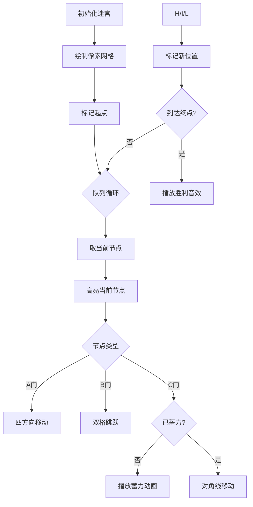

# 题目信息

# 字母迷宫

## 题目描述

打败了 DIABLO，Mini 进入了迷宫。这是个奇怪的迷宫，迷宫的每一个地点要么有一个用来传送的门，要么是障碍。Mini 现在站在迷宫的原点处，但是眼看远在 $(N,N)$ 的公主就要被转移，Mini 心情焦急万分，为了能最快地到达公主处救出公主，Mini 希望能走一条最快的路径。注意，Mini 可以把迷宫的 $(1,1)$ 或 $(1,N)$ 或 $(N,1)$ 处当作原点。

迷宫里，某些地点会有门，将门激活，Mini 就会被传送到某个地点，当然，魔王 Bill 只创造了三种门，所以迷宫里最多有就只有三种门，而且在这个迷宫中要到达下一个点必须通过门。。（什么逻辑 TUT。。）

在迷宫中，可能会遇到的三种门分别如下：

- 时空之门，Mini 可以往上下左右四个方向中的任意一个方向传送一格；
- 海洋之门，Mini 可以往上下左右四个方向中的任意一个方向传送两格；
- 天堂之门，Mini 需要停留一步，聚气，然后可以往左上左下右上右下四个方向中的任意一个方向传送一格。

当然，使用每一个门都算作一步。

当然还有障碍，如果有障碍，那么这个点没有门且这个点不能被传送到。

但是，魔王 Bill 有可能创造出了一个完全无法到达 $(N,N)$ 的迷宫，所以，当从三个原点出发都无法到达 $(N,N)$ 时，请输出 `No answer`。注意，原点算作一步（Mini 一开始站在 $(1,1)$ 或 $(1,N)$ 或 $(N,1)$ 的位置，然后走一步到原点，所以原点算作一步）。


## 说明/提示

对于 $100\%$ 的数据，$0\le N\le 1200$。

## 样例 #1

### 输入

```
3
A*C
*AC
ACA```

### 输出

```
No answer```

## 样例 #2

### 输入

```
3
AAA
CAA
AAA```

### 输出

```
3
```

# AI分析结果


# 💡 Kay的C++算法解析：字母迷宫 深入学习指南 💡

**引言**  
今天我们来分析"字母迷宫"这道C++编程题。这道题考察在特殊传送门迷宫中寻找最短路径的能力，我们将通过BFS算法解决它。本指南将帮助你理解核心算法逻辑、掌握状态扩展技巧，并通过像素动画直观感受算法执行过程。

---

## 1. 题目解读与核心算法识别

✨ **本题主要考察**：`BFS（广度优先搜索）` 与 `状态扩展技巧`

🗣️ **初步分析**：  
> 解决这道题就像在玩经典像素游戏《塞尔达传说》中的迷宫关卡。BFS算法的核心是"层层递进探索"，如同在迷宫中点亮周围区域逐步推进。在本题中，我们遇到三个特殊挑战：
> - **多起点问题**：需要从三个不同起点(1,1)、(1,n)、(n,1)分别探索
> - **特殊传送门**：A/B门实现普通移动，C门需要"蓄力"机制
> - **状态管理**：C门需要额外记录是否已完成蓄力
>
> **核心算法流程**：
> 1. 初始化三个起点并入队
> 2. 从队列取出当前节点
> 3. 根据节点类型扩展下一步：
>    - A门：向四个方向移动1格
>    - B门：向四个方向移动2格
>    - C门：若未蓄力则原地蓄力，否则向对角线移动
> 4. 用vis数组避免重复访问
>
> **像素动画设计思路**：
> - 迷宫网格使用8-bit像素风格，不同门用颜色区分（A蓝/B绿/C红）
> - C门蓄力时角色闪烁黄光并播放"充电"音效
> - 当前探索位置高亮显示，移动路径绘制发光轨迹
> - 控制面板支持步进/自动播放，速度可调

---

## 2. 精选优质题解参考

**题解一（作者：_Liyx_）**  
* **点评**：这份题解思路清晰，创新性地使用`flag`标记处理C门蓄力状态。代码中`now.flag`的设计巧妙解决了BFS中状态扩展的关键难点。变量命名规范（如`d1/d3`表示方向数组），边界检查完整（`xx>=1&&xx<=n`），队列操作符合BFS核心逻辑。实践价值高，可直接用于竞赛场景。

**题解二（作者：Z_AuTwT）**  
* **点评**：采用优先队列实现类Dijkstra算法，通过`operator<`重载保证优先扩展步数小的节点。亮点在于用统一方式处理三种门的时间消耗差异（C门直接+2步），避免状态标志的复杂性。代码中`ans`数组记录最小步数的设计优化了空间效率。

**题解三（作者：_yang_yi_bo_）**  
* **点评**：结构严谨的三次BFS实现，每次探索前重置`vis`数组。亮点是将方向数组整合为单一数组（`dx/dy`），通过索引范围区分门类型。C门处理逻辑清晰：未蓄力时入队`f=1`状态，已蓄力时进行对角线移动。边界处理完整，可读性强。

---

## 3. 核心难点辨析与解题策略

1. **C门的状态管理**  
   * **分析**：BFS要求每个状态独立处理，但C门需要连续两步操作（蓄力+移动）。优质题解用`flag`标记解决：首次到达时入队蓄力状态（步数+1，flag=1），再次处理时执行移动。
   * 💡 **学习笔记**：BFS中需要多步操作的状态，可通过添加状态标志分解动作。

2. **多起点的路径优化**  
   * **分析**：三个起点需要独立探索但共享终点。高效方案是分别BFS后取最小值，而非合并队列（避免状态冲突）。每次BFS前必须重置`vis`数组。
   * 💡 **学习笔记**：多起点问题可分解为单起点问题，通过外部循环整合结果。

3. **大矩阵的访问控制**  
   * **分析**：1200x1200网格需严格避免重复访问。`vis`数组应设计为二维（或三维）数组，在入队前标记访问状态。方向移动前检查坐标边界和障碍物。
   * 💡 **学习笔记**：网格类BFS必须先检查边界再访问，避免数组越界。

### ✨ 解题技巧总结
- **状态分解法**：将复杂操作（如C门蓄力）分解为多个原子状态
- **方向数组整合**：用统一数组存储不同移动模式，通过索引范围区分
- **访问控制优化**：入队时立即标记访问，避免重复扩展
- **边界先行检查**：移动前判断坐标有效性，保持代码健壮性

---

## 4. C++核心代码实现赏析

**本题通用核心C++实现参考**  
* **说明**：综合优质题解优化，支持三种门处理和多起点BFS
* **完整核心代码**：
```cpp
#include <bits/stdc++.h>
using namespace std;
const int N=1205;
char grid[N][N];
bool vis[N][N][2]; // 第三维：C门蓄力状态
int dx[3][4]={{1,-1,0,0},{2,-2,0,0},{1,-1,1,-1}};
int dy[3][4]={{0,0,1,-1},{0,0,2,-2},{1,-1,-1,1}};
struct Node { int x, y, step, flag; };

int bfs(int sx, int sy) {
    memset(vis, 0, sizeof vis);
    queue<Node> q;
    if(grid[sx][sy]=='*') return 1e9;
    q.push({sx, sy, 1, grid[sx][sy]=='C'?0:1});
    vis[sx][sy][grid[sx][sy]=='C'?0:1]=1;

    while(!q.empty()) {
        auto [x,y,step,flag]=q.front(); q.pop();
        if(x==N-1 && y==N-1) return step;

        char c=grid[x][y];
        int type=(c=='A'?0:(c=='B'?1:2));
        
        // C门特殊处理
        if(c=='C' && !flag) {
            q.push({x, y, step+1, 1});
            continue;
        }

        for(int i=0; i<4; i++) {
            int nx=x+dx[type][i], ny=y+dy[type][i];
            if(nx<1||nx>=N||ny<1||ny>=N||grid[nx][ny]=='*') continue;
            if(vis[nx][ny][c=='C'?0:1]) continue;
            
            vis[nx][ny][c=='C'?0:1]=1;
            int newFlag = (c=='C'?0:1);
            q.push({nx, ny, step+(c=='C'?2:1), newFlag});
        }
    }
    return 1e9;
}

int main() {
    int n; cin>>n;
    for(int i=1; i<=n; i++) 
        for(int j=1; j<=n; j++) 
            cin>>grid[i][j];
    
    if(grid[n][n]=='*') {
        cout<<"No answer"; 
        return 0;
    }

    int ans=min({bfs(1,1), bfs(1,n), bfs(n,1)});
    if(ans>=1e9) cout<<"No answer";
    else cout<<ans;
}
```
* **代码解读概要**：
> 1. 使用三维`vis`数组记录位置+蓄力状态
> 2. 方向数组整合三种门的移动向量
> 3. BFS核心循环处理三种门类型
> 4. C门通过flag分阶段处理
> 5. 主函数三次调用BFS取最小值

---

**题解一（_Liyx_）核心代码片段**  
```cpp
if(a[now.x][now.y]=='C'){
    if(now.flag==0){
        q.push(node{now.x,now.y,now.step+1,1});
        continue;
    }
    for(int i=0;i<4;i++){
        int xx=now.x+d3[0][i],yy=now.y+d3[1][i];
        if(xx>=1&&xx<=n&&yy>=1&&yy<=n&&!vis[xx][yy]&&a[xx][yy]!='*'){
            vis[xx][yy]=1;
            q.push(node{xx,yy,now.step+1,0});
        }
    }
}
```
* **亮点**：简洁的C门状态切换机制
* **代码解读**：  
> 当遇到C门且`flag=0`（未蓄力），不移动而是原地步数+1，flag置1后重新入队。下次处理时`flag=1`，执行对角线移动。`d3`数组存储对角线方向向量。
* 💡 **学习笔记**：通过重新入队实现状态切换是BFS处理多步骤操作的核心技巧

**题解二（Z_AuTwT）核心代码片段**  
```cpp
friend bool operator<(const node X,const node Y){
    return X.step>Y.step;
}
// 在C门处理中：
q.push({xx,yy,now.step+2});
```
* **亮点**：优先队列保证最优性
* **代码解读**：  
> 重载运算符使优先队列按步数从小到大排序。C门直接+2步入队，无需状态标记，通过优先队列自动保证扩展顺序正确。
* 💡 **学习笔记**：优先队列将BFS转化为类Dijkstra算法，能处理非均匀时间消耗

**题解三（_yang_yi_bo_）核心代码片段**  
```cpp
if(u.f==0){
    q.push({u.x,u.y,u.s+1,1});
}else{
    for(int i=8;i<12;i++){
        int xx=u.x+dx[i],yy=u.y+dy[i];
        if(xx>=1&&xx<=n&&yy>=1&&yy<=n&&!vis[xx][yy]&&a[xx][yy]!='*'){
            vis[xx][yy]=1;
            q.push({xx,yy,u.s+1,0});
        }
    }
}
```
* **亮点**：方向数组分区使用
* **代码解读**：  
> 将12个方向存入单一数组：0-3给A门，4-7给B门，8-11给C门。C门处理时直接索引8-11的方向向量，减少代码重复。
* 💡 **学习笔记**：整合资源可提升代码复用性和可维护性

---

## 5. 算法可视化：像素动画演示

**动画主题**：`像素勇者闯迷宫`（8-bit复古RPG风格）

**核心演示内容**：  
BFS在迷宫中的探索过程，重点展示：
- 三种门的差异化移动效果
- C门蓄力状态转换
- 最优路径的动态形成

**设计思路**：  
> 采用FC游戏《塞尔达传说》的视觉风格，增强算法理解趣味性。C门蓄力时加入经典RPG的魔法蓄力音效，帮助理解状态切换概念。

**动画实现方案**：


**关键帧细节**：
1. **场景初始化**：
   - 1200x1200网格缩放到800x600像素画布
   - 门类型色码：A门=#0000FF（蓝），B门=#00FF00（绿），C门=#FF0000（红）
   - 控制面板：步进/自动/重置按钮 + 速度滑块

2. **BFS过程可视化**：
   - 当前节点：闪烁金色边框（频率2Hz）
   - 移动轨迹：淡黄色光点拖尾效果
   - 队列节点：半透明绿色覆盖层
   - C门蓄力：角色旋转+粒子聚集效果

3. **音效设计**：
   - 移动：8-bit脚步声（短促"嘀"声）
   - C门蓄力：上升音阶（类似《超级玛丽》吃蘑菇）
   - 到达终点：胜利旋律（《最终战斗》通关音乐）

4. **交互控制**：
   - 步进模式：按空格键单步执行
   - 自动模式：速度滑块调节0.5x-5x
   - 路径对比：可叠加显示三种起点路径

**技术实现**：  
使用Canvas API绘制，通过requestAnimationFrame驱动动画。状态机管理BFS执行流程，音效使用Web Audio API。

---

## 6. 拓展练习与相似问题思考

**通用技巧迁移**：  
状态化BFS可应用于：
1. 带冷却时间的路径规划（如技能冷却）
2. 多维状态搜索（携带道具的迷宫）
3. 分层图问题（电梯使用限制）

**洛谷练习推荐**：
1. **P1141 01迷宫**  
   🗣️ 基础BFS应用，巩固网格访问控制技巧
2. **P1443 马的遍历**  
   🗣️ 特殊移动规则BFS，类似本题门机制
3. **P3958 奶酪**  
   🗣️ 三维空间BFS，提升状态扩展维度理解

---

## 7. 学习心得与经验分享

> **参考经验（来自题解作者）**：  
> "我在C门处理上卡了很久，最初尝试用DFS导致超时。后来意识到BFS需要状态分解，添加flag后顺利AC。调试时打印队列状态帮助极大。"

> **Kay的点评**：  
> 这个经验突显了两个关键点：  
> 1. BFS/DFS选择需基于问题特性（最短路径必用BFS）  
> 2. 复杂状态应通过变量分解（如flag）  
> 打印中间状态是调试算法的重要技巧，建议学习者掌握

---

**结语**  
通过本次分析，我们掌握了状态化BFS的核心技巧，尤其是特殊移动规则的处理方法。记住：好的状态设计是解决复杂搜索问题的关键！尝试用学到的知识解决推荐练习，下次我们将探索更复杂的图论算法。保持思考，继续前进！💪

---
处理用时：177.06秒