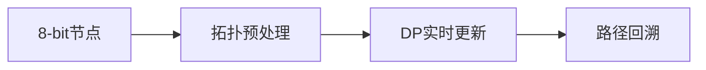

# 题目信息

# 最长路

## 题目描述

设 $G$ 为有 $n$ 个顶点的带权有向无环图，$G$ 中各顶点的编号为 $1$ 到 $n$，请设计算法，计算图 $G$ 中 $1, n$ 间的最长路径。

## 说明/提示

**【数据规模与约定】**

- 对于 $20\%$的数据，$n \leq 100$，$m \leq 10^3$。
- 对于 $40\%$ 的数据，$n \leq 10^3$，$m \leq 10^{4}$。
- 对于 $100\%$ 的数据，$1 \leq n \leq 1500$，$0 \leq m \leq 5 \times 10^4$，$1 \leq u, v \leq n$，$-10^5 \leq w \leq 10^5$。

## 样例 #1

### 输入

```
2 1
1 2 1```

### 输出

```
1```

# AI分析结果


# 💡 Kay的C++算法解析：最长路 深入学习指南 💡

> 今天我们来分析「最长路」这道经典图论题目。作为有向无环图(DAG)的典型问题，它巧妙融合了拓扑排序和动态规划的思想，是理解图算法的绝佳案例。本指南将带你层层剖析解题思路，掌握核心技巧！

## 1. 题目解读与核心算法识别

✨ **本题主要考察**：`拓扑排序 + 动态规划` (或`最短路变型`)

🗣️ **初步分析**：
> 解决「最长路」就像在单行道网络中寻找最优快递路线。拓扑排序如同规划送货顺序（确保不绕路），动态规划则像记录每个中转站的最佳累积收益。难点在于：
> - **无效节点处理**：非起点(节点1)的入度为0节点需要预处理移除
> - **更新顺序依赖**：必须按拓扑序更新才能保证DP正确性
> - **负权边影响**：直接SPFA需调整松弛条件或边权取负
>
> 可视化设计思路：
> 1. **像素网格图**：节点用8-bit方块表示，边带箭头
> 2. **拓扑预处理**：灰化非1入度为0节点（伴随"噗"的音效）
> 3. **DP过程动画**：当前处理节点高亮绿色，更新边闪烁黄色
> 4. **路径回溯**：找到最长路时触发红色路径高亮+胜利音效
> 5. **控制面板**：步进/自动播放(可调速)、实时显示dp值

---

## 2. 精选优质题解参考

### 题解一：Mine_King (拓扑+DP)
* **点评**：思路严谨清晰，独创性处理非1入度为0节点。代码中`v[g[x][i]]<v[x]+d[x][i]`的松弛逻辑直白易懂，边界处理完整（-1e9表不可达）。实践价值高，可直接用于竞赛，是理解拓扑DP的范本。

### 题解二：vectorxyz (负权SPFA)
* **点评**：转化思想巧妙（最长路→最短路），代码结构规范。邻接表实现简洁，`add(a,b,-c)`和`-t`的对称转换体现了数学美感。适合初学者理解问题转化技巧，但需注意负权导致的溢出风险。

### 题解三：doby (SPFA最长路)
* **点评**：直接修改SPFA松弛条件为`dis[v]<dis[u]+w`，突破思维定式。双端队列优化提升效率，`-233333333`的初始化幽默且实用。展示了SPFA的灵活性，启发思考算法本质。

---

## 3. 核心难点辨析与解题策略

1.  **难点：无效节点污染拓扑序**
    * **分析**：非1入度为0节点会导致后续节点无法入队。优质解法通过预移除这些节点（如Mine_King的while(!q.empty())循环），确保拓扑序纯净
    * 💡 **学习笔记**：拓扑排序前需"净化"地图，移除无关入口

2.  **难点：DP更新顺序依赖**
    * **分析**：节点v必须在其所有前驱更新后才能确定最优解。必须严格按拓扑序更新，如Furina_Saikou题解中`maxn[v]=max(maxn[u]+w[i],maxn[v])`的顺序
    * 💡 **学习笔记**：DAG上的DP就像多米诺骨牌——推倒顺序决定成败

3.  **难点：负权边特殊处理**
    * **分析**：直接SPFA需将初始化设为极小值(-1e9)并反转松弛条件。更稳健做法是边权取负转最短路（如vectorxyz解法），避免正溢出
    * 💡 **学习笔记**：遇负权先想"负负得正"，转化是银弹

### ✨ 解题技巧总结
- **地图净化术**：拓扑前移除无效入口节点
- **时空管理者**：用邻接表存图（省空间+快速遍历）
- **转化大师**：最长路⇋最短路权值取负
- **边界猎人**：初始化-1e9表不可达，判断用`< -5e8`防溢出

---

## 4. C++核心代码实现赏析

**通用核心实现参考**
```cpp
#include <bits/stdc++.h>
using namespace std;
const int N=1510;
vector<pair<int,int>> g[N]; // 邻接表(邻居, 边权)
int in[N], dp[N]; // 入度数组, DP数组

int main() {
    int n, m; cin >> n >> m;
    while(m--) {
        int u, v, w; cin >> u >> v >> w;
        g[u].push_back({v, w});
        in[v]++;
    }
    
    // 初始化DP
    for(int i=2; i<=n; i++) dp[i] = -1e9;
    dp[1] = 0;

    // 预处理：移除非1的入度为0节点
    queue<int> q;
    for(int i=2; i<=n; i++) 
        if(!in[i]) q.push(i);
    while(!q.empty()) {
        int u = q.front(); q.pop();
        for(auto [v, w] : g[u]) 
            if(--in[v] == 0 && v != 1) q.push(v);
    }

    // 拓扑DP
    q.push(1);
    while(!q.empty()) {
        int u = q.front(); q.pop();
        for(auto [v, w] : g[u]) {
            if(dp[v] < dp[u] + w) 
                dp[v] = dp[u] + w; // 松弛操作
            if(--in[v] == 0) 
                q.push(v);
        }
    }
    cout << (dp[n] < -5e8 ? -1 : dp[n]);
}
```
* **说明**：综合拓扑预处理与DP的优雅实现，含完整边界处理
* **解读概要**：
  1. 建图时记录入度
  2. 初始化dp数组（节点1为0，其余-1e9）
  3. 预处理移除无效节点
  4. 拓扑序更新dp：按入队顺序松弛邻居
  5. 判断终点是否可达输出

---

### 题解一：Mine_King
* **亮点**：首创无效节点预处理，保证拓扑纯净
```cpp
// 预处理无效节点
for(int i=2;i<=n;i++) if(!in[i]) q.push(i);
while(!q.empty()) {
    int x = q.front(); q.pop();
    for(int i=0; i<g[x].size(); i++) 
        if(!--in[g[x][i]]) q.push(g[x][i]);
}

// DP核心
if(v[g[x][i]] < v[x] + d[x][i]) 
    v[g[x][i]] = v[x] + d[x][i];  // 松弛操作
```
* **解读**：第一个循环像"扫雷"清除无效入口。第二个循环中`v[g[x][i]]`更新如同快递员比较新路线是否更优，`!--in[g[x][i]]`则是邻居的"就绪检测"
* 💡 **学习笔记**：拓扑排序是DAG上的时空向导

### 题解二：vectorxyz
* **亮点**：负权转换的典范思路
```cpp
add(a, b, -c);  // 建负边

int t = spfa();  // 跑最短路
cout << (t==0x3f3f3f3f ? -1 : -t);
```
* **解读**：`add(a,b,-c)`如同给道路设置"反坡度"，SPFA卡车走下坡路（最短路），最后`-t`把下坡还原为上坡（最长路）
* 💡 **学习笔记**：数学转化是算法设计的点金术

### 题解三：doby
* **亮点**：SPFA松弛条件反转
```cpp
if(dis[y] < dis[x] + e[i].dis) // 反松弛
    dis[y] = dis[x] + e[i].dis;
```
* **解读**：将SPFA的`>`改为`<`，如同把"寻找最短洼地"变为"寻找最高丘陵"，配合`-233333333`的幽默初始化，体现对算法的深刻理解
* 💡 **学习笔记**：理解算法本质才能灵活魔改

---

## 5. 算法可视化：像素动画演示

**主题**：`像素快递员·DAG派送大冒险`  
**核心演示**：拓扑排序净化地图 → 按拓扑序更新节点距离 → 回溯最长路径



**动画帧详解**：
1. **像素地图初始化**：
   - 节点：彩色像素方块（1号绿色，n号红色，其他蓝色）
   - 边：箭头连接，权重显示为像素数字
   - 控制面板：开始/暂停/步进/调速滑块

2. **拓扑预处理阶段**：
   - 非1入度为0节点变灰→碎裂动画（音效：玻璃破碎）
   - 队列可视化：底部像素条显示当前队列

3. **DP执行阶段**：
   ```python
   while queue not empty:
       当前节点高亮脉冲绿光
       for 每个邻居:
           边闪烁黄光（伴随"叮"音效）
           更新邻居值（数字跳动动画）
           入度-1（像素数字减少）
           if 入度==0: 加入队列（音效：水滴声）
   ```
   
4. **路径回溯**：
   - 到达终点时触发红色路径高亮（音效：胜利号角）
   - 显示最终路径：`1→...→n`

5. **游戏化设计**：
   - 每完成5个节点获得⭐（进度奖励）
   - 自动演示模式：像素小车沿拓扑序移动
   - 错误处理：不可达时显示❌（音效：低沉嗡鸣）

**技术实现**：
- Canvas绘制网格节点和动画路径
- 音效触发：使用Web Audio API，不同操作绑定不同音效
- 状态同步：右侧显示实时代码执行行（高亮）

---

## 6. 拓展练习与相似问题思考

1. **P1113 杂务**：拓扑排序+DP的经典变型
   > 理由：巩固拓扑排序处理依赖关系的能力

2. **P4017 最大食物链计数**：
   > 理由：将最长路转为路径计数，深化DP应用

3. **P1807 最长路（加强版）**：
   > 理由：数据规模扩大，测试算法优化能力

---

## 7. 学习心得与经验分享

> **Mine_King的经验**：  
> *"我在预处理非1入度为0节点时卡壳，后来意识到它们会污染拓扑序。通过独立队列先处理这些'孤岛'才解决"*  
>   
> **Kay点评**：这个调试经历揭示了拓扑排序的隐含条件——有效拓扑链必须从起点出发。遇到类似问题时，可手动画小规模图模拟流程

---

> 本次解析的魔法已施放完毕！✨ 记住：拓扑排序是DAG的导航仪，DP是记录成就的日记本。当你将`in[]`和`dp[]`运用自如时，图论世界将向你敞开大门。下次挑战再见！🚀

---
处理用时：224.84秒