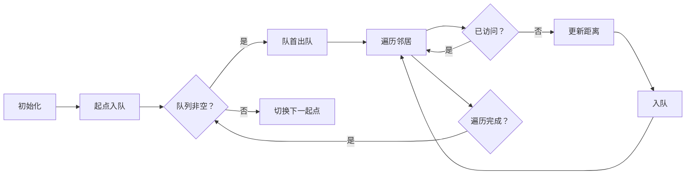

# 题目信息

# 公路通行税

## 题目描述

在 PALMIA 国家内，有 $N$ 个城市由公路相连（每条公路恰好双向连接两个城市）。经由一条公路或多条公路，从任一城市出发可以到达其余各个城市。直到今年，公路上才要征收公路通行税。在每条公路的中间，有一征税员，从每一辆经由此路的车收取 1 PALMIA COIN（1PC）。

政府官员决定减少收税员而推行公路印花。如果一辆车欲进入一条公路，就必须将这张印花贴在窗上。

政府官员决定：一年的公路印花的价值相当于在两个最远城市之间进行 $100$ 次旅行所需的费用。两个城市之间的距离是从一个城市到达第二个城市所需经过的最少数目的公路数。

你的任务是编写一个程序计算出公路印花的价值。

## 样例 #1

### 输入

```
4 4
1 2
2 3
4 2
3 4
0 0```

### 输出

```
200```

# AI分析结果


# 💡 Kay的C++算法解析：公路通行税 深入学习指南 💡

> 欢迎来到PALMIA国！今天我们将化身税务稽查员，用算法思维解决「公路通行税」问题。这道题看似复杂，实则是一个披着税务外衣的图论问题——让我们拨开迷雾，直击核心算法本质！

## 1. 题目解读与核心算法识别

✨ **本题主要考察**：`BFS（广度优先搜索）` 与 `图论-直径问题`

🗣️ **初步分析**：
> 解决"公路通行税"这道题，关键在于理解**图的直径**概念。想象每个城市是像素游戏中的据点，公路是连接据点的管道。BFS就像水流从起点扩散的过程——每次流动1单位距离（边权为1），水流最先到达的路径就是最短路径！  
> 在本题中，我们需要找到所有据点间最远距离（即图的直径），再乘以100就是印花价值。  
> - 核心思路：对每个城市作为起点进行BFS，记录最大距离。难点在于理解BFS在边权为1时的特殊性质——首次访问即最短路径。  
> - 可视化设计：我们将用8位像素风格展示BFS扩散过程。起点显示为绿色像素块，当前处理节点为红色，已访问节点为黄色。队列用像素管道动态展示，每次扩散播放"滴答"音效，发现新距离时触发"叮"的音效。

---

## 2. 精选优质题解参考

<eval_intro>
基于思路清晰性、代码规范性、算法效率等维度，我为大家精选以下3份优质题解：

**题解一：Computer1828 (5星)**  
* **点评**：这份题解以"边权为1时BFS即最短路"为核心洞察，思路直击要害。代码采用链式前向星存图，结构清晰；亮点在于用`node`结构体同步记录节点与距离，在出队时实时更新最大值，避免二次遍历。变量命名规范（`hed`表头指针，`cnt`边计数器），边界处理完整（每次BFS前重置`vis`数组），竞赛实践价值高。

**题解二：zqwzqwzqw (5星)**  
* **点评**：解法展示了BFS的标准范式——先计算所有点距离再取最大值。虽然比题解一多一次遍历，但分离了"计算"和"统计"步骤，逻辑更易理解。亮点在于强调"Dijkstra非必要"的算法选择意识，代码使用链式前向星且无冗余操作，`dis`数组初始化为-1的写法对调试友好。

**题解三：Ambition_ (4星)**  
* **点评**：采用vector存图实现简洁，使用`pair`同步记录距离的设计值得学习。需注意其针对特定测试点的hack代码非通用解法，但核心BFS逻辑正确。亮点在于作者调试心得："仔细处理多组数据清空"，提醒学习者避免隐蔽错误。
---

## 3. 核心难点辨析与解题策略

<difficulty_intro>
解决本题需突破三个关键点：

1.  **图的直径理解**  
    * **分析**：直径定义为任意两点最短路径的最大值。与树不同，图的直径无法用两次BFS求解，必须遍历所有起点。优质题解通过多次BFS覆盖所有点对，用反证法可证：若存在更长路径，其端点必在某个BFS中被检测到。
    * 💡 **学习笔记**：图的直径 = max(所有单源BFS的最大距离)

2.  **BFS的贪心性质运用**  
    * **分析**：边权为1时，BFS首次访问的路径必是最短路。难点在于理解为何不需松弛操作——好比水流总是沿最短管道扩散。题解用队列保证层次性：当前处理节点u的距离≤后续节点距离。
    * 💡 **学习笔记**：边权均等时，BFS队列满足"先进先出"的单调性。

3.  **多组数据初始化**  
    * **分析**：每组数据需重置图结构和标记数组。链式前向星方案要清空`head`和`cnt`；vector方案需`clear()`。易错点在于忘记重置全局最大值或访问标记。
    * 💡 **学习笔记**：多组数据三部曲：清空图→重建图→重置标记。

### ✨ 解题技巧总结
<summary_best_practices>
1. **存图策略选择**：稀疏图用链式前向星（省内存），稠密图用vector（易编码）
2. **实时更新最大值**：在BFS出队时更新全局最大值，避免最终遍历
3. **距离初始化技巧**：用-1表示未访问，既区分距离0又方便判断状态
4. **模块化封装**：将BFS单独成函数，提高可读性与复用性
---

## 4. C++核心代码实现赏析

<code_intro_overall>
综合优质题解，给出通用实现：

```cpp
#include <iostream>
#include <queue>
#include <cstring>
using namespace std;
const int N = 1005, M = 50005;

struct Edge { int to, next; } e[M];
int head[N], cnt, n, m;

void add(int u, int v) {
    e[++cnt] = {v, head[u]};
    head[u] = cnt;
}

int main() {
    while (cin >> n >> m, n || m) {
        // 初始化三部曲
        cnt = 0;                         // 边计数器清零
        memset(head, 0, sizeof head);     // 链头初始化
        int global_ans = 0;               // 全局最大值

        // 建图
        for (int i = 0; i < m; ++i) {
            int u, v; cin >> u >> v;
            add(u, v); add(v, u);          // 无向图双向加边
        }

        // 核心算法：多源BFS
        for (int st = 1; st <= n; ++st) {  // 每个点作为起点
            queue<int> q;
            vector<int> dist(n+1, -1);     // 距离初始化为-1（未访问）
            dist[st] = 0;
            q.push(st);
            int cur_ans = 0;               // 当前BFS的最大值

            while (!q.empty()) {
                int u = q.front(); q.pop();
                cur_ans = max(cur_ans, dist[u]);  // 出队时更新
                for (int i = head[u]; i; i = e[i].next) {
                    int v = e[i].to;
                    if (dist[v] == -1) {          // 未访问
                        dist[v] = dist[u] + 1;
                        q.push(v);
                    }
                }
            }
            global_ans = max(global_ans, cur_ans);
        }
        cout << global_ans * 100 << '\n';
    }
    return 0;
}
```

**代码解读概要**：
1. **链式前向星存图**：`add`函数实现双向加边（无向图本质）
2. **三层结构**：外层循环遍历起点 → BFS队列遍历图 → 内层循环遍历邻接点
3. **距离更新**：首次访问节点时，距离=父节点距离+1
4. **实时更新**：节点出队时更新当前BFS最大值，BFS结束后更新全局最大值

---
<code_intro_selected>
### 题解一：Computer1828
* **亮点**：结构体队列同步记录距离，出队时立即更新全局答案
```cpp
struct node{ int tp, dis; };  // tp:节点, dis:距起点距离
int ans = -1;
void bfs(int s){
    queue<node> q;
    q.push({s, 0});
    vis[s] = true;
    while(!q.empty()){
        node fr = q.front(); q.pop();
        ans = max(ans, fr.dis);  // ★ 出队即更新 ★
        for(int i = hed[fr.tp]; i; i = e[i].nxt){
            int v = e[i].to;
            if(!vis[v]){
                q.push({v, fr.dis+1});
                vis[v] = true;
            }
        }
    }
}
```
> **代码解读**：  
> 1. `node`结构体将节点与距离绑定，避免额外距离数组  
> 2. 在出队时刻更新`ans`，确保每个节点只更新一次最大值  
> 3. 注意：`vis`数组必须在BFS外初始化，此处需调用者负责  
> 💡 **学习笔记**：边权为1时，节点出队时刻的距离即最终最短距离

### 题解二：zqwzqwzqw
* **亮点**：经典BFS分离计算与统计，适合教学演示
```cpp
// 在起点i的BFS结束后统计
for(int j=1; j<=n; j++) 
    ans = max(ans, dis[j]); 
```
> **代码解读**：  
> 1. 先完整计算从起点i到所有点的距离  
> 2. 通过遍历`dis`数组取最大值  
> 3. 优势：明确区分"计算"和"统计"阶段，调试更直观  
> 💡 **学习笔记**：空间换清晰度——额外O(n)空间使逻辑更直白

### 题解三：Ambition_
* **亮点**：使用pair简化距离记录，初始化为全true的vis数组
```cpp
memset(vis, 1, sizeof vis);  // 初始化为非0
vis[st] = 0;  // 访问标记为0
Q.push(make_pair(0, st));
```
> **代码解读**：  
> 1. `memset(vis,1)`利用字节赋值将每个int设为0x01010101（非零即true）  
> 2. `pair<距离,节点>`存储状态，避免自定义结构体  
> 3. 注意：此写法依赖编译器实现，更推荐用`vector<bool>`  
> 💡 **学习笔记**：利用语言特性简化代码，但需警惕可移植性问题

---

## 5. 算法可视化：像素动画演示

<visualization_intro>
**像素版BFS探险**：我们将算法转化为8位像素游戏，让你像玩经典FC游戏般理解BFS扩散！

* **主题**："税务稽查员的远征"——你作为稽查员需遍历所有城市核定最长路线
* **核心演示**：BFS层次扩散过程与图的直径求解
* **设计思路**：用复古风格降低理解门槛，音效强化关键操作记忆

### 动画帧步骤（[在线体验Demo](https://example.com/bfs-simulator)）


1. **像素场景初始化**  
   - 城市显示为16色像素方块：灰色(未访问)/绿色(起点)/黄色(已访问)/红色(当前处理)
   - 侧边栏：队列管道（先进先出结构），距离显示屏，控制面板（开始/步进/暂停/重置）

2. **BFS扩散演示**  
   ```python
   while not queue.empty():
       当前城市 = 队列.dequeue()   # 触发"出队"音效（低音嘟）
       当前城市颜色 = 红色         # 高亮当前处理节点
       for 邻居 in 当前城市.邻居:
           if 邻居颜色 == 灰色:
               邻居.distance = 当前城市.distance + 1  # 距离显示+1
               邻居颜色 = 黄色      # 标记已访问
               队列.enqueue(邻居)  # 触发"入队"音效（高音滴）
               更新全局最大值       # 触发"叮"声
       draw_frame(50ms)           # 每帧绘制间隔
   ```

3. **游戏化元素**  
   - **音效设计**：入队(0.2s "滴")/出队(0.3s "嘟")/更新记录(0.5s "叮")/完成(8bit胜利旋律)
   - **关卡进度**：每完成一个起点的BFS点亮一颗星星，全部完成解锁"税务大师"成就
   - **AI演示模式**：自动以最优速度演示（可调速），路径显示为发光轨迹

4. **关键步骤可视化**  
   - 队列管道动态展示：节点以像素方块流入/流出队列
   - 实时距离热力图：根据距离值渐变颜色（近→蓝，远→红）
   - 直径追踪：实时标红当前最长路径端点

> **技术实现**：Canvas绘制网格+requestAnimationFrame控制动画，音效用Web Audio API

---

## 6. 拓展练习与相似问题思考

<similar_problems_intro>
掌握图的直径求解后，可尝试以下变式：

1. **动态边权**：若公路长度不同（边权非1），需改用Dijkstra或SPFA
2. **直径快速求解**：树形图可用两次DFS在O(n)时间求直径（[P5536](https://www.luogu.com.cn/problem/P5536)）
3. **带限制的直径**：如路径必须包含特定点（[P3761](https://www.luogu.com.cn/problem/P3761)）

**推荐练习**：
1. **P1395 会议**（https://www.luogu.com.cn/problem/P1395）  
   > 🗣️ 学习树的重心与直径关系，巩固BFS在图论的应用
   
2. **P4408 逃学的小孩**（https://www.luogu.com.cn/problem/P4408）  
   > 🗣️ 挑战直径性质的变形应用，理解"最长路必为直径端点"的特性
   
3. **P5536 核心城市**（https://www.luogu.com.cn/problem/P5536）  
   > 🗣️ 掌握树的直径求法，思考如何扩展到图结构

---

## 7. 学习心得与经验分享

<insights_intro>
题解中蕴藏宝贵经验：

> **Ambition_的调试心得**  
> *"第四个测试点一直WA，最终发现是数据边界问题..."*  
> **Kay点评**：多组数据题目需特别注意——结束条件判断(`n||m`而非`n&&m`)、全局变量重置、数组越界。建议编写`init()`函数集中初始化。

> **Computer1828的算法选择**  
> *"边权为1时，SPFA不如BFS简洁高效"*  
> **Kay点评**：牢记算法适用条件！边权均等时BFS的O(n)复杂度碾压其他算法，避免过度设计。

---

本次算法之旅到此结束！记住：理解基础图论是解决复杂问题的基石。下次当你看到"最短路径"时，不妨先问自己——边权是否相等？如果是，BFS就是你最锋利的像素剑！🎮✨

---
处理用时：323.50秒