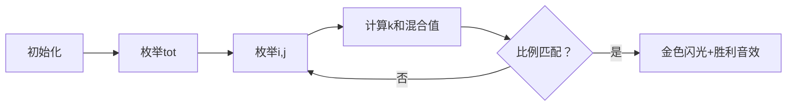

# 题目信息

# [USACO3.2] 饲料调配 Feed Ratios

## 题目背景

农夫约翰从来只用调配得最好的饲料来喂他的奶牛。饲料用三种原料调配成：大麦，燕麦和小麦。他知道自己的饲料精确的配比，在市场上是买不到这样的饲料的。他只好购买其他三种混合饲料（同样都由三种麦子组成），然后将它们混合，来调配他的完美饲料。


## 题目描述

给出三组整数，表示 大麦：燕麦：小麦 的比例，找出用这三种饲料调配 x：y：z 的饲料的方法。

例如，给出目标饲料 3：4：5 和三种饲料的比例：

1:2:3
3:7:1
2:1:2
你必须编程找出使这三种饲料用量最少的方案，要是不能用这三种饲料调配目标饲料，输出“NONE”。“用量最少”意味着三种饲料的用量（整数）的和必须最小。


对于上面的例子，你可以用8份饲料1，1份饲料2，和5份饲料3，来得到7份目标饲料：

8\*(1:2:3) + 1\*(3:7:1) + 5\*(2:1:2) = (21:28:35) = 7\*(3:4:5)

表示饲料比例的整数以及目标饲料的都是小于100的非负整数。表示各种饲料的份数的整数，都小于100。一种混合物的比例不会由其他混合物的比例直接相加得到。


## 说明/提示

题目翻译来自NOCOW。

USACO Training Section 3.2


## 样例 #1

### 输入

```
3 4 5
1 2 3
3 7 1
2 1 2 ```

### 输出

```
8 1 5 7```

# AI分析结果


### 💡 Kay的C++算法解析：饲料调配 Feed Ratios 深入学习指南 💡

**引言**  
今天我们来分析USACO训练题"饲料调配"，这是一道关于比例混合的经典问题。通过本指南，你将掌握多种解题思路的核心技巧，并通过像素动画直观理解算法执行过程。

---

#### 1. 题目解读与核心算法识别
✨ **本题主要考察**：`枚举`与`线性代数应用`  

🗣️ **初步分析**  
> 解决饲料调配问题，核心在于**寻找最小整数解**满足线性组合关系。想象你在调配一款像素游戏中的药水——需要精确混合三种基料（红、蓝、绿像素块）来合成目标颜色。  

- **核心思路**：通过枚举目标比例倍数（k值）或饲料份数组合，验证混合比例是否匹配。难点在于处理比例含0的情况和优化枚举范围。
- **算法流程**：  
  - 计算混合后各成分值：`混合值 = Σ(饲料份数×饲料比例)`  
  - 验证：`混合值 = k × 目标比例`（用乘法避免除0）  
- **可视化设计**：  
  - 用三种颜色像素块代表饲料成分，动态展示份数增加时混合颜色变化  
  - 当匹配目标颜色（金色）时播放胜利音效，并高亮显示当前份数组合  
  - 控制面板支持调速滑块观察不同枚举速度（慢速=手动调试，快速=AI自动求解）

---

#### 2. 精选优质题解参考

**题解一：Youngsc（枚举优化法）**  
* **点评**：此解法通过枚举饲料总量再分配份数，巧妙用`交叉相乘`（`a*y == b*x`）避免除零错误。代码中`tot`控制枚举范围，逻辑清晰；变量名`no[d]`（各成分值）、`to[d]`（目标值）直观体现含义；时间复杂度O(n²)优于三重循环，实践性极强。

**题解二：QianhanOfficial（DFS剪枝）**  
* **点评**：采用DFS按饲料种类顺序搜索，通过`last`参数避免重复组合（如[1,2]和[2,1]等效）。`c1,c2,c3`计数器明确记录份数，递归边界处理干净；剪枝策略（`a-x[i]≥0`）有效减少无效搜索，是学习深度优先搜索的典范。

**题解三：Mingoal（高斯消元法）**  
* **点评**：将问题转化为线性方程组，通过高斯消元求解。亮点在`精度处理`：用`eps=1e-13`避免浮点误差，`(int)(a[i][3]+eps)`解决X.99999取整问题。虽稍复杂，但展示了数学工具的威力，适合进阶学习。

---

#### 3. 核心难点辨析与解题策略

1. **难点1：避免除零错误**  
   * **分析**：当目标比例含0时，直接除法失效。优质解法采用乘法验证（如`no[1]*to[2] == to[1]*no[2]`）或柯西不等式。  
   * 💡 **学习笔记**：比例验证永远用乘法代替除法！

2. **难点2：快速定位最小整数解**  
   * **分析**：枚举顺序决定效率。Youngsc先限定总量再分配份数（O(n²)），优于三重循环（O(n³)）。  
   * 💡 **学习笔记**：缩小枚举范围（如总量≤300）是暴力法的关键优化。

3. **难点3：处理浮点精度误差**  
   * **分析**：高斯消元法需处理浮点数。通过`eps`阈值和`(int)(x+eps)`保证整数转换正确性。  
   * 💡 **学习笔记**：浮点运算必须设置误差容忍度。

✨ **解题技巧总结**  
- **比例转换法**：将`a:b:c = x:y:z` 转化为 `a*y==b*x && b*z==c*y`  
- **枚举优化**：优先枚举目标比例倍数k，份数和自然最小  
- **边界预判**：单独处理全零目标比例（直接输出0）  

---

#### 4. C++核心代码实现赏析

**通用核心实现参考**  
```cpp
#include <iostream>
using namespace std;

int main() {
    int x, y, z, a[3], b[3], c[3];
    cin >> x >> y >> z;
    for (int i = 0; i < 3; i++) cin >> a[i] >> b[i] >> c[i];

    for (int tot = 1; tot <= 300; tot++)          // 枚举总份数
    for (int i = 0; i <= tot; i++)               // 饲料1份数
    for (int j = 0; j <= tot-i; j++) {           // 饲料2份数
        int k = tot - i - j;                     // 饲料3份数
        int no[3] = { 
            i*a[0] + j*a[1] + k*a[2], 
            i*b[0] + j*b[1] + k*b[2],
            i*c[0] + j*c[1] + k*c[2] 
        };
        // 交叉相乘验证比例
        if (no[0]*y == no[1]*x && 
            no[1]*z == no[2]*y && 
            no[0] >= x && no[1] >= y && no[2] >= z) 
        {
            cout << i << " " << j << " " << k << " " << no[0]/x;
            return 0;
        }
    }
    cout << "NONE";
}
```
* **说明**：综合Youngsc和Celebrate思路，使用交叉相乘避免除零，三重循环结构清晰。  
* **解读概要**：  
  1. 外层`tot`枚举总份数（确保解最小）  
  2. 内层`i,j`枚举两种饲料份数，`k`由计算得出  
  3. `no[]`数组存储混合结果，乘法验证比例  

---

#### 5. 算法可视化：像素动画演示

**主题**  
`像素农场主`：在8-bit风格农场中混合三种饲料袋（红/蓝/绿），合成金色饲料  

**动画设计**  


1. **像素元素**  
   - 饲料袋：红色（大麦）、蓝色（燕麦）、绿色（小麦）  
   - 混合槽：显示当前RGB=(混合值)的动态像素方块  
   - 目标槽：固定金色方块（目标比例）  

2. **关键动画**  
   - **枚举过程**：饲料袋按`i,j,k`数量跳动进入混合槽  
   - **比例验证**：混合槽与目标槽并排对比，不相同时抖动并播放错误音效  
   - **成功时刻**：混合槽变金色，显示`+[分数]`并播放《塞尔达》获得道具音效  

3. **交互控制**  
   - 调速滑块：0.5x~5x速度调整（慢速观察细节，快速自动演示）  
   - 单步按钮：逐次枚举，高亮当前变量值  
   - AI模式：自动演示最优解路径（如样例的8-1-5组合）  

4. **技术实现**  
   - Canvas绘制动态饲料袋和混合槽  
   - 音效触发：  
     - 饲料投入：8-bit "噗"声  
     - 匹配成功：16-bit胜利和弦  
     - 匹配失败：短促警报声  

---

#### 6. 拓展练习与相似问题思考

**通用技巧迁移**  
比例枚举和线性方程组思想还可用于：  
1. 化学方程式配平  
2. 游戏合成系统资源计算  
3. 经济模型中的资源最优分配  

**洛谷题目推荐**  
1. **P1029** 最大公约数和最小公倍数问题  
   → 巩固比例与整数分解的关系  
2. **P1061** 矩阵交换行  
   → 学习线性方程组的高斯消元法  
3. **P1150** 打表  
   → 训练枚举优化思维  

---

#### 7. 学习心得与经验分享
> **经验摘录（Youngsc）**：  
> “用乘法代替除法彻底避免了特判0的麻烦”  
>   
> **Kay点评**：  
> 这是极其重要的工程思维！在涉及比例的题目中，整数运算永远比浮点运算可靠。记住：`a/b == c/d` 等价于 `a*d == b*c`。

---

**结语**  
通过本次分析，相信大家掌握了比例问题的核心解题框架——从暴力枚举到数学优化。记住Kay的秘诀：**用乘法思考比例，用范围控制枚举**！下次挑战见！💪

---
处理用时：142.13秒