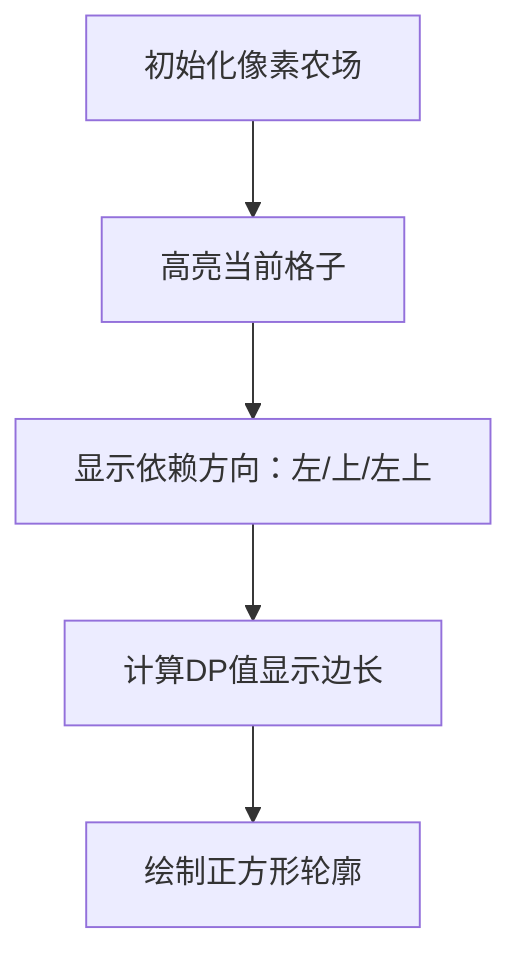

# 题目信息

# [USACO3.3] 家的范围 Home on the Range

## 题目背景

农民约翰在一片边长是N (2 <= N <= 250)英里的正方形牧场上放牧他的奶牛。(因为一些原因，他的奶牛只在正方形的牧场上吃草。)遗憾的是,他的奶牛已经毁坏一些土地。( 一些1平方英里的正方形)


## 题目描述

农民约翰需要统计那些可以放牧奶牛的正方形牧场(至少是2x2的,在这些较大的正方形中没有一个点是被破坏的，也就是说，所有的点都是“1”)。

你的工作要在被供应的数据组里面统计所有不同的正方形放牧区域(>=2x2)的个数。当然，放牧区域可能是重叠。


## 说明/提示

题目翻译来自NOCOW。

USACO Training Section 3.3


## 样例 #1

### 输入

```
6
101111
001111
111111
001111
101101
111001```

### 输出

```
2 10
3 4
4 1```

# AI分析结果


# 💡 Kay的C++算法解析：家的范围 深入学习指南 💡

<introduction>
大家好！我是Kay，今天我们一起分析「家的范围」这道C++编程题。这道题看似简单，却蕴含着动态规划的精妙思想。本指南将帮助你快速掌握核心算法，并通过生动的像素动画直观理解解题过程。准备好了吗？让我们开始吧！
</introduction>

## 1. 题目解读与核心算法识别

✨ **本题主要考察**：`动态规划 (Dynamic Programming)`

🗣️ **初步分析**：
> 想象你在玩一个像素农场游戏，需要找出所有完整的正方形牧场（至少2x2大小）。这就像在布满障碍物的网格中寻找宝藏区域！动态规划就是你的"寻宝地图"——通过记录每个位置能构成的最大正方形边长，逐步填满整张地图。

核心思路是：**以每个点为右下角，计算它能扩展的最大正方形边长**。状态转移方程为：
```
dp[i][j] = min(dp[i-1][j], dp[i][j-1], dp[i-1][j-1]) + 1
```
就像搭积木，当前方块能搭多高取决于左、上、左上三个方向最矮的积木。

在可视化方案中，我们将设计**像素农场动画**：
- 绿色方块表示可用土地（1），棕色表示损坏（0）
- 红色高亮当前计算的dp点，黄色显示依赖的左/上/左上点
- 每计算一个dp值，显示对应边长的正方形轮廓
- 伴随"叮"的音效标记关键操作，"胜利"音效完成统计

---

## 2. 精选优质题解参考

<eval_intro>
从众多题解中，我精选了三条最具启发性的解法。重点关注思路清晰度、代码规范性和算法优化技巧：

**题解一：Khan_（赞26）**
* **点评**：这份题解堪称动态规划的教科书范例！作者清晰定义了`f[i][j]`表示以(i,j)为右下角的最大正方形边长，并用`min(f[i-1][j], f[i][j-1], f[i-1][j-1])+1`精准捕捉状态转移精髓。亮点在于：
  - 边界处理严谨（单独初始化首行首列）
  - 用桶排`num[]`高效统计各尺寸数量
  - 反向累加技巧`num[i-1] += num[i]`巧妙避免重复计数
  > 作者心得："老师讲了一遍没听懂，想了好久"——提醒我们复杂算法需要反复琢磨

**题解二：Conrad（赞1）**
* **点评**：短小精悍的代表作！虽然代码仅20行，但完整实现了DP核心逻辑。亮点在于：
  - 省略显式初始化，直接在dp计算中处理边界
  - 实时统计`ans[dp[i][j]]++`并反向累加
  - 简洁的`min`嵌套表达式展现C++语法功底
  > 实践价值：竞赛中快速实现的首选模板

**题解三：VenusM1nT（赞19）**
* **点评**：提供全新视角！用**二维前缀和**验证正方形，虽然复杂度O(n³)但思路直观。亮点：
  - 手绘示意图清晰展示前缀和原理
  - 输入处理技巧`scanf("%1d")`解决无空格难题
  > 教学价值：帮助理解"区域和验证"的通用技巧

---

## 3. 核心难点辨析与解题策略

<difficulty_intro>
解决本题需突破三大关键点。结合优质题解，我提炼了以下解题心法：

1.  **状态定义的艺术**
    * **难点**：如何设计dp状态才能完整表达子问题？
    * **策略**：优质题解不约而同采用`dp[i][j]=以(i,j)为右下角的最大边长`。该定义满足：
      - **无后效性**：当前状态仅依赖左、上、左上
      - **完备性**：覆盖所有可能正方形
    * 💡 **学习笔记**：好的状态定义是DP成功的基石

2.  **状态转移的思维模型**
    * **难点**：为什么取三个方向的最小值？
    * **策略**：想象三个方向分别代表"向上扩展能力"、"向左扩展能力"和"对角支撑能力"。木桶效应决定最终高度（参考图示）：
      ```
      左: dp[i][j-1] →  ← dp[i][j] (当前)
      上: dp[i-1][j] ↗
      ```
    * 💡 **学习笔记**：状态转移方程是算法逻辑的数学表达

3.  **结果统计的优化技巧**
    * **难点**：如何避免O(n³)的暴力统计？
    * **策略**：利用"大正方形包含小正方形"的特性：
      - 解法一：桶排+反向累加`num[i-1] += num[i]`
      - 解法二：实时累加`ans[dp[i][j]]++`
    * 💡 **学习笔记**：逆向思维往往能发现高效统计路径

### ✨ 解题技巧总结
<summary_best_practices>
从本题提炼的通用解题策略：
</summary_best_practices>
- **子问题分解**：将大正方形分解为更小的子正方形
- **空间换时间**：用dp数组存储子问题解避免重复计算
- **边界预判**：单独处理首行/列避免越界
- **滚动优化**：dp数组可降维至O(n)（本题未展示但值得探索）

---

## 4. C++核心代码实现赏析

<code_intro_overall>
先看**标准动态规划实现**，融合了优质题解的精华：

```cpp
#include <iostream>
using namespace std;

int main() {
    int n;
    cin >> n;
    char grid[251][251];
    int dp[251][251] = {}, cnt[251] = {};

    // 读取网格
    for (int i = 0; i < n; i++)
        for (int j = 0; j < n; j++)
            cin >> grid[i][j];
    
    // DP计算
    for (int i = 0; i < n; i++) {
        for (int j = 0; j < n; j++) {
            if (grid[i][j] == '1') {
                // 处理首行/列特殊情况
                int up = (i == 0) ? 0 : dp[i-1][j];
                int left = (j == 0) ? 0 : dp[i][j-1];
                int diag = (i == 0 || j == 0) ? 0 : dp[i-1][j-1];
                
                dp[i][j] = min(min(up, left), diag) + 1;
                
                // 累加所有可能尺寸
                if (dp[i][j] >= 2) {
                    for (int k = 2; k <= dp[i][j]; k++)
                        cnt[k]++;
                }
            }
        }
    }

    // 输出结果
    for (int k = 2; k <= n; k++)
        if (cnt[k] > 0) 
            cout << k << " " << cnt[k] << endl;
}
```
**代码解读概要**：
1. 读取N×N字符网格
2. 双层循环计算每个点的dp值：
   - 边界点特殊处理（避免越界）
   - 状态转移取左/上/左上最小值
3. 实时统计所有≥2的正方形
4. 按尺寸输出结果

---

<code_intro_selected>
再看各解法中**最具特色的代码片段**：

**题解一：Khan_的桶排技巧**
```cpp
// 核心统计逻辑
for (int i = n; i > 0; i--)
    num[i-1] += num[i];
```
* **亮点**：逆向累加避免重复计算
* **代码解读**：
  > 从最大尺寸n开始倒序累加：`num[i-1] += num[i]`。  
  > 为什么？因为边长为k的正方形必然包含1个(k-1)的正方形！  
  > 就像俄罗斯套娃，大娃套小娃👯‍♀️

**题解二：Conrad的极简DP**
```cpp
// 状态转移核心
dp[i][j] = min(min(dp[i-1][j], dp[i][j-1]), dp[i-1][j-1]) + 1;
```
* **亮点**：三分钟力表达式展现算法精髓
* **学习笔记**：C++的`min`函数可嵌套使用，但注意括号匹配

**题解三：VenusM1nT的前缀和验证**
```cpp
// 区域和计算
int area = sum[x2][y2] - sum[x1-1][y2] - sum[x2][y1-1] + sum[x1-1][y1-1];
if (area == k * k) ans++;
```
* **亮点**：二维前缀和经典应用
* **学习笔记**：`sum[i][j] = sum[i-1][j] + sum[i][j-1] - sum[i-1][j-1] + grid[i][j]`

---

## 5. 算法可视化：像素动画演示

<visualization_intro>
想象你在玩**复古农场模拟器**！我们将动态规划转化为像素游戏，用动画演示算法执行过程：

**主题**：`8-bit风格农场建设者`  
**核心演示**：DP计算如何像开垦农田般扩展正方形区域

### 动画设计（HTML5 Canvas实现）


**关键帧步骤**：
1. **初始化**：
   - 16色像素网格（绿1/棕0）
   - 控制面板：步进/播放/调速滑块
   - 8-bit背景音乐循环

2. **DP计算演示**：
   ```javascript
   // 伪代码示例
   for (let i = 0; i < n; i++) {
     for (let j = 0; j < n; j++) {
        highlightCell(i, j, 'red'); // 当前格红色高亮
        showDependencies(i, j);     // 黄色显示左/上/左上点
        calculateDP(i, j);          // 显示min计算过程
        drawSquare(i, j, dp[i][j]); // 绘制正方形轮廓
        playSound('ding');          // 操作音效
     }
   }
   ```

3. **游戏化元素**：
   - 每完成一行获得"耕种积分"
   - 发现新正方形时播放"胜利音效"
   - 累计积分解锁新农场装饰品

**为什么这样设计**？  
> 通过颜色标记和音效反馈，将抽象的DP计算转化为直观的农场建设过程。就像在《星露谷物语》中开垦土地，学习算法也能充满乐趣！

---

## 6. 拓展练习与相似问题思考

<similar_problems_intro>
掌握本题的DP思想后，你已获得解决**网格类问题**的钥匙。以下是进阶挑战：

1. **最大加权矩形**（洛谷P1719）  
   → 二维前缀和+DP的进阶应用  
   → **推荐理由**：将"纯1正方形"推广到数值最大区域

2. **创意吃鱼法**（洛谷P1736）  
   → 对角线方向DP扩展  
   → **推荐理由**：训练多方向状态转移思维

3. **棋盘制作**（洛谷P1169）  
   → 悬线法DP经典  
   → **推荐理由**：掌握交替模式的状态设计

---

## 7. 学习心得与经验分享

<insights_intro>
题解中藏匿着宝贵经验，我为你提炼如下：

> **Hongse_Fox的调试心得**：  
> "最初用`cin >> char`读入，因行末空格调试半小时...改用`scanf("%1d")`才解决"  
>   
> **Kay点评**：  
> 输入处理是竞赛常见"暗坑"！建议：
> 1. 用`scanf("%1d")`或`cin.get()`处理无空格数字
> 2. 打印中间矩阵验证读入
> 3. 编写时即考虑边界情况

---

<conclusion>
本次探索之旅到此结束！记住动态规划的精髓：**定义状态 → 找到转移 → 高效统计**。在像素农场中练习，在洛谷题库中挑战，你一定会成为算法高手！下次见~ 👾🚜

---
处理用时：156.31秒