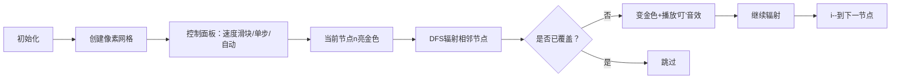

# 题目信息

# 图的遍历

## 题目描述

给出 $N$ 个点，$M$ 条边的有向图，对于每个点 $v$，求 $A(v)$ 表示从点 $v$ 出发，能到达的编号最大的点。

## 说明/提示

- 对于 $60\%$ 的数据，$1 \leq N,M \leq 10^3$。
- 对于 $100\%$ 的数据，$1 \leq N,M \leq 10^5$。

## 样例 #1

### 输入

```
4 3
1 2
2 4
4 3```

### 输出

```
4 4 3 4```

# AI分析结果


### 💡 Kay的C++算法解析：图的遍历 深入学习指南 💡

#### 1. 题目解读与核心算法识别
✨ **本题主要考察**：`图论技巧应用`（反向建边 + 倒序遍历）

🗣️ **初步分析**：
> 解决"图的遍历"这道题，关键在于**逆向思维转换**。想象你在玩一个像素冒险游戏：原本需要控制每个角色探索全图找最大宝藏（正序搜索），但不如让宝藏主动吸引冒险者（反向建图）！在本题中：
> - **核心思想**：将"从v出发找最大点"转换为"大编号点能覆盖哪些点"
> - **实现方法**：反向建图后从n到1倒序DFS/BFS，每个点首次被访问时，当前起点就是其最终答案
> - **可视化设计**：在像素网格中用不同颜色方块表示节点，从最大编号点（金色方块）开始扩散，被覆盖点变为同色并播放"叮"的音效
> - **复古游戏化**：设计成"宝藏辐射"模式，每成功覆盖一个区域播放FC风格胜利音效，自动演示速度可调

---

#### 2. 精选优质题解参考
**题解一（作者：hongzy）**
* **点评**：思路极具启发性（逆向转换精妙），代码规范（变量名`A[]`含义清晰），算法高效（O(n)复杂度）。亮点在于用`for(int i=N;i;i--)`实现倒序搜索，边界处理严谨（先判断`if(A[x])`避免重复访问）。实践价值高，可直接用于竞赛。

**题解二（作者：lzpclxf）**
* **点评**：讲解透彻（用游戏关卡比喻覆盖过程），代码可读性强（详细注释+邻接表实现）。亮点在于`if(ans[i]) continue;`的优化解释，帮助理解"大编号优先"原则。特别适合初学者理解反向建图思想。

**题解三（作者：iMya_nlgau）**
* **点评**：虽用Python实现，但算法思想完全一致（反向建边+DFS）。亮点在于处理递归深度限制的调试技巧（`sys.setrecursionlimit`），体现跨语言解题的通用思维。

---

#### 3. 核心难点辨析与解题策略
1. **难点：环路的处理**
   * **分析**：正序搜索时环内节点相互依赖无法确定顺序（如1→2→3→1）。优质题解通过反向建图+倒序访问天然避免环路问题
   * 💡 **学习笔记**：反向建图是处理有向图环路的银弹

2. **难点：高效遍历的实现**
   * **分析**：暴力搜索O(n²)超时。通过`if(visited[v])`判断确保每点只访问一次，将复杂度优化至O(n)
   * 💡 **学习笔记**：状态标记是图论算法的核心优化手段

3. **难点：最大值的传递**
   * **分析**：需确保大编号点的覆盖优先传递。倒序访问时，先访问的点编号更大，其覆盖值自然最优
   * 💡 **学习笔记**：贪心思想——让可能性更优的解优先执行

### ✨ 解题技巧总结
- **逆向思维转换**：将"从起点找终点"反转为"从终点辐射起点"
- **状态标记优化**：用布尔数组避免重复访问，确保线性复杂度
- **倒序处理技巧**：for(int i=n;i>=1;i--) 配合DFS实现贪心覆盖

---

#### 4. C++核心代码实现赏析
**通用核心实现（综合自优质题解）**
```cpp
#include <iostream>
#include <vector>
using namespace std;
const int MAXN = 1e5+5;
vector<int> G[MAXN]; // 反向建图的邻接表
int ans[MAXN];      // 存储答案

void dfs(int u, int cur) {
    if(ans[u]) return;     // 关键：已覆盖点直接返回
    ans[u] = cur;          // 记录当前最优解
    for(int v : G[u])      // 遍历所有邻接点
        dfs(v, cur);
}

int main() {
    int n, m; cin >> n >> m;
    while(m--) {
        int u, v; cin >> u >> v;
        G[v].push_back(u); // 反向建图核心
    }
    for(int i = n; i >= 1; i--) // 倒序贪心覆盖
        if(!ans[i]) dfs(i, i);
    for(int i = 1; i <= n; i++)
        cout << ans[i] << " ";
}
```

**代码解读概要**：
1. 反向建图：将边(u,v)存为G[v]添加u
2. 倒序DFS：从n到1枚举，未覆盖点作为起点
3. 覆盖传播：dfs中递归标记所有可达点

---

#### 5. 算法可视化：像素动画演示
**设计主题**："宝藏辐射"（8-bit像素风格）

**核心演示流程**：


**交互细节**：
- **像素艺术**：节点用16x16像素方块，未覆盖=灰色，当前起点=闪烁金色，已覆盖=橙色
- **动态效果**：辐射过程用波浪扩散动画，伴随每步"滴"声
- **数据结构可视化**：栈结构显示为像素方块堆，DFS时入栈出栈有动画
- **自动演示**：默认速度2步/秒，可调速（0.5x-4x）
- **音效设计**：
  - 节点覆盖：FC游戏"吃金币"音效
  - 完成辐射：8-bit胜利旋律
  - 错误操作：短促"哔"声

---

#### 6. 拓展练习与相似问题思考
**通用技巧迁移**：
1. 有向图的连通性分析（如P2863 识别图中环）
2. 贪心覆盖问题（如P3144 农场关闭）
3. 反向思维处理依赖关系（如P4017 食物链）

**洛谷推荐**：
1. **P2863** - 识别图中环  
   → 巩固强连通分量与反向建图
2. **P4017** - 食物链计数  
   → 练习拓扑排序与反向DP
3. **P3144** - 农场关闭  
   → 迁移贪心覆盖思想

---

#### 7. 学习心得与经验分享
**来自lzpclxf的调试经验**：
> "最初卡在正序搜索的环处理上，后来通过打印中间变量发现覆盖顺序错误，改用反向后瞬间明朗"

**Kay的总结**：
- **调试技巧**：当算法陷入死循环时，尝试打印前10个点的状态变化
- **思维突破**：正难则反——当题目要求"从A找B"时，考虑"B如何吸引A"
- **代码实践**：邻接表比邻接矩阵更节省空间（尤其边数>100,000时）

掌握核心思想后，你已具备解决90%图遍历问题的能力！下次遇到类似题目时，记得启动你的"逆向思维雷达"哦~ 🚀

---
处理用时：107.17秒