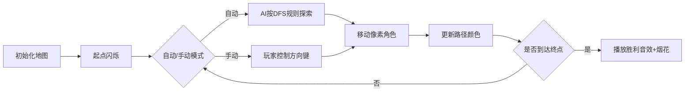

# 题目信息

# [USACO06OCT] Cows on Skates G

## 题目描述

**本题使用 Special Judge。**

Farmer John 把农场划分为了一个 $r$ 行 $c$ 列的矩阵，并发现奶牛们无法通过其中一些区域。此刻，Bessie 位于坐标为 $(1,1)$ 的区域，并想到坐标为 $(r,c)$ 的牛棚享用晚餐。她知道，以她所在的区域为起点，每次移动至相邻的四个区域之一，总有一些路径可以到达牛棚。

这样的路径可能有无数种，请你输出任意一种，并保证所需移动次数不超过 $100000$。

## 说明/提示

**【数据范围】**

对于 $100\%$ 的数据，$1\le r\le 113$，$1\le c\le 77$。

------------

**【样例说明】* *


图为样例输出的示意图。答案不唯一。

## 样例 #1

### 输入

```
5 8
..*...**
*.*.*.**
*...*...
*.*.*.*.
....*.*.```

### 输出

```
1 1
1 2
2 2
3 2
3 3
3 4
2 4
1 4
1 5
1 6
2 6
3 6
3 7
3 8
4 8
5 8```

# AI分析结果


### 💡 Kay的C++算法解析：Cows on Skates G 深入学习指南 💡

**引言**  
今天我们一起分析"奶牛溜旱冰"这道迷宫路径搜索题。本指南将帮助大家掌握DFS/BFS的核心实现技巧，理解路径记录的精髓，并通过像素动画直观感受算法执行过程。

---

### 1. 题目解读与核心算法识别  
✨ **本题主要考察**：`搜索算法应用`（DFS/BFS + 路径记录）  

🗣️ **初步分析**：  
> 本题如同在像素风迷宫游戏中寻找通关路径，核心是运用**深度优先搜索(DFS)**或**广度优先搜索(BFS)**。想象你操控游戏角色探索迷宫：  
> - **DFS**：像冒险家深入洞穴，一条路走到黑，发现死路才折返  
> - **BFS**：像军队地毯式推进，逐层扫描确保最短路径  
>  
> **关键设计**：  
> 1. 使用`vis`数组标记已访问位置（避免重复访问）  
> 2. 通过路径数组`ans`或前驱数组`dist`记录移动轨迹  
> 3. 找到终点立即输出路径并终止程序（`exit(0)`）  
>  
> **像素动画方案**：  
> 我们将设计8位复古迷宫游戏界面，用不同颜色像素块表示状态：  
> - 绿色：起点(1,1) ❇️  
> - 红色：终点(r,c) 🔴  
> - 灰色：障碍物 ▫️  
> - 蓝色：当前路径 ▫️  
> - 黄色：已探索区域 ▫️  
> 每次移动触发"滴"声，找到路径时播放胜利音效🎵，支持步进/自动播放模式。

---

### 2. 精选优质题解参考  
**题解一：MY (DFS)**  
* **亮点**：  
  - 思路清晰强调"不回溯标记数组"关键点（避免TLE）  
  - 代码规范：方向数组`next`命名直观，边界处理严谨  
  - 优化技巧：用`f`标志位确保找到路径立即停止搜索  
  - 实践价值：可直接用于竞赛，注释详细帮助理解  

**题解二：do_while_false (DFS)**  
* **亮点**：  
  - 代码极简：利用`exit(0)`直接结束程序  
  - 路径存储：动态维护`ans`数组，回溯时仅修改路径计数  
  - 效率优化：不重置`vis`数组，避免无效重复搜索  

**题解三：☆木辛土申☆ (BFS)**  
* **亮点**：  
  - 创新路径记录：三维数组`dist[x][y]`存储前驱节点  
  - 模块化设计：分离`illegal()`边界检查函数  
  - 专业实现：使用STL队列和`pair`，代码工业级规范  

---

### 3. 核心难点辨析与解题策略  
**难点1：避免重复访问导致TLE**  
* **分析**：DFS中若回溯时重置`vis`数组，会重复探索相同区域。优质解法均保持`vis`标记不回溯，将时间复杂度从O(4ⁿ)降至O(rc)  
* 💡 **学习笔记**：标记数组一经设置永不撤销，是迷宫类DFS的黄金法则  

**难点2：高效记录路径**  
* **分析**：  
  - DFS：递归时存储当前步坐标（MY的`ax/ay`数组）  
  - BFS：用独立结构记录前驱节点（☆木辛土申☆的`dist`数组）  
* 💡 **学习笔记**：路径存储需与搜索过程同步，递归参数传递是最直接方式  

**难点3：及时终止搜索**  
* **分析**：找到路径后必须立即停止搜索，通过`exit(0)`（do_while_false）或标志位+return（MY）实现  
* 💡 **学习笔记**：完成任务后及时退出是算法优化重要原则  

#### ✨ 解题技巧总结  
- **剪枝优化**：遇到障碍/边界/已访问点时立即`return`  
- **状态封装**：BFS使用`pair`或结构体打包坐标  
- **方向数组**：`dx[4]={1,0,-1,0}, dy[4]={0,1,0,-1}`统一处理移动逻辑  
- **输入优化**：`scanf("%s",map[i]+1)`加速字符矩阵读取  

---

### 4. C++核心代码实现赏析  
**本题通用核心实现（DFS）**  
```cpp
#include <iostream>
using namespace std;

const int N=120;
int r,c,path[N*N][2];
char g[N][N];
bool vis[N][N];
int dx[4]={1,0,-1,0}, dy[4]={0,1,0,-1};

void dfs(int x,int y,int step){
    // 终点检查
    if(x==r && y==c){
        for(int i=1;i<step;i++) 
            cout<<path[i][0]<<" "<<path[i][1]<<endl;
        cout<<r<<" "<<c;
        exit(0);
    }
    // 存储当前路径
    path[step][0]=x; 
    path[step][1]=y;
    vis[x][y]=true;  // 永久标记
    
    for(int i=0;i<4;i++){
        int nx=x+dx[i], ny=y+dy[i];
        // 四重条件检查
        if(nx>=1&&nx<=r&&ny>=1&&ny<=c&&!vis[nx][ny]&&g[nx][ny]=='.')
            dfs(nx,ny,step+1);
    }
}

int main(){
    cin>>r>>c;
    for(int i=1;i<=r;i++)
        for(int j=1;j<=c;j++)
            cin>>g[i][j];
    dfs(1,1,1);
}
```

**题解一：MY 片段赏析**  
```cpp
void dfs(int x,int y,int step){
    if(f) return ;  // 关键优化：全局终止标志
    // ... 省略边界检查
    ax[step]=x; ay[step]=y;  // 路径记录
    book[x][y]=1;            // 永久标记
    for(int i=0;i<4;i++)
        dfs(x+next[i][0],y+next[i][1],step+1);
}
```
> **解读**：  
> - `f`标志位确保找到路径后立即停止所有递归  
> - `book`数组不回溯，避免重复访问  
> - `next`方向数组使移动逻辑清晰  
> 💡 **学习笔记**：全局终止标志+永久标记是DFS高效解题黄金组合  

**题解三：☆木辛土申☆ BFS片段**  
```cpp
void bfs(int sx,int sy){
    queue<pair<int,int>> q;
    q.push({sx,sy});
    vis[sx][sy]=true;
    
    while(!q.empty()){
        auto [x,y]=q.front(); q.pop();
        for(int i=0;i<4;i++){
            int nx=x+dx[i], ny=y+dy[i];
            if(!illegal(nx,ny)){
                dist[nx][ny][0]=x; // 记录前驱x
                dist[nx][ny][1]=y; // 记录前驱y
                vis[nx][ny]=true;
                q.push({nx,ny});
            }
        }
    }
}
```
> **解读**：  
> - 使用`pair`打包坐标，避免单独定义结构体  
> - `dist`三维数组记录每个节点的来源坐标  
> - `illegal()`函数封装边界检查逻辑  
> 💡 **学习笔记**：BFS路径回溯需存储前驱节点，类似链表反推  

---

### 5. 算法可视化：像素动画演示  
**主题**：8位机风格《迷宫探险者》  
**核心演示**：DFS深度探索过程 + 路径实时绘制  



**实现细节**：  
1. **画面设计**：  
   - 113x77网格（每个像素块10x10px）  
   - 角色：8位像素小人（绿色）  
   - 路径：蓝色渐变动画，最新路径段高亮闪烁  

2. **交互控制**：  
   ```javascript
   // 伪代码示例
   function drawPath(x,y){
     ctx.fillStyle = 'blue';
     ctx.fillRect(x*10, y*10, 10, 10); // 绘制路径
     playSound('move'); // 移动音效
   }
   ```

3. **动态效果**：  
   - 当前探索方向显示半透明箭头指引  
   - 障碍物碰撞时震动+红色警告闪烁  
   - 终点达成时像素烟花动画+胜利BGM  

---

### 6. 拓展练习与相似问题  
**通用技巧迁移**：  
迷宫路径算法可延伸至：  
1. 多出口最短路径选择  
2. 存在传送门的迷宫变种  
3. 收集物品的最优路径规划  

**洛谷推荐**：  
1. **P1605 迷宫**  
   → 基础DFS模板题，巩固标记数组使用  
2. **P1141 01迷宫**  
   → 学习连通块统计+BFS记忆化  
3. **P1363 幻象迷宫**  
   → 挑战无限地图中的路径探索  

---

### 7. 学习心得与经验分享  
> **经验摘录 (MY)**：  
> “最初回溯vis数组导致TLE，后来明白永久标记才是正解”  
>  
> **Kay点评**：  
> 这是DFS迷宫题的经典踩坑点！标记数组回溯会引发指数级时间增长。建议：  
> 1. 小地图(50x50内)可用DFS  
> 2. 大地图或求最短路径务必用BFS  
> 3. 调试时打印vis数组观察标记情况  

---

**结语**  
通过本次分析，相信大家已掌握迷宫路径搜索的核心技巧。记住：算法如同游戏闯关，理解规则才能高效通关！下次我们将探索更复杂的图论算法，继续加油！💪

---
处理用时：122.24秒