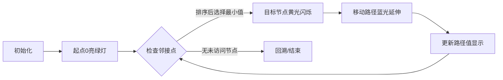

# 题目信息

# [Code+#7] 最小路径串

## 题目描述

$n$ 个点 $m$ 条边的无向图中，所有点用从 `0` 开始的 `6` 位数字串编号，即 `000000`、`000001`、`000002`、……直到 $n-1$ 对应的 $6$ 位数字串。保证 $n\le 10^6$，所以 $6$ 位的编号不会溢出。

对于除了 `000000` 以外的每个点，你需要找到一条从 `000000` 出发且不经过重复点的路径，使得路径上所有点的数字串顺次连接形成的串的字典序最小。比较两个不同的串的字典序的方法是：如果其中某个串是另一个的前缀，则较短的串字典序较小；否则，找出两个串从左往右扫描时遇到的首个不相等的位置，在这个位置上的数字较小的串字典序较小。

由于输出路径过于麻烦，你不需要完整地输出路径，只需要将路径上所有点的数字串视作一个整数，输出这个数对 $998244353$ 取模的结果。

## 说明/提示

### 样例解释

- 从 `000000` 到 `000001` 所求的路径对应的串为 `000000000002000001`。
- 从 `000000` 到 `000002` 所求的路径对应的串为 `000000000002`。
- 从 `000000` 到 `000003` 所求的路径对应的串为 `000000000002000001000003`，对 $998244353$ 取模后为 $517560944$。
- 从 `000000` 到 `000004` 不存在路径。

### 子任务

子任务 $1$（$11$ 分）
- $1\le n\le 10^6, m = 0$。

子任务 $2$（$55$ 分）
- $1\le n\le 10, 0\le m\le20$。

子任务 $3$（$34$ 分）
- $1\le n\le 10^6, 0\le m\le 10^6$。

## 样例 #1

### 输入

```
5 5
000000000003000001000003000001000002000002000000000002000003```

### 输出

```
2000001
2
517560944
-1```

# AI分析结果


# 💡 Kay的C++算法解析：最小路径串 深入学习指南 💡

> 今天我们来分析洛谷P6606「最小路径串」这道图论题。本指南将带你理解贪心遍历的核心思想，掌握DFS实现技巧，并通过像素动画直观感受算法执行过程。准备好开启算法探索之旅吧！

## 1. 题目解读与核心算法识别

✨ **本题主要考察**：`贪心算法 + 图遍历 (DFS)`  

🗣️ **初步分析**：
> 解决「最小路径串」如同在数字迷宫中寻找最优路径。想象每个房间都有6位门牌号，从起点"000000"出发，**每次选择门牌号最小的相邻房间**（贪心策略），最终形成字典序最小的路径串。  
> - 核心难点在于证明局部最优选择（最小邻接点）能保证全局最优解，这由字典序的逐位比较特性决定  
> - 算法流程：1) 邻接表排序 → 2) DFS遍历 → 3) 动态计算路径整数（当前值×10⁶+新节点）  
> - 可视化设计：采用**8位像素迷宫风格**，当前节点高亮为黄色，路径显示为蓝色光带。每次选择最小邻接点时触发"叮"音效，完成路径时播放胜利音效。控制面板支持单步/自动模式，速度可调

---

## 2. 精选优质题解参考

### 题解一：opzc35
* **点评**：思路清晰直击贪心本质，代码简洁高效。亮点在于：  
  ✅ 使用`vector`存储邻接表，配合`sort`实现自动排序  
  ✅ 用`ans[v]==-1`巧妙替代`vis`数组，节省内存  
  ✅ 递归参数直接传递计算值`(now*1000000+v)%mod`，避免全局变量  
  ⚠️ 但未显式处理重边（实际不影响结果）

### 题解二：FZY_CZY
* **点评**：教学价值突出，注释详尽解释贪心原理。亮点在于：  
  ✅ 显式处理自环`if(x==y)continue`，增强代码健壮性  
  ✅ 输入处理采用双循环读入字符，逻辑清晰易理解  
  ✅ 强调重边和自环的处理要点，对初学者友好  
  ⚠️ 计算部分`(now*1000000+v)%Mod`可优化为常量定义

### 题解三：SUNCHAOYI
* **点评**：通过树形结构示例生动解释贪心策略。亮点在于：  
  ✅ 举例说明路径形成过程（如000001→000002→000007）  
  ✅ 使用索引循环`for(int i=0;i<e[st].size();++i)`便于调试  
  ✅ 独立`cmp`函数强调排序逻辑（实际可省略）  
  ⚠️ 输入处理效率稍低（双循环逐字符读取）

---

## 3. 核心难点辨析与解题策略

1.  **贪心策略正确性证明**
    * **分析**：字典序需逐位比较。假设存在更优路径，其首次分叉点必选择更小节点，与贪心策略矛盾。优质题解通过**邻接表预排序**确保优先访问最小节点
    * 💡 **学习笔记**：贪心选择无后效性是该解法成立的关键

2.  **大规模整数计算与存储**
    * **分析**：路径串长度可达6×10⁶位，直接存储不可行。通过模运算公式`(now*1000000+v)%mod`动态计算，数学依据：  
      `(a*b + c) mod M = [(a mod M)*b + c] mod M`
    * 💡 **学习笔记**：取模运算的分配律是空间优化的数学基础

3.  **图遍历的终止条件**
    * **分析**：需区分不可达节点（输出-1）与路径终点。通过初始化`ans[]=-1`，最终值仍为-1的节点即不可达
    * 💡 **学习笔记**：初始状态标记法可同时记录访问状态和计算结果

### ✨ 解题技巧总结
-   **邻接表预处理**：对每个节点的邻接点排序，将全局贪心转化为局部有序访问
-   **状态复用**：用结果数组`ans[]`同时充当访问标记，减少额外内存
-   **模运算优化**：在每一步扩展时即时取模，避免大整数运算
-   **自环处理**：显式跳过`u==v`的边提升效率

---

## 4. C++核心代码实现赏析

### 本题通用核心C++实现参考
* **说明**：综合优质题解优化的完整实现，重点突出贪心DFS框架
```cpp
#include <iostream>
#include <vector>
#include <algorithm>
#include <cstring>
using namespace std;
const int maxn = 1e6+5;
const long long mod = 998244353;
vector<int> g[maxn]; // 邻接表
long long ans[maxn]; // 存储结果兼访问标记

void dfs(int u, long long now) {
    ans[u] = now; // 记录当前节点答案
    for (int v : g[u]) { // 遍历邻接点（已排序）
        if (ans[v] == -1) // 未访问则继续探索
            dfs(v, (now * 1000000 + v) % mod);
    }
}

int main() {
    int n, m;
    cin >> n >> m;
    memset(ans, -1, sizeof(ans)); // 初始化为未访问
    
    // 读入边数据（每行12字符→两个6位整数）
    for (int i = 0; i < m; i++) {
        string s1, s2;
        cin >> s1 >> s2;
        int u = stoi(s1), v = stoi(s2);
        if (u == v) continue; // 跳过自环
        g[u].push_back(v);
        g[v].push_back(u); // 无向图双向添加
    }
    
    // 邻接表排序实现贪心
    for (int i = 0; i < n; i++)
        sort(g[i].begin(), g[i].end());
    
    dfs(0, 0); // 从起点开始遍历
    
    // 输出结果（1~n-1号节点）
    for (int i = 1; i < n; i++) {
        if (ans[i] == -1) cout << "-1\n";
        else cout << ans[i] << '\n';
    }
    return 0;
}
```
* **代码解读概要**：
  1. **数据结构**：`g[]`存储邻接表，`ans[]`兼作访问标记和结果
  2. **预处理**：邻接表排序确保贪心选择
  3. **DFS核心**：递归更新路径值并取模
  4. **输出处理**：区分可达与不可达节点

### 优质题解片段赏析

**题解一（opzc35）**
```cpp
void dfs(int u,ll now){
    ans[u]=now;
    for(auto v:g[u]){
        if(ans[v]!=-1)continue;
        dfs(v,(now*1000000+v)%mod);
    }
}
```
* **亮点**：简洁高效的递归实现
* **代码解读**：
  > `ans[u]=now`立即记录当前节点值 → 遍历邻接表时使用`auto`简化迭代 → 通过`ans[v]!=-1`跳过已访问节点 → 递归时动态计算新值`(now*1000000+v)%mod`
* 💡 **学习笔记**：`auto`遍历提升代码简洁性

**题解二（FZY_CZY）**
```cpp
memset(ans,-1,sizeof(ans));
for (int i=0;i<=n;i++) 
    sort(g[i].begin(),g[i].end());
```
* **亮点**：显式初始化与标准化排序
* **代码解读**：
  > `memset`初始化`ans`数组为-1 → 循环对所有节点的邻接表排序 → 确保DFS按升序访问邻接点
* 💡 **学习笔记**：排序预处理是贪心算法的实现关键

**题解三（SUNCHAOYI）**
```cpp
ans[st] = s;
for(int i = 0;i < e[st].size();++i)
    if(ans[e[st][i]] == -1)
        dfs(e[st][i],(s * 1000000 + e[st][i]) % MOD);
```
* **亮点**：索引循环便于调试跟踪
* **代码解读**：
  > 使用索引`i`而非迭代器遍历邻接表 → 显式检查`ans[e[st][i]] == -1` → 参数传递保持公式一致性
* 💡 **学习笔记**：索引访问在调试时可添加断点监控

---

## 5. 算法可视化：像素动画演示

### 像素迷宫探索方案
**主题**：8-bit风格数字迷宫  
**核心演示**：贪心DFS的节点选择与路径形成

### 动画设计


1. **场景与UI**：
   - 像素网格（1280×720），每个节点显示为6×6像素块
   - 控制面板：开始/暂停、单步执行、速度滑块（1x-5x）
   - 状态栏：当前路径值（实时更新）、已访问节点数

2. **核心动画逻辑**：
   ```javascript
   // 伪代码：动画主循环
   function animateStep() {
     highlightCurrentNode(YELLOW); // 当前节点高亮
     let neighbors = getSortedNeighbors(); // 获取排序后邻接点
     playSound('select'); // 播放选择音效
     
     for (let node of neighbors) {
       if (!visited[node]) {
         drawArrow(current, node); // 绘制蓝色箭头
         moveTo(node);              // 移动到新节点
         updatePathValue(node);     // 计算并显示新路径值
         break; // 贪心选择第一个未访问节点
       }
     }
     // 触发递归或回溯...
   }
   ```

3. **游戏化元素**：
   - **音效设计**：
     - 节点选择："叮"（8-bit短音）
     - 路径完成：胜利旋律（上升和弦）
     - 回溯：低沉提示音
   - **关卡系统**：每访问100个节点解锁新迷宫皮肤
   - **AI演示**：自动模式展示完整路径发现过程

4. **可视化技巧**：
   - 路径值计算过程显示在右侧面板
   - 回溯时显示红色虚线箭头
   - 不可达节点显示为灰色并打叉

---

## 6. 拓展练习与相似问题思考

### 通用算法迁移
贪心图遍历技巧还可用于：
1. 拓扑排序最小字典序（如P1137旅行计划）
2. 迷宫最短路径字典序（方向序列最小化）
3. 网络布线优先级优化（选择最小成本端口）

### 洛谷练习推荐
1. **P1137 旅行计划**  
   → 拓扑排序+贪心选择，巩固字典序路径思想
   
2. **P1608 路径统计**  
   → 带权图的最短路径计数，练习状态记录技巧
   
3. **P2296 寻找道路**  
   → 图遍历+条件过滤，提升问题抽象能力

---

## 7. 学习心得与经验分享

> **参考经验**（来自题解作者）：  
> *"十年OI一场空，不开long long见祖宗"*  
> *"邻接表排序后DFS看似简单，但正确性证明是关键"*
>
> **点评**：两位作者的经验极具参考价值：
> 1. 数据类型选择直接影响边界情况处理，`long long`是防止溢出的安全网
> 2. 贪心算法必须思考其正确性，本题可通过反证法验证
> 3. 输入规模较大时，字符读取优化能显著提升性能

---

> 本次解析到此结束。记住：**贪心选择是局部最优的艺术，而图遍历是全局探索的冒险**。多动手实现可视化方案，你会对算法有全新认知！下次挑战再见！🚀

---
处理用时：232.08秒