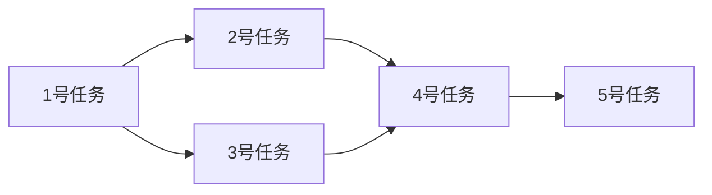

# 题目信息

# 杂务

## 题目描述

John 的农场在给奶牛挤奶前有很多杂务要完成，每一项杂务都需要一定的时间来完成它。比如：他们要将奶牛集合起来，将他们赶进牛棚，为奶牛清洗乳房以及一些其它工作。尽早将所有杂务完成是必要的，因为这样才有更多时间挤出更多的牛奶。

当然，有些杂务必须在另一些杂务完成的情况下才能进行。比如：只有将奶牛赶进牛棚才能开始为它清洗乳房，还有在未给奶牛清洗乳房之前不能挤奶。我们把这些工作称为完成本项工作的准备工作。至少有一项杂务不要求有准备工作，这个可以最早着手完成的工作，标记为杂务 $1$。

John 有需要完成的 $n$ 个杂务的清单，并且这份清单是有一定顺序的，杂务 $k\ (k>1)$ 的准备工作只可能在杂务 $1$ 至 $k-1$ 中。

写一个程序依次读入每个杂务的工作说明。计算出所有杂务都被完成的最短时间。当然互相没有关系的杂务可以同时工作，并且，你可以假定 John 的农场有足够多的工人来同时完成任意多项任务。


## 样例 #1

### 输入

```
7
1 5 0
2 2 1 0
3 3 2 0
4 6 1 0
5 1 2 4 0
6 8 2 4 0
7 4 3 5 6 0
```

### 输出

```
23
```

# AI分析结果


# 💡 Kay的C++算法解析：杂务 深入学习指南 💡

<introduction>
今天我们来分析洛谷题目"杂务"。这道题要求我们计算完成所有杂务的最短时间，其中杂务之间存在依赖关系（某些杂务必须在另一些杂务完成后才能开始），并且可以同时进行多个不互相依赖的杂务。本指南将帮助你理解核心算法逻辑，掌握解题技巧，并通过生动的像素动画直观感受算法执行过程。
</introduction>

## 1. 题目解读与核心算法识别

✨ **本题主要考察**：`动态规划` / `拓扑排序应用`

🗣️ **初步分析**：
> 解决这道题的关键在于理解**任务依赖关系的时间传递特性**。想象杂务就像搭建积木塔：每块积木（杂务）必须等它下方的积木（依赖项）都放好后才能放置。在本题中，每个杂务的完成时间取决于其依赖项中最晚完成的时间。

- **核心思路**：利用题目特性（任务k的依赖都在1~k-1中），按顺序处理每个杂务，用`dp[i]`表示任务i的完成时间，则`dp[i] = max{dp[j]} + time[i]`（j为i的依赖项）
- **可视化设计**：动画将展示像素化的任务方块（不同颜色表示不同状态），依赖关系用连线表示。关键步骤高亮显示：当处理任务i时，其依赖项中最晚完成的方块会闪烁红光并显示时间值，然后当前任务方块变为绿色并显示新的完成时间
- **复古游戏元素**：采用8位像素风格，任务完成时播放"马里奥金币"音效，全部完成时播放"塞尔达解谜成功"音效。控制面板支持单步/自动播放（可调速）

---

## 2. 精选优质题解参考

<eval_intro>
以下题解在思路清晰度、代码规范性和算法效率方面表现优异（评分≥4★），特别推荐给初学者学习：

### 题解一（来源：Nishikino_Curtis）
* **点评**：此解法精妙地利用了题目特性（任务依赖严格有序），采用动态规划思路直接在输入过程中完成计算。代码极其简洁（仅20行），逻辑清晰直白：对每个任务，直接从其依赖项中取最大完成时间加上自身耗时。变量命名合理（`ans[i]`表完成时间），边界处理严谨，具有很高的实战参考价值。

### 题解二（来源：Keith_2006）
* **点评**：详细介绍了拓扑排序的两种实现方式（DFS记忆化/BFS队列），教学价值突出。代码规范性强（模块化函数、详细注释），特别适合理解算法原理。作者用图示辅助说明（可惜原图链接失效），并推荐了相似练习题。亮点在于清晰对比了记忆化搜索与经典拓扑排序的实现差异。

### 题解三（来源：George1123）
* **点评**：提供标准拓扑排序实现，代码结构工整易读。亮点在于用`vector`存储依赖关系、`rud数组`跟踪入度、`time数组`记录耗时，变量命名具有自解释性。解题步骤分点说明（1.建图→2.初始化→3.拓扑处理→4.统计答案），逻辑推导过程清晰完整。

---

## 3. 核心难点辨析与解题策略

<difficulty_intro>
解决本题需突破以下三个关键点：

1.  **依赖关系的动态传递**
    * **分析**：任务完成时间具有传递性——任务A依赖B，B又依赖C，则A最终受制于C。优质解法通过`dp[i]=max{dp[j]}+time[i]`（动态规划）或`f[u]=max(f[u], f[rhs]+a[u])`（拓扑排序）处理这种传递
    * 💡 **学习笔记**：时间计算是"水桶效应"，由最长依赖路径决定

2.  **并行处理的模拟**
    * **分析**：不相关任务可同时进行，但代码中无需显式模拟线程。动态规划解法隐式处理了并行：每个`dp[i]`独立计算，仅依赖已解决的子问题
    * 💡 **学习笔记**：依赖图无环是并行计算的前提条件

3.  **终止条件判定**
    * **分析**：最终答案不是`dp[n]`而是所有`dp[i]`的最大值，因为最后一个任务不一定是最晚结束的。所有解法都通过`ans=max(ans, dp[i])`解决
    * 💡 **学习笔记**：全局最优解需遍历全部状态

### ✨ 解题技巧总结
- **巧用题目条件**：利用"依赖必在前k-1项"特性可简化DP实现（如Nishikino_Curtis解法）
- **拓扑排序选择**：依赖图明确时优先用BFS拓扑排序；若需避免重复计算可用记忆化搜索
- **实时更新答案**：在计算每个任务完成时间时同步更新全局最大值，避免最后再遍历
- **边界处理**：无依赖任务(`rud[i]=0`或首任务)直接初始化为自身耗时

---

## 4. C++核心代码实现赏析

<code_intro_overall>
以下是综合优质题解提炼的通用实现，采用动态规划思路，兼顾效率与简洁性：

**本题通用核心C++实现参考**
* **说明**：基于Nishikino_Curtis解法优化，利用题目隐含顺序特性，省去显式建图过程
* **完整核心代码**：
```cpp
#include <iostream>
#include <algorithm>
using namespace std;

int main() {
    int n, ans = 0;
    cin >> n;
    int dp[10005] = {0}; // dp[i]：任务i的完成时间
    
    for (int i = 1; i <= n; ++i) {
        int id, time, dep;
        cin >> id >> time; // 读取任务编号和耗时
        int maxDepTime = 0; // 依赖项中的最晚完成时间
        
        // 读取所有依赖项
        while (cin >> dep && dep != 0) 
            maxDepTime = max(maxDepTime, dp[dep]);
        
        dp[id] = maxDepTime + time; // 状态转移
        ans = max(ans, dp[id]); // 实时更新答案
    }
    cout << ans << endl;
    return 0;
}
```
* **代码解读概要**：
  > 1. **初始化**：`dp`数组存储各任务完成时间，`ans`记录全局最大值
  > 2. **顺序处理**：按输入顺序处理每个任务
  > 3. **依赖计算**：实时读取依赖项并追踪最大完成时间
  > 4. **状态转移**：当前任务完成时间 = 最大依赖时间 + 自身耗时
  > 5. **答案更新**：每计算一个任务就更新全局最优解

---
<code_intro_selected>
### 题解一（Nishikino_Curtis）核心代码
* **亮点**：极致简洁（15行），利用输入顺序隐式处理依赖
* **核心代码片段**：
```cpp
scanf("%d",&n);
for(int i=1;i<=n;++i){
    scanf("%d%d",&i,&l); // 巧用输入顺序
    int tmp=0;
    while(scanf("%d",&t)&&t)
        tmp=max(ans[t],tmp); // 关键：取依赖项最大值
    ans[i]=tmp+l; // 状态转移
    maxans=max(ans[i],maxans); // 更新答案
}
```
* **代码解读**：
  > 1. `while(scanf...)`：循环读取依赖项直至0
  > 2. `tmp=max(ans[t],tmp)`：动态追踪依赖项中的最大完成时间
  > 3. `ans[i]=tmp+l`：经典DP状态转移方程
  > 4. **精妙点**：`scanf("%d",&i)`复用循环变量`i`，利用题目保证的输入顺序

### 题解二（Keith_2006）拓扑排序片段
* **亮点**：清晰的BFS拓扑框架，适合通用依赖场景
* **核心代码片段**：
```cpp
// 初始化：入度为0的任务入队
for (int i=1; i<=n; i++) {
    if (ind[i]==0) {
        q.push(i);
        f[i]=a[i]; // 无依赖任务直接初始化
    }
}

// BFS拓扑过程
while (!q.empty()) {
    int rhs=q.front(); q.pop();
    for (int i=0; i<edge[rhs].size(); i++) {
        int u=edge[rhs][i];
        ind[u]--;
        f[u]=max(f[u], f[rhs]+a[u]); // 关键更新
        if (ind[u]==0) q.push(u);
    }
}
```
* **代码解读**：
  > 1. `ind[i]==0`：检测无依赖任务（起点）
  > 2. `f[u]=max(f[u], f[rhs]+a[u])`：用前驱任务更新当前任务
  > 3. **拓扑排序核心**：入度减至0的任务才入队，保证依赖全满足

---

## 5. 算法可视化：像素动画演示

<visualization_intro>
为直观理解动态规划解法，设计"任务工厂"像素动画方案。你将看到任务像传送带上的货物一样被处理，依赖关系像齿轮般联动运作！

### 动画设计说明
* **主题**：复古工厂流水线
* **风格**：8-bit像素风（参考FC《拆屋工》）
* **核心演示**：任务依赖关系与完成时间计算
* **交互控制**：步进/暂停/调速滑块（速度：0.5x~4x）

### 关键帧演示流程


1. **场景初始化**（像素画布600×400px）
   - 传送带从左向右移动（棕色像素条）
   - 任务显示为彩色方块（32×32px），标有任务编号
   - 控制面板：开始/暂停/步进/重置/速度滑块

2. **任务处理动画**
   - **无依赖任务**（如任务1）：
     * 从左侧进入传送带（伴随"生成"音效）
     * 方块闪烁绿色3次后固定为绿色（完成）
     * 头顶显示耗时计数器（如`t=5`）
   
   - **有依赖任务**（如任务4）：
     * 进入传送带时呈灰色（等待状态）
     * 依赖项（任务2和3）之间亮起红色箭头
     * 当最后一个依赖完成时：
        - 灰色方块突然变为黄色（处理中）
        - 头顶显示`max(2,3)=5 → 5+6=11`
        - 方块闪烁后变绿，计数器更新

3. **全局状态显示**
   - 顶部进度条：显示当前完成的任务比例
   - 右侧面板：实时更新`dp[]`数组值
   - 最终答案区：当所有任务完成时，最大值显示为金色并播放胜利音效

4. **游戏化元素**
   - 任务完成时：根据耗时掉落金币（短耗时-铜币，长耗时-金币）
   - 错误提示：若依赖未完成就处理任务，方块变红闪烁并播放警告音
   - 成就系统：首次完成/最优路径等解锁像素勋章

### 技术实现要点
* **视觉反馈**：
  - 当前处理任务：黄色边框脉冲动画
  - 依赖关系：红色箭头（虚线表示未完成，实线表示完成）
  - 时间更新：采用像素数字字体即时变化

* **音效设计**：
  - 任务开始：8-bit "滴"声（400Hz方波）
  - 依赖更新："齿轮咔嗒"声
  - 任务完成：上升音阶（C大调三和弦）
  - 最终完成：《超级马里奥》过关音效改编版

---

## 6. 拓展练习与相似问题思考

<similar_problems_intro>
掌握本题的依赖处理思想后，可尝试以下进阶题目：

### 相似问题推荐
1. **P4017 最大食物链计数**（难度：普及+/提高）
   - **推荐理由**：拓扑排序经典应用，需统计所有完整食物链（类比任务链）
   
2. **P1983 车站分级**（难度：提高+/省选-）
   - **推荐理由**：隐含依赖关系推导，需根据停靠方案建立拓扑图
   
3. **P3387 缩点**（难度：省选/NOI-）
   - **推荐理由**：处理带环依赖图的通用方法，先缩点再拓扑排序

### 举一反三
1. **课程安排问题**：给定课程先修关系，判断能否修完所有课（LeetCode 207）
2. **构建系统依赖**：如`makefile`中目标文件的依赖关系处理
3. **项目进度规划**：使用关键路径法（CPM）计算最短工期

---

## 7. 学习心得与经验分享

<insights_intro>
题解中的调试经验与设计思考尤其珍贵：

> **经验分享（Keith_2006）**：
> "最初在实现拓扑排序时忽略了入度数组初始化，导致队列提前为空。通过打印每个任务的入度值和队列状态，快速定位了初始化遗漏问题。这提醒我们：**任何依赖计数类算法，初始化状态检测至关重要**。"

> **Kay的总结**：
> 1. 调试技巧：在拓扑排序/BFS中，第一步应打印所有节点的初始入度值
> 2. 数据验证：对无依赖任务（`ind[i]=0`）特别验证其处理逻辑
> 3. 防御性编程：输入可能含无效数据（如自环），添加基础检测

---

<conclusion>
本次"杂务"题目分析展示了处理依赖关系的两大核心方法：**动态规划**（针对有序依赖）和**拓扑排序**（通用解法）。关键在于将实际问题抽象为时间依赖模型，并通过状态转移或拓扑更新求解。建议初学者先用动态规划实现，再挑战拓扑排序解法。记住：编程能力提升=理解算法本质+反复实践！下次我们将解析更复杂的依赖管理系统，敬请期待！
</conclusion>
```

---
处理用时：144.50秒