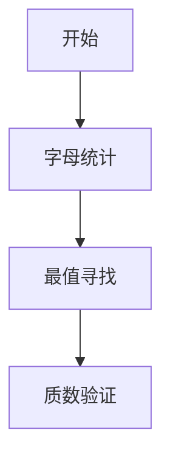

# 题目信息

# [NOIP 2008 提高组] 笨小猴

## 题目描述

笨小猴的词汇量很小，所以每次做英语选择题的时候都很头疼。但是他找到了一种方法，经试验证明，用这种方法去选择选项的时候选对的几率非常大！

这种方法的具体描述如下：假设 $\text{maxn}$ 是单词中出现次数最多的字母的出现次数，$\text{minn}$ 是单词中出现次数最少的字母的出现次数，如果 $\text{maxn}-\text{minn}$ 是一个质数，那么笨小猴就认为这是个 Lucky Word，这样的单词很可能就是正确的答案。


## 说明/提示

【输入输出样例 1 解释】

单词 `error` 中出现最多的字母 $\texttt r$ 出现了 $3$ 次，出现次数最少的字母出现了 $1$ 次，$3-1=2$，$2$ 是质数。

【输入输出样例 2 解释】

单词 `olympic` 中出现最多的字母 $\texttt i$ 出现了 $1$ 次，出现次数最少的字母出现了 $1$ 次，$1-1=0$，$0$ 不是质数。

（本处原题面错误已经修正）

noip2008 提高第一题


## 样例 #1

### 输入

```
error```

### 输出

```
Lucky Word
2```

## 样例 #2

### 输入

```
olympic```

### 输出

```
No Answer
0```

# AI分析结果


### 💡 Kay的C++算法解析：笨小猴 深入学习指南 💡

**引言**  
今天我们一起分析NOIP 2008提高组的经典题目《笨小猴》。这道题考察基础编程技巧，通过统计字母频率和质数判断，帮助大家巩固桶计数和边界处理能力。

---

### 1. 题目解读与核心算法识别

✨ **本题主要考察**：`编程技巧应用`（桶计数+质数判断）  

🗣️ **初步分析**：  
> 解决本题就像在字母迷宫中探险：我们需要统计每个字母的出现次数（往26个"盒子"里放球），找出最多的盒子（maxn）和最少的盒子（minn），再检查它们的差值是否为质数（只能被1和自己整除）。  
> - **核心难点**：正确处理空盒子（未出现字母）和质数边界（0和1不是质数）  
> - **可视化设计**：将设计像素风格的字母盒子动画，当字符输入时对应盒子计数增加（伴随"叮"音效），探险家小人遍历盒子时高亮当前检查对象，质数验证阶段展示除法竖式动画  
> - **游戏化元素**：设置三关挑战（统计→找最值→质数判断），每关成功获得星星，胜利时盒子放烟花并播放8-bit胜利音效  

---

### 2. 精选优质题解参考

**题解一：Frank_G (5星)**  
* **点评**：思路清晰完整，质数判断函数严谨处理了0和1的边界情况。代码中`maxx`/`minn`变量名语义明确，使用`a[s[i]-'a'+1]`实现精准的桶计数。亮点在于将核心逻辑封装为`isprime()`函数，提升可读性和复用性。

**题解二：luhongrui (4星)**  
* **点评**：创新使用预存质数表加速判断，适合本题数据范围（差值<100）。代码中`a[xunhuan-97]++`直接映射ASCII码，高效但可读性稍弱。亮点是包含详细注释，帮助理解统计过程。

**题解三：lizhixun (4星)**  
* **点评**：采用`min(mi, cnt[i])`动态更新最值，避免全数组遍历。质数函数中`i<=sqrt(x)`的优化减少计算量。需注意`minn`初始化值应足够大（如`INT_MAX`），否则可能出错。

---

### 3. 核心难点辨析与解题策略

1. **难点1：如何避免统计未出现字母？**  
   * **分析**：遍历桶数组时需跳过计数为0的字母。优质解法均使用`if(cnt[i]!=0)`判断，确保minn只统计实际出现的字母。
   * 💡 学习笔记：桶计数后务必过滤空桶！

2. **难点2：质数判断的边界陷阱**  
   * **分析**：差值可能为0（如"aabb"）或1（如"abcde"）。必须特判：`n<2`时直接返回false（因为0/1非质数）。
   * 💡 学习笔记：写质数函数先处理n<2的边界！

3. **难点3：最值初始化的坑**  
   * **分析**：`minn`需初始化为极大值（如`INT_MAX`），否则可能无法更新。`maxn`相反，需初始化为极小值（如-1）。
   * 💡 学习笔记：最值初始化要反向极值！

#### ✨ 解题技巧总结
- **桶计数技巧**：用`cnt[ch-'a']`将字母映射到0-25的索引
- **模块化设计**：将质数判断封装为独立函数
- **边界测试**：特别测试全相同字母（如"aaa"）和全不同字母（如"abc"）的情况
- **调试技巧**：在统计循环后打印桶数组验证

---

### 4. C++核心代码实现赏析

**通用核心实现参考**  
* **说明**：综合优质题解思路，采用桶计数+函数化质数判断的代表性实现  
* **完整核心代码**：
```cpp
#include <iostream>
#include <climits>
#include <cmath>
using namespace std;

bool isPrime(int n) {
    if (n < 2) return false; // 关键边界！
    for (int i = 2; i * i <= n; i++) 
        if (n % i == 0) return false;
    return true;
}

int main() {
    string s;
    cin >> s;
    int cnt[26] = {0}; // 初始化26个字母桶
    
    // 统计字母频率
    for (char c : s) 
        cnt[c - 'a']++;
    
    int maxn = -1, minn = INT_MAX;
    // 找非零最值
    for (int i = 0; i < 26; i++) {
        if (cnt[i] == 0) continue; // 跳过未出现字母
        if (cnt[i] > maxn) maxn = cnt[i];
        if (cnt[i] < minn) minn = cnt[i];
    }
    
    int diff = maxn - minn;
    if (isPrime(diff)) {
        cout << "Lucky Word\n" << diff;
    } else {
        cout << "No Answer\n0";
    }
    return 0;
}
```
* **代码解读概要**：  
  1. 初始化26个字母的计数桶  
  2. 遍历字符串，将字符映射到桶索引（`c-'a'`）并累加  
  3. 遍历桶数组，跳过0值后更新maxn/minn  
  4. 用质数函数验证差值并输出  

---

**题解一：Frank_G**  
* **亮点**：严谨的质数边界处理  
* **核心代码片段**：
```cpp
bool isprime(int n){
    if(n==0) return false;  // 明确处理0
    if(n==1) return false;  // 明确处理1
    for(int i=2;i*i<=n;i++){
        if(n%i==0) return false;
    }
    return true;
}
```
* **代码解读**：  
  > 这是质数判断的黄金标准：  
  > 1. 第2-3行排除0和1的特殊情况  
  > 2. 循环从2到√n验证整除性（`i*i<=n`比`i<=sqrt(n)`更高效）  
  > 3. 若中途发现整除立即返回false  
* 💡 学习笔记：边界处理是算法的安全带！

**题解二：luhongruu**  
* **亮点**：预存质数表的空间换时间技巧  
* **核心代码片段**：
```cpp
int zhishu[25]={2,3,5,...,97}; // 预存100以内质数
// ...
for(int i=0;i<=24;i++){
    if(cha==zhishu[i]){ // 查表验证
        cout<<"Lucky Word"<<endl;
        cout<<cha;
        return 0;
    }
}
```
* **代码解读**：  
  > 1. 当问题规模较小时（本题差值≤100）  
  > 2. 预存质数表可避免重复计算  
  > 3. 直接查表比计算更快速  
* 💡 学习笔记：数据范围决定优化策略！

---

### 5. 算法可视化：像素动画演示

**主题**：像素探险家之字母迷航  
**核心演示**：字母计数→最值寻找→质数验证三幕剧  

#### 设计实现方案：


1. **像素场景设计**：
   - 26个16x16像素方块（FC红白机风格），每个代表字母a-z
   - 控制面板：开始/暂停/单步按钮 + 速度滑块
   - 背景：8-bit星空图，播放循环芯片音乐

2. **动态演示流程**：
   - **字母统计阶段**：
     * 输入字符"e"时，e方块闪烁黄色，计数+1（伴随"叮"音效）
     * 字符像流星飞入对应字母方块
   - **最值寻找阶段**：
     * 像素小人Kay遍历方块，当前检查的方块高亮绿色边框
     * 当发现更大值：方块变红并播放"升级"音效
     * 当发现更小非零值：方块变蓝并播放"水滴"音效
   - **质数验证阶段**：
     * 显示差值（如5），Kay持除法剑依次挑战2/3/4...
     * 验证2：显示5÷2=2余1（非整除），方块闪绿光
     * 验证3：√5≈2.23<3，停止验证，播放胜利音效
     * 若可整除：方块爆炸，播放失败音效

3. **游戏化元素**：
   - 三关挑战：每关限时60秒，根据速度和正确率给星
   - 连击奖励：连续正确操作触发连击特效
   - 成就系统：首次发现maxn解锁"鹰眼"成就

4. **技术实现**：
   - Canvas绘制方块和动画
   - 音效：Web Audio API播放8-bit音效
   - 数据绑定：实时显示计数和最值变量

---

### 6. 拓展练习与相似问题思考

**技巧迁移场景**：
1. 数据频率统计（如词频分析）
2. 有限范围的最值问题
3. 质数特性应用（如密码学简单模拟）

**洛谷题目推荐**：
1. **P2550 [NOIP2015 提高组] 彩票摇奖**  
   → 巩固桶计数在数字统计中的应用
2. **P1217 [USACO1.5] 回文质数**  
   → 强化质数判断与回文数结合
3. **P1308 [NOIP2011 提高组] 统计单词数**  
   → 进阶的字符串频率统计

---

### 7. 学习心得与经验分享

> **经验摘录（来自题解）**：  
> *"最小值初始化必须足够大（如INT_MAX），否则可能无法正确更新"*  
> *"质数判断务必先处理0和1的边界情况"*  

**Kay点评**：  
这些经验源于实战调试教训。初始化就像给探险家准备行囊——装备不足（初始值不合理）会导致任务失败。边界条件则是迷宫中的暗门，需要特别标记！

---

**结语**  
通过《笨小猴》的解题之旅，我们掌握了桶计数、边界处理和质数判断的核心技巧。记住：编程如探险，细心准备（初始化）和警惕边界（特殊情况）才能通关！下次挑战再见！🚀

---
处理用时：169.23秒