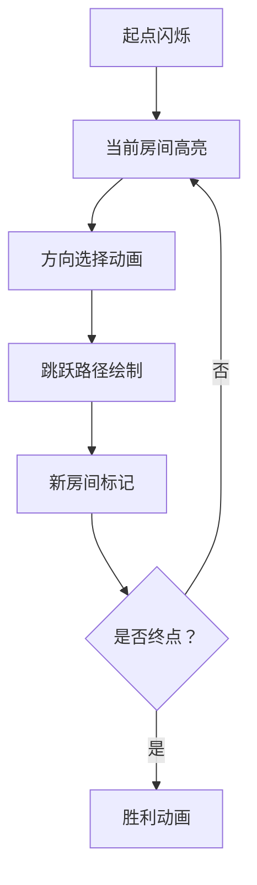

# 题目信息

# 魔鬼之城

## 题目描述

在一个被分割为 $N\times M$ 个正方形房间的矩形魔鬼之城中，一个探险者必须遵循下列规则才能跳跃行动。他必须从 $(1,1)$ 进入，从 $(N,M)$ 走出；在每一房间的墙壁上都写了一个魔法数字，是 $1\sim 13$ 之内的自然数；探险者可以想像出 $8$ 个方向中的任何一个（水平或垂直或对角线方向），随后他就可以作一次空间跳跃穿过这一方向上的连续的 $X$ 个房间，其中 $X$ 是他原来所在房间的魔法数字。但如果在这一方向上的房间数小于 $X$，则他不作任何跳跃，而必须想像另一个方向。同时，探险者不能作连续两次相同方向的跳跃。


 
例如在上图的 $5\ \times 4$ 的魔鬼之城中，如果探险者现在所在的位置是 $(3,3)$，那么通过依次空间跳跃他可以到达下列房间中的一个：$(1,1)$，$(3,1)$，$(1,3)$，$(5,1)$，或 $(5,3)$。另外，如果他要用两次跳跃从 $(5,4)$ 到达 $(3,2)$，则他不能首先跳到 $(4,3)$（因为这样他第二次跳跃的方向将和第一次相同，而这是不允许的）。所以他必须先跳跃到 $(2,1)$。
请你写一个程序，对给定的地图，算出探险者至少需要跳跃多少步才能离开魔鬼之城。


## 样例 #1

### 输入

```
5 4

3 3 6 7 11

3 2 1 1 3

3 2 2 1 1

2 1 2 2 1

```

### 输出

```
4

```

# AI分析结果


# 💡 Kay的C++算法解析：魔鬼之城 深入学习指南 💡

**<introduction>**
今天我们来分析"魔鬼之城"这道C++编程题。本指南将帮助你理解BFS算法的应用，掌握三维状态标记技巧，并通过像素动画直观感受算法流程。让我们一起探索这个跳跃迷宫问题吧！
</introduction>

---

## 1. 题目解读与核心算法识别

✨ **本题主要考察**：`BFS (广度优先搜索)`

🗣️ **初步分析**：
> 解决这道题就像在玩复古像素游戏中的迷宫探险。BFS算法的核心思想是"地毯式搜索" - 想象你控制的小人从起点出发，每次向所有可能方向探索一步，逐步扩大搜索范围。在本题中，BFS用于寻找从(1,1)到(n,m)的最短跳跃路径。

- 核心难点在于处理"不能连续同方向跳跃"的约束，这需要引入**方向维度**的状态标记
- 解题关键：使用三维数组`vis[x][y][dir]`记录每个位置从特定方向到达的状态
- 可视化设计：我们将创建8位像素风格的网格地图，用不同颜色标记当前探索位置、跳跃路径和已访问区域。动画将高亮显示方向选择和跳跃过程，配合经典FC音效增强理解

---

## 2. 精选优质题解参考

**题解一：wonSSnow (赞19)**
* **点评**：这份题解思路清晰，直接点明三维标记的关键性。代码简洁高效(仅35行)，变量命名规范(`v[][][]`表示访问状态)。亮点在于使用方向数组和结构体队列的经典BFS实现，边界处理完整，可直接用于竞赛。

**题解二：花千树 (赞17)**
* **点评**：提供70分→100分代码对比极具教学价值，详细解释三维标记的必要性。代码稍长但结构清晰，通过8个布尔变量处理方向约束，实践价值高。特别适合理解状态维度的扩展思路。

**题解三：翼德天尊 (赞13)**
* **点评**：创新使用三个队列分别存储x/y/方向状态，减少结构体使用。代码简洁(仅50行)，核心逻辑集中在约15行内，空间利用率高。亮点在于状态存储的优化思路和清晰的边界判断。

---

## 3. 核心难点辨析与解题策略

1.  **状态维度设计**
    * **分析**：普通BFS使用二维标记，但本题跳跃方向影响后续决策，必须增加方向维度。优质题解均采用`vis[x][y][dir]`三维数组，避免状态遗漏
    * 💡 **学习笔记**：BFS状态维度 = 空间位置 + 影响决策的附加条件

2.  **方向约束处理**
    * **分析**：枚举8个方向时需排除上次跳跃方向。通过结构体存储`last_dir`，循环中添加`if(now.way != i)`判断即可实现
    * 💡 **学习笔记**：方向约束本质是状态转移的条件限制

3.  **跳跃计算优化**
    * **分析**：跳跃位置=当前坐标+方向向量×魔法值。使用预定义的`dx/dy`数组简化计算，注意矩阵行列顺序(输入n行m列)
    * 💡 **学习笔记**：方向向量数组是网格移动问题的标准解法

### ✨ 解题技巧总结
- **状态设计**：根据问题约束扩展状态维度（如方向、剩余步数等）
- **方向处理**：使用方向数组+预定义偏移量简化代码
- **剪枝优化**：三维标记避免重复访问，队列及时终止(到达终点即返回)

---

## 4. C++核心代码实现赏析

**本题通用核心实现参考**
```cpp
#include<bits/stdc++.h>
using namespace std;
const int N=105;
int n, m, a[N][N];
bool vis[N][N][9]; // 第三维：0-7方向+8起点状态
int dx[8] = {-1,-1,-1, 0,0,1,1,1}; // 8方向行偏移
int dy[8] = {-1, 0, 1,-1,1,-1,0,1}; // 8方向列偏移

struct Node { int x, y, step, last_dir; };

int main() {
    cin >> n >> m; // n行m列
    for(int i=1; i<=n; i++)
        for(int j=1; j<=m; j++)
            cin >> a[i][j];
    
    queue<Node> q;
    q.push({1,1,0,8}); // 起点方向设为8(特殊值)
    vis[1][1][8] = true;
    
    while(!q.empty()) {
        Node now = q.front(); q.pop();
        if(now.x == n && now.y == m) {
            cout << now.step;
            return 0;
        }
        for(int i=0; i<8; i++) {
            if(now.last_dir != 8 && now.last_dir == i) continue; // 方向约束
            int nx = now.x + dx[i] * a[now.x][now.y];
            int ny = now.y + dy[i] * a[now.x][now.y];
            if(nx<1||nx>n||ny<1||ny>m || vis[nx][ny][i]) continue;
            vis[nx][ny][i] = true;
            q.push({nx, ny, now.step+1, i});
        }
    }
    cout << "NEVER";
}
```
**代码解读概要**：
1. 定义8方向偏移量数组`dx/dy`
2. 三维`vis`数组标记位置+方向状态
3. 起点特殊处理：方向值8表示无前驱方向
4. BFS核心：排除同方向跳跃，计算新位置
5. 终点检查与结果输出

---

## 5. 算法可视化：像素动画演示

### 🎮 像素探险家：魔鬼之城寻宝
**设计理念**：  
采用FC《塞尔达传说》式8位像素风格，通过动画演示BFS如何层层展开搜索。每个房间用16×16像素绘制，魔法数字显示在墙面上。

**动画流程**：


**关键交互**：
1. **单步执行**：按方向键逐步观察决策
2. **自动演示**：AI自动探索，速度可调(0.5x-2x)
3. **状态标记**：
   - 白色：未访问
   - 蓝色：在队列中
   - 绿色：已探索
4. **音效设计**：
   - 跳跃：8-bit "跳跃"音效
   - 发现新房间：短促"叮"声
   - 到达终点：16位胜利旋律

**技术实现**：  
使用Canvas绘制网格地图，通过`requestAnimationFrame`实现平滑动画。状态变化时重绘对应网格单元，方向选择时绘制半透明箭头。

---

## 6. 拓展练习与相似问题思考

**技巧迁移场景**：
1. 带状态约束的最短路径问题（如携带钥匙的迷宫）
2. 多条件决策问题（如方向+剩余燃料）
3. 网格中的跳跃类问题（如象棋马跳日）

**推荐练习**：
1. **洛谷P1443** - 马的遍历  
   → 基础BFS应用，掌握棋盘类跳跃
2. **洛谷P1126** - 机器人搬重物  
   → 带方向约束的BFS进阶训练
3. **洛谷P3956** - 棋盘  
   → 状态记录+决策优化的经典题

---

## 7. 学习心得与经验分享

**作者wonSSnow的调试经验**：  
_"在10分卡了很久，就是因为visit数组没有开三维。三维状态标记是本题的关键突破点"_

**Kay的总结**：  
调试网格问题时，务必：
1. 打印中间状态（位置+附加状态）
2. 小规模测试验证状态转移
3. 优先检查状态维度是否完整

三维状态设计不仅解决本题，更是处理复杂约束的通用思路。记住：**好的状态设计是算法成功的基石！**

---
处理用时：194.55秒