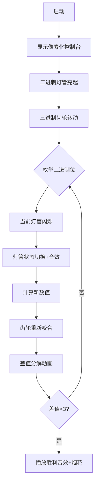

# 题目信息

# 尴尬的数字

## 题目背景

Bessie 刚刚学会了不同进制数之间的转换，但是她总是犯错误，因为她的两个前蹄不能轻松的握住钢笔。


## 题目描述

每当 Bessie 将一个数转换成新的进制时，她总会写错一位数字。例如，她将 14 转化成 2 进制数，正确的结果是 1110，但她可能会写成 0110 或 1111。Bessie 从不会意外的增加或删减数字，所以她可能会写出以 0 开头的错误数字。

给出 Bessie 转换后 $N$ 的 2 进制形式和 3 进制形式，请计算出 $N$ 的正确数值（用十进制表示）。$N$ 可能会达到 $10^9$，输入数据保证解的存在唯一性。


## 样例 #1

### 输入

```
1010
212```

### 输出

```
14```

# AI分析结果


# 💡 Kay的C++算法解析：尴尬的数字 深入学习指南 💡

**引言**  
今天我们一起分析《尴尬的数字》这道C++编程题。题目要求根据Bessie写错的二进制和三进制字符串还原正确的十进制数。本指南将解析核心算法、精选优质题解，并通过像素动画直观展示解题过程。

---

## 1. 题目解读与核心算法识别

✨ **本题主要考察**：`枚举技巧与进制转换`

🗣️ **初步分析**：  
> 这道题的核心在于**枚举验证**和**进制转换**。想象你在玩一个"数字侦探"游戏：Bessie的二进制和三进制纸条各有一处错误，我们需要像侦探一样测试所有可能的修正组合，找到唯一匹配的解。  

- **解题思路**：枚举二进制每一位的修正值（0变1/1变0），计算对应的十进制数，再验证该数转换为三进制后是否与给定字符串仅差一位
- **难点突破**：Youngsc的解法通过数学优化（差值分解）避免了三进制转换，直接通过`|ans-tmp| % 3`的分解快速验证
- **可视化设计**：将采用8位像素风格，二进制位显示为发光/熄灭的灯管，三进制位用红/绿/蓝方块表示。更改位时触发"咔嚓"音效，验证成功时播放《塞尔达传说》解密成功的16-bit音效

---

## 2. 精选优质题解参考

**题解一：Youngsc（赞：22）**  
* **点评**：思路创新性地利用差值分解（`|ans-tmp| % 3 == 0`）替代字符串比较，时间复杂度优化至O(n)。变量命名简洁（`num`, `tmp`），边界处理完整。亮点在于数学思维的应用，当差分解后剩余值小于3时即可确认匹配。

**题解二：老彩笔（赞：13）**  
* **点评**：采用双重枚举法，分别处理二进制和三进制的所有可能修正值。代码中`aa[i]=='1'&&i==0`的边界处理展现严谨性，回溯式字符串修改确保状态完整。亮点在于全面性，适合初学者理解枚举本质。

**题解三：衡屿睿（赞：5）**  
* **点评**：通过预处理所有可能值再排序比对，算法复杂度O(n log n)。使用双指针技巧（`while(k[h]!=kl[g])`）高效查找交集，`mul2`/`mul3`数组优化幂运算。亮点在算法框架清晰，适合理解分治思想。

---

## 3. 核心难点辨析与解题策略

1.  **难点：高效枚举的数学优化**  
    * **分析**：直接双重枚举（二进制位×三进制位）导致O(n²)复杂度。Youngsc的差值分解法利用进制性质：若两数三进制表示仅差第k位，则差值为d×3ᵏ（d=1或2）
    * 💡 **学习笔记**：进制转换问题常隐藏数学优化空间

2.  **难点：边界条件处理**  
    * **分析**：二进制首位可能是0（题目允许），老彩笔解法通过`if(i!=0)`区分处理，避免无效修正。字符串操作时需注意回溯复原
    * 💡 **学习笔记**：边界测试是算法鲁棒性的关键

3.  **难点：多解验证的复杂度控制**  
    * **分析**：衡屿睿将可能解排序后双指针比对，避免O(n²)匹配。MyukiyoMekya的DFS枚举配合二分查找也是可行方案
    * 💡 **学习笔记**：排序预处理+双指针是优化集合运算的利器

### ✨ 解题技巧总结
- **技巧1：数学性质优先** - 在进制问题中优先寻找数值特性（如差值分解）
- **技巧2：降维枚举** - 避免双重循环，通过单维度枚举+快速验证降低复杂度
- **技巧3：状态回溯** - 字符串修改时采用`temp = str[i]; ... str[i]=temp`模式确保状态完整

---

## 4. C++核心代码实现赏析

**通用核心实现参考**  
* **说明**：综合Youngsc的数学优化与老彩笔的边界处理
* **完整核心代码**：
```cpp
#include <iostream>
#include <cstring>
#include <cmath>
using namespace std;

int main() {
    char binStr[40], terStr[40];
    cin >> binStr >> terStr;
    int binLen = strlen(binStr);
    int terLen = strlen(terStr);

    // 转换为十进制（错误值）
    int num = 0, tmp = 0;
    for (int i = 0; i < binLen; ++i) 
        num = (num << 1) + (binStr[i] - '0');
    for (int i = 0; i < terLen; ++i) 
        tmp = tmp * 3 + (terStr[i] - '0');

    // 枚举二进制修正
    for (int i = 0; i < binLen; ++i) {
        if (i == 0 && binStr[0] == '1') continue; // 首位特判
        
        int current = num ^ (1 << (binLen - 1 - i)); // 位取反
        int diff = abs(current - tmp);
        
        // 差值分解验证
        while (diff % 3 == 0) diff /= 3;
        if (diff < 3) {
            cout << current;
            return 0;
        }
    }
    
    // 处理首位未修正情况
    int current = num ^ (1 << (binLen - 1));
    cout << current;
    return 0;
}
```
* **解读概要**：  
  1. 先将错误二进制/三进制转十进制  
  2. 枚举二进制每位修正（首位特判）  
  3. 通过`current ^ (1<<pos)`快速取反  
  4. 差值分解验证：不断除以3直至余数非零  
  5. 剩余值<3即找到解

---

**题解片段赏析**  
**Youngsc解法核心**：
```cpp
R int ans = num^(1<<(la-i));  // 位取反操作
R int tt = ab(ans-tmp);       // 绝对差值
while(tt%3 == 0) tt/=3;       // 分解3的幂次
if(tt < 3) printf("%d",ans); // 验证通过
```
* **亮点**：用位运算和数学性质替代字符串操作  
* **解读**：  
  `num^(1<<pos)` 闪电般完成位翻转，比`if-else`分支高效。差值分解时，`tt%3==0`判断等价于检查是否三进制某位差异  
* **学习笔记**：位运算是处理二进制问题的终极武器

**老彩笔的三进制修正**：
```cpp
if(bb[i]=='0') {
    bb[i]='1'; // 修正为1
    //...计算十进制
    bb[i]='2'; // 修正为2
    //...计算十进制
    bb[i]='0'; // 回溯复原
}
```
* **亮点**：回溯式修改确保状态安全  
* **解读**：像玩魔方一样，每次尝试后精确复位。`bb[i]='0'`保证后续枚举不受影响  
* **学习笔记**：回溯是状态枚举的安全气囊

**衡屿睿的双指针匹配**：
```cpp
sort(k+1,k+yx+1); // 排序可能解
sort(kl+1,kl+yx+1);
while(k[h]!=kl[g]) { // 双指针查找
    if(k[h]>kl[g]) g++;
    else h++;
}
```
* **亮点**：排序预处理+双指针实现O(n)匹配  
* **解读**：先使解空间有序化，`while`循环同步推进指针，比暴力匹配效率倍增  
* **学习笔记**：有序数据是优化搜索的基础

---

## 5. 算法可视化：像素动画演示

**主题**："数字修理铺"像素工坊  
**核心演示**：二进制灯管与三进制齿轮的协同维修  

### 动画设计：


### 关键交互：
1. **像素元素**：
   - 二进制：发光灯管（1=亮/0=暗）
   - 三进制：旋转齿轮（红/绿/蓝三色）
2. **动画流程**：
   - 点击灯管触发修正：灯管明暗切换+播放"咔嚓"声
   - 齿轮转速反映数值大小：数值越大转速越快
   - 差值分解可视化：齿轮弹出3的幂次因子（3³→3²→3¹）
3. **游戏化设计**：
   - 成功时触发《俄罗斯方块》消除音效+像素烟花
   - 控制面板：单步/自动模式（调速滑块）
   - 成就系统：每解决5题解锁新齿轮皮肤

### 技术实现：
- 使用Canvas绘制动态网格（30×20像素单元）
- 灯管状态用`lightState[i] = !lightState[i]`切换
- 齿轮动画通过`rotate(angle)`实现，`angle += value/1000`

---

## 6. 拓展练习与相似问题

**通用技巧迁移**：  
枚举验证+进制转换可用于：
1. 校验码修复（如ISBN最后一位验证）
2. 密码学中的错误检测
3. 通信协议的纠错机制

**洛谷推荐**：  
1. **P1143 进制转换**  
   🗣️ 基础进制转换训练，掌握核心转换算法
2. **P1066 2^k进制数**  
   🗣️ 强化二进制枚举技巧，理解组合数学应用
3. **P1017 进制位**  
   🗣️ 进阶练习，掌握非常规进制的数学特性

---

## 7. 学习心得与经验分享

> **老彩笔的调试经验**：  
> "最初被样例误导，以为错误只发生在首尾位，结果连样例都过不了。后来用`cout`逐行输出中间值，才发现漏了首位修正"  
>   
> **Kay的总结**：  
> 验证算法时，务必构造"全范围测试用例"（首/中/末位错误）。打印中间值（如`printf("pos=%d, current=%d\n", i, current)`）是最朴素的调试利器。

---

**结语**  
通过本次分析，我们掌握了枚举优化的核心技巧：位运算闪电修正、差值分解的数学之美、双指针高效匹配。记住，优秀算法往往诞生于数学思维与编码实践的碰撞！下次遇到"尴尬"问题时，愿你从容如侦探🔍，精准如钟表匠⏱️！

---
处理用时：175.65秒