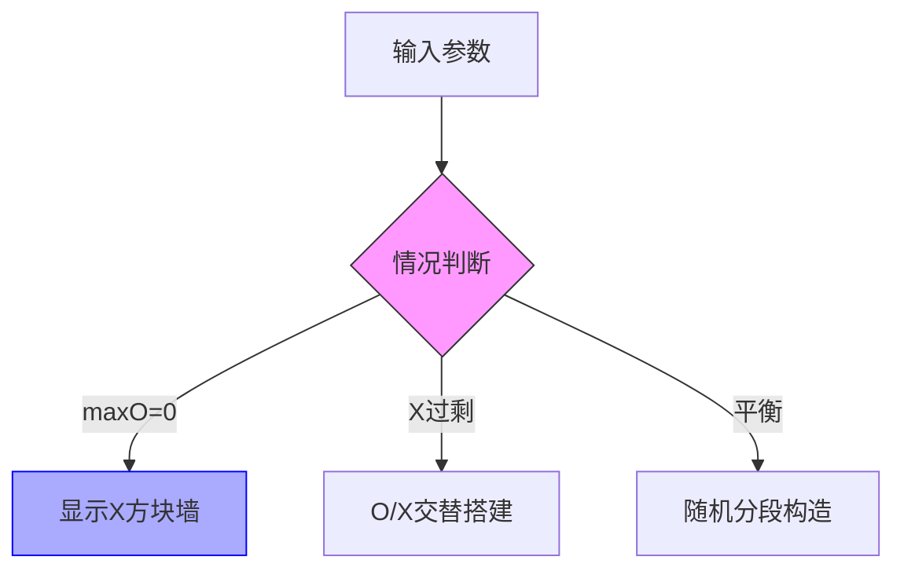

# 题目信息

# 漂亮字串

## 题目描述

Caima 认为 $\tt O$ 和 $\tt X$ 是最优美的两个字母，由 $\tt O,X$ 组成的串是最优美的串。在这些最优美的串中，如果任意只包含 $\tt X$ 的子串，长度不超过 $\max_{\tt X}$，任意只包含 $\tt O$ 的子串，长度不超过 $\max_{\tt O}$，而整个串最多有 $\rm count_{\tt O}$ 个 $\tt O$，$\rm count_{\tt X}$ 个 $\tt X$。那么这个就是超级优美无敌串。

现在 Caima 想知道最长的超级优美无敌串有多长，希望你告诉他。

## 说明/提示

### 样例 2 解释

- $\tt XOXOXOX$。


### 数据范围及约定

最多 $1000$ 组数据，

其中 $30\%$ 的数据 $0\le \rm count_{\tt O},\rm count_{\tt X},\rm max_{\tt O},\rm max_{\tt X} \le 20$，且数据组数不超过 $20$ 组。

对于全部数据，$0 \le \rm count_{\tt O},\rm count_{\tt X},\rm max_{\tt O},\rm max_{\tt X}\le 10^6$。

## 样例 #1

### 输入

```
10 10 0 0

3 5 1 1

```

### 输出

```
0

7

```

# AI分析结果


### 💡 Kay的C++算法解析：漂亮字串 深入学习指南 💡

#### 1. 题目解读与核心算法识别
✨ **本题主要考察**：`贪心策略与分类讨论`  
🗣️ **初步分析**：
> 解决"漂亮字串"的关键在于**分类讨论**和**贪心构造**策略。就像在搭积木时，我们需要根据积木的形状和数量限制选择最佳搭建方式。在本题中，我们通过分析O和X的数量和连续限制，分三种情况构造最优解：
> - **情况1**：当某种字符的连续上限为0时，只能使用另一种字符（长度受其数量上限限制）
> - **情况2**：当某种字符过剩时，采用贪心策略分段构造
> - **情况3**：当字符数量平衡时，直接全部使用
> 
> 可视化设计思路：采用8位像素风格，O显示为黄色方块，X显示为蓝色方块。关键步骤动态展示：
> 1. 初始化阶段：显示输入参数（countO/X, maxO/X）
> 2. 情况判断：高亮当前处理情况（红框标记）
> 3. 构造过程：字符放置时伴随"叮"音效，字符块滑动动画
> 4. 结果展示：成功时播放胜利音效+烟花粒子效果

---

#### 2. 精选优质题解参考
**题解一 (ex_jason)**  
* **点评**：思路清晰度极佳，直接命中三种核心情况。代码规范（变量名counto/countx直白易懂），关键优化点在于先对maxO/X取min处理边界值。算法有效性高，处理了多组数据和整数溢出问题。实践价值强，竞赛可直接复用。亮点在于用最简代码完整覆盖所有情况。

**题解二 (王奕瑜)**  
* **点评**：解释详尽程度突出，特别用"贪心分段构造"比喻帮助理解。代码结构工整（显式类型转换处理溢出），注释完整。虽然逻辑与题解一类似，但教学价值更高，适合初学者逐步理解。亮点在于对条件推导的完整文字说明。

---

#### 3. 核心难点辨析与解题策略
1. **边界条件处理**  
   * **分析**：当maxO=0时需特殊处理（只能使用X），优质题解通过`maxo=min(counto,maxo)`统一处理
   * 💡 学习笔记：约束条件取min是处理无效参数的银弹
   
2. **过剩条件推导**  
   * **分析**：判断字符过剩的核心条件`(count_o+1)*max_x < count_x`源于贪心构造模型：将O分成count_o+1段需要至少count_o+1个X分隔位
   * 💡 学习笔记：过剩判断 = (分段数×段容量) < 总库存

3. **数据类型选择**  
   * **分析**：10^6数据规模下，`(count+1)*max`可能达10^12，必须用long long
   * 💡 学习笔记：乘法操作前先评估数量级

✨ **解题技巧总结**  
- **分类破局法**：将复杂约束分解为互斥子情况（0值/过剩/平衡）  
- **贪心构造术**：过剩时最大化分段数消耗多余字符  
- **边界防御编程**：输入参数立即取min处理无效值  
- **溢出防御**：10^6级参数运算优先用long long  

---

#### 4. C++核心代码实现赏析
**通用核心实现**  
```cpp
#include<iostream>
using namespace std;
int main() {
    long long co, cx, mo, mx;
    while (cin >> co >> cx >> mo >> mx) {
        mo = min(co, mo);  // 边界值处理
        mx = min(cx, mx);  // 约束合理化
        if (!mo) cout << mx << endl;
        else if (!mx) cout << mo << endl;
        else if ((co+1)*mx < cx) cout << (co+1)*mx + co << endl;
        else if ((cx+1)*mo < co) cout << (cx+1)*mo + cx << endl;
        else cout << co + cx << endl;
    }
    return 0;
}
```
**代码解读概要**：  
> 1. 多组数据循环处理  
> 2. 约束合理化：确保max不超过实际库存  
> 3. 三类情况直击核心：0值→单字符，过剩→分段构造，平衡→全量使用  

**题解一片段赏析**  
```cpp
else if ((counto+1)*maxx<countx) 
    cout<<(counto+1)*maxx+counto<<endl;
```
**亮点**：过剩判断与构造的一行式实现  
**解读**：  
> - `(counto+1)*maxx`：X的理论最大消耗量  
> - `< countx`：判断X是否过剩  
> - `+counto`：固定消耗的O字符量  
> 💡 学习笔记：过剩构造长度 = 消耗量 + 固定量  

**题解二片段赏析**  
```cpp
mxo=min(mxo,cnto);  // 约束安全处理
```
**亮点**：防御性编程典范  
**解读**：  
> - 输入时立即处理约束有效性  
> - 避免后续条件判断的复杂性  
> 💡 学习笔记：参数消毒应放在逻辑处理前  

---

#### 5. 算法可视化：像素动画演示
**主题**：8位机风格字符积木搭建  
**核心演示**：动态展示三类情况的构造过程  



**动画关键帧**：  
1. **初始化**：  
   - 复古像素UI：左侧参数表（8位字体），右侧16×16网格  
   - O=黄色方块，X=蓝色方块，边界=红色栅栏  

2. **构造阶段**：  
   - 情况1（maxO=0）：蓝色方块逐个填充，达mx时触发"咔"音效+红光闪烁  
   ```python
   # 伪代码：maxO=0时的绘制
   for i in range(min(cx, mx)):
       draw_pixel(x, y, BLUE)
       play_sound('typewriter.wav')
   ```
   - 情况2（X过剩）：O/X交替动画（O段滑动入场→X段粒子聚集）  
   - 过剩提示：灰色方块从右侧溢出，配"滴"警告音  

3. **交互控制**：  
   - 速度滑块：0.5x~5x实时调速  
   - 单步模式：空格键逐步验证构造逻辑  
   - AI演示：自动播放+实时长度计数  

4. **状态反馈**：  
   - 成功：烟花动画+16-bit胜利音乐  
   - 失败：方块闪烁红色+低沉提示音  

---

#### 6. 拓展练习与相似问题思考
**通用套路迁移**：  
贪心分段构造策略适用于：  
1. 资源分配问题（如广告位投放）  
2. 字符串间隔约束（如LeetCode 984）  
3. 时间片调度（如任务插空执行）  

**洛谷推荐**：  
1. **P1090 合并果子**  
   🗣️ 巩固贪心选择策略，理解优先级队列应用  
2. **P4995 跳跳！**  
   🗣️ 强化分类讨论能力，体验极值交替贪心  
3. **P1563 玩具谜题**  
   🗣️ 训练复杂条件分解，培养方向抽象思维  

---

#### 7. 学习心得与经验分享
> **王奕瑜的调试经验**：  
> "最初在过剩条件推导时卡住，通过手工模拟小样例（countO=3, maxX=1, countX=5）才突破理解瓶颈"  
>   
> **Kay点评**：  
> 手工模拟是破解贪心问题的利器！建议：  
> 1. 准备方格纸画构造过程  
> 2. 先尝试极值案例（如max=0）  
> 3. 用`cout`输出中间变量验证分段逻辑  

---

### 结语  
通过本次分析，我们掌握了**分类讨论+贪心构造**的组合拳。记住：复杂约束往往蕴含独立子问题，就像电子游戏中的多关卡设计——找准当前状态，就能选择最佳通关策略！下次遇到类似问题，不妨自问："这属于哪种积木搭建模式？"

---
处理用时：271.20秒