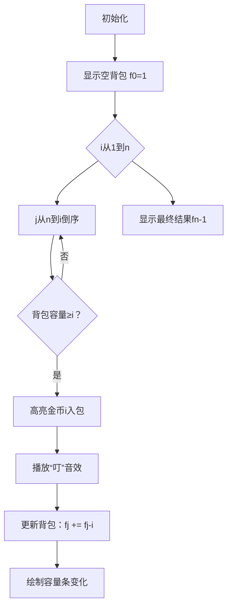

# 题目信息

# 跑步

## 题目描述

路人甲准备跑 $n$ 圈来锻炼自己的身体，他准备分多次（$\gt1$）跑完，每次都跑正整数圈，然后休息下再继续跑。

为了有效地提高自己的体能，他决定每次跑的圈数都必须比上次跑的多。

可以假设他刚开始跑了 $0$ 圈，那么请问他可以有多少种跑完这 $n$ 圈的方案？

## 说明/提示

#### 数据规模与约定

对于 $100\%$ 的数据，保证 $5\le n\le 500$。

## 样例 #1

### 输入

```
212```

### 输出

```
995645335```

# AI分析结果


# 💡 Kay的C++算法解析：跑步 深入学习指南 💡

## 1. 题目解读与核心算法识别

✨ **本题主要考察**：`动态规划（01背包变体）`

🗣️ **初步分析**：
> 解决"跑步"这道题，关键在于将问题转化为**01背包求方案数模型**。想象你有一个容量为n的背包（总圈数），物品是1~n的圈数（每个物品重量=价值=圈数）。每次只能选一次物品（01背包），选出的物品序列自然满足递增要求（因为从小到大枚举物品）。  
   - 核心思路：用`f[j]`表示凑成j圈的方案数，通过倒序枚举背包容量避免重复选择，最后减去"一次跑完"的非法情况
   - 可视化设计：像素动画将展示背包容量条、圈数物品的选取过程，高亮倒序更新时背包容量的变化
   - 复古游戏化设计：采用"像素探险家收集金币"主题，金币编号1~n代表圈数。收集时触发8-bit音效，成功集齐n金币时播放胜利音效，背包容量条用像素色块动态填充

---

## 2. 精选优质题解参考

**题解一（翼德天尊）**
* **点评**：思路直击本质，将问题转化为01背包求方案数，代码简洁高效（O(n²)）。变量命名清晰（`ans[j]`），边界处理严谨（`ans[0]=1`初始化）。实践价值高，竞赛可直接使用。亮点在于用背包模型自然满足递增约束。

**题解二（AveMarina）**
* **点评**：明确区分01背包与完全背包的应用场景，提供模板对比加深理解。代码规范（LL防溢出），关键注释到位。亮点在于指出"物品重量=价值"特性及倒序枚举的原理。

**题解三（XL4453）**
* **点评**：从二维DP优化到一维的过程讲解透彻，强调状态设计思想。代码极简但完整，空间优化到位。亮点在于讨论数据加强时的应对策略，体现算法可扩展性。

---

## 3. 核心难点辨析与解题策略

1.  **难点1：问题转化为背包模型**
    * **分析**：关键在于识别"严格递增序列求和"与"01背包选取物品"的等价性。优质题解通过类比物品重量=圈数，背包容量=总圈数建立映射。
    * 💡 **学习笔记**：计数类问题若满足"元素独立+目标固定"，可考虑背包模型。

2.  **难点2：状态转移的倒序设计**
    * **分析**：正序枚举会导致同一物品重复选择（完全背包），而倒序保证每个圈数仅选一次。可视化中需高亮j从n→i的更新顺序。
    * 💡 **学习笔记**：倒序枚举是01背包空间优化的精髓，本质是滚动数组压缩状态。

3.  **难点3：边界条件与非法方案处理**
    * **分析**：初始化`f[0]=1`表示空方案，但最终需排除单次跑完（`f[n]-1`）。二维DP解法中需跳过`dp[i][i]`状态。
    * 💡 **学习笔记**：DP初始化是构建状态转移的基石，需结合问题语义谨慎设计。

### ✨ 解题技巧总结
- **技巧1：背包问题特征识别** - 当问题出现"组合求和+元素互异"时，考虑01背包变体
- **技巧2：空间优化推导** - 二维DP若仅依赖上一行状态，可优化为一维
- **技巧3：调试数据构造** - 用n=5验证：方案有(1,4)/(2,3)/(1,2,3)共3种

---

## 4. C++核心代码实现赏析

**本题通用核心C++实现参考**
```cpp
#include <iostream>
using namespace std;
typedef long long LL; // 防溢出

int main() {
    int n; cin >> n;
    LL f[505] = {1}; // 初始化f[0]=1
    
    for (int i = 1; i <= n; i++)       // 枚举圈数(物品)
        for (int j = n; j >= i; j--)  // 倒序枚举背包容量
            f[j] += f[j - i];         // 状态转移
    
    cout << f[n] - 1; // 减去一次跑完的方案
    return 0;
}
```
**代码解读概要**：  
1. `f[0]=1` 初始化保证状态转移起点  
2. 外层循环枚举每次跑的圈数（物品）  
3. 内层倒序更新背包容量，避免重复选择  
4. 最终结果需排除单次跑完的非法情况  

---

**题解一核心片段赏析**  
```cpp
ans[0]=1;
for (int i=1;i<=n;i++) 
    for (int j=n;j>=i;j--) 
        ans[j] += ans[j-i];  // 状态转移
```
* **亮点**：用简洁代码实现完整背包逻辑  
* **代码解读**：  
  > `ans[j] += ans[j-i]` 是关键转移方程：凑j圈的方案数 += 没选当前圈数i时的方案数。倒序枚举确保`ans[j-i]`来自上一轮状态  
* 💡 **学习笔记**：背包问题中，状态转移本质是决策的数学表达  

**题解二核心片段赏析**  
```cpp
for (int i=1; i<=n; i++) 
    for (int j=n; j>=i; j--) 
        f[j] += f[j-i];  // 01背包转移
```
* **亮点**：明确注释转移方程类型  
* **代码解读**：  
  > 与题解一逻辑一致，但强调`j>=i`的边界控制：当背包容量小于圈数i时无法选择  
* 💡 **学习笔记**：内层循环条件决定状态转移的有效范围  

**题解三核心片段赏析**  
```cpp
f[0]=1;
for(int i=1;i<=n;i++)
    for(int j=n;j>=i;j--)
        f[j] += f[j-i];  // 一维优化
```
* **亮点**：极致简洁的工业级实现  
* **代码解读**：  
  > 省略大括号的单行循环体现算法核心逻辑，适合竞赛编码  
* 💡 **学习笔记**：代码简洁性应与可读性平衡，关键步骤需注释  

---

## 5. 算法可视化：像素动画演示

**主题**：  
"金币收集者"——像素小人跑圈收集递增编号金币，背包容量条实时显示当前圈数  

**核心演示流程**：  


**交互设计**：  
1. **控制面板**：  
   - 步进/暂停/重置按钮 + 速度滑块  
   - 背包容量条（像素色块组成）  
   - 当前状态显示：`f[j] = ?`  

2. **关键动画细节**：  
   - 金币编号1→n悬浮排列，选中时放大闪烁  
   - 倒序更新时，j指针从右向左扫描背包格  
   - 容量条色块增长时显示`f[j] += f[j-i]`公式  

3. **音效系统**：  
   - 拾取金币：8-bit "叮"声  
   - 步骤完成：电子合成音效  
   - 游戏结束：马里奥过关音乐  

---

## 6. 拓展练习与相似问题思考

**通用技巧迁移**：  
01背包求方案数模型还可解决：  
1. 集合划分问题（如：能否分成和相等的两子集）  
2. 目标和的组合数（如：硬币组合问题）  
3. 元素不重复的子集计数  

**洛谷推荐题目**：  
1. **P1048 采药**  
   → 基础01背包应用，巩固"价值最大化"变体  
2. **P1734 最大约数和**  
   → 物品价值=约数和，练习问题转化能力  
3. **P1164 小A点菜**  
   → 求方案数的直接应用，强化边界处理  

---

## 7. 学习心得与经验分享

**题解作者经验摘录**：  
> "倒序枚举是01背包的灵魂，正序就成了完全背包" —— AveMarina  
> "二维DP容易MLE，一维优化是竞赛必备技能" —— XL4453  

**Kay总结**：  
- 调试核心：打印中间状态（如n=5时f数组变化）  
- 易错点：忘记`f[0]=1`初始化导致全零结果  
- 能力提升：从DFS暴力到DP优化的思维跃迁  

---

通过本指南，相信大家已掌握背包问题在方案计数中的巧妙应用。记住：算法本质在于**问题抽象**与**状态设计**。下次遇到组合优化问题时，不妨先问自己："这能否转化为背包模型？" 继续加油，编程之路如跑圈，每一步都算数！🏃💨

---
处理用时：163.30秒