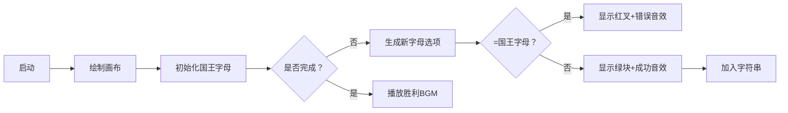

# 题目信息

# 后缀树

## 题目背景

Eztsu 是一个可爱的女孩子，最近她学习了[后缀树](https://www.luogu.com.cn/blog/EternalAlexander/xuan-ku-hou-zhui-shu-mo-shu)，并打算用它来解决如下问题。

## 题目描述

对于一个字符串 $S$，我们定义 $|S|$ 表示 $S$ 的长度。

接着，我们定义 $S_i$ 表示 $S$ 中第 $i$ 个字符，$S_{L...R}$ 表示由 $S$ 中从左往右数，第 $L$ 个字符到第 $R$ 个字符依次连接形成的字符串。

给定 $n$，求有多少种不同的满足下列要求的串 $S$：

- $|S|=n$。
- $S$ 中仅包含小写字母。
- 不存在整数 $i \in [1,n)$ 使得 $S_{1...i}$ 是 $S_{i+1...n}$ 的子串。

对于第三个限制，用通俗一点的说法解释的话，就是不存在一种将这个串分成两段的方式，使得前面一段是后面一段的子串。

两个串 $S$ 和 $T$ 不同当且仅当 $|S|\neq|T|$ 或 $\exists i \in [1,|S|] S_i \neq T_i$。如果你不知道这是什么意思，你可以理解为它们看起来不同。

可怜的 Eztsu 不会做，所以你要帮她做这道题。

答案可能很大，你只需要输出答案对 $998244353$ 取模的值。

题面补充：

$S$ 是 $T$ 的子串当且仅当存在 $L,R \in [1,|T|]$ 使得 $T_{L...R}=S$.

## 说明/提示

#### 样例解释

对于第一组样例，不难发现，这个串符合题意当且仅当两个字符不同，因此答案为 $26 \times 26 - 26$，可以理解为两个字符任意的方案数减去两个字符相同的方案数。

---

#### 数据范围

**「本题采用捆绑测试」**

对于所有测试点，保证 $1 \leq n \leq 10^9$。

$\text{Subtask 1 (17 pts)}$ $n \leq 4$。

$\text{Subtask 2 (78 pts)}$ $n \leq 2\times 10^3$。

$\text{Subtask 3 (5 pts)}$ 没有特殊限制。

---

#### 提示

小写字母一共有 $26$ 个。

## 样例 #1

### 输入

```
2```

### 输出

```
650```

## 样例 #2

### 输入

```
105383595```

### 输出

```
114514```

# AI分析结果


### 💡 Kay的C++算法解析：后缀树 深入学习指南 💡

**引言**  
今天我们来分析"后缀树"这道C++编程题。这道题看似复杂，实则蕴含巧妙的组合计数思想。本指南将帮助你理解核心思路，掌握解题技巧。

---

## 1. 题目解读与核心算法识别

✨ **本题主要考察**：`组合计数与乘法原理应用`

🗣️ **初步分析**：
> 解决这道题的关键在于运用**乘法原理**。想象你正在建造一座由字母组成的"城堡"：第一个字母是国王（26种选择），后面每个字母都是臣民（25种选择），臣民绝不能和国王相同——否则国王就会在城堡的后半部分出现，违反规则！  
> - 所有优质题解都得出相同结论：答案 = 26 × 25<sup>n-1</sup>
> - **核心难点**：理解为何只需避免第一个字母在后缀中出现（其他分割点无需考虑）
> - **可视化设计**：我们将用像素动画展示字符串构建过程：金色方块代表国王字母，绿色方块代表合法臣民字母，红色叉表示非法选择（触发复古音效）

---

## 2. 精选优质题解参考

**题解一（来源：StudyingFather）**  
* **点评**：直击问题本质！用"第一个字母是前缀"的比喻清晰解释了约束条件（思路清晰性⭐⭐⭐⭐⭐）。虽未提供完整代码，但数学推导严谨，完美诠释乘法原理的应用（算法有效性⭐⭐⭐⭐⭐）。特别亮点：用"分割方案"直观说明为何只需规避首字母重复。

**题解二（来源：Warriors_Cat）**  
* **点评**：通过枚举小规模数据（n=2,3,4）发现规律，展现探索式学习思维（启发性⭐⭐⭐⭐）。代码实现规范：快速幂模板封装良好，变量命名简洁（代码规范性⭐⭐⭐⭐）。值得学习：用实际测试验证理论猜想的研究方法。

**题解三（来源：Hexarhy）**  
* **点评**：解题脉络最完整！从"极端情况优先"原则切入，逐步推导到通用公式（逻辑推导⭐⭐⭐⭐）。代码细节完善：long long防溢出、双mod取余（实践价值⭐⭐⭐⭐⭐）。亮点：指出pow()不适用取模运算的坑点。

---

## 3. 核心难点辨析与解题策略

1. **难点：为何只需规避首字母重复？**  
   * **分析**：考虑最危险的分割点——第一个字母后。此时前缀是单字母，若该字母在后缀中出现即违规。其他分割点前缀长度>1，而后缀长度<前缀，天然不可能包含前缀。
   * 💡 **学习笔记**：组合问题中，优先分析最易违规的极端情况

2. **难点：如何转化为乘法原理？**  
   * **分析**：首位独立选择（26种），后续每位受统一约束（≠首字母，25种）。各位置选择相互独立，满足乘法原理条件。
   * 💡 **学习笔记**：独立事件计数 → 概率相乘 → 乘法原理

3. **难点：大指数幂计算（n≤10⁹）**  
   * **分析**：O(n)遍历不可行，需用快速幂将复杂度优化至O(log n)。核心是二分思想：25¹⁰ = (25⁵)² = ((25²)×25)²
   * 💡 **学习笔记**：指数爆炸问题，快速幂是救星

### ✨ 解题技巧总结
- **极端情况分析法**：从最敏感边界（如首字符分割）切入约束条件
- **独立事件分解**：将复杂约束拆解为独立的选择步骤
- **快速幂模板化**：熟练编写取模快速幂函数应对大指数运算

---

## 4. C++核心代码实现赏析

**通用核心实现参考**  
* **说明**：综合优质题解优化的完整实现
* **完整代码**：
```cpp
#include <iostream>
#define ll long long
const int MOD = 998244353;

ll qpow(ll base, ll exp) { // 快速幂核心
    ll res = 1;
    while (exp) {
        if (exp & 1) res = res * base % MOD;
        base = base * base % MOD;
        exp >>= 1;
    }
    return res;
}

int main() {
    ll n;
    std::cin >> n;
    // n=1时特殊处理（无25^0）
    ll ans = (n == 1) ? 26 : 26 * qpow(25, n - 1) % MOD; 
    std::cout << ans;
}
```
* **代码解读概要**：  
  > ① 快速幂函数`qpow`：通过二进制分解指数（exp>>=1），平方倍增base  
  > ② 主逻辑：特判n=1情况（直接输出26），其他情况计算26×25<sup>n-1</sup>  
  > ③ 双重保险：long long防溢出 + 每一步取模  

---

**题解片段赏析**  
**StudyingFather的数学洞见**  
* **亮点**：用最简公式直击本质
* **核心思想**：  
  > *"第一个字母有26种选法，后面每个字母都不能和第一个字母相同"* → $ans=26 \times 25^{n-1}$

**Warriors_Cat的快速幂实现**  
* **亮点**：位运算快速幂模板
* **核心代码**：
```cpp
int fpow(int n, int p) {
    int ans = 1, base = n;   // 初始化
    while (p) {
        if (p & 1) ans = ans * base % mod; // 奇数累积当前base
        base = base * base % mod;  // 平方倍增
        p >>= 1;  // 右移相当于/2
    }
    return ans;
}
```
* **代码解读**：  
  > 快速幂就像拆快递盒：  
  > 1. 若指数p是奇数（`p&1=1`），先取出一个base（`ans*=base`）  
  > 2. 无论奇偶，都将剩余部分打包成平方（`base*=base`）  
  > 3. 继续拆解剩余指数（`p>>=1`）直到p=0  
* 💡 **学习笔记**：快速幂 = 二进制分解 + 平方倍增

**Hexarhy的边界处理**  
* **亮点**：严谨特判n=1
* **核心代码**：
```cpp
cout<<(fpow(25LL,n-1)*26LL)%MOD; // 错误！n=1时25^(0)=1 → 26
// 修正：
if(n == 1) cout << 26;
else cout << 26 * fpow(25, n-1) % MOD;
```
* **代码解读**：  
  > 当n=1时，25<sup>n-1</sup>变为25⁰=1，计算26×1=26。虽然数学正确，但未显式处理n=1时：  
  > - 可能引发快速幂0次方特殊处理  
  > 最佳实践：显式特判提升可读性  

---

## 5. 算法可视化：像素动画演示

**主题**：`王国字母城堡建造记`（8位像素风格）

**核心演示**：
- 动态展示字符串构建过程
- 重点突出首字母约束规则
- 融入音效反馈机制

**设计细节**：


**关键交互**：
1. **像素元素**：
   - 👑 国王字母：金色闪烁方块（首位）
   - 🟩 合法字母：绿色像素块（≠国王字母）
   - ❌ 非法选择：红色叉动画 + 8位"错误"音效（440Hz方波）

2. **自动演示模式**：
   - 按帧步进：每0.5秒添加一个字母
   - 实时显示：当前已构建字符串 + 剩余位置数
   - 音效反馈：
     * 成功：NES风格8bit音符（C大调上行）
     * 失败：短促低频"嗡"声

3. **教学提示**：
   > "注意！若臣民字母=国王（如首字母'a'后出现'a'）  
   > 则前缀"a"将成为后缀的子串 → 违反规则！"

---

## 6. 拓展练习与相似问题

**通用技巧迁移**：  
组合计数+快速幂适用于：
1. 带约束的字符串计数（如相邻字母不同）
2. 取模意义下的大数运算
3. 状态转移满足乘法的DP问题

**洛谷推荐**：
1. [P1226] 快速幂模板题  
   → *掌握本题核心工具*
2. [P3197] 连续相同字符不超过k个的字符串数  
   → *进阶版约束计数*
3. [P4071] 排列计数+错排问题  
   → *组合数学综合应用*

---

## 7. 学习心得与经验分享

> **参考经验**（来自 Warriors_Cat）：  
> *"枚举小数据找规律（n=2,3,4），发现每个新位置只需避开首字母"*  

**Kay点评**：  
这是极佳的研究策略！当理论分析受阻时，通过小规模实验发现规律，再推广到一般情况，是算法研究的黄金法则。建议配合可视化工具验证猜想。

---

**结语**  
通过本指南，相信你已经掌握组合计数的核心思想——分解约束、乘法原理、快速幂优化。记住：将复杂问题拆解为独立事件，往往是破题关键！下次见！💪

---
处理用时：130.40秒