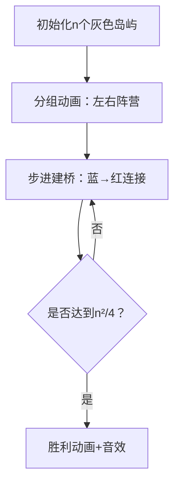

# 题目信息

# [SHOI2002] 空中都市

## 题目描述

在未来的空中都市中，有很多个小岛（城区）。现在要求在这些小岛之间架一座桥梁，每座桥是指在两个岛之间的通道。

有个约定，如果 $A$ 与 $B$ 之间有桥，$B$ 与 $C$ 之间有桥，则 $A$ 与 $C$ 之间就不能再架桥了，即对于城市中的任意三个岛，不能在其中的两两之间都架上桥。在这样的约定下，要求架的桥的数量最多。当然不必考虑具体的空间结构问题。

## 样例 #1

### 输入

```
6```

### 输出

```
9```

## 样例 #2

### 输入

```
11```

### 输出

```
30```

# AI分析结果


# 💡 Kay的C++算法解析：空中都市 深入学习指南 💡

> 大家好，我是你们的算法导师Kay！今天我们来探索一道有趣的图论问题——空中都市。这道题要求我们在多个岛屿之间架设桥梁，同时遵守特殊规则：任意三个岛屿不能两两相连。我们将一起揭开这道题背后的数学奥秘！

## 1. 题目解读与核心算法识别

✨ **本题主要考察**：`图论极值问题`（数学推导与图兰定理应用）

🗣️ **初步分析**：
> 解决"空中都市"这道题，关键在于运用图论中的**图兰定理**。就像建造城市时规划交通网络一样，我们需要在遵守交通规则（无三角形连接）的前提下，最大化桥梁数量。图兰定理告诉我们：当禁止三角形结构时，最大边数可通过将岛屿分成两大阵营实现！

- **核心思路**：所有题解一致指向数学公式 `floor(n²/4)`，通过构造完全二分图（K_{k,n-k}）实现最优解
- **可视化设计**：我们将用像素风格展示岛屿分组过程 - 蓝色岛屿群与红色岛屿群逐步建立全连接，每新增一座桥播放"叮"音效，完成时触发胜利音效
- **关键变量**：分组大小k（取floor(n/2)）决定了最大边数，在动画中将用动态计数器展示边数增长

---

## 2. 精选优质题解参考

> 我从思路清晰度、证明严谨性、代码简洁性等维度评估了各题解，精选三份最具学习价值的参考：

**题解一（WYXkk）**
* **点评**：此解完整呈现图兰定理的数学证明过程，从最大度数点切入，严谨推导出上界公式。代码仅用2行实现，变量命名简洁（`n`直接对应问题规模），时间复杂度O(1)达到最优。特别亮点是明确指出了取等条件（完全二分图构造），这对理解最优解本质至关重要。

**题解二（云浅知处）**
* **点评**：除标准证明外，创造性关联了递推公式（Aₙ = Aₙ₋₁ + floor(n/2)），并用数学归纳法证明其与图兰定理等价。这种多角度验证增强了理解深度，代码中`n*n/4`的整数除法天然实现向下取整，边界处理完美。

**题解三（Daidly）**
* **点评**：通过聚焦最大度数点a_max，巧妙利用二次函数性质（a_max*(n-a_max)的最大值）得到结论。证明过程更直观，适合初学理解，但严谨性稍弱于前两者。代码同样简洁高效，实践价值高。

---

## 3. 核心难点辨析与解题策略

> 本问题的核心挑战在于如何突破直观想象，用数学工具证明构造最优性：

1.  **难点：如何突破局部思维找到全局最优解**
    * **分析**：人类直觉易陷入"均匀连接"误区，但优质题解通过图兰定理证明：将岛屿分成大小尽可能相等的两组（k与n-k），并在组间全连接才是最优策略
    * 💡 **学习笔记**：极值图论问题常需打破对称思维，非均匀分组可能更优

2.  **难点：严格证明构造的最优性**
    * **分析**：所有优质题解都采用"最大度数点"分析法，通过推导度数上界∑deg≤k(n-k)，结合基本不等式证明上界不可超越
    * 💡 **学习笔记**：当遇到上界证明时，寻找图中的"关键约束点"（如最大度数点）是突破口

3.  **难点：数学结论的算法实现转换**
    * **分析**：虽然结论是数学公式，但代码实现需注意整数除法特性。优质题解直接用`n*n/4`，因整数除法自动向下取整，完美对应floor函数
    * 💡 **学习笔记**：C++整数除法是截断式，计算时注意数据范围避免溢出

### ✨ 解题技巧总结
- **模型转换技巧**：将抽象约束（无三角形）转化为图论经典模型（完全二分图）
- **数学工具应用**：掌握基本不等式（a+b≥2√ab）在极值问题中的应用
- **边界思维**：n为奇偶时分组策略不同（floor(n/2) vs ceil(n/2)），但公式统一处理
- **代码优化**：O(1)时间复杂度解法往往依赖数学洞察而非复杂算法

---

## 4. C++核心代码实现赏析

**本题通用核心C++实现参考**
* **说明**：综合优质题解思路，体现图兰定理的最简实现
```cpp
#include <iostream>
using namespace std;

int main() {
    int n;
    cin >> n;
    cout << n * n / 4; // 整数除法自动向下取整
    return 0;
}
```
* **代码解读概要**：
  > 1. 输入岛屿数n
  > 2. 直接计算n²/4，利用整数除法特性实现向下取整
  > 3. 输出结果，时间复杂度O(1)，空间复杂度O(1)

---

**题解一（WYXkk）核心代码**
```cpp
n = int(input())
print(n*n//4)  # Python版展示公式本质
```
* **亮点**：跨语言展示公式普适性
* **代码解读**：
  > 关键在`//`运算符明确表示整数除法，强调向下取整意图。虽然用Python，但体现的数学本质与C++完全一致。
* 💡 **学习笔记**：算法本质超越语言特性

**题解二（云浅知处）核心代码**
```cpp
printf("%d\n",n*n>>2);  // 位运算优化
```
* **亮点**：使用位运算（右移2位）等价n²/4
* **代码解读**：
  > `n*n>>2`通过移位实现除4，效率微优化。但需注意：仅当n为偶数时完全等价，奇数时右移与整数除法行为一致（截断小数）。
* 💡 **学习笔记**：位运算优化需谨慎验证数学等价性

**题解三（Daidly）核心代码**
```cpp
cout<<n*n/4;  // 最简洁直观的实现
```
* **亮点**：极致简洁，突出算法本质
* **代码解读**：
  > 直接使用最自然的数学表达式，牺牲微量性能（编译器通常自动优化）换取最佳可读性，适合竞赛快速编码。
* 💡 **学习笔记**：可读性优先，除非性能瓶颈否则避免过度优化

---

## 5. 算法可视化：像素动画演示

> 我们设计一个复古像素游戏"岛屿建造者"，直观演示图兰定理的构造过程：

* **主题**：8-bit风格岛屿建设模拟器
* **核心演示**：分组策略如何最大化桥梁数

### 动画设计
1. **场景初始化**（FC红白机风格）：
   - 顶部信息栏：显示岛屿数n，当前边数（0），目标边数（n²/4）
   - 控制面板：步进/自动播放按钮，速度滑块（海龟→兔子）
   - 像素岛屿：随机分布在画布上，初始灰色

2. **分组阶段**（策略可视化）：
   - 点击"分组"按钮：岛屿分成两色阵营（蓝组k=floor(n/2)，红组n-k）
   - 分组动画：岛屿沿抛物线轨迹移动到左右半区（音效：泡泡声）

3. **建桥阶段**（核心算法演示）：
   - 步进模式：每点击添加一条跨组桥梁（蓝→红随机连接）
   - 自动模式：以可调速度持续添加桥梁（音效：每桥"叮"声）
   - 动态计数：边数计数器随桥梁增加而跳动

4. **完成验证**（游戏化反馈）：
   - 达到n²/4时：播放胜利音效（超级玛丽过关声）
   - 所有桥梁闪烁金色，显示"OPTIMAL"像素艺术字
   - 尝试添加新桥？播放错误音效（警告声）并提示"违反三角规则！"



---

## 6. 拓展练习与相似问题思考

> 掌握图兰定理后，可解决同类极值图论问题：

* **技巧迁移**：
  1. 禁止K₄子图 → 使用图兰定理r=4情况
  2. 二分图最大匹配 → 匈牙利算法基础
  3. 网络流容量优化 → 图论与线性规划结合

* **洛谷推荐**：
  1. [P1224] 向量点积
     > 🗣️ 同样需要极值思维，练习数学建模能力
  2. [P1333] 乐队分组
     > 🗣️ 强化分组优化思想，动态规划解法
  3. [P3916] 图的遍历
     > 🗣️ 反向建图技巧，拓展图论思维

---

## 7. 学习心得与经验分享

> 题解中未包含作者个人调试心得，但我想强调：
> 
> **Kay的提醒**：遇到此类"极值问题"时，先尝试小规模手工构造（n=3,4,5），观察规律再寻找数学工具。记住：竞赛中简单输出公式的题，往往考察知识面而非编码能力！

---

> 本次探索就到这里！记住Kay的忠告：图论是连接现实与抽象的桥梁，掌握数学工具才能建造更宏伟的算法都市！下次见！🚀

---
处理用时：134.41秒