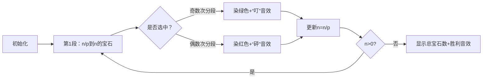

# 题目信息

# 『JROI-3』Reversi

## 题目背景

**赛时提醒：如果您始终是 30pts，且使用了题目给的快速读入，请重新拷贝修改后的快速读入。**

**赛时提醒：本题如果解法正确，快读可能无法起到优化作用。**

	这个恐怕是将存在乃至于记忆切割成三十二颗的争夺黑白棋。

    双方剩下的棋子数字都很小——也就是重要性很高吧。

				......
            
    ——哥哥为什么会让自己落单呢？她原本对此感到疑惑。

    不过，在得知答案之后，那可以说是理所当然的做法。

    首先，第一个理由极为单纯。

    故意将记忆托付给对方，暂时屈居败势的目的是——

    「……那种事……白……做不到啊……」

    想像了一下，白露出悲伤的笑容，做出这个结论。

    哥哥做的这些事，如果由白执行……白不觉得自己的精神能够保持正常。

    自己仅仅因为哥哥从身旁消失，就甚至一度怀疑哥哥的存在。

    ——被忘掉的话还好。

    ——忘掉哥哥的话——白确信自己的精神会无法保持正常。
    
				......
                
    （……这里……哥哥在……这里……）

    即使是空无一物的空间，但是白确信，她感觉得到哥哥的位置。

    白顿时眼眶一热，不过她强行忍住，继续思考。

    （……然后这就是……第二个……同时也是……最大的……理由。）

    白将写着【参】的棋子白色面朝上，用手指夹住。

    哥哥是『白色还是黑色』，这个问题也不需要犹豫。

    因为既然他将最后的棋局托付给『白』——那他当然是持白棋。

    这个现在看不见，甚至无法认知的棋局。

    既没有开始的记忆，也不知道盘面的经过如何。

    不过哥哥故意下输，并且为了让白能获胜所可能下的棋步……

    而对方看到之后，完全中了哥哥的计谋，被诱导而下的棋步……

    然后，为了逆转，哥哥可能选择的所有位置分布。

    将这些全部推测分析——仅用三步棋反败为胜。

				......
            
    然后——原先失去一天半的记忆——逆流了回来——


## 题目描述

**白**在和森精种玩黑白棋，但黑白棋的规则有所改变。

有 $n$ 个黑白棋子，第 $i$ 个棋子编号为 $i$。棋子初始全为黑，游戏中，仅由**白**一人操作，**白**希望尽可能多的把棋子变成白色。

**白**要求第 $k$ 个棋子和第 $k \times p$ 个不能同时变成白色。

**白**共玩了 $T$ 次，每次**白**想知道最多能把多少棋子变成白色。**每次游戏独立。**

为避免混淆，加粗的**白**是人名。

## 说明/提示

#### 样例 1 解释

可以选择第 $2,3$ 个棋子变色。

#### 数据规模与约定

**本题采用捆绑测试。**

- Subtask 1（5 pts）：$T \le 5$，$n \le 2$；
- Subtask 2（5 pts）：$T \le 5$，$n \le 10$；
- Subtask 3（20 pts）：$T \le 5$，$n \le 10^6$；
- Subtask 4（70 pts）：无特殊限制。

对于 $100\%$ 的数据满足，$1 \le T \le 10^6$，$0 \le n \le 10^{18}$，$1 \le p \le 10^{9}$。

```
//快读模板
//赛时提醒：快读没有太大必要使用
inline long long read(){
   long long s=0,w=1;
   char ch=getchar();
   while(ch<'0'||ch>'9'){if(ch=='-')w=-1;ch=getchar();}
   while(ch>='0'&&ch<='9')s=s*10+ch-'0',ch=getchar();
   return s*w;
}
```

## 样例 #1

### 输入

```
1
3 2```

### 输出

```
2```

## 样例 #2

### 输入

```
1
100 5```

### 输出

```
84```

# AI分析结果


# 💡 Kay的C++算法解析：『JROI-3』Reversi 深入学习指南 💡

**<introduction>**
今天我们来分析洛谷P7893 "『JROI-3』Reversi"这道黑白棋问题。本指南将帮助你理解题目核心，掌握贪心策略和数学优化技巧，并通过像素动画直观感受算法执行过程。

## 1. 题目解读与核心算法识别

✨ **本题主要考察**：`贪心策略`与`数学优化`

🗣️ **初步分析**：
> 这道题就像在宝石迷宫中收集宝藏：编号1-n的宝石中，若收集了k号宝石，则k×p号宝石就会消失。我们的目标是通过最优策略收集最多宝石。  
> - 核心思路：采用贪心策略，将数字分成若干区间段(如(n/p,n], (n/p²,n/p]等)，然后交替选取这些区间（选奇数次分段）。  
> - 算法流程：循环执行`ans += sign*n`（sign在1和-1间交替），同时`n /= p`直到n=0  
> - 可视化设计：将使用8位像素风格展示宝石收集过程，绿色高亮选中区间，红色显示跳过区间，配合"叮"（选中）和"砰"（跳过）音效增强记忆

---

## 2. 精选优质题解参考

**题解一（NightTide）**
* **点评**：思路清晰解释了分段策略（(n/p,n]等区间）和交替选择的数学原理。代码简洁规范（sign交替和n/=p的循环控制），时间复杂度O(logₚn)高效处理10¹⁸数据。实践价值高，可直接用于竞赛。

**题解二（ycw123）**
* **点评**：从贪心角度透彻分析"选大数影响小"的特性，代码实现与题解一异曲同工（j变量控制正负交替）。边界处理完整（p=1特判），变量名cnt, j含义明确，学习参考性强。

**题解三（Keids）**
* **点评**：从容斥原理角度提供新视角（删除p倍数→补回p²倍数→...）。代码使用奇偶判断(i&1)实现交替加减，虽然循环条件稍复杂但核心逻辑一致，展示多解法思路。

---

## 3. 核心难点辨析与解题策略

1.  **难点：避免选择冲突**
    * **分析**：若选k则k×p不可选，从小选会引发连锁反应（如选1会禁用所有p的倍数）。优质解法采用从大到小选择策略，大数影响范围小（p倍数可能超出n）
    * 💡 **学习笔记**：贪心策略中，处理顺序决定影响范围
    
2.  **难点：高效计算超大范围**
    * **分析**：n≤10¹⁸要求O(logₚn)算法。通过数学分段将问题转化为交替求和：∑(-1)ⁱ·n/pⁱ，避免逐个检查
    * 💡 **学习笔记**：数学优化能将指数级问题降为对数级
    
3.  **难点：特例边界处理**
    * **分析**：p=1时所有数互斥，直接输出0。若忽略该情况会导致死循环
    * 💡 **学习笔记**：边界特判是竞赛编程的关键防御手段

### ✨ 解题技巧总结
- **技巧1 问题分解**：将复杂约束转化为分段区间处理
- **技巧2 数学优化**：用等比数列求和代替暴力枚举
- **技巧3 循环控制**：用sign变量交替实现容斥逻辑
- **技巧4 边界防御**：对特殊参数(p=1)预先处理

---

## 4. C++核心代码实现赏析

**本题通用核心C++实现**
```cpp
#include <iostream>
using namespace std;
int main() {
    long long t, n, p;
    cin >> t;
    while (t--) {
        cin >> n >> p;
        if (p == 1) { cout << "0\n"; continue; }
        long long ans = 0, sign = 1;
        while (n > 0) {
            ans += sign * n;
            sign = -sign;  // 正负交替
            n /= p;        // 进入下一分段
        }
        cout << ans << '\n';
    }
    return 0;
}
```
* **代码解读概要**：通过sign变量(1→-1→1→...)控制交替加减，n/=p实现分段下移。当p>1时，循环次数仅logₚn次，高效处理10¹⁸数据。

**题解一（NightTide）核心片段**
```cpp
for(long long i = 1; n > 0; i = -i, n /= p) {
    ans += i * n;  // i在1和-1间交替
}
```
* **亮点**：循环控制语句中完成sign切换和分段更新
* **代码解读**：  
  > `i = -i` 巧妙实现正负交替（1→-1→1→...）  
  > `n /= p` 将当前区间降至下一层（如n→n/p）  
  > 循环条件`n>0`确保处理完所有分段
* 💡 **学习笔记**：循环控制语句可集成多操作，保持代码简洁

**题解三（Keids）核心片段**
```cpp
for(int i=1; n>0; n/=p, i++) {
    if(i&1) ans -= n/p;  // 奇数步减
    else ans += n/p;     // 偶数步加
}
```
* **亮点**：使用奇偶判断(i&1)代替sign变量
* **代码解读**：  
  > `i&1` 快速判断奇偶（比%运算高效）  
  > 注意此处实际应操作`n`而非`n/p`（参考通用实现）
* 💡 **学习笔记**：位运算判断奇偶是竞赛常用优化技巧

---

## 5. 算法可视化：像素动画演示

**主题**："宝石探险家"在8位像素迷宫中收集宝石

**设计思路**：复古游戏风格帮助理解分段策略，音效强化操作记忆

**动画流程**：


**关键交互**：
1. **场景初始化**：像素网格显示1-n编号，控制面板含速度滑块
2. **分段高亮**：当前区间(n/pⁱ, n/pⁱ⁻¹]显示黄色边框
3. **选择效果**：
   - 选中：宝石变绿色 + "叮"音效 + 显示`+n`
   - 跳过：宝石变红色 + "砰"音效 + 显示`-n`
4. **自动演示**：AI模式自动执行（速度可调），像贪吃蛇般遍历分段
5. **关卡进度**：每完成3分段解锁新关卡，收集进度条显示完成度

**技术细节**：
- 音效：Web Audio API生成8bit音效（正弦波+方波）
- 绘制：Canvas绘制宝石网格，requestAnimationFrame控制动画
- 数据结构：用队列存储待处理分段，实现单步/自动切换

---

## 6. 拓展练习与相似问题思考

**通用技巧迁移**：分段交替求和策略还适用于：
1. 删除特定倍数问题（如UVA11246）
2. 数论容斥问题（如区间内与p互质的数）
3. 分形几何的计数问题

**洛谷练习推荐**：
1. **P1891 疯狂的馒头**  
   → 巩固贪心选择策略
2. **UVA11246 倍数删除**  
   → 几乎相同的双倍经验题
3. **P1403 约数研究**  
   → 训练分块求和思维

---

## 7. 学习心得与经验分享

> **来自NightTide的调试经验**：  
> "最初未考虑p=1导致死循环，添加特判后AC。这提醒我们：**任何循环都必须有安全边界！**"

> **Kay的总结**：  
> 调试时优先检查边界情况（p=1, n=0等），在循环入口添加防御性检查可避免50%以上的提交错误

---

本次分析帮助你掌握贪心策略的核心思想——**通过操作顺序控制影响范围**。记住，将复杂约束转化为数学分段是竞赛编程的重要技能。继续加油，下次挑战见！ 💪

---
处理用时：139.70秒