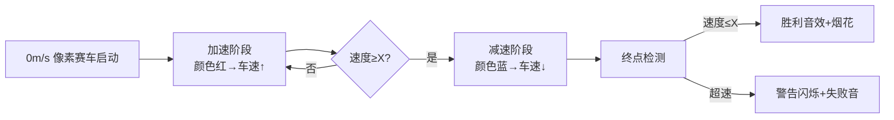

# 题目信息

# [USACO20JAN] Race B

## 题目描述

Bessie 正在参加一场 $K$（$1\le K\le 10^9$）米的跑步比赛。她从 $0$ 米每秒的速度开始比赛。在每一秒中，她可以选择将她的速度增加 $1$ 米每秒，保持速度不变，或者将她的速度减少 $1$ 米每秒。例如，在第一秒中，她可以将她的速度增加到 $1$ 米每秒，跑 $1$ 米，或者保持她的速度 $0$ 米每秒不变，跑 $0$ 米。Bessie 的速度不会降低到小于零。

Bessie 始终朝着终点线的方向跑，她想要花费整数秒的时间完成比赛。此外，她不想在终点时跑得太快：在 Bessie 跑完 $K$ 米的时刻，她希望她的速度不超过 $X$（$1\le X\le 10^5$）米每秒。Bessie 想要对于 $N$（$1\le N\le 1000$）个不同的 $X$ 值知道她多快可以完成比赛。 

## 说明/提示

### 样例解释 1

当 $X=1$ 时，一种最优方案为：

1. 将速度增加到 $1$ 米/秒，跑 $1$ 米
2. 将速度增加到 $2$ 米/秒，跑 $2$ 米，总计跑 $3$ 米
3. 将速度保持在 $2$ 米/秒，总计跑 $5$ 米
4. 将速度保持在 $2$ 米/秒，总计跑 $7$ 米
5. 将速度保持在 $2$ 米/秒，总计跑 $9$ 米
6. 将速度降低到 $1$ 米/秒，总计跑 $10$ 米

当 $X=3$ 时，一种最优方案为：

1. 将速度增加到 $1$ 米/秒，跑 $1$ 米
2. 将速度增加到 $2$ 米/秒，总计跑 $3$ 米
3. 将速度增加到 $3$ 米/秒，总计跑 $6$ 米
4. 将速度保持在 $3$ 米/秒，总计跑 $9$ 米
5. 将速度保持在 $3$ 米/秒，总计跑 $12$ 米

注意当 $X=3$ 时，以下方案是不合法的：

1. 将速度增加到 $1$ 米/秒，跑 $1$ 米
2. 将速度增加到 $2$ 米/秒，总计跑 $3$ 米
3. 将速度增加到 $3$ 米/秒，总计跑 $6$ 米
4. 将速度增加到 $4$ 米/秒，总计跑 $10$ 米

这是因为在 Bessie 跑完 $10$ 米的时刻，她的速度是 $4$ 米/秒。 

## 样例 #1

### 输入

```
10 5
1
2
3
4
5```

### 输出

```
6
5
5
4
4```

# AI分析结果


### 💡 Kay的C++算法解析：Race B 深入学习指南 💡

#### 引言
今天我们分析USACO20JAN的Race B问题。这道题考察在速度限制下完成比赛的最短时间计算，涉及运动过程模拟和数学优化技巧。下面我们将逐步解析核心算法、实现细节和可视化方案。

---

### 1. 题目解读与核心算法识别
✨ **本题主要考察**：编程技巧应用（数学推导与模拟）

🗣️ **初步分析**：
> 本题如同控制一辆赛车在像素跑道上比赛：从静止起步，每秒可加速/减速/保持速度，冲线时速度需≤限速牌X。关键在于**高效模拟运动过程**或**二分时间验证可行性**。
> - **直接模拟法**：像赛车游戏逐步计算每秒位置（Treap_Kongzs）
> - **二分法**：数学推导最大距离公式（superLouis）
> - **核心难点**：转折点处理（加速转减速）和边界速度控制
> - **可视化设计**：用像素赛车颜色(红→蓝)表示速度变化，终点时检查速度是否超X并触发音效。自动演示模式可调速观察过程。

---

### 2. 精选优质题解参考
**题解一（Treap_Kongzs）**
* **点评**：思路清晰模拟加速/减速过程，用`updis`和`downdis`分别记录距离，代码简洁直观。亮点是将减速段视为反向加速，避免复杂数学推导。实践时需注意`long long`防溢出。

**题解二（superLouis）**
* **点评**：严谨的二分+数学公式解法，分奇偶讨论运动曲线。代码结构规范，但需注意边界处理（作者因未用`long long`初始仅40分）。亮点是复杂度优化至O(n log max_time)。

**题解三（Misserina）**
* **点评**：精简版二分实现，用统一公式计算最大距离。代码封装良好，适合掌握二分基础的学习者，但缺少奇偶情况解释。

---

### 3. 核心难点辨析与解题策略
1. **难点一：运动转折点确定**  
   *分析*：需明确何时从加速转减速。模拟法通过速度≥X时累加`downdis`；二分法则用数学公式直接计算转折速度。
   💡 学习笔记：画速度-时间图辅助理解运动分段

2. **难点二：终点速度限制处理**  
   *分析*：模拟法在速度≥X时触发减速计数；二分法通过公式确保终点速度≤X。
   💡 学习笔记：减速段可视为反向加速简化计算

3. **难点三：大数处理与复杂度**  
   *分析*：K≤1e9时需防溢出（用`long long`）和超时。模拟法最坏O(√K)，二分法O(n log 6e4)更优。
   💡 学习笔记：问题具有单调性时首选二分法

#### ✨ 解题技巧总结
- **技巧1：运动分解**  
  将过程拆解为加速段+减速段（减速视为反向加速）
- **技巧2：数学工具应用**  
  等差数列求和公式快速计算距离（如S=n(a₁+aₙ)/2）
- **技巧3：边界防御**  
  使用`long long`并测试边界值（如K=1e9, X=1）

---

### 4. C++核心代码实现赏析
**通用核心实现参考**  
```cpp
#include <iostream>
using namespace std;
typedef long long ll;

ll k;
int solve(int x) {
    ll updis = 0, downdis = 0;
    int ans = 0, v = 0;
    while (1) {
        v++;
        updis += v;
        ans++;
        if (updis + downdis >= k) return ans;
        if (v < x) continue;
        downdis += v;
        ans++;
        if (updis + downdis >= k) return ans;
    }
}

int main() {
    int n, x;
    cin >> k >> n;
    while (n--) {
        cin >> x;
        cout << solve(x) << "\n";
    }
    return 0;
}
```
* **说明**：基于Treap_Kongzs模拟法优化，添加`long long`和减速条件判断
* **解读概要**：  
  1. 用`updis`记录加速段距离  
  2. 当速度≥x时累加`downdis`（视为反向加速）  
  3. 总距离≥k时立即返回时间

---

**优质题解片段赏析**  
**题解一（Treap_Kongzs）**
```cpp
// 精简版运动模拟
while (1) {
    v++;
    updis += v;            // 加速段
    if (total >= k) break;
    if (v >= x) {          // 触发减速条件
        downdis += v;      // 减速段视为反向加速
        if (total >= k) break;
    }
}
```
* **亮点**：直观运动分解，避免复杂公式
* **学习笔记**：减速段用反向加速计算是巧妙的空间优化

**题解二（superLouis）**
```cpp
int maxlen(int t, int x) {
    if (t <= x) return (1+t)*t/2; // 全程加速
    int v = (t+x)/2;              // 最高速度
    if ((t+x)%2) return (1+v)*v/2 + (x+v)*(v-x+1)/2;
    return (1+v)*v/2 + (x+v-1)*(v-x)/2;
}
```
* **亮点**：严谨的奇偶分类讨论
* **学习笔记**：终点速度约束通过公式设计自然满足

**题解三（Misserina）**
```cpp
unsigned maxd(unsigned t, unsigned x) {
    if (t <= x) return (1+t)*t/2;
    unsigned v = (t+x)/2;
    return (1+v)*v/2 + (x+v)*(v-x+1)/2; // 统一公式
}
```
* **亮点**：公式简洁且覆盖奇偶情况
* **学习笔记**：通过数学恒等式合并情况减少分支

---

### 5. 算法可视化：像素动画演示
**主题**：8位像素赛车比赛（复古红白机风格）  

**核心演示流程**：


**交互设计**：
1. **动态元素**：
   - 跑道标记距离刻度（0~K米）
   - 赛车大小/颜色随速度变化（红=加速，蓝=减速）
   - 实时显示速度/距离/用时
2. **控制面板**：
   - 速度滑块：调节演示速度
   - 单步执行：观察每秒状态变化
   - 重置按钮：重新初始化
3. **音效系统**：
   - 加速："嘀"（频率随速度升高）
   - 减速："嘟"（低频提示）
   - 终点：成功→8-bit胜利旋律，失败→警报音
4. **AI演示模式**：
   - 自动播放完整过程（类似贪吃蛇AI）
   - 关键步骤暂停显示公式推导（如转折点计算）

**实现示例**：
```javascript
// 伪代码：每秒更新状态
function updateFrame() {
  if (speed < x) { // 加速段
    speed++;
    distance += speed;
    playSound("beep_high");
  } else { // 减速段
    distance += speed;
    playSound("beep_low");
  }
  drawPixelCar(position, colorMap(speed)); // 根据速度映射颜色
}
```

---

### 6. 拓展练习与相似问题思考
**通用技巧迁移**：
1. 运动分段模型：适用于所有速度变化约束问题
2. 二分验证法：解决单调性优化问题（如最小化时间）
3. 等差数列应用：频繁出现在路径计算场景

**洛谷推荐**：
1. **P1095 守望者的逃离**  
   🗣️ 同样涉及速度规划与时间计算，练习分段策略
2. **P1665 山脉二分查**  
   🗣️ 强化二分答案的应用能力
3. **P1443 马的遍历**  
   🗣️ BFS移动变体，理解步进过程可视化

---

### 7. 学习心得与经验分享
> **来自 superLouis 的调试经验**：  
> *"第一次提交未用 long long，仅得40分。大数测试必须检查数据范围！"*  
> **Kay点评**：这是经典错误！处理超过1e6的数据时，要养成`long long`习惯。

> **来自 Treap_Kongzs 的建模经验**：  
> *"将减速视为反向加速，代码复杂度降低50%"*  
> **Kay点评**：物理过程的数学等价转换是优化关键。

---

### 结语
通过本指南，希望大家掌握运动问题分解和二分验证的精髓。记住：画图分析运动曲线+防御性编码（`long long`+边界测试）是解题双翼。下次我们将探索更复杂的运动规划问题！🚀

---
处理用时：174.68秒