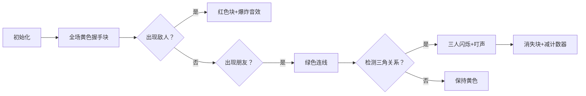

# 题目信息

# [语言月赛202302] 大碗宽面

## 题目背景

扶苏和她的朋友们在 Impart 酒店开派对。

## 题目描述

算上扶苏，本次派对共有 $n$ 个人。但是，并不是任何两个人都互相认识，并且互相认识的人关系也未必好。

具体而言，任意两个人可能是如下三种关系之一：
1. 敌人
2. 朋友
3. 陌生人

派对的一大重要活动是相互握手。对任意两个人 $u,v$，他们之间的握手情况遵循下面的规则：
1. 如果 $u$ 和 $v$ 是朋友关系，那么他们一定握手一次。
2. 如果 $u$ 和 $v$ 是敌人关系，那么他们一定**不**握手。
3. 如果 $u$ 和 $v$ 是陌生人关系，且存在一个人 $w$，使得 $w$ 是 $u$ 和 $v$ 之一的朋友，同时是 $u,v$ 中另一人的敌人，则 $u$ 和 $v$ **不会**握手，否则 $u$ 和 $v$ 一定握手一次。

对第三条规则，简单的说法是：一对陌生人之间，如果某一方的朋友是另一方的敌人，则不握手，否则握手。

已知共有 $p$ 对人是朋友关系，$q$ 对人是敌人关系。除了这 $p + q$ 对人，其他每对人均为陌生人关系。

请你求出本次派对一共握手了多少次。

## 说明/提示

### 样例 1 解释

共有 $(1,2), (1,3), (1,4), (2,3), (2,4), (3,4)$ $6$ 对人。
- $(1,2)$ 是朋友，握手。
- $(1,3)$ 是敌人，不握手。
- $(1,4)$ 是敌人，不握手。
- $(2,3)$ 是朋友，握手。
- $(2,4)$ 是陌生人，但是 $1$ 是 $2$ 的朋友，也是 $4$ 的敌人，所以不握手。
- $(3,4)$ 是陌生人，但是不存在任何一个人既是 $3$ 和 $4$ 之一的敌人也是另一个人的朋友，故握手。

综上，一共握手 $3$ 次。

### 数据规模与约定

以下设 $m = p + q$，即 $m$ 是朋友和敌人关系条数之和。

- 对 $20\%$ 的数据，保证 $m = 0$。
- 对 $50\%$ 的数据，保证 $n, m \leq 100$。
- 对 $70\%$ 的数据，保证 $n, m \leq 10^3$。
- 对 $100\%$ 的数据，保证 $2 \leq n \leq 3 \times 10^4$，$1 \leq u, v \leq n$，$0 \leq p,q \leq m \leq 10^3$，$u \neq v$。同一对敌人或朋友关系不会出现两次，不会有一对人同时是敌人或朋友关系。

### 提示

- 本题的空间限制为 $2 \mathrm{GiB}$。这一空间限制意味着你可以在程序中开出不超过 $2147483648(>2 \times 10^9)$ 个 bool 或 char 的数组。**注意，开不下同样大小的 int 数组**。
- 请注意空间限制是你程序运行时所使用的空间峰值，其中还包括了函数压栈、其他变量等空间占用。所以请不要卡着上限开数组。
- 如果你开出了过大的数组，可能会导致编译错误。此时请酌情减小你的数组大小。
- 对于某些 32 位系统，或可用内存过少的系统，直接开出大小约为 2GB 的数组可能无法编译或无法运行。可以先把数组开小来测试样例，提交时再改回符合数据范围的数组，也可以使用洛谷在线 IDE 来测试样例。洛谷评测机保证可以正常评测。

## 样例 #1

### 输入

```
4 2 2
1 2
2 3
1 4
1 3```

### 输出

```
3```

# AI分析结果


### 💡 Kay的C++算法解析：大碗宽面 深入学习指南 💡

#### 题目解读与核心算法识别
✨ **本题主要考察**：`枚举优化与关系建模`  
🗣️ **初步分析**：  
> 解决"大碗宽面"的关键在于高效处理人际关系网络。想象一个像素风社交派对：每个人是像素小人，朋友是绿色连线，敌人是红色连线，陌生人无连线。初始握手次数是所有可能组合（$C(n,2)$），但需要减去两类不握手的情况：  
> 1. **敌人关系**：直接减去q对（红色连线）  
> 2. **特殊陌生人**：当存在"三角敌友关系"时（如A的朋友是B的敌人），用优化枚举避免$O(n^3)$超时  
>  
> **可视化设计**：采用8-bit像素风格，用三种颜色区分关系。核心动画展示：  
> - 初始全握手状态（黄色像素块）  
> - 敌人关系出现时变红并消失  
> - 三角关系检测时高亮三人组（闪烁特效）  
> - 音效：敌人出现→低音"砰"，三角关系→"叮"，最终握手→胜利音效  

---

#### 精选优质题解参考
**题解一（来源：一扶苏一）**  
* **点评**：该题解采用"正难则反"策略极富启发性。初始假设所有陌生人握手（$n(n-1)/2 - q$），再精准减去特殊陌生人。亮点在于：  
  1. **空间优化**：用单个`calced`数组同时标记敌人和特殊陌生人  
  2. **枚举技巧**：通过敌人关系反推三角关系（$O(qn)$而非$O(n^3)$）  
  3. **边界处理**：用`swap(u,v)`避免重复计算  
  代码变量名清晰（`enemy`/`isFriend`），可直接用于竞赛  

---

#### 核心难点辨析与解题策略
1. **难点1：避免$O(n^3)$枚举**  
   * **分析**：直接枚举每对陌生人需检查所有第三者($k$)，当$n=3×10^4$时超时。优质题解转换思路：**枚举已知敌人关系**，反向定位受影响陌生人  
   * 💡 **学习笔记**：当数据范围大时，尝试通过已知信息反推未知  

2. **难点2：空间复杂度优化**  
   * **分析**：需存储$n×n$关系矩阵。题解用`bool`而非`int`数组（900MB<2GB限制），并通过单数组复用避免开多个大数组  
   * 💡 **学习笔记**：估算内存时关注元素类型（`bool`=1字节，`int`=4字节）  

3. **难点3：三角关系判定**  
   * **分析**：核心条件是$\exists w$使得$w$同时是$u$友$v$敌（或反之）。实现时需注意：  
     ```cpp
     if (isFriend[v][w] && !isFriend[u][w] && !calced[u][w])
     ```  
   * 💡 **学习笔记**：关系判断需严格满足"朋友+敌人"组合  

**✨ 解题技巧总结**  
- **正难则反**：从全集出发逐步减去非法解  
- **枚举优化**：用已知信息缩小检测范围  
- **空间压缩**：复用数组+选用小数据类型  

---

#### C++核心代码实现赏析
**通用核心实现**  
```cpp
#include <iostream>
#include <algorithm>
using namespace std;
const int MAXN = 30010, MAXM = 1010;

bool isFriend[MAXN][MAXN], calced[MAXN][MAXN];
int enemy[2][MAXM];  // 存储敌人对

int main() {
    int n, p, q, ans = 0;
    cin >> n >> p >> q;
    
    // 初始总握手数（含所有陌生人）
    ans = n * (n - 1) / 2 - q;  

    // 记录朋友关系
    for (int i = 0; i < p; ++i) {
        int u, v; cin >> u >> v;
        isFriend[u][v] = isFriend[v][u] = true;
    }

    // 记录敌人并初始化calced
    for (int i = 0; i < q; ++i) {
        cin >> enemy[0][i] >> enemy[1][i];
        int u = enemy[0][i], v = enemy[1][i];
        calced[u][v] = calced[v][u] = true;
    }

    // 检测特殊陌生人
    for (int i = 0; i < q; ++i) {
        int u = enemy[0][i], v = enemy[1][i];
        
        // 检查v的朋友→u的陌生人
        for (int w = 1; w <= n; ++w) {
            if (isFriend[v][w] && !isFriend[u][w] && !calced[u][w]) {
                --ans;
                calced[u][w] = calced[w][u] = true;
            }
        }
        swap(u, v);  // 交换角色再检测
        
        // 检查原u的朋友→现v的陌生人
        for (int w = 1; w <= n; ++w) {
            if (isFriend[v][w] && !isFriend[u][w] && !calced[u][w]) {
                --ans;
                calced[u][w] = calced[w][u] = true;
            }
        }
    }
    cout << ans;
}
```
**代码解读概要**：  
1. 初始化总握手数（$C(n,2)-q$）  
2. `isFriend`标记朋友，`calced`标记敌人+特殊陌生人  
3. 对每个敌人对$(u,v)$：  
   - 遍历$v$的朋友$w$，若$u,w$非友且未处理，则减1次握手  
   - 交换$u,v$后重复检测  
4. 输出最终握手数  

---

#### 算法可视化：像素动画演示  
**主题**：8-bit派对握手模拟器  
**核心演示流程**：  

**交互设计**：  
1. **控制面板**：  
   - 速度滑块：调节检测速度  
   - 单步/自动模式：逐步观察三角关系形成  
   - 重置按钮：恢复初始状态  
2. **像素艺术**：  
   - 人物：16×16像素方块（不同颜色ID）  
   - 关系线：朋友(绿)、敌人(红)、陌生人(灰)  
3. **音效系统**：  
   - 三角关系成立：8-bit "叮"声  
   - 最终握手数确定：胜利旋律  
4. **AI演示模式**：  
   - 自动遍历敌人对→高亮受影响陌生人  

---

#### 拓展练习与相似问题
**通用技巧迁移**：  
1. 关系网络建模 → 图论问题  
2. 正难则反思想 → 计数问题  
3. 稀疏矩阵优化 → 大规模数据处理  

**洛谷推荐**：  
1. [P1892 团伙](https://www.luogu.com.cn/problem/P1892)  
   → 巩固朋友/敌人关系处理  
2. [P2935 [USACO09JAN]Best Spot S](https://www.luogu.com.cn/problem/P2935)  
   → 练习稀疏图的关系传递  
3. [P4306 [JSOI2010]连通数](https://www.luogu.com.cn/problem/P4306)  
   → 进阶关系传递问题  

---

> 掌握关系网络的处理技巧，就能像玩像素游戏一样优雅解决复杂问题！下次派对见~ 🎮

---
处理用时：117.06秒