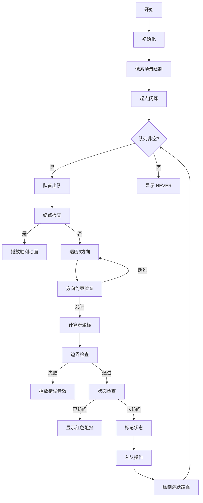

# 题目信息

# 魔鬼之城

## 题目描述

在一个被分割为 $N\times M$ 个正方形房间的矩形魔鬼之城中，一个探险者必须遵循下列规则才能跳跃行动。他必须从 $(1,1)$ 进入，从 $(N,M)$ 走出；在每一房间的墙壁上都写了一个魔法数字，是 $1\sim 13$ 之内的自然数；探险者可以想像出 $8$ 个方向中的任何一个（水平或垂直或对角线方向），随后他就可以作一次空间跳跃穿过这一方向上的连续的 $X$ 个房间，其中 $X$ 是他原来所在房间的魔法数字。但如果在这一方向上的房间数小于 $X$，则他不作任何跳跃，而必须想像另一个方向。同时，探险者不能作连续两次相同方向的跳跃。


 
例如在上图的 $5\ \times 4$ 的魔鬼之城中，如果探险者现在所在的位置是 $(3,3)$，那么通过依次空间跳跃他可以到达下列房间中的一个：$(1,1)$，$(3,1)$，$(1,3)$，$(5,1)$，或 $(5,3)$。另外，如果他要用两次跳跃从 $(5,4)$ 到达 $(3,2)$，则他不能首先跳到 $(4,3)$（因为这样他第二次跳跃的方向将和第一次相同，而这是不允许的）。所以他必须先跳跃到 $(2,1)$。
请你写一个程序，对给定的地图，算出探险者至少需要跳跃多少步才能离开魔鬼之城。


## 样例 #1

### 输入

```
5 4

3 3 6 7 11

3 2 1 1 3

3 2 2 1 1

2 1 2 2 1

```

### 输出

```
4

```

# AI分析结果


# 💡 Kay的C++算法解析：魔鬼之城 深入学习指南 💡

## 1. 题目解读与核心算法识别

✨ **本题主要考察**：`BFS（广度优先搜索）`

🗣️ **初步分析**：
> 魔鬼之城问题就像在复古像素游戏中的寻宝探险——探险者从起点(1,1)出发，每次根据房间的魔法数字向8个方向跳跃，但不能连续两次同方向移动。这本质上是最短路径问题，BFS就像同时派出多支探险队分头探索，确保首次到达终点时路径最短。
   
   - **核心难点**在于跳跃方向约束和状态去重：若仅用二维坐标标记访问状态，会忽略不同方向到达的同位置不同状态（导致70分陷阱）。三维状态`(x,y,方向)`是解题关键。
   - **可视化设计**：我们将创建像素网格地图，用不同颜色方块表示魔法数字。跳跃时显示方向箭头和连续跳跃路径，用闪烁效果标记当前探索位置。当状态更新时，同步高亮代码中的方向判断和队列操作逻辑。
   
   - **复古游戏化方案**：采用8-bit像素风格，跳跃时触发"叮"音效，到达终点播放胜利音阶。设计"自动演示"模式像AI解谜游戏，每步显示当前步数和方向限制，通关后显示步数排行榜。

---

## 2. 精选优质题解参考

**题解一：wonSSnow (19赞)**
* **点评**：此解法思路清晰直白，将BFS状态定义为`(x,y,step,last_direction)`，核心创新在于使用三维数组`v[x][y][dir]`解决方向约束问题。代码规范简洁（仅40行），变量名`tx/ty/ts`含义明确，边界检查严谨。亮点在于方向向量`dx/dy`的精妙设计和初始方向`way=9`的巧妙处理，避免首次跳跃限制。可直接用于竞赛，是学习BFS状态设计的典范。

**题解二：花千树 (17赞)**
* **点评**：通过70→100分的对比教学极具启发性，生动展示了三维标记的必要性。代码结构稍显冗长但逻辑严谨，独创性体现在用结构体布尔变量`a-h`显式管理8方向状态。实践价值在于详细注释和调试心得分享："考场上少开一维丢30分"的教训警示我们状态设计的重要性。

**题解三：翼德天尊 (13赞)**
* **点评**：采用三队列分离存储`x,y,direction`，算法有效性体现在状态更新和空间复杂度优化。亮点是终止条件`if(x==n&&y==m)`的精确定位和初始方向`push(3)`的巧妙处理，队列分离设计提升代码可读性，特别适合初学者理解BFS状态管理本质。

---

## 3. 核心难点辨析与解题策略

1.  **状态维度设计**
    * **分析**：传统二维BFS在"方向约束"场景失效，必须增加方向维度。如优质题解所示，定义`vis[x][y][dir]`标记"在方向dir下到达(x,y)"的状态，避免重复搜索
    * 💡 **学习笔记**：状态维度 = 影响决策的变量数

2.  **跳跃边界处理**
    * **分析**：计算新坐标需`新位置=当前位置+方向向量*魔法值`，务必校验是否越界（如`tx>=1&&tx<=n`）。注意地图行列输入顺序（先行后列）
    * 💡 **学习笔记**：方向向量*系数的坐标计算是网格类问题的通用技巧

3.  **BFS终止优化**
    * **分析**：终点(N,M)首次出队时即为最短路径，立即返回结果。注意队列中步数是累加值，终点步数=`当前步数+1`
    * 💡 **学习笔记**：BFS的首次到达即最优是核心特性

### ✨ 解题技巧总结
- **状态升维法**：当决策受历史操作影响时（如方向约束），增加状态维度记录关键历史信息
- **方向向量封装**：用`dx[8]/dy[8]`数组封装8方向偏移量，避免重复计算
- **边界防御编程**：在移动计算后立即校验坐标合法性，防止无效状态入队
- **队列状态设计**：结构体应包含所有必要维度（坐标+步数+方向），或使用多个同步队列

---

## 4. C++核心代码实现赏析

**本题通用核心C++实现参考**
* **说明**：综合优质题解思路的精炼实现，包含三维状态标记和方向约束处理
* **完整核心代码**：
```cpp
#include <iostream>
#include <queue>
using namespace std;

const int dx[8] = {-1,-1,-1,0,0,1,1,1};
const int dy[8] = {-1,0,1,-1,1,-1,0,1};

struct Node { int x, y, step, dir; };

int main() {
    int n, m, map[105][105];
    bool vis[105][105][8] = {0}; // 三维状态标记
    
    cin >> m >> n; // 注意输入顺序：列数m，行数n
    for(int i=1; i<=n; i++)
        for(int j=1; j<=m; j++)
            cin >> map[i][j];
            
    queue<Node> q;
    q.push({1,1,0,-1}); // 初始方向设为-1（无限制）
    for(int i=0; i<8; i++) vis[1][1][i] = true;
    
    while(!q.empty()) {
        Node cur = q.front(); q.pop();
        if(cur.x == n && cur.y == m) {
            cout << cur.step;
            return 0;
        }
        for(int i=0; i<8; i++) {
            if(i == cur.dir) continue; // 方向约束检查
            int nx = cur.x + dx[i] * map[cur.x][cur.y];
            int ny = cur.y + dy[i] * map[cur.x][cur.y];
            
            if(nx<1||nx>n||ny<1||ny>m||vis[nx][ny][i]) continue;
            
            vis[nx][ny][i] = true;
            q.push({nx, ny, cur.step+1, i});
        }
    }
    cout << "NEVER";
}
```
* **代码解读概要**：
  1. **方向向量**：`dx/dy`数组封装8个方向的坐标偏移
  2. **状态标记**：三维数组`vis[x][y][dir]`记录每个位置在每个方向下的访问状态
  3. **BFS初始化**：起点(1,1)所有方向标记已访问
  4. **方向约束**：跳过与上次相同的方向（`if(i==cur.dir)continue`）
  5. **跳跃计算**：新坐标=当前位置+方向向量×魔法值
  6. **终止条件**：到达终点(n,m)立即输出步数

---

**题解一：wonSSnow**
* **亮点**：简洁高效的方向向量设计
* **核心代码片段**：
```cpp
int dx[9]={0,0,1,1,1,0,-1,-1,-1};
int dy[9]={0,-1,-1,0,1,1,1,0,-1};
//...
for(int i=1;i<=8;i++) {
    if(now.way!=i) {
        int tx=now.x+dx[i]*mapa[now.x][now.y];
        int ty=now.y+dy[i]*mapa[now.x][now.y];
        if(tx<=m&&ty<=n&&tx>=1&&ty>=1&&v[tx][ty][i]==0) {
            v[tx][ty][i]=1;
            q.push({tx, ty, now.step+1, i});
```
* **代码解读**：
  > 1. **方向索引**：1-8对应8个方向（0索引未使用）
  > 2. **方向检查**：`now.way!=i`确保不重复方向
  > 3. **坐标计算**：`tx=now.x+dx[i]*魔法值`实现跳跃
  > 4. **边界校验**：`tx<=m&&ty<=n`防止越界
  > 5. **状态更新**：三维标记`v[tx][ty][i]=1`后入队
* 💡 **学习笔记**：方向向量从1开始索引使代码更直观

**题解二：花千树**
* **亮点**：结构体显式管理方向状态
* **核心代码片段**：
```cpp
struct AC{
    int sum,x,y;
    bool a,b,c,d,e,f,g,h; // 8方向状态
};
//...
if(check(k.x+a[k.x][k.y],k.y)&&!v[k.x+a[k.x][k.y]][k.y][1]&&k.a==1){
    q.push(AC{k.sum+1, k.x+a[k.x][k.y], k.y, 0,1,1,1,1,1,1,1});
    v[k.x+a[k.x][k.y]][k.y][1]=1;
```
* **代码解读**：
  > 1. **方向状态**：用布尔变量`a-h`表示各方向是否可用
  > 2. **复合条件**：边界检查+方向标记+状态未访问
  > 3. **状态更新**：`k.a=0`表示当前方向已使用
  > 4. **三维标记**：`v[x][y][1]`记录特定方向访问
* 💡 **学习笔记**：显式方向变量增强可读性但增加代码量

**题解三：翼德天尊**
* **亮点**：三队列分离状态管理
* **核心代码片段**：
```cpp
queue<int> q[3]; // 0:x, 1:y, 2:direction
q[0].push(1); q[1].push(1); q[2].push(3);
//...
int x=q[0].front(), y=q[1].front(), f=q[2].front();
for(int i=0;i<8;i++){
    if(i == f) continue;
    int xx=x+dx[i]*map[x][y], yy=y+dy[i]*map[x][y];
    if(!vis[xx][yy][i]){
        vis[xx][yy][i] = 1;
        q[0].push(xx); q[1].push(yy); q[2].push(i);
```
* **代码解读**：
  > 1. **队列分离**：三个队列同步存储x/y/方向
  > 2. **方向检查**：`if(i==f)continue`处理方向约束
  > 3. **状态更新**：新坐标和新方向同步入队
  > 4. **三维标记**：`vis[xx][yy][i]`标记状态
* 💡 **学习笔记**：多队列实现避免结构体，提升内存效率

---

## 5. 算法可视化：像素动画演示

**动画演示主题**："8-bit魔法探险家"复古寻宝游戏

**核心演示内容**：BFS在魔鬼之城的逐步探索过程，重点展示：
1. 三维状态标记如何避免重复搜索
2. 方向约束导致的路径变化
3. 首次到达终点的最短路径确认

**设计实现方案**：


**关键帧细节**：
1. **场景构建**：FC红白机风格的网格地图，不同魔法值房间用不同颜色像素块表示
2. **状态标记**：当标记`vis[x][y][dir]=1`时，对应方向箭头变灰并触发"咔"音效
3. **跳跃动画**：从当前位置向目标位置绘制像素箭头，长度=魔法值×格子大小
4. **游戏化元素**：
   - 每步触发8-bit音效
   - "关卡进度"显示当前探索的步数
   - 到达终点时播放《超级玛丽》通关音效
5. **调试面板**：实时显示队列内容和`vis`数组状态

---

## 6. 拓展练习与相似问题思考

**通用技巧迁移**：
1. **状态升维**：适用于任何需要记录历史操作的搜索问题（如P1120 小木棍）
2. **方向约束BFS**：类似P1514 引水入城的水厂方向限制
3. **跳跃类路径规划**：可扩展至P2324 骑士精神中的马步跳跃

**洛谷推荐**：
1. **P1443 马的遍历**  
   🗣️ *推荐理由*：基础BFS应用，掌握网格中固定步长跳跃的路径规划
   
2. **P3958 奶酪**  
   🗣️ *推荐理由*：三维空间BFS，学习立体状态设计和连通性判断
   
3. **P1135 奇怪的电梯**  
   🗣️ *推荐理由*：方向约束变体，电梯上下操作有类似方向限制

---

## 7. 学习心得与经验分享

**参考经验 (来自花千树)**：  
> "我在解决这个问题时，最初仅用二维数组标记位置，导致70分卡了2小时。后来增加方向维度才AC。这让我意识到：**状态空间必须覆盖所有影响决策的变量**"

**点评**：  
这位同学的调试经历极具代表性。在BFS问题中，不完整的状态设计就像探险者忘记自己从哪个方向来，导致在迷宫中循环打转。当我们增加`方向`这个关键状态维度时，相当于给探险者配备了"指南针"，确保每个决策点都有完整记忆。

---

本次关于"魔鬼之城"的解析就到这里。记住，好的算法设计就像精心规划探险路线——明确目标，记录关键信息，避免重复探索。当你掌握BFS状态设计的精髓，就能在各种迷宫问题中所向披靡！💪

---
处理用时：154.39秒