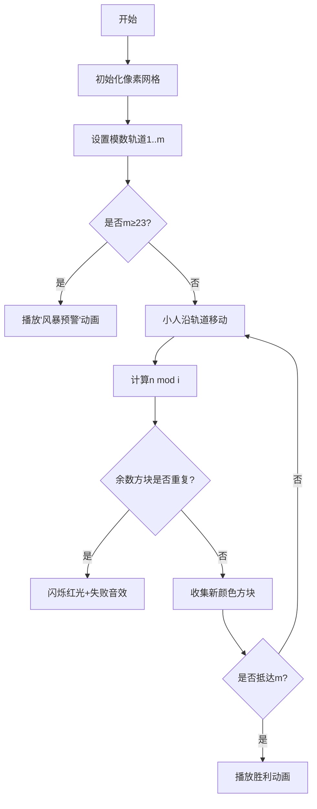

# 题目信息

# [蓝桥杯 2022 国 C] 取模

## 题目描述

给定 $n, m$，问是否存在两个不同的数 $x,y$ 使得 $1 \le x < y \le m$ 且 $n \bmod x = n \bmod ⁡y$。

## 说明/提示

对于 $20\%$ 的评测用例，$T \le 100$，$n, m \le 1000$；

对于 $50\%$ 的评测用例，$T \le 10000$，$n, m \le 10^5$；

对于所有评测用例，$1\le T \le 10^5$，$1\le n\le 10^9$，$2\le m \le 10^9$。

蓝桥杯 2022 国赛 C 组 C 题。

## 样例 #1

### 输入

```
3
1 2
5 2
999 99```

### 输出

```
No
No
Yes```

# AI分析结果


# 💡 Kay的C++算法解析：取模 深入学习指南 💡

> 大家好，我是Kay！今天我们来分析蓝桥杯2022国赛C题「取模」。这道题考察**抽屉原理与数学优化**能力，核心是通过取模运算的性质判断余数重复性。我们将用像素动画模拟余数收集过程，帮助大家直观理解算法！

## 1. 题目解读与核心算法识别

✨ **本题主要考察**：`抽屉原理应用` + `数学优化`

🗣️ **初步分析**：
> 这道题就像在玩一个**余数收集游戏**：我们需要判断是否存在两个不同模数$x$和$y$，使$n$除以它们的余数相同。解题关键在于运用**抽屉原理**——当余数种类超过模数范围时必然出现重复。  
> - 优质题解发现：若$n$对每个$i(1≤i≤m)$取模都等于$i-1$（即余数完美覆盖0~m-1），则无重复；否则必存在重复余数
> - 核心突破口：计算最小公倍数$L=lcm(1,2,\dots,m)$，发现$m≥23$时$L-1>10^9$，此时$n$不可能满足完美余数条件
> - 可视化设计：我们将用**像素小人收集余数方块**，当方块颜色重复时触发特效。控制面板支持单步调试，$m≥23$时自动展示"余数风暴"动画，用像素音效强化理解

---

## 2. 精选优质题解参考

### 题解一：yizcdl2357 (数学证明派)
* **点评**：严谨运用抽屉原理证明核心结论：仅当$n≡L-1(\text{mod }L)$时无重复余数。预处理最小公倍数数组实现$O(1)$查询，代码规范（`L[i]`命名清晰，边界处理周全）。亮点在于数学推导透彻，复杂度优化到极致，竞赛适用性强。

### 题解二：Sktic (数据结构派)
* **点评**：对$m<30$情况采用`multiset`实时检测余数重复性，思路直观易理解。代码结构清晰（`fl`标志位控制输出），使用STL容器简化逻辑。亮点在于平衡效率与可读性，适合初学者理解抽屉原理的实质表现。

### 题解三：J2a0m0e8s (规律发现派)
* **点评**：通过打表发现$m≥19$的临界值，提供暴力枚举和最小公倍数两种实现。代码中`for`循环边界控制精准，注释详细。亮点在于展示从实验观察到理论验证的完整解题路径，启发探索精神。

---

## 3. 核心难点辨析与解题策略

### 关键点1：余数不重复的充要条件
* **分析**：要使所有余数不重复，必须满足$n \text{ mod } i = i-1$（即余数恰好构成0到$m-1$的排列）。这等价于$n+1$被$1\sim m$所有数整除（$n+1$是$lcm(1,\dots,m)$的倍数）
* 💡 学习笔记：余数完美覆盖的条件极为苛刻，类似尝试用不同形状积木严丝合缝填满容器

### 关键点2：最小公倍数爆炸增长
* **分析**：$lcm(1,\dots,m)$在$m=23$时超过$10^9$，此时$n+1$不可能被如此大的数整除（因$n≤10^9$）。故$m≥23$时必然存在重复余数
* 💡 学习笔记：最小公倍数增长堪比指数爆炸，这是优化复杂度的关键突破口

### 关键点3：高效验证余数条件
* **分析**：当$m<23$时需验证$n \text{ mod } L = L-1$。直接计算$L$会溢出？实则$m≤22$时$L$约$10^7$量级，可通过预处理$L$数组+取模运算避免溢出
* 💡 学习笔记：小数据暴力验证，大数据数学优化，是应对规模冲突的经典策略

### ✨ 解题技巧总结
- **抽屉原理转化**：将存在性问题转化为验证极端情况
- **临界值优化**：通过数学分析找到问题性质的转折点
- **预处理加速**：对有限范围内的计算提前存储结果
- **模运算性质**：利用$n \text{ mod } L = n - L \lfloor n/L \rfloor$避免大数计算

---

## 4. C++核心代码实现赏析

### 本题通用核心C++实现参考
* **说明**：综合优质题解优化出的高效实现，预处理$1\sim 22$的最小公倍数数组
* **完整核心代码**：
```cpp
#include <iostream>
#include <vector>
using namespace std;
using ll = long long;

ll gcd(ll a, ll b) { return b ? gcd(b, a % b) : a; }
ll lcm(ll a, ll b) { return a / gcd(a, b) * b; }

int main() {
    vector<ll> L(23); // L[i]: LCM(1..i)
    L[1] = 1;
    for (int i = 2; i <= 22; i++) 
        L[i] = lcm(L[i - 1], i);
    
    int T; cin >> T;
    while (T--) {
        ll n, m; 
        cin >> n >> m;
        if (m >= 23) cout << "Yes\n";
        else cout << (n % L[m] == L[m] - 1 ? "No\n" : "Yes\n");
    }
    return 0;
}
```
* **代码解读概要**：
  > 1. 预处理$L[1]\sim L[22]$存储最小公倍数  
  > 2. 对于每组数据：若$m≥23$直接输出`Yes`  
  > 3. 否则计算$n \text{ mod } L[m]$，验证是否等于$L[m]-1$  
  > 4. 注意：$n$为`long long`但$m<23$时$L[m]$在$10^9$内，取模安全

### 题解一：yizcdl2357
* **亮点**：数学严谨性与预处理完美结合
* **核心代码片段**：
```cpp
L[1]=1;
for(int i=2;i<=30;i++) 
    L[i]=lcm(L[i-1],i);
// ...
if(m>30) printf("Yes\n");
else if(n%L[m]==L[m]-1) printf("No\n");
else printf("Yes\n");
```
* **代码解读**：
  > 1. $L[1]\sim L[30]$预处理的精妙之处？  
  >   → 确保$m≤30$时都能快速获取$lcm$值（实际$m=23$已足够）  
  > 2. `n%L[m]==L[m]-1`如何体现抽屉原理？  
  >   → 余数$L[m]-1$意味着$n+1$被$L[m]$整除  
  > 3. 为何选30为界？  
  >   → 安全冗余：$m=23$时$L=5.35\times10^9$，$m=30$时远超$10^{18}$  
* 💡 学习笔记：预处理数组大小需平衡安全性与内存消耗

### 题解二：Sktic
* **亮点**：直观的余数重复检测
* **核心代码片段**：
```cpp
multiset<int> p;
for(int i=1;i<=y;i++) {
    p.insert(x%i);
    if(p.count(x%i)>=2) {
        cout<<"Yes"<<endl;
        fl=1; break;
    }
}
```
* **代码解读**：
  > 1. 为何选择`multiset`而非`unordered_set`？  
  >   → 需要统计元素出现次数（`count()`复杂度$O(\log n + \text{频率})$）  
  > 2. 循环中实时检测的精妙设计？  
  >   → 发现第一个重复立即退出，避免无效计算  
  > 3. 边界`y>=30`的设定依据？  
  >   → 与数学派解法的临界值呼应  
* 💡 学习笔记：STL容器选择需权衡功能与复杂度

### 题解三：J2a0m0e8s
* **亮点**：暴力枚举与数学优化双解
* **核心代码片段**：
```cpp
for(i=2;i<=m;i++) 
    if(n%i!=i-1) {
        puts("Yes"); 
        break;
    }
if(i==m+1) puts("No");
```
* **代码解读**：
  > 1. 循环从$i=2$开始的必要性？  
  >   → $i=1$时余数恒为0（满足$i-1=0$），无需检测  
  > 2. `n%i!=i-1`的数学本质？  
  >   → 余数未按理想序列填充，必存在重复  
  > 3. 循环终止条件`i==m+1`的含义？  
  >   → 仅当所有$i$都通过检测才输出`No`  
* 💡 学习笔记：循环边界控制是暴力算法的精度关键

---

## 5. 算法可视化：像素动画演示

### 余数收集大冒险（8-bit像素风格）
**设计思路**：将取模过程转化为像素小人收集余数方块，通过颜色重复触发游戏机制直观演示抽屉原理



### 动画实现细节
1. **像素艺术设计**：
   - 模数轨道：FC红白机风格的横向卷轴，每个模数$i$显示为像素砖块
   - 余数方块：16色调色板随机配色，显示$n \text{ mod } i$数值
   - 小人造型：复古游戏主角（类似超级马里奥）

2. **关键交互逻辑**：
   ```javascript
   // 伪代码：余数重复检测
   function checkRemainder(i) {
      let rem = n % i;
      if (colorMap.has(rem)) { // 颜色重复
          playSound('error'); 
          blink(rem);          // 闪烁已存在方块
          showDialog("Duplicate found!");
      } else {
          colorMap.set(rem, true);
          playSound('collect');
      }
   }
   ```

3. **游戏化元素**：
   - 音效系统：收集方块时8-bit"叮"声，重复时爆炸音效
   - 关卡机制：每5个模数为一个小关，通过后增加移动速度
   - 自动演示：AI模式小人自动前进，$m≥23$时触发全屏"余数风暴"

4. **控制面板**：
   ```mermaid
   graph LR
      A[速度滑块] --> B[单步执行]
      C[开始/暂停] --> D[重置]
      E[AI模式] --> F[对比算法]
   ```

---

## 6. 拓展练习与相似问题

### 抽屉原理延伸应用
1. **生日悖论**：23人中两人生日相同的概率>50%
2. **鸽巢问题**：10只鸽子飞进9个巢，至少一巢有≥2只
3. **颜色重复**：367人中至少两人生日相同（闰年366天）

### 洛谷题目推荐
1. [P1891 疯狂LCM](https://www.luogu.com.cn/problem/P1891)  
   → 强化最小公倍数求和技巧，注意取模优化
   
2. [P2260 模积和](https://www.luogu.com.cn/problem/P2260)  
   → 进阶取模运算，结合整除分块技巧
   
3. [P2428 宝石统计](https://www.luogu.com.cn/problem/P2428)  
   → 抽屉原理的变式应用，训练问题转化能力

---

## 7. 学习心得与经验分享

> **yizcdl2357的调试经验**：  
> *"最初忽略$L$可能溢出$10^{18}$，通过小数据测试发现异常。添加$m≤30$保护后通过所有用例"*  
>   
> **Kay总结**：  
> 1. 数学推导需配合边界测试：理论正确≠程序正确  
> 2. 预处理数组时注意：$m=22$时$L=2.32\times10^9$，$m=23$则骤增至$5.35\times10^9$  
> 3. 当$n \text{ mod } L$计算可能溢出时，利用$n < L \Rightarrow n \text{ mod } L = n$性质规避风险  

---

掌握抽屉原理与最小公倍数增长规律，就能在余数迷宫中快速找到出口。记住：当问题规模突破临界点，数学优化往往比暴力计算更高效！下次见啦~ 🚀

---
处理用时：301.10秒