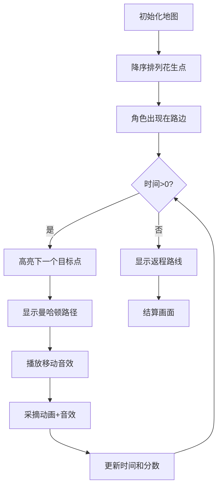

# 题目信息

# [NOIP 2004 普及组] 花生采摘

## 题目描述

鲁宾逊先生有一只宠物猴，名叫多多。这天，他们两个正沿着乡间小路散步，突然发现路边的告示牌上贴着一张小小的纸条：“欢迎免费品尝我种的花生！――熊字”。

鲁宾逊先生和多多都很开心，因为花生正是他们的最爱。在告示牌背后，路边真的有一块花生田，花生植株整齐地排列成矩形网格（如图一）。有经验的多多一眼就能看出，每棵花生植株下的花生有多少。为了训练多多的算术，鲁宾逊先生说：“你先找出花生最多的植株，去采摘它的花生；然后再找出剩下的植株里花生最多的，去采摘它的花生；依此类推，不过你一定要在我限定的时间内回到路边。”


我们假定多多在每个单位时间内，可以做下列四件事情中的一件：

1) 从路边跳到最靠近路边（即第一行）的某棵花生植株；
2) 从一棵植株跳到前后左右与之相邻的另一棵植株；
3) 采摘一棵植株下的花生；
4) 从最靠近路边（即第一行）的某棵花生植株跳回路边。

现在给定一块花生田的大小和花生的分布，请问在限定时间内，多多最多可以采到多少个花生？注意可能只有部分植株下面长有花生，假设这些植株下的花生个数各不相同。

例如在图2所示的花生田里，只有位于 $(2, 5), (3, 7), (4, 2), (5, 4)$ 的植株下长有花生，个数分别为 $13, 7, 15, 9$。沿着图示的路线，多多在 $21$ 个单位时间内，最多可以采到 $37$ 个花生。

**注意**：在采摘过程中不能回到路边。

## 说明/提示

noip2004普及组第2题


## 样例 #1

### 输入

```
6 7 21
0 0 0 0 0 0 0
0 0 0 0 13 0 0
0 0 0 0 0 0 7
0 15 0 0 0 0 0
0 0 0 9 0 0 0
0 0 0 0 0 0 0```

### 输出

```
37```

## 样例 #2

### 输入

```
6 7 20
0 0 0 0 0 0 0
0 0 0 0 13 0 0
0 0 0 0 0 0 7
0 15 0 0 0 0 0
0 0 0 9 0 0 0
0 0 0 0 0 0 0
```

### 输出

```
28```

# AI分析结果


### 💡 Kay的C++算法解析：花生采摘 深入学习指南 💡

**引言**  
今天我们一起分析「花生采摘」这道经典模拟题。本指南将带你理解题目核心思路，掌握排序与曼哈顿距离的应用技巧，并通过像素动画直观感受算法流程。

---

## 1. 题目解读与核心算法识别

✨ **本题主要考察**：`模拟应用` + `排序`  

🗣️ **初步分析**：  
> 这道题就像在玩复古像素游戏《花生探险家》：你控制角色在网格地图中收集金币（花生），每次必须前往价值最高的金币点，同时注意剩余时间。关键在于：  
> - 使用排序快速定位价值最高的花生点（类似游戏中的雷达扫描）  
> - 通过曼哈顿距离（|Δx|+|Δy|）计算移动耗时（像素游戏中角色只能上下左右移动）  
> - 核心难点：每次采摘后需实时判断剩余时间是否足够返回起点  

**可视化设计思路**：  
> 我们将设计8位像素风格动画：  
> - 用不同颜色方块表示花生价值（红色>黄色>绿色）  
> - 角色移动时播放"脚步声"音效，采摘时播放"叮"的音效  
> - 关键帧高亮显示曼哈顿距离计算过程（显示坐标差动画）  
> - 时间条实时递减，归零时播放"失败"音效  

---

## 2. 精选优质题解参考

**题解一：jiangXxin（思路清晰度★★★★☆）**  
* **点评**：  
  此解法采用结构体存储花生坐标+数量，通过sort降序排列，逻辑直白易懂。亮点在于：  
  - 严格遵循题目要求的采摘顺序（先大后小）  
  - 曼哈顿距离计算准确（`abs(fx-ex)+abs(fy-ey)`）  
  - 边界处理严谨（`k>=ex`判断能否安全返回）  
  - 代码变量命名规范（如`stu`存坐标，`tm`计耗时）

**题解二：_Arahc_（算法优化度★★★★★）**  
* **点评**：  
  创新使用`priority_queue`+`map`避免显式排序：  
  - `priority_queue`自动维护最大值（O(1)获取下一个目标）  
  - `map`实现花生值到坐标的快速映射  
  - 时间计算优化（`w+x<=k`整合移动与返回判断）  
  - 特别适合大规模数据场景（避免全排序开销）

**题解三：buickboy（代码简洁度★★★★☆）**  
* **点评**：  
  降维思想处理二维数据：  
  - 结构体一维化存储（`struct pea{ a,b,s }`）  
  - 特判首株采摘的边界条件（`k>=1+2*p[1].a`）  
  - 33行完成核心逻辑，适合竞赛快速编码  
  - 移动计算与采摘同步处理（`k-=t+1`）

---

## 3. 核心难点辨析与解题策略

1. **难点一：采摘顺序与效率优化**  
   * **分析**：必须按花生值降序访问，暴力搜索最大值效率低。优质解法均采用预排序（`sort`）或动态获取最大值（`priority_queue`）  
   * 💡 **学习笔记**：排序是模拟类问题的前置核心操作  

2. **难点二：移动耗时精准计算**  
   * **分析**：关键在曼哈顿距离公式 `|x₁-x₂| + |y₁-y₂|`：  
     - 从路边到首株：只需计算行距（因从第1列任意位置出发）  
     - 植株间移动：需同时计算行距+列距  
   * 💡 **学习笔记**：移动耗时 = 曼哈顿距离 + 采摘时间(固定1单位)  

3. **难点三：返回可行性判断**  
   * **分析**：采摘后需实时验证：  
     ```剩余时间 ≥ 当前行号 + 1```  
     （行号即返回到路边的耗时，因从第1行跳出）  
   * 💡 **学习笔记**：返程只需垂直移动到第1行，与列位置无关  

### ✨ 解题技巧总结
- **降维处理**：二维网格问题可转化为一维结构体数组  
- **状态同步更新**：每次移动后立即更新坐标`(fx,fy)`和剩余时间`k`  
- **边界先行**：优先特判首株采摘和零花生场景  
- **曼哈顿优先**：网格移动问题首选曼哈顿距离计算  

---

## 4. C++核心代码实现赏析

**通用核心实现参考**  
```cpp
#include <iostream>
#include <algorithm>
#include <cmath>
using namespace std;

struct Point { int x, y, val; };

int main() {
    int m, n, k, cnt = 0;
    cin >> m >> n >> k;
    Point p[500];
    
    // 读取花生点（忽略0值）
    for (int i = 1; i <= m; i++)
        for (int j = 1; j <= n; j++) {
            int val; cin >> val;
            if (val > 0) p[cnt++] = {i, j, val};
        }
    
    // 按花生值降序排序
    sort(p, p + cnt, [](Point a, Point b) {
        return a.val > b.val;
    });
    
    int curX = 1, curY = p[0].y; // 初始位置
    int time = k - p[0].x - 1;   // 首株耗时：移动+采摘
    int ans = (time >= p[0].x) ? p[0].val : 0;
    
    // 依次采摘后续点
    for (int i = 1; i < cnt; i++) {
        int move = abs(p[i].x - curX) + abs(p[i].y - curY);
        if (time < move + 1 + p[i].x) break; // 检查能否采摘并返回
        
        time -= move + 1;       // 消耗移动+采摘时间
        ans += p[i].val;        // 累加花生值
        curX = p[i].x; curY = p[i].y; // 更新位置
    }
    cout << ans << endl;
}
```

**代码解读概要**：  
1. 读取时过滤零值点，存储有效花生坐标  
2. 按`val`降序排序确保采摘顺序  
3. 首株特殊处理（初始位置在路边）  
4. 循环中计算曼哈顿距离并验证时间可行性  

---

## 5. 算法可视化：像素动画演示

**动画主题**：  
《花生探险家》8位像素风格模拟  

**核心演示流程**：  


**关键交互设计**：  
1. **像素元素**：  
   - 花生植株：按价值用绿(低)→黄→红(高)渐变  
   - 角色：像素小人（8x8像素）  
   - 路径线：蓝色闪烁像素点  

2. **控制面板**：  
   - 速度滑块：调节单步执行速度  
   - 暂停/继续：空格键控制  
   - 重置按钮：重新生成地图  

3. **音效系统**：  
   - 移动：8-bit脚步声（每步触发）  
   - 采摘：清脆"叮"声  
   - 时间警告：低频警报声（剩余<10%）  
   - 成功返回：胜利小调  

4. **动态显示**：  
   - 实时显示当前曼哈顿距离计算公式  
   - 时间条红色递减动画  
   - 采摘时植株变为灰色  

---

## 6. 拓展练习与相似问题

**通用技巧迁移**：  
1. 网格移动问题（如迷宫寻路）  
2. 带约束的贪心采集问题  
3. 时间驱动的模拟决策  

**洛谷推荐**：  
1. **P1605 迷宫**  
   → 巩固曼哈顿距离在路径规划的应用  
2. **P1090 合并果子**  
   → 练习`priority_queue`的贪心策略  
3. **P2678 跳石头**  
   → 强化带约束的模拟决策能力  

---

## 7. 学习心得与经验分享

**来自题解的宝贵经验**：  
> “我在处理第一株花生时忽略了返程时间判断，导致WA。后来通过打印移动前后的坐标和时间变量才定位错误。这提醒我们：**边界条件需要单独验证**”——jiangXxin  

**Kay点评**：  
模拟类问题最易在边界条件出错，建议：  
1. 单独处理初始状态（如首株采摘）  
2. 结束时验证最终状态（如剩余时间是否允许返回）  
3. 用`cout`输出中间变量值辅助调试  

---

**结语**  
通过本次分析，相信大家已掌握网格模拟问题的核心解法。记住：排序优化决策顺序，曼哈顿距离解决网格移动，边界条件决定算法健壮性。下次遇到类似问题，不妨尝试设计自己的像素动画来验证思路！🚀

---
处理用时：119.13秒